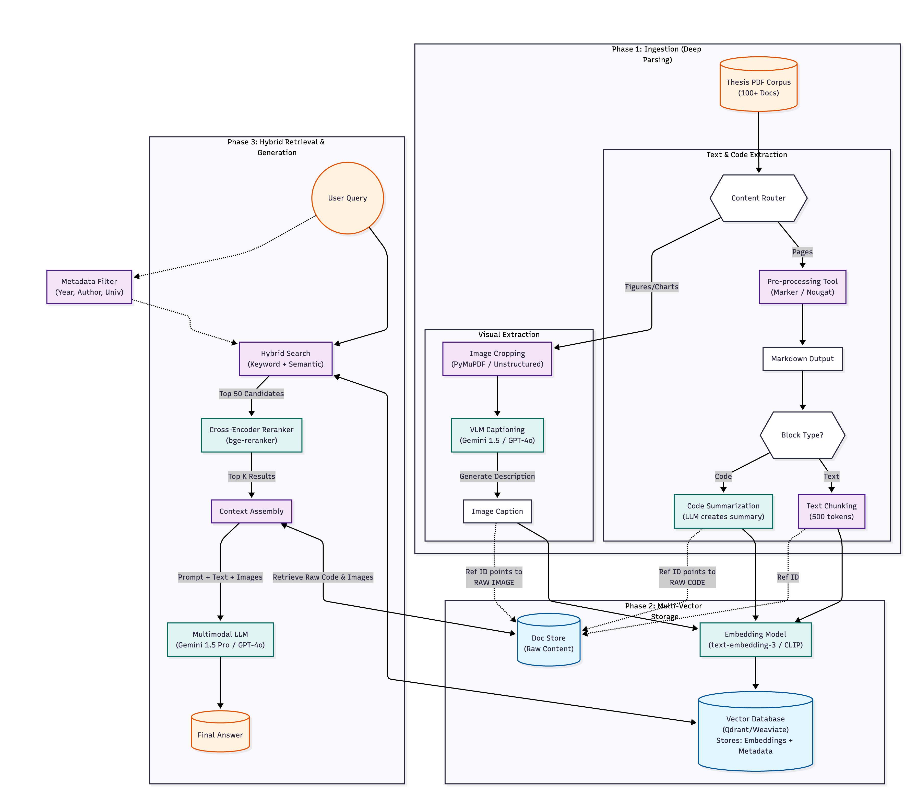

# NTU DAVID RAG

**Project Status**: Active Development — all three planned phases are implemented end-to-end, and two retrieval paths (vector RAG and GraphRAG) run side-by-side over a shared embedding service.

This project builds a retrieval-augmented generation system specialised for economics research papers and their accompanying Fortran codebases. It ingests PDFs and source code, stores structured artefacts plus embeddings, and answers both focused ("what is the Euler equation in this paper?") and comparative ("which papers share the same mathematical model?") questions.



Architecture diagrams for the two retrieval stacks live under [docs/tikz/](docs/tikz/):

- [docs/tikz/vector_rag.pdf](docs/tikz/vector_rag.pdf) — hybrid BM25 + dense + reranker pipeline.
- [docs/tikz/graph_rag.pdf](docs/tikz/graph_rag.pdf) — entity/relationship graph with community summaries.

## Repository layout

```
NTU-DAVID-RAG/
├── utils/
│   ├── s1_data_ingestion/   # Fortran digestion + MinerU-based PDF extraction
│   ├── s2_embedding/        # Chunking, embedder, Qdrant vector store, CLI
│   ├── s3_RAG/              # BM25, dense, RRF fusion, cross-encoder rerank
│   ├── orchestrator/        # Ingestion pipeline + profile-aware query engine
│   └── llm_clients/         # Gemini, OpenAI, and local (OpenAI-compatible) clients
├── graphRag/                # Knowledge-graph RAG (entities → graph → community summaries → local/global search)
├── docker/
│   ├── docker-compose.yml   # Unified stack: embedding-server + rag-web + graphrag-web + proxy
│   ├── embedding_server/    # Shared HTTP embedder + reranker (owns the GPU)
│   ├── RAG/                 # Flask API + React chat UI for the vector RAG
│   ├── graphRag/            # Flask API + React chat UI for the GraphRAG
│   ├── proxy/               # nginx that fronts both UIs under one port
│   └── local_llm/           # llama.cpp / Ollama compose files for the answer LLM
├── RAG_quality_test/        # Report-style and Ragas-based evaluators
├── tests/                   # Pytest suites per stage
├── docs/                    # Diagrams and workflow notes
├── db/ · graph_db/          # Qdrant + registry for vector RAG and GraphRAG respectively
├── data/ · graph_data/      # Raw and processed paper/code artefacts per stack
├── CHANGELOG.md
└── README.md
```

Each subpackage ships its own `readme.md` with module-level detail — the sections below point into them rather than duplicating their contents.

## Architecture at a glance

| Stage | Package | Key modules |
|-------|---------|-------------|
| **Ingestion** | [`utils/s1_data_ingestion/`](utils/s1_data_ingestion/) | `fortran_code_digest.py`, `pdf_extract.py` (MinerU-backed) |
| **Embedding & storage** | [`utils/s2_embedding/`](utils/s2_embedding/) | `chunker.py`, `embedder.py`, `qdrant_store.py`, `run_embed.py` |
| **Hybrid retrieval** | [`utils/s3_RAG/`](utils/s3_RAG/) | `bm25_retriever.py`, `dense_retriever.py`, `reranker.py`, `hybrid_rag.py` |
| **Orchestration** | [`utils/orchestrator/`](utils/orchestrator/) | `ingest_paper.py`, `store_to_db.py`, `rag_query.py`, `paper_profiler.py`, `query_router.py` |
| **Knowledge-graph RAG** | [`graphRag/`](graphRag/) | `entity_extractor.py`, `graph_builder.py`, `community_summarizer.py`, `local_search.py`, `global_search.py` |

Default models (overridable per service):

- **Embedder**: `Alibaba-NLP/gte-Qwen2-7B-instruct` (3584-dim, asymmetric query/passage prefixes applied server-side).
- **Reranker**: `BAAI/bge-reranker-v2-m3` (cross-encoder, scores the top-50 fused candidates).
- **Vector store**: Qdrant on-disk (per-stack: `db/` for vector RAG, `graph_db/` for GraphRAG).

## Running the stack

The canonical way to bring up both retrieval services is the unified Docker compose in [docker/docker-compose.yml](docker/docker-compose.yml). A single `embedding-server` container owns the GPU and loads the 7B embedder + reranker once; `rag-web` and `graphrag-web` are CPU-only Flask backends that call it over HTTP, so both frontends run simultaneously against the same GPU.

```bash
cd docker
docker compose up --build
```

Endpoints exposed by the nginx proxy (default `UNIFIED_PORT=3006`):

| Path | Served by |
|------|-----------|
| `/`        | Landing + tab shell |
| `/rag/`    | Vector RAG chat UI |
| `/graph/`  | GraphRAG chat UI |

Databases stay isolated by design: `rag-web` owns `db/` + `data/`, `graphrag-web` owns `graph_db/` + `graph_data/`. Papers uploaded through one UI do not bleed into the other. Per-service compose files under `docker/RAG/` and `docker/graphRag/` remain usable for running a single backend with its own embedder — see their `readme.md`s for standalone mode.

An answer LLM is still required. Start one from `docker/local_llm/` — the Gemma3 (Ollama) and Qwen3-Next-80B (llama.cpp) compose files are both wired to the `OPENAI_API_BASE` that the two web backends expect.

## Quick Start (Python environment)

Use this path when working on `utils/` modules directly — chunking, retrieval, the orchestrator — outside the Docker stack.

```bash
python3 -m venv .venv
source .venv/bin/activate
pip install --upgrade pip
pip install -r requirements.txt
```

MinerU (used by `utils/s1_data_ingestion/pdf_extract.py`) is installed separately into `utils/data_preprocess/MinerU/`; see its upstream docs. For LaTeX-rendered comparison outputs, install a TeX distribution:

```bash
# Ubuntu/Debian
sudo apt-get install -y texlive-latex-base texlive-latex-extra
# macOS
brew install --cask mactex
```

Embed a paper into the vector store:

```bash
CUDA_VISIBLE_DEVICES=2 python -m utils.s2_embedding.run_embed \
  --manuscript "data/<Paper>/manuscript_parsed_mineru/Manuscript/hybrid_auto/Manuscript_content_list.json" \
  --fortran    "data/<Paper>/RAG_Chunks/fortran_chunks.json" \
  --output     "data/<Paper>/vector_store" \
  --device cuda:0 \
  --test-query
```

Query it interactively:

```bash
CUDA_VISIBLE_DEVICES=2 python -m utils.s3_RAG.run_rag \
  --vector-store "data/<Paper>/vector_store" \
  --device cuda:0
```

## Running tests

All tests assume the virtual environment is active and run from the project root.

```bash
source .venv/bin/activate

# Stage 1 — Fortran digestion, PDF extract, local-LLM smoke tests
python -m tests.test_s1_fortran_preprocess
python -m tests.test_s1_pdf_extract
python -m tests.test_s1_llm

# Stage 2 — chunking + embedder + Qdrant round-trip
CUDA_VISIBLE_DEVICES=2 python -m tests.test_s2_embedding

# Stage 3 — BM25 / dense / RRF / reranker full pipeline
CUDA_VISIBLE_DEVICES=2 python -m tests.test_s3_rag

# Orchestrator — end-to-end ingest, store, and query
python -m tests.test_orch_ingest_paper_n_code
python -m tests.test_orch_store_to_db
python -m tests.test_orch_rag_query

# LLM clients (needs GEMINI_API_KEY / OPENAI_API_KEY)
python -m tests.test_llm_clients
```

Stage-2 and Stage-3 tests require a GPU and an existing vector store under `data/<paper>/vector_store/`.

## Quality evaluation

[RAG_quality_test/](RAG_quality_test/) contains two complementary evaluators, each available for both the vector RAG and the GraphRAG:

- `rag_quality_test.py` / `graph_rag_quality_test.py` — report-style regression runners.
- `rag_ragas_eval.py` / `graph_rag_ragas_eval.py` — reference-free Ragas metrics, with `local` / `openai` / `gemini` judges.

Only one retrieval stack should be running when an evaluator is active. For the vector RAG:

```bash
cd docker/graphRag && docker compose down
cd ../local_llm && docker compose -f docker-compose.gemma4_31b_ollama.yml up -d
cd ../RAG && docker compose up -d --build rag-web

source .venv/bin/activate
pip install -r RAG_quality_test/requirements-ragas.txt
python RAG_quality_test/rag_ragas_eval.py
```

See [RAG_quality_test/README.md](RAG_quality_test/README.md) for the full evaluator notes and CLI options.

## Solving the global-query problem

Chunk-level retrieval is strong on *local* questions ("what is the Euler equation used in this paper?") but fails on *global*, cross-document ones ("which papers share the same mathematical model?", "how do these papers differ in their computational methods?"). A query like this needs paper-level identity, not a bag of passages — top-k dense + BM25 results from a single paper's chunks can drown out the smaller evidence from other papers, and chunk text rarely contains the canonical model/method terms needed to compare papers.

The project tackles this in two independent ways, each under its own package.

### Option A — profile-first retrieval in [`utils/orchestrator/`](utils/orchestrator/)

A second Qdrant collection, `paper_profiles`, stores one structured record per paper:

| Field | Purpose |
|-------|---------|
| `research_question`, `summary` | One-line identity of the paper |
| `mathematical_models` | Canonicalised model families (e.g. `overlapping-generations`, `heterogeneous-agent Bewley`) |
| `key_equations` | Distinctive equations (`Euler`, `Bellman`, `HJB`) |
| `economic_concepts` | Central concepts (wealth inequality, idiosyncratic risk) |
| `computational_methods` | Numerical methods (VFI, EGM, Krusell-Smith) |
| `data_sources`, `main_findings`, `keywords` | Empirical + narrative anchors |

`paper_profiler.build_paper_profile()` emits these via the LLM; `compute_profile_overlap()` uses canonicalisation tables (`_MODEL_CANON`, `_METHOD_CANON`) to collapse synonyms (`OLG` = `overlapping-generations` = `life-cycle`) so cross-paper comparisons quote concrete shared fields instead of hallucinating them.

`query_router.classify_query()` decides whether a query is `local` or `global` — a cheap regex catches obvious comparative phrasing, and an LLM classifier handles the rest. Global queries route through `RAGQueryEngine`, which retrieves from `paper_profiles` first, drills into each candidate paper's chunks with a `paper_title` filter, round-robin-diversifies the top-k, and builds a context ordered `PAPER PROFILES → OVERLAP ANALYSIS → per-paper passages`. Local queries go through the original chunk pipeline unchanged.

For databases created before the profile collection existed, `utils/orchestrator/backfill_profiles.py` regenerates and upserts profiles idempotently:

```bash
python -m utils.orchestrator.backfill_profiles --db-path ./db
```

### Option B — knowledge graph in [`graphRag/`](graphRag/)

The GraphRAG stack takes a different route: it extracts typed entities (model / concept / method / dataset / variable / theorem / author / paper) and relationships (uses / extends / compares / applies_to / causes / contains / measures / authored / mentions) from every chunk, merges them into a `networkx.DiGraph`, summarises graph communities, and serves both `local_search` (entity-anchored) and `global_search` (community-summary-anchored) modes. Because each node carries its source `chunk_ids` and `paper_titles`, answers remain traceable to evidence. See [graphRag/readme.md](graphRag/readme.md) for the pipeline detail.

## Change history

See [CHANGELOG.md](CHANGELOG.md) for the user-visible change log.
