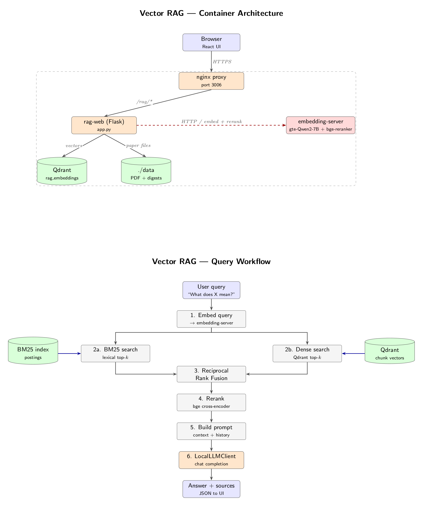
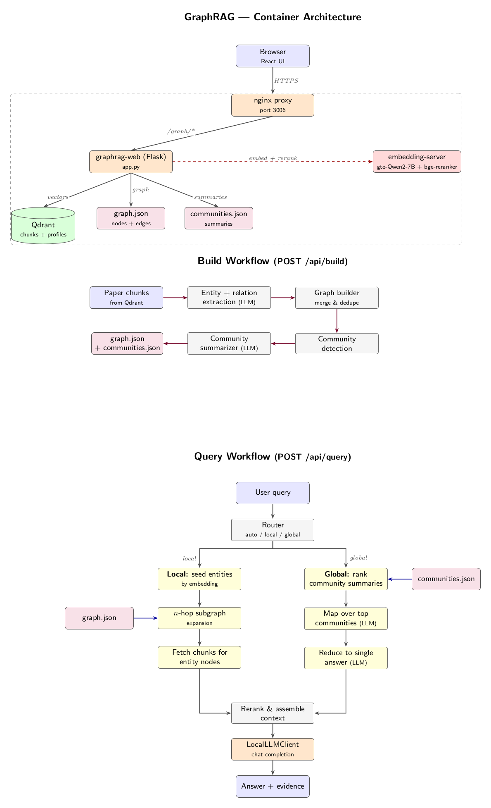

# NTU DAVID RAG

**Project Status**: Active Development — all three planned phases are implemented end-to-end, and two retrieval paths (vector RAG and GraphRAG) run side-by-side over a shared embedding service.

This project builds a retrieval-augmented generation system specialised for economics research papers and their accompanying Fortran codebases. It ingests PDFs and source code, stores structured artefacts plus embeddings, and answers both focused ("what is the Euler equation in this paper?") and comparative ("which papers share the same mathematical model?") questions.


Architecture diagrams for the two retrieval stacks live under [docs/tikz/](docs/tikz/):

- [docs/tikz/vector_rag.pdf](docs/tikz/vector_rag.pdf) — hybrid BM25 + dense + reranker pipeline.
- [docs/tikz/graph_rag.pdf](docs/tikz/graph_rag.pdf) — entity/relationship graph with community summaries.

## Repository layout

```
NTU-DAVID-RAG/
├── utils/
│   ├── s1_data_ingestion/   # Fortran digestion + MinerU-based PDF extraction
│   ├── s2_embedding/        # Chunking, embedder, Qdrant vector store, CLI
│   ├── s3_RAG/              # BM25, dense, RRF fusion, cross-encoder rerank
│   ├── orchestrator/        # Ingestion pipeline + profile-aware query engine
│   └── llm_clients/         # Gemini, OpenAI, and local (OpenAI-compatible) clients
├── graphRag/                # Knowledge-graph RAG (entities → graph → community summaries → local/global search)
├── docker/
│   ├── docker-compose.yml   # Unified stack: embedding-server + rag-web + graphrag-web + proxy
│   ├── embedding_server/    # Shared HTTP embedder + reranker (owns the GPU)
│   ├── RAG/                 # Flask API + React chat UI for the vector RAG
│   ├── graphRag/            # Flask API + React chat UI for the GraphRAG
│   ├── proxy/               # nginx that fronts both UIs under one port
│   └── local_llm/           # llama.cpp / Ollama compose files for the answer LLM
├── RAG_quality_test/        # Report-style and Ragas-based evaluators
├── tests/                   # Pytest suites per stage
├── docs/                    # Diagrams and workflow notes
├── db/ · graph_db/          # Qdrant + registry for vector RAG and GraphRAG respectively
├── data/ · graph_data/      # Raw and processed paper/code artefacts per stack
├── CHANGELOG.md
└── README.md
```

Each subpackage ships its own `readme.md` with module-level detail — the sections below point into them rather than duplicating their contents.

## Architecture at a glance

| Stage | Package | Key modules |
|-------|---------|-------------|
| **Ingestion** | [`utils/s1_data_ingestion/`](utils/s1_data_ingestion/) | `fortran_code_digest.py`, `pdf_extract.py` (MinerU-backed) |
| **Embedding & storage** | [`utils/s2_embedding/`](utils/s2_embedding/) | `chunker.py`, `embedder.py`, `qdrant_store.py`, `run_embed.py` |
| **Hybrid retrieval** | [`utils/s3_RAG/`](utils/s3_RAG/) | `bm25_retriever.py`, `dense_retriever.py`, `reranker.py`, `hybrid_rag.py` |
| **Orchestration** | [`utils/orchestrator/`](utils/orchestrator/) | `ingest_paper.py`, `store_to_db.py`, `rag_query.py`, `paper_profiler.py`, `query_router.py` |
| **Knowledge-graph RAG** | [`graphRag/`](graphRag/) | `entity_extractor.py`, `graph_builder.py`, `community_summarizer.py`, `local_search.py`, `global_search.py` |

Default models (overridable per service):

- **Embedder**: `Alibaba-NLP/gte-Qwen2-7B-instruct` (3584-dim, asymmetric query/passage prefixes applied server-side).
- **Reranker**: `BAAI/bge-reranker-v2-m3` (cross-encoder, scores the top-50 fused candidates).
- **Vector store**: Qdrant on-disk (per-stack: `db/` for vector RAG, `graph_db/` for GraphRAG).

## Running the stack

The canonical way to bring up both retrieval services is the unified Docker compose in [docker/docker-compose.yml](docker/docker-compose.yml). A single `embedding-server` container owns the GPU and loads the 7B embedder + reranker once; `rag-web` and `graphrag-web` are CPU-only Flask backends that call it over HTTP, so both frontends run simultaneously against the same GPU.

```bash
cd docker
docker compose up --build
```

Endpoints exposed by the nginx proxy (default `UNIFIED_PORT=3006`):

| Path | Served by |
|------|-----------|
| `/`        | Landing + tab shell |
| `/rag/`    | Vector RAG chat UI |
| `/graph/`  | GraphRAG chat UI |

Databases stay isolated by design: `rag-web` owns `db/` + `data/`, `graphrag-web` owns `graph_db/` + `graph_data/`. Papers uploaded through one UI do not bleed into the other. Per-service compose files under `docker/RAG/` and `docker/graphRag/` remain usable for running a single backend with its own embedder — see their `readme.md`s for standalone mode.

An answer LLM is still required. Start one from `docker/local_llm/` — the Gemma3 (Ollama) and Qwen3-Next-80B (llama.cpp) compose files are both wired to the `OPENAI_API_BASE` that the two web backends expect.

## Quick Start (Python environment)

Use this path when working on `utils/` modules directly — chunking, retrieval, the orchestrator — outside the Docker stack.

```bash
python3 -m venv .venv
source .venv/bin/activate
pip install --upgrade pip
pip install -r requirements.txt
```

MinerU (used by `utils/s1_data_ingestion/pdf_extract.py`) is installed separately into `utils/data_preprocess/MinerU/`; see its upstream docs. For LaTeX-rendered comparison outputs, install a TeX distribution:

```bash
# Ubuntu/Debian
sudo apt-get install -y texlive-latex-base texlive-latex-extra
# macOS
brew install --cask mactex
```

Embed a paper into the vector store:

```bash
CUDA_VISIBLE_DEVICES=2 python -m utils.s2_embedding.run_embed \
  --manuscript "data/<Paper>/manuscript_parsed_mineru/Manuscript/hybrid_auto/Manuscript_content_list.json" \
  --fortran    "data/<Paper>/RAG_Chunks/fortran_chunks.json" \
  --output     "data/<Paper>/vector_store" \
  --device cuda:0 \
  --test-query
```

Query it interactively:

```bash
CUDA_VISIBLE_DEVICES=2 python -m utils.s3_RAG.run_rag \
  --vector-store "data/<Paper>/vector_store" \
  --device cuda:0
```

## Running tests

All tests assume the virtual environment is active and run from the project root.

```bash
source .venv/bin/activate

# Stage 1 — Fortran digestion, PDF extract, local-LLM smoke tests
python -m tests.test_s1_fortran_preprocess
python -m tests.test_s1_pdf_extract
python -m tests.test_s1_llm

# Stage 2 — chunking + embedder + Qdrant round-trip
CUDA_VISIBLE_DEVICES=2 python -m tests.test_s2_embedding

# Stage 3 — BM25 / dense / RRF / reranker full pipeline
CUDA_VISIBLE_DEVICES=2 python -m tests.test_s3_rag

# Orchestrator — end-to-end ingest, store, and query
python -m tests.test_orch_ingest_paper_n_code
python -m tests.test_orch_store_to_db
python -m tests.test_orch_rag_query

# LLM clients (needs GEMINI_API_KEY / OPENAI_API_KEY)
python -m tests.test_llm_clients
```

Stage-2 and Stage-3 tests require a GPU and an existing vector store under `data/<paper>/vector_store/`.

### Unified RAG + GraphRAG Stack (Recommended)

The top-level [docker/docker-compose.yml](docker/docker-compose.yml) brings up **both** the vector RAG and the GraphRAG services behind a single nginx proxy, sharing one GPU-resident embedding/reranker container. You get one URL with a landing page and `/rag/` + `/graph/` tabs.

Architecture (see also the TikZ diagrams in [docs/tikz/](docs/tikz/) — [vector_rag.pdf](docs/tikz/vector_rag.pdf), [graph_rag.pdf](docs/tikz/graph_rag.pdf)):

```
                    ┌───────────────────────────────┐
                    │  nginx proxy  (one port)      │
                    │  /  /rag/  /graph/            │
                    └──────┬──────────────┬─────────┘
                           │              │
                    ┌──────▼─────┐ ┌──────▼─────┐
                    │  rag-web   │ │ graphrag-  │   CPU-only Flask backends,
                    │  (Flask)   │ │   web      │   chat-style React frontends
                    └──────┬─────┘ └──────┬─────┘
                           │              │
                    ┌──────▼──────────────▼─────────┐
                    │  embedding-server (GPU)       │   gte-Qwen2-7B +
                    │  HTTP /embed, /rerank         │   bge-reranker-v2-m3,
                    └───────────────────────────────┘   loaded once, shared
```

Per-service internals (container layout + query pipeline):

<p align="center">
  
  <br>
  <em>Vector RAG: nginx → Flask → shared embedding server, with BM25 + dense + RRF + cross-encoder rerank feeding the LLM.</em>
</p>

<p align="center">
  
  <br>
  <em>GraphRAG: entity/relation extraction → community detection → summarization at build time; router picks a local (n-hop subgraph) or global (community summaries) path at query time.</em>
</p>

Key points:

- **Shared GPU embedder.** `EmbeddingModel` and `Reranker` have a remote HTTP mode (enabled by `RAG_EMBEDDING_SERVER_URL` / `RAG_RERANKER_SERVER_URL`). Both backends delegate all encoding/scoring to a single container, so the 7B embedder loads once.
- **Isolated databases.** `rag-web` uses `db/` + `data/`; `graphrag-web` uses `graph_db/` + `graph_data/`. The per-service compose files under [docker/RAG/](docker/RAG/) and [docker/graphRag/](docker/graphRag/) still work standalone.
- **Chat-style UIs.** Both frontends are persistent chat shells: message bubbles, follow-up questions, stop / regenerate / delete, localStorage-backed history, Markdown export. GraphRAG additionally threads `conversation_history` through retrieval so follow-ups like "what about for China?" get rewritten against prior turns before searching.
- **URL-prefix aware.** Frontends are built with `VITE_BASE_PATH` so assets and API calls resolve correctly when served under `/rag/` or `/graph/` behind the proxy.

Start it:

```bash
cd docker
cp .env.example .env
# Edit .env if defaults don't fit: UNIFIED_PORT (default 3006),
# EMBEDDING_GPU (default 1), EMBEDDING_MODEL, RERANKER_MODEL, etc.
docker compose up --build
```

Then open `http://<host>:3006/` and pick **RAG** or **GraphRAG** from the landing page. The embedding server has a long startup grace (~10 min on a cold HF cache) while the 7B weights download.

### Local LLM Service (Qwen3-Next-80B Q8_0 on GPU 0 + 1)

[RAG_quality_test/](RAG_quality_test/) contains two complementary evaluators, each available for both the vector RAG and the GraphRAG:

- `rag_quality_test.py` / `graph_rag_quality_test.py` — report-style regression runners.
- `rag_ragas_eval.py` / `graph_rag_ragas_eval.py` — reference-free Ragas metrics, with `local` / `openai` / `gemini` judges.

Only one retrieval stack should be running when an evaluator is active. For the vector RAG:

```bash
cd docker/graphRag && docker compose down
cd ../local_llm && docker compose -f docker-compose.gemma4_31b_ollama.yml up -d
cd ../RAG && docker compose up -d --build rag-web

source .venv/bin/activate
pip install -r RAG_quality_test/requirements-ragas.txt
python RAG_quality_test/rag_ragas_eval.py
```

See [RAG_quality_test/README.md](RAG_quality_test/README.md) for the full evaluator notes and CLI options.

## Project Structure

```
NTU-DAVID-RAG/
├── data/                           # Raw and processed data
│   ├── Accounting for Wealth.../   # Research project 1
│   │   ├── coding/                 # Original mixed files
│   │   ├── codes_fortran/          # Extracted Fortran files
│   │   ├── codes_fortran_json/     # Parsed JSON outputs
│   │   └── manuscript_parsed_*/    # Parsed manuscript outputs
│   ├── Consumption Smoothing.../   # Research project 2
│   └── The Welfare Implications.../# Research project 3
├── docker/                         # Dockerized stacks
│   ├── docker-compose.yml          # Unified RAG + GraphRAG + shared embedding server
│   ├── embedding_server/           # GPU container: gte-Qwen2-7B + bge-reranker HTTP service
│   ├── proxy/                      # nginx + landing page (/rag/, /graph/)
│   ├── RAG/                        # Standalone vector-RAG service (Flask + React)
│   ├── graphRag/                   # Standalone GraphRAG service (Flask + React)
│   └── local_llm/                  # Local OpenAI-compatible LLM endpoints (llama.cpp / Ollama)
├── docs/
│   └── tikz/                       # Architecture diagrams (vector_rag, graph_rag)
├── utils/
│   ├── s2_embedding/               # Chunking + embedding pipeline (ChromaDB)
│   ├── s3_RAG/                     # Hybrid BM25 + dense + reranker pipeline
│   ├── orchestrator/               # Profile-first global-query router
│   └── data_preprocess/
│       ├── fortran_preprocess/     # Fortran code extraction & parsing
│       ├── Dolphin/                # PDF parsing with Dolphin (layout-aware)
│       ├── pdf_crawler/            # PDF parsing with Docling (structured)
│       ├── vlm_formula_to_latex/   # VLM-based formula extraction
│       ├── s2orc-doc2json/         # PDF/LaTeX to S2ORC JSON format
│       └── Paper2Code/             # Auto-generate code from papers
└── README.md
```

## Tools Documentation

### [Phase 1] Data Preprocessing Tools Overview

The `utils/data_preprocess/` directory contains specialized tools for extracting and parsing economic research materials:

#### 1. **fortran_preprocess/** - Fortran Code Processing

- **Purpose**: Extract and parse Fortran economic model code for RAG systems
- **Key Tools & Usage**:
  - `remove_non_fortran.py` - Extract Fortran files from mixed directories
  - `fortran_parser.py` - Parse Fortran into structured JSON with dependency tracking
  - **Conversion Scripts**:
    - `retrieve_fortran_codes.sh`: Batch script to extract Fortran source files.
    - `parse_fortrain.sh`: Batch script to parse extracted Fortran files into JSON.
- **Output**: JSON files with global variables, subroutines, and dependencies
- **GPU**: Not required

#### 2. **Dolphin/** - Advanced PDF Parsing

- **Purpose**: Parse PDFs using Dolphin v2 model (layout-aware, handles digital & scanned docs)
- **Best For**: Complex layouts, tables, figures, multi-column documents
- **Conversion Script**: `parse_manuscript.sh`
  - Reference this script to see how to run `demo_page.py` for specific PDF files.
- **Output**: Structured JSON with document elements, layout information
- **GPU**: Required (vision model inference)

#### 3. **pdf_crawler/** - Basic PDF Parsing

- **Purpose**: Extract structured content from PDFs using Docling
- **Best For**: Standard academic papers with text and formulas
- **Conversion Script**: `pdf_crawler.sh`
  - A bash wrapper around `pdf_crawler.py` that processes specific input PDFs defined within the script.
- **Features**: LaTeX formula extraction, table detection
- **Output**: JSON with text, formulas, and metadata
- **GPU**: Optional (faster with GPU, works on CPU)

#### 4. **vlm_formula_to_latex/** - VLM Formula to LaTeX

- **Purpose**: Uses Vision Language Models (VLMs) to accurately extract mathematical formulas as LaTeX, with quality verification.
- **Pipeline**:
  1. Convert PDF pages to PNG images
  2. Crop formulas using Docling bounding boxes
  3. Transcribe formulas to LaTeX using Gemini Vision API
  4. Render LaTeX back to PNG for quality comparison
  5. Generate interactive HTML comparison page
- **Conversion Script**: `run_all.sh`
  - Automates the complete pipeline from PDF to quality-verified LaTeX.

  ```bash
  # Run for all papers
  ./utils/data_preprocess/vlm_formula_to_latex/run_all.sh

  # Run for a specific paper
  ./utils/data_preprocess/vlm_formula_to_latex/run_all.sh --target-folder "Paper Name"

  # Skip already processed papers
  ./utils/data_preprocess/vlm_formula_to_latex/run_all.sh --skip-existing
  ```

- **Output Structure**:

  ```
  data/[Paper Name]/vlm_formula_latex/
  ├── formula_latex.json           # Transcribed formulas with metadata
  ├── formula_latex.md             # Human-readable markdown view
  ├── cost_info.log                # API cost tracking
  ├── accumulated_cost.json        # Cost summary
  ├── png/                         # Rendered LaTeX → PNG
  │   └── page_*_formula_*.png
  └── quality_comparison/          # Visual quality assessment
      └── comparison.html          # Interactive comparison page
  ```

- **Quality Comparison**: The generated HTML file displays original vs transcribed formulas side-by-side with LaTeX code, allowing visual verification of transcription accuracy. The HTML is self-contained and can be shared with others.

- **Requirements**:
  - Python packages: `pdf2image`, `Pillow`, `google-generativeai`
  - System: LaTeX distribution (texlive-latex-base, texlive-latex-extra)
  - API: Gemini API key

- **Cost**: ~$0.01–$0.05 per paper (varies by formula count)

#### 5. **s2orc-doc2json/** - Scientific Paper Parsing

- **Purpose**: Convert PDFs/LaTeX to S2ORC JSON format using Grobid
- **Best For**: Academic papers requiring bibliographic data and citations
- **Conversion Script**: `process_all_manuscripts.sh`
  - Iterates through a defined list of papers and runs the Grobid-to-JSON conversion.
- **Output**: S2ORC-formatted JSON with sections, citations, bibliography
- **GPU**: Not required

#### 6. **Paper2Code/** - Code Generation from Papers

- **Purpose**: Multi-agent LLM system to generate code repositories from papers
- **Best For**: Reproducing ML/computational methods from manuscripts
- **Pipeline**: Planning → Analysis → Code Generation
- **GPU**: Optional (uses LLM APIs by default, can use local models with GPU)

##### Installation

Paper2Code requires its own virtual environment to avoid dependency conflicts:

```bash
# Navigate to Paper2Code directory
cd utils/data_preprocess/Paper2Code

# Create virtual environment
python3 -m venv .venv

# Activate virtual environment
source .venv/bin/activate

# Upgrade pip
pip install --upgrade pip

# Install dependencies
pip install -r requirements.txt
```

##### API Key Configuration

Paper2Code supports both **Gemini API** (recommended for this project) and **OpenAI API**:

**Using Gemini API (Recommended):**

```bash
# Export your Gemini API key to the shell environment
export GEMINI_API_KEY="your-gemini-api-key-here"

# Verify the key is set
echo $GEMINI_API_KEY
```

**Using OpenAI API (Alternative):**

```bash
# Export your OpenAI API key to the shell environment
export OPENAI_API_KEY="your-openai-api-key-here"

# Verify the key is set
echo $OPENAI_API_KEY
```

> **Note**: The API key must be exported in the same terminal session where you run the scripts. To make it persistent across sessions, add the export command to your `~/.bashrc` or `~/.zshrc` file.

##### Execution

**Option 1: Process Economics Papers (Automated)**

The `run_econs.sh` script automatically processes all papers in the `data/` directory:

```bash
# Make sure you're in the Paper2Code directory with the virtual environment activated
cd utils/data_preprocess/Paper2Code
source .venv/bin/activate

# Export your API key (if not already done)
export GEMINI_API_KEY="your-gemini-api-key-here"

# Run the economics paper processing script
./scripts/run_econs.sh
```

This script will:

1. Find all PDF files in `data/[paper]/source/` directories
2. Convert PDFs to JSON format (or use existing s2orc JSON if available)
3. Run the Paper2Code pipeline (planning → analysis → code generation)
4. Save outputs to `data/[paper]/manuscript_paper2code/`

**Option 2: Process a Single Paper (Manual)**

For processing individual papers with more control:

```bash
# Using Gemini API with PDF-based JSON
export GEMINI_API_KEY="your-gemini-api-key-here"
cd scripts
bash run.sh

# Using OpenAI API with PDF-based JSON
export OPENAI_API_KEY="your-openai-api-key-here"
cd scripts
bash run.sh

# Using LaTeX source (if available)
export GEMINI_API_KEY="your-gemini-api-key-here"
cd scripts
bash run_latex.sh
```

**Option 3: Using Open Source Models with vLLM**

For local model inference (requires GPU):

```bash
# Using PDF-based JSON
cd scripts
bash run_llm.sh

# Using LaTeX source
cd scripts
bash run_latex_llm.sh
```

##### Output Structure

After processing, outputs are organized as follows:

```
data/[Paper Name]/manuscript_paper2code/
├── [Paper]_cleaned.json          # Preprocessed paper JSON
├── outputs/
│   ├── planning_artifacts/       # Planning stage outputs
│   ├── analyzing_artifacts/      # Analysis stage outputs
│   └── coding_artifacts/         # Code generation outputs
└── repository/                   # Final generated code repository
    ├── config.yaml               # Extracted configuration
    └── [generated code files]
```

##### Cost Estimates

- **Gemini API (gemini-3-flash-preview)**: ~$0.30–$0.50 per paper
  - Input: $0.50 per 1M tokens
  - Output: $3.00 per 1M tokens
- **OpenAI API (o3-mini)**: ~$0.50–$0.70 per paper

##### Troubleshooting

- **Missing s2orc-doc2json**: If you see an error about missing s2orc-doc2json, ensure it's installed in `utils/data_preprocess/s2orc-doc2json/`
- **Grobid service not running**: Start the Grobid service for PDF processing:
  ```bash
  cd utils/data_preprocess/s2orc-doc2json/grobid-0.7.3
  ./gradlew run
  ```
- **API key not found**: Ensure you've exported the API key in the current terminal session
- **Virtual environment issues**: Always activate the Paper2Code virtual environment before running scripts

### [Phase 2] RAG Database & Embeddings

The `utils/s2_embedding/` directory contains the embedding pipeline that chunks, embeds, and stores academic paper text and Fortran code into a local vector database for retrieval.

#### Architecture Overview

```
JSON Data Files ──→ Chunker ──→ Embedding Model ──→ ChromaDB Vector Store
                   (chunker.py)  (embedder.py)      (vector_store.py)
```

| Component | Choice | Rationale |
|-----------|--------|-----------|
| **Embedding Model** | `Alibaba-NLP/gte-Qwen2-7B-instruct` (default) | Top-tier MTEB retrieval scores on academic text + code; `BAAI/bge-large-en-v1.5` still selectable via `--model` |
| **Vector Database** | ChromaDB (persistent) | Lightweight, local-first, zero-config, supports metadata filtering |
| **Chunking** | Section-aware (text) + Line-based (code) | Preserves semantic coherence for papers; summary-prefixed for code |

#### File Structure

```
utils/s2_embedding/
├── __init__.py          # Package init
├── chunker.py           # Chunking strategies for manuscript text and Fortran code
├── embedder.py          # Embedding model wrapper (gte-Qwen2-7B-instruct by default; supports remote HTTP mode)
├── vector_store.py      # ChromaDB persistent vector store wrapper
└── run_embed.py         # CLI orchestration script (chunk → embed → store → test)
```

#### Chunking Strategy

**Manuscript Text** (`Manuscript_content_list.json`):
- Filters `type == "text"` entries only (ignores headers, footers, page numbers)
- Merges consecutive paragraphs into chunks of ~384 tokens with 64-token overlap
- Preserves page index metadata for traceability

**Fortran Code** (`fortran_chunks.json`):
- Reads each code file referenced in the JSON
- Splits into sub-chunks of 150 lines with 30-line overlap
- Prepends the summary description to each chunk for retrieval context

#### Usage

**Prerequisites**: Install dependencies from the project root:

```bash
source .venv/bin/activate
pip install -r requirements.txt  # includes sentence-transformers and chromadb
```

**Run the embedding pipeline**:

```bash
# Using GPU #2 (adjust CUDA_VISIBLE_DEVICES as needed)
CUDA_VISIBLE_DEVICES=2 python -m utils.s2_embedding.run_embed \
  --manuscript "data/Accounting for Wealth Concentration in the United States/manuscript_parsed_mineru/Manuscript/hybrid_auto/Manuscript_content_list.json" \
  --fortran "data/Accounting for Wealth Concentration in the United States/RAG_Chunks/fortran_chunks.json" \
  --output "data/Accounting for Wealth Concentration in the United States/vector_store" \
  --device cuda:0 \
  --test-query
```

**CLI Arguments**:

| Argument | Required | Description |
|----------|----------|-------------|
| `--manuscript` | No* | Path to `Manuscript_content_list.json` |
| `--fortran` | No* | Path to `fortran_chunks.json` |
| `--output` | Yes | Output directory for ChromaDB persistent storage |
| `--model` | No | Embedding model name (default: `Alibaba-NLP/gte-Qwen2-7B-instruct`) |
| `--device` | No | Device for inference, e.g. `cuda:0` (default: auto-detect) |
| `--test-query` | No | Run smoke queries after embedding to verify results |

\* At least one of `--manuscript` or `--fortran` must be specified.

**Output**: The vector store is saved to the `--output` directory and persists across runs:

```
data/[Paper Name]/vector_store/
├── chroma.sqlite3           # ChromaDB persistent storage
└── [collection files]       # HNSW index and metadata
```

#### Programmatic Usage

You can also use the components directly in Python:

```python
from utils.s2_embedding.chunker import chunk_manuscript, chunk_fortran
from utils.s2_embedding.embedder import EmbeddingModel
from utils.s2_embedding.vector_store import VectorStore

# Chunk
chunks = chunk_manuscript("path/to/Manuscript_content_list.json")

# Embed
model = EmbeddingModel(device="cuda:0")
embeddings = model.embed_documents([c["text"] for c in chunks])

# Store
store = VectorStore(persist_dir="path/to/vector_store")
store.add_documents(texts=..., embeddings=..., metadatas=..., ids=...)

# Query
query_emb = model.embed_query("What drives wealth concentration?")
results = store.query(query_emb, n_results=5, where_filter={"content_type": "manuscript"})
```

### [Phase 3] Hybrid Retrieval & Generation

#### Retrieval Pipeline (`utils/s3_RAG/`) ✅

The retrieval pipeline combines sparse and dense search with cross-encoder reranking:

```
Query
  ├──→ BM25 Sparse (top 50)  ──┐
  │     exact variable names,   │
  │     algorithm names         ├──→ RRF Fusion ──→ Cross-Encoder Reranker (top 10)
  └──→ Dense Vector (top 50) ──┘     (merge +       (BGE-Reranker-v2-m3)
        semantic intent               deduplicate)
```

| Component | Model / Library | Purpose |
|-----------|----------------|---------|
| **Sparse Retrieval** | BM25 (`rank-bm25`) | Lexical matching for exact Fortran identifiers like `REAL*8`, `NGRIDA`, subroutine names |
| **Dense Retrieval** | ChromaDB + `Alibaba-NLP/gte-Qwen2-7B-instruct` | Semantic similarity for concept-level queries |
| **Fusion** | Reciprocal Rank Fusion (RRF) | Merges + deduplicates results from both retrievers |
| **Reranker** | `BAAI/bge-reranker-v2-m3` | Cross-encoder that rigorously scores each passage against the query |

##### Retrieval Strategy

**1. Reciprocal Rank Fusion (RRF)**

BM25 and dense retrieval produce scores on different scales (BM25 is unbounded, cosine similarity is 0–1), so raw scores can't be compared directly. RRF solves this by discarding scores entirely and using only **rank positions**:

```
RRF(doc) = Σ  1 / (k + rank_i)     where k = 60
```

- Documents found by **both** retrievers receive additive RRF contributions, boosting them above single-source results
- The constant `k = 60` (from [Cormack et al., 2009](https://plg.uwaterloo.ca/~gvcormac/cormacksigir09-rrf.pdf)) smooths out rank differences so neither retriever dominates
- Deduplication is built-in: each document appears once, keeping the first occurrence's metadata

**2. Cross-Encoder Reranking**

The top 50 RRF-fused results are refined by `BAAI/bge-reranker-v2-m3`, a cross-encoder that scores (query, passage) pairs jointly — unlike bi-encoders like BGE which embed query and passage independently. This makes it significantly more accurate at judging relevance, but too slow to run on the whole corpus (hence applied only to the fused top-50). The final top 10 results are returned sorted by `rerank_score`.

##### File Structure

```
utils/s3_RAG/
├── __init__.py            # Package init
├── bm25_retriever.py      # BM25Okapi sparse retrieval with Fortran-aware tokenization
├── dense_retriever.py     # ChromaDB + BGE dense vector retrieval
├── reranker.py            # BGE-Reranker-v2-m3 cross-encoder
├── hybrid_rag.py          # Full pipeline: BM25 + Dense + RRF + Reranker
└── run_rag.py             # Interactive CLI query interface
```

##### Usage

```bash
# Interactive query mode (GPU #2)
CUDA_VISIBLE_DEVICES=2 python -m utils.s3_RAG.run_rag \
  --vector-store "data/Accounting for Wealth Concentration in the United States/vector_store" \
  --device cuda:0

# With content type filter
CUDA_VISIBLE_DEVICES=2 python -m utils.s3_RAG.run_rag \
  --vector-store "data/.../vector_store" \
  --device cuda:0 \
  --filter code       # or 'manuscript' or 'all'
```

In the interactive prompt, you can also switch filters on the fly:

```
>>> filter:code
Filter: code
>>> REAL*8 dimension asset grid
  [1] rerank=0.9256 | type=code | ...
>>> filter:all
Filter: all (no filter)
```

##### Programmatic Usage

```python
from utils.s3_RAG.hybrid_rag import HybridRAG

rag = HybridRAG(
    vector_store_dir="data/.../vector_store",
    device="cuda:0",
)

results = rag.query("What drives wealth concentration?", final_top_k=5)
for r in results:
    print(r["rerank_score"], r["metadata"]["content_type"], r["text"][:100])
```

#### Generation ✅

Answer generation is now shipped end-to-end through the Dockerized RAG and GraphRAG services (see **Unified RAG + GraphRAG Stack** below). Both services use the retrieval pipeline above, feed the top passages into an LLM (local or API), and return a streamed, Markdown-rendered answer in a chat-style web UI.

### Solving the Global Query Problem

Chunk-level retrieval is strong on *local* questions ("what is the Euler equation used in this paper?") but fails on *global*, cross-document ones ("which papers share the same mathematical model?", "how do these papers differ in their computational methods?"). A query like this needs paper-level identity, not a bag of passages — top-k dense + BM25 results from a single paper's chunks can drown out the smaller evidence from other papers, and chunk text rarely contains the canonical model/method terms needed to compare papers.

The project tackles this in two independent ways, each under its own package.

### Option A — profile-first retrieval in [`utils/orchestrator/`](utils/orchestrator/)

A second Qdrant collection, `paper_profiles`, stores one structured record per paper:

| Field | Purpose |
|-------|---------|
| `research_question`, `summary` | One-line identity of the paper |
| `mathematical_models` | Canonicalised model families (e.g. `overlapping-generations`, `heterogeneous-agent Bewley`) |
| `key_equations` | Distinctive equations (`Euler`, `Bellman`, `HJB`) |
| `economic_concepts` | Central concepts (wealth inequality, idiosyncratic risk) |
| `computational_methods` | Numerical methods (VFI, EGM, Krusell-Smith) |
| `data_sources`, `main_findings`, `keywords` | Empirical + narrative anchors |

`paper_profiler.build_paper_profile()` emits these via the LLM; `compute_profile_overlap()` uses canonicalisation tables (`_MODEL_CANON`, `_METHOD_CANON`) to collapse synonyms (`OLG` = `overlapping-generations` = `life-cycle`) so cross-paper comparisons quote concrete shared fields instead of hallucinating them.

`query_router.classify_query()` decides whether a query is `local` or `global` — a cheap regex catches obvious comparative phrasing, and an LLM classifier handles the rest. Global queries route through `RAGQueryEngine`, which retrieves from `paper_profiles` first, drills into each candidate paper's chunks with a `paper_title` filter, round-robin-diversifies the top-k, and builds a context ordered `PAPER PROFILES → OVERLAP ANALYSIS → per-paper passages`. Local queries go through the original chunk pipeline unchanged.

For databases created before the profile collection existed, `utils/orchestrator/backfill_profiles.py` regenerates and upserts profiles idempotently:

```bash
python -m utils.orchestrator.backfill_profiles --db-path ./db
```

### Option B — knowledge graph in [`graphRag/`](graphRag/)

The GraphRAG stack takes a different route: it extracts typed entities (model / concept / method / dataset / variable / theorem / author / paper) and relationships (uses / extends / compares / applies_to / causes / contains / measures / authored / mentions) from every chunk, merges them into a `networkx.DiGraph`, summarises graph communities, and serves both `local_search` (entity-anchored) and `global_search` (community-summary-anchored) modes. Because each node carries its source `chunk_ids` and `paper_titles`, answers remain traceable to evidence. See [graphRag/readme.md](graphRag/readme.md) for the pipeline detail.

## Change history

See [CHANGELOG.md](CHANGELOG.md) for the user-visible change log.
