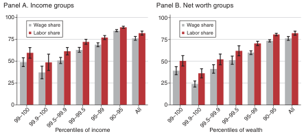
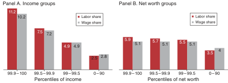
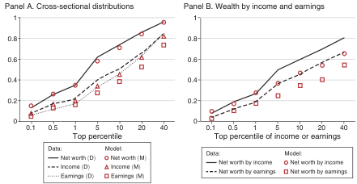
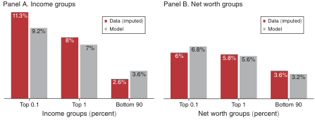
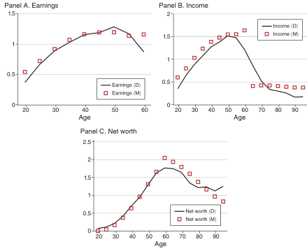
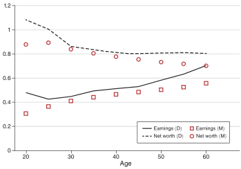
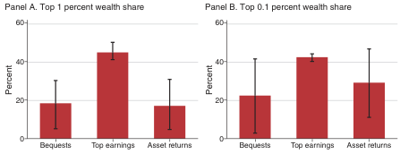
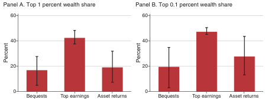
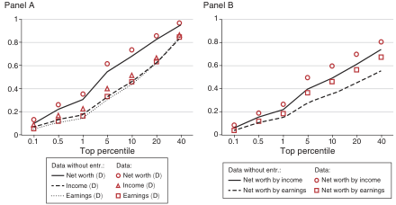
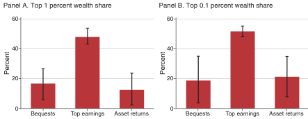

American Economic Journal: Macroeconomics 2026, 18(1): 1-36 http://doi.org/10.1257/mee.20210174

# Accounting for Wealth Concentration in the United States$^{1}$

By BARIŞ KAYMAK, DAVID LEUNG, AND MARKUS POSCHKE*

We assess the empirical relevance of different macroeconomic modeling approaches to wealth concentration, using the joint distribution of earnings, capital income, and net worth in combination with an OLG model of household heterogeneity. We find large earnings disparities to be the primary source of US wealth concentration. This reflects the fact that labor income, from salaries but also from entrepreneurship, is a major income source for top income and wealth groups in the data. Bsequets and differences in rates of return on capital together explain about how the holdings of the wealthiest of households. (JEL D31, E25, G51, J23, I31, L26 )

It worth, the balance of a household's assets and liabilities, is highly concentrated in the United States, with the wealthiest 1 percent holding over one-third of total wealth. Economists have proposed a set of explanations for this, highlighting factors such as labor income heterogeneity; capital return heterogeneity; entrepreneurial activity, which combines heterogeneity in labor and capital incomes; or bequests. These explanations differ in their depictions of who the wealthy are and how they become wealthy, yielding conflicting perspectives on economic policy. $^1$ Regrettably, a direct empirical assessment of how important labor and capital income are for building fortunes in the United States has proven elusive due to the lack of longitudinal data on finances of high-wealth households.

In this paper, we assess the relevance of different modeling approaches by exploiting their diverging predictions for the income composition of top income and wealth groups. If concentration is driven by asset return differences or bequests, these groups should rely heavily on capital income. In contrast, prominent labor income should point to earnings heterogeneity as a key driver of wealth concentration.

* Kaymak: Research Department, Federal Reserve Bank of Cleveland (email: kaymak@mail.ccg.nl); Leung: Department of Economics, National Taiwan University (email: davidlo3004@gmail.com); Prosakle: Department of Economics, McGill University (email: markus.progsakle@mcgill.ca); Ayeegul: Wahid was coeditor for this article. We thank the anonymous reviewers for their comments and suggestions. This article was peer reviewed and accepted for a conference and conferences. We thank Jacob Hager for his assistance. The authors acknowledge support from Chairede la fondation J.W. McConnell en études américaines and the SHRC (grant 435.2018-0264). Leung gratefully acknowledges research support from the E.Sun Academic Award. The views expressed here are those of the authors and do not necessarily reflect the views of the Federal Reserve Bank of Cleveland or the Federal Reserve System. To cite this article, please contact: leung@hsu.edu.tw; leunggrail@hsu.edu.tw; jw.mccann@hofstra.uka; support@hofstra.uka; or email to: leung@hsu.edu.tw; leunggrail@hofstra.uka; jw.mccann@hofstra.uka; support@hofstra.uka; or email to: leung@hsu.edu.tw; leunggrail@hofstra.uka; jw.mccann@hofstra.uka; support@hofstra.uka; or email to: leung@hsu.edu.tw; leunggrail@hofstra.uka; jw.mccann@hofstra.uka; support@hofstra.uka; or email to: leung@hsu.edu.tw; leunggrail@hofstra.uka; jw.mccann@hofstra.uka; support@hofstra.uka; or email to: leung@hsu.edu.tw; leunggrail@hofstra.uka; jw.mccann@hofstra.uka; support@hofstra.uka; or email to: leung@hsu.edu.tw; leunggrail@hofstra.uka; jw.mccann@hofstra.uka; support@hofstra.uka; or email to: leung@hsu.edu.tw; leunggrail@hofstra.uka; jw.mccann@hofstra.uka; support@hofstra.uka; or email to: leung@hsu.edu.tw; leunggrail@hofstra.uka; jw.mccann@hofstra.uka; support@hofstra.uka; or email to: leung@hsu.edu.tw; leunggrail@hofstra.uka; jw.mccann@hofstra.uka; support@hofstra.uka; or email to: leung@hsu.edu.tw; leunggrail@hofstra.uka; jw.mccann@hofstra.uka; support@hofstra.uka; or email to: leung@hsu.edu.tw; leunggrail@hofstra.uka; jw.mccann@hofstra.uka; support@hofstra.uka; or email to: leung@hsu.edu.tw; leunggrail@hofstra.uka; jw.mccann@hofstra.uka; support@hofstra.uka; or email to: leung@hsu.edu.tw; leunggrail@hofstra.uka; jw.mccann@hofstra.uka; support@hofstra.uka; or email to: leung@hsu.edu.tw; leunggrail@hofstra.uka; jw.mccann@hofstra.uka; support@hofstra.uka; or email to: leung@hsu.edu.tw; leunggrail@hofstra.uka; jw.mccann@hofstra.uka; support@hofstra.uka; or email to: leung@hsu.edu.tw; leunggrail@hofstra.uka; jw.mccann@hofstra.uka; support@hofstra.uka; or email to: leung@hsu.edu.tw; leunggrail@hofstra.uka; jw.mccann@hofstra.uka; support@hofstra.uka; or email to: leung@hsu.edu.tw; leunggrail@hofstra.uka; jw.mccann@hofstra.uka; support@hofstra.uka; or email to: leung@hsu.edu.tw; leunggrail@hofstra.uka; jw.mccann@hofstra.uka; support@hofstra.uka; or email to: leung@hsu.edu.tw; leunggrail@hofstra.uka; jw.mccann@hofstra.uka; support@hofstra.uka; or email to: leung@hsu.edu.tw; leunggrail@hofstra.uka; jw.mccann@hofstra.uka; support@hofstra.uka; or email to: leung@hsu.edu.tw; leunggrail@hofstra.uka; jw.mccann@hofstra.uka; support@hofstra.uka; or email to: leung@hsu.edu.tw; leunggrail@hofstra.uka; jw.mccann@hofstra.uka; support@hofstra.uka; or email to: leung@hsu.edu.tw; leunggrail@hofstra.uka; jw.mccann@hofstra.uka; support@hofstra.uka; or email to: leung@hsu.edu.tw; leunggrail@hofstra.uka; jw.mccann@hofstra.uka; support@hofstra.uka; or email to: leung@hsu.edu.tw; leunggrail@hofstra.uka; jw.mccann@hofstra.uka; support@hofstra.uka; or email to: leung@hsu.edu.tw; leunggrail@hofstra.uka; jw.mccann@hofstra.uka; support@hofstra.uka; or email to: leung@hsu.edu.tw; leunggrail@hofstra.uka; jw.mccann@hofstra.uka; support@hofstra.uka; or email to: leung@hsu.edu.tw; leunggrail@hofstra.uka; jw.mccann@hofstra.uka; support@hofstra.uka; or email to: leung@hsu.edu.tw; leunggrail@hofstra.uka; jw.mccann@hofstra.uka; support@hofstra.uka; or email to: leung@hsu.edu.tw; leunggrail@hofstra.uka; jw.mccann@hofstra.uka; support@hofstra.uka; or email to: leung@hsu.edu.tw; leunggrail@hofstra.uka; jw.mccann@hofstra.uka; support@hofstra.uka; or email to: leung@hsu.edu.tw; leunggrail@hofstra.uka; jw.mccann@hofstra.uka; support@hofstra.uka; or email to: leung@hsu.edu.tw; leunggrail@hofstra.uka; jw.mccann@hofstra.uka; support@hofstra.uka; or email to: leung@hsu.edu.tw; leunggrail@hofstra.uka; jw.mccann@hofstra.uka; support@hofstra.uka; or email to: leung@hsu.edu.tw; leunggrail@hofstra.uka; jw.mccann@hofstra.uka; support@hofstra.uka; or email to: leung@hsu.edu.tw; leunggrail@hofstra.uka; jw.mccann@hofstra.uka; support@hofstra.uka; or email to: leung@hsu.edu.tw; leunggrail@hofstra.uka; jw.mccann@hofstra.uka; support@hofstra.uka; or email to: leung@hsu.edu.tw; leunggrail@hofstra.uka; jw.mccann@hofstra.uka; support@hofstra.uka; or email to: leung@hsu.edu.tw; leunggrail@hofstra.uka; jw.mccann@hofstra.uka; support@hofstra.uka; or email to: leung@hsu.edu.tw; leunggrail@hofstra.uka; jw.mccann@hofstra.uka; support@hofstra.uka; or email to: leung@hsu.edu.tw; leunggrail@hofstra.uka; jw.mccann@hofstra.uka; support@hofstra.uka; or email to: leung@hsu.edu.tw; leunggrail@hofstra.uka; jw.mccann@hofstra.uka; support@hofstra.uka; or email to: leung@hsu.edu.tw; leunggrail@hofstra.uka; jw.mccann@hofstra.uka; support@hofstra.uka; or email to: leung@hsu.edu.tw; leunggrail@hofstra.uka; jw.mccann@hofstra.uka; support@hofstra.uka; or email to: leung@hsu.edu.tw; leunggrail@hofstra.uka; jw.mccann@hofstra.uka; support@hofstra.uka; or email to: leung@hsu.edu.tw; leunggrail@hofstra.uka; jw.mccann@hofstra.uka; support@hofstra.uka; or email to: leung@hsu.edu.tw; leunggrail@hofstra.uka; jw.mccann@hofstra.uka; support@hofstra.uka; or email to: leung@hsu.edu.tw; leunggrail@hofstra.uka; jw.mccann@hofstra.uka; support@hofstra.uka; or email to: leung@hsu.edu.tw; leunggrail@hofstra.uka; jw.mccann@hofstra.uka; support@hofstra.uka; or email to: leung@hsu.edu.tw; leunggrail@hofstra.uka; jw.mccann@hofstra.uka; support@hofstra.uka; or email to: leung@hsu.edu.tw; leunggrail@hofstra.uka; jw.mccann@hofstra.uka; support@hofstra.uka; or email to: leung@hsu.edu.tw; leunggrail@hofstra.uka; jw.mccann@hofstra.uka; support@hofstra.uka; or email to: leung@hsu.edu.tw; leunggrail@hofstra.uka; jw.mccann@hofstra.uka; support@hofstra.uka; or email to: leung@hsu.edu.tw; leunggrail@hofstra.uka; jw.mccann@hofstra.uka; support@hofstra.uka; or email to: leung@hsu.edu.tw; leunggrail@hofstra.uka; jw.mccann@hofstra.uka; support@hofstra.uka; or email to: leung@hsu.edu.tw; leunggrail@hofstra.uka; jw.mccann@hofstra.uka; support@hofstra.uka; or email to: leung@hsu.edu.tw; leunggrail@hofstra.uka; jw.mccann@hofstra.uka; support@hofstra.uka; or email to: leung@hsu.edu.tw; leunggrail@hofstra.uka; jw.mccann@hofstra.uka; support@hofstra.uka; or email to: leung@hsu.edu.tw; leunggrail@hofstra.uka; jw.mccann@hofstra.uka; support@hofstra.uka; or email to: leung@hsu.edu.tw; leunggrail@hofstra.uka; jw.mccann@hofstra.uka; support@hofstra.uka; or email to: leung@hsu.edu.tw; leunggrail@hofstra.uka; jw.mccann@hofstra.uka; support@hofstra.uka; or email to: leung@hsu.edu.tw; leunggrail@hofstra.uka; jw.mccann@hofstra.uka; support@hofstra.uka; or email to: leung@hsu.edu.tw; leunggrail@hofstra.uka; jw.mccann@hofstra.uka; support@hofstra.uka; or email to: leung@hsu.edu.tw; leunggrail@hofstra.uka; jw.mccann@hofstra.uka; support@hofstra.uka; or email to: leung@hsu.edu.tw; leunggrail@hofstra.uka; jw.mccann@hofstra.uka; support@hofstra.uka; or email to: leung@hsu.edu.tw; leunggrail@hofstra.uka; jw.mccann@hofstra.uka; support@hofstra.uka; or email to: leung@hsu.edu.tw; leunggrail@hofstra.uka; jw.mccann@hofstra.uka; support@hofstra.uka; or email to: leung@hsu.edu.tw; leunggrail@hofstra.uka; jw.mccann@hofstra.uka; support@hofstra.uka; or email to: leung@hsu.edu.tw; leunggrail@hofstra.uka; jw.mccann@hofstra.uka; support@hofstra.uka; or email to: leung@hsu.edu.tw; leunggrail@hofstra.uka; jw.mccann@hofstra.uka; support@hofstra.uka; or email to: leung@hsu.edu.tw; leunggrail@hofstra.uka; jw.mccann@hofstra.uka; support@hofstra.uka; or email to: leung@hsu.edu.tw; leunggrail@hofstra.uka; jw.mccann@hofstra.uka; support@hofstra.uka; or email to: leung@hsu.edu.tw; leunggrail@hofstra.uka; jw.mccann@hofstra.uka; support@hofstra.uka; or email to: leung@hsu.edu.tw; leunggrail@hofstra.uka; jw.mccann@hofstra.uka; support@hofstra.uka; or email to: leung@hsu.edu.tw; leunggrail@hofstra.uka; jw.mccann@hofstra.uka; support@hofstra.uka; or email to: leung@hsu.edu.tw; leunggrail@hofstra.uka; jw.mccann@hofstra.uka; support@hofstra.uka; or email to: leung@hsu.edu.tw; leunggrail@hofstra.uka; jw.mccann@hofstra.uka; support@hofstra.uka; or email to: leung@hsu.edu.tw; leunggrail@hofstra.uka; jw.mccann@hofstra.uka; support@hofstra.uka; or email to: leung@hsu.edu.tw; leunggrail@hofstra.uka; jw.mccann@hofstra.uka; support@hofstra.uka; or email to: leung@hsu.edu.tw; leunggrail@hofstra.uka; jw.mccann@hofstra.uka; support@hofstra.uka; or email to: leung@hsu.edu.tw; leunggrail@hofstra.uka; jw.mccann@hofstra.uka; support@hofstra.uka; or email to: leung@hsu.edu.tw; leunggrail@hofstra.uka; jw.mccann@hofstra.uka; support@hofstra.uka; or email to: leung@hsu.edu.tw; leunggrail@hofstra.uka; jw.mccann@hofstra.uka; support@hofstra.uka; or email to: leung@hsu.edu.tw; leunggrail@hofstra.uka; jw.mccann@hofstra.uka; support@hofstra.uka; or email to: leung@hsu.edu.tw; leunggrail@hofstra.uka; jw.mccann@hofstra.uka; support@hofstra.uka; or email to: leung@hsu.edu.tw; leunggrail@hofstra.uka; jw.mccann@hofstra.uka; support@hofstra.uka; or email to: leung@hsu.edu.tw; leunggrail@hofstra.uka; jw.mccann@hofstra.uka; support@hofstra.uka; or email to: leung@hsu.edu.tw; leunggrail@hofstra.uka; jw.mccann@hofstra.uka; support@hofstra.uka; or email to: leung@hsu.edu.tw; leunggrail@hofstra.uka; jw.mccann@hofstra.uka; support@hofstra.uka; or email to: leung@hsu.edu.tw; leunggrail@hofstra.uka; jw.mccann@hofstra.uka; support@hofstra.uka; or email to: leung@hsu.edu.tw; leunggrail@hofstra.uka; jw.mccann@hofstra.uka; support@hofstra.uka; or email to: leung@hsu.edu.tw; leunggrail@hofstra.uka; jw.mccann@hofstra.uka; support@hofstra.uka; or email to: leung@hsu.edu.tw; leunggrail@hofstra.uka; jw.mccann@hofstra.uka; support@hofstra.uka; or email to: leung@hsu.edu.tw; leunggrail@hofstra.uka; jw.mccann@hofstra.uka; support@hofstra.uka; or email to: leung@hsu.edu.tw; leunggrail@hofstra.uka; jw.mccann@hofstra.uka; support@hofstra.uka; or email to:

For example, Kandemer and Krueger (2022) prescribe an optimal top marginal tax rate of 90 percent using a model of labor income risk, whereas Brüggen et al. (2023) calls for a 60 percent rate based on a model of enterpreneurship. Givenen et al. (2023) argue that the health tax law may bring efficient gains in models with rate of return hitcropping to the top. However, the subsidy can only spread to a small share of the population. Thus, HKS does not concentrate on top income tax cuts, whereas Kaymak and Poschke (2016) attribute it to widening earnings dispersion.

.

AEJMacro-2021-0174.indd   1

10/28/25 11:21 AM

---

2

AMERICAN ECONOMIC JOURNAL: MACROECONOMICS

JANUARY 2026

Data from administrative tax records show a substantial labor income component for high-income households (Piketty, Saez, and Zucman 2018). We reach a similar conclusion using data from the Survey of Consumer Finance (SCF). Earnings account for almost one-half to two-thirds of total income for the top 1 percent of incomes, depending on the treatment of capital gains and proprietors' income. Households outside the top groups rely almost exclusively on labor income. These suggest an indispensable role for earnings in shaping the wealth distribution.

The lower labor income shares among the highest income and wealth groups nonetheless reflect the relative importance of capital income for these groups. Our analysis indicates, however, that the low shares among the wealthiest mainly reflect their larger asset stocks rather than higher returns. By contrast, we estimate sizable return differences across income groups even after accounting for their wealth.

The effect of these differences on wealth concentration depends on fluctuations in income and asset returns over a lifetime. However, cross-sectional data alone cannot reveal how such dynamics impact wealth accumulation. To discipline these dynamics, we employ a life cycle model of wealth formation calibrated to match the joint distributions of earnings, income, and wealth in the data, in contrast to common macro approaches that focus solely on marginal distributions.

The model incorporates key savings motives like precautionary behavior, retirement planning, and bequests. When combined with empirical income and wealth distributions, the calibrated model yields realistic earnings risk, variation of asset returns with income and wealth, and life cycle profiles of earnings, income, and wealth.

Conducting a series of counterfactual experiments to assess each component's contribution to wealth concentration, we find earnings heterogeneity to be the primary driver of top wealth shares, directly explaining about half of wealth concentration on average, regardless of the presence of other mechanisms in the model.

Differences in bequests and asset returns together explain the remainder of wealth concentration. Individually, return heterogeneity mostly impacts the top 0.1 percent wealth share, while bequest inequality mostly affects the Gini coefficient of wealth. The two mechanisms amplify each other, especially in terms of their effect on the top wealth shares. The marginal effect of each is much smaller when the other mechanism is absent.

Overall, our results emphasize theories based on earnings concentration. The findings reflect the significance of labor income among top groups and are robust to measurement concerns and the exclusion of entrepreneurs. In contrast, we show that explanations relying solely on returns or bequests severely underestimate the concentration of earnings in the economy, while dramatically overstating capital shares among top income and wealth groups.

In the next section, we give a brief overview of the related literature. In Section II , we summarize the empirical distributions of earnings, income, and wealth and document the rates of return by income and wealth implied by the factor composition of income. We present the model in Section III , calibrate it in Section IV , and discuss the benchmark economy in Section V . Section VI analyzes the relative roles of rate of return heterogeneity, labor income risk, and bequests in wealth concentration. Section VII illustrates the sources of identification and

AEJMacro-2021-0174.indd   2

10/28/25 11:21AM

---

VOL. 18 NO. 1

KAYMAK ET AL.: ACCOUNTING FOR WEALTH CONCENTRATION IN THE UNITED STATES

3

discusses the robustness of our results to model specification and measurement. Section VIII provides a discussion of our findings vis-à-vis the literature.

## I. Macroeconomics of the Wealth Distribution

The foundations of modern macroeconomic analysis of the wealth distribution are laid out in early work by Imroghorolu (1989); Huggett (1993); and Aiyagari (1994) . In this setting, dispersion in asset holdings emerges from households' motives to accumulate assets in order to insure themselves against earnings fluctuations. While early models focused on implications of earnings risk for macro outcomes like aggregate savings or the interest rate, it was noted that income differences observed in household surveys were not large enough to generate a highly skewed wealth distribution. The subsequent literature aimed to enhance the model for applications to questions related to wealth inequality. The macro literature on the wealth distribution now is vast, with applications to various economic questions. In our discussion here, we focus on the main modeling extensions: $^2$

The main shortcoming in the original model was that wealthy households cared little about earnings risk and, therefore, limited their savings once their wealth was sufficiently high. The first modeling extensions that helped maintain continuing wealth accumulation, and thereby generate a more skewed wealth distribution, involved introducing differences in savings motives or rates of return on assets. This was achieved by explicitly introducing heterogeneity in preferences for saving (Krusell and Smith 1998) , in rates of return on assets (Benhabib, Bisin, and Zhu 2011; Gabaix et al. 2016; Nirei and Aoki 2016; Cao and Luo 2017) , as well as bequest motives that are increasing in wealth (De Nardi 2004) . Benhabib, Bisin, and Zhu (2011) show analytically that idiosyncratic capital income risk can generate a Pareto-tailed wealth distribution with a realistic tail index. Capital income risk is essential to a fat-tailed wealth distribution in some versions of the incomplete markets model, but is not generally necessary, for example, if agents have finite lives (Jones 2015; Stachurski and Toda 2019; Sargent, Wang, and Yang 2021) .

Benhabib, Bisin, and Luo ( 2019 ) : HKS; and Cao and Luo ( 2017 ) provide quantitative assessments of the contribution of rate of return heterogeneity to wealth concentration. The common element among these models is that the main source of differences in wealth accumulation is capital income. High wealth concentration emerges because wealthy households enjoy higher rates of return on their assets and have higher saving rates. As a consequence, capital income is essential to top income and wealth groups.

A second strand of the literature focused on better measurement of earnings. Household surveys typically provide an incomplete picture of the distribution of earnings and associated risks due to censoring of earnings above a certain level or limited sampling of high-earning households. Castañeda, Díaz-Giménez, and Ríos-Rull (2003) were the first to show that the standard incomplete markets model can indeed generate a highly skewed wealth distribution if the earnings process is calibrated

2 See De Nardi and Fella (2017) for a more detailed review of the macro literature on wealth inequality.

AEJMacro-2021-0174.indd   3

10/28/25 11:21 AM

---

4

AMERICAN ECONOMIC JOURNAL: MACROECONOMICS

JANUARY 2026

accordingly. This, however, required unrealistically high earnings levels for top income groups. Subsequent work refined this approach, using the recent progress in measurement of top earnings levels based on administrative data to discipline the extent of earnings dispersion in the model (Kindermann and Krueger 2022; Kaymak and Poschke 2016) . The economic mechanism here is that households that temporarily have very high earnings face lower future earnings (be it because of retirement or the vagaries of a top-level career) and, therefore, have a very strong saving motive. The explicit consideration of very high earnings levels is a key ingredient in these models, where the main source of wealth concentration consists of differences in labor income and the associated saving behavior.

Another mechanism that can generate high wealth concentration is entrepreneurship, which combines elements from the two stands above, since profits reflect both the return on business investment and the value of entrepreneurial labor (Quadrini 2000; Cagetti and De Nardi 2006) . Versions of these models without credit restrictions can be mapped into a model with earnings heterogeneity and a common return on assets because in equilibrium, the marginal rate of return on business capital is equalized across entrepreneurs (see Supplemental Appendix A). Differences in business income net of the common return on capital, stemming from inframarginal returns to entrepreneurial skill, are then attributable entirely to labor. This interpretation is in line with recent work, which finds that entrepreneurial income primarily reflects the entrepreneur's human capital (Smith et al. 2019; Bhandari and McGrattan 2021) . In versions with credit constraints, some entrepreneurs reap higher (marginal) rates of return on their investments if, or as long as, they are financially constrained (Buera 2009; Moll 2014) . In such cases, differences in business income reflect differences in both the investment returns and the productivity of entrepreneurial labor. The accounting approach we adopt below, both in our empirical and in our quantitative analysis, is consistent with this view.

All these approaches substantially improved the ability of the standard incomplete markets model to generate a realistic wealth distribution for the United States, offering economists several modeling options. The existing literature has operated with either a model with capital income risk, one with high earnings dispersion, or one with entrepreneurship. Yet, the relative roles of earnings and capital income risk in generating the observed wealth concentration are not well understood, in part due to a lack of data on the dispersion and persistence of rates of return on assets at the household level in the United States. $^3$ Our analysis fills this gap.

## Ⅱ. Income, Earnings, and Wealth in the United States

In this section, we summarize the distributions of earnings, income and wealth, and discuss the relative significance of capital and labor for top income and wealth groups. The primary sources of data are the 2001 to 2019 waves of the SCF, a triennial cross-sectional survey of households on their assets, income, and demographic characteristics. The SCF is particularly suitable for our analysis since it

$^{14}$ Recent work by Fagereng et al. (2021) and Bach, Calvet, and Sodini (2020) provide empirical evidence for rate of return heterogeneity using panel data from Norway and Sweden, respectively.

AEJ Macro-2021-0174.indd    4

10/28/25 11:21 AM

---

VOL. 18 NO. 1

KAYMAK ET AL.: ACCOUNTING FOR WEALTH CONCENTRATION IN THE UNITED STATES

$

oversamples high-income households and is commonly used in the macro literature to study upper tails of the income and wealth distribution (e.g., Kuhn, Schularick, and Steins 2020).

## A. Data and Definitions

Since the objective is to identify the importance of different modeling components, we adopt a market-based notion of income that is compatible with the models of wealth distribution mentioned above. Market income includes wage and salary income, business and farm income, interest and dividend income, private pension withdrawals, and capital gains, whereas it excludes income from fiscal sources, such as transfer income or Social Security income.

We distinguish between labor and capital income. Labor income consists of wage and salary income, including any salary drawn from an actively managed business. The vast majority of households report these explicitly in the SCF. Among business owners, active shareholders of corporations are explicitly required by the IRS to report their salaries. But some business organizations, such as partnerships and sole proprietorships, are exempt from this requirement. As a result, about 9 percent of households report some business income but no salary income associated with the business. In such cases, we impute the labor and capital components of business income. We impute a labor component only if a household reports income from actively owned businesses but does not report any wage income, or if the respondent or their spouse reports explicitly that they did not draw salary from their actively managed business. This procedure does not change the conclusions we draw from the empirical patterns below, reported with and without imputed salaries. For our baseline analysis, we include imputed wages in labor income and later present a version without imputed wages for robustness.

To determine capital's share of active business income, we assume capital's contribution is proportional to business equity held. Consequently, we regress active business income on equity value, controlling for the quantity and quality of the labor input. Specifically, we include the number of hours worked by household members who are actively involved in the business as well as demographic characteristics of the head of household, such as gender, age, and education, as control variables. The resulting coefficient on equity is 0.25 (SE 0.03), which we interpret as the capital income share." We thus allocate 75 percent of active business income to labor for those who do not report wage income from their business.

Despite the differences in methodology and data sources, our estimate of 75 percent is close to that of Pieketty, Saez, and Zucman (2018) who attribute 70 percent of pass-through income to labor. While ascertaining the labor share of income among entrepreneurs is inherently difficult, our estimates potentially underestimate the contribution of entrepreneurial labor, and, hence, we see them as conservative given our findings. First, empirical work that relies on administrative tax records and variations in ownership that are more exogenous in nature suggest much higher

4This is the share in net income, since depreciation expenses are deducted from the reported business income. The share in gross income can be found by adding the rate of depreciation.

AEJMacro-2021-0174.indd    5

10/28/25 11:21 AM

---

6

AMERICAN ECONOMIC JOURNAL: MACROECONOMICS

JANUARY 2026

TABLE 1—C ROSS -S ECTIONAL Distributions ISTRIBUTIONS of Income, NCOME, Earnings, ARINGS , and Net ET Worth ORTH

<table><tr><td>Top percentile</td><td>0.1%</td><td>0.5%</td><td>1%</td><td>5%</td><td>10%</td><td>20%</td><td>40%</td><td>Gini</td></tr><tr><td>Net worth</td><td>0.13</td><td>0.26</td><td>0.35</td><td>0.62</td><td>0.74</td><td>0.86</td><td>0.96</td><td>0.84$^{a}$</td></tr><tr><td>Income</td><td>0.08</td><td>0.17</td><td>0.22</td><td>0.40</td><td>0.51</td><td>0.66</td><td>0.85</td><td>0.66</td></tr><tr><td>Earnings</td><td>0.06</td><td>0.12</td><td>0.17</td><td>0.33</td><td>0.46</td><td>0.63</td><td>0.85</td><td>0.64$^{b}$</td></tr></table>

Notes: Table shows the cumulative concentration shares for the top percentile groups. Income includes capital gains. a Includes negative values. The Gini coefficient with nonnegative values is 0.81. b The Gini coefficient for households with a working-age head is 0.56.

Source: SCF 2001-2019.

roles for entrepreneurial labor. Smith et al. (2019) , for instance, find that profits of a business decline substantially upon the owner's demise. Consequently, they attribute 75 percent of business profits to human capital, in addition to the reported salaries. Similarly, Bhandari and McGrattan (2021) attribute three-quarters of profits to “ sweat equity, ” which is embodied in the entrepreneur. We maintain profits as part of the return on capital. Second, we do not question the explicitly reported salaries, although business owners have tax incentives to underreport wage income. Third, among those who do not report wage income, we only impute wages for the spouse and the respondent due to data limitations. If other members of the household also work for the business, their labor income is classified as part of the household's business income.

Capital’s share of income excludes accrued (but not realized) capital gains since they are not observed. Including them would lower the overall labor share, but it is not clear ex ante how it would change the relative labor shares across income and wealth groups—the critical input to our quantitative analysis below. Burman and Ricoy (1997) find that higher income groups are overwhelmingly more likely to realize capital gains and realize a large fraction of their gains when they do. They explain this by differences in portfolio composition: Since housing is the main component of wealth for lower income groups, the associated capital gains are realized much less frequently relative to financial assets, which are concentrated among top income groups. This suggests that ignoring accrued gains leads to larger differences in labor shares across income groups, and, thereby, in rates of return on capital. This is consistent with Larrimore et al. (2021) where, for the 2001–2016 period, the average share of the top 1 percent of income is 19.5 with accrued gains, whereas it is 20.6 with realized gains alone (see their appendix table 2). This suggests that realized gains are more skewed than the total (realized and accrued) capital gains. $^3$

## B. Marginal and Joint Distributions

Table 1 shows the cross-sectional distributions of income, earnings, and wealth. The distribution of net worth is far more skewed than the distributions of income and earnings: The Gini coefficient for net worth is 0.84, whereas it is 0.64 for earnings and 0.66 for income. This is driven by both the heavier concentration of wealth at

$^{5}$We show in Section VII that any such bias would have to be much larger than what can be attributed to unrealized capital gains to overturn our results.

AEJMacro-2021-0174.indd    6

10/28/25 11:21 AM

---

VOL. 18 NO. 1

KAYMAK ET AL.: ACCOUNTING FOR WEALTH CONCENTRATION IN THE UNITED STATES

7

TABLE 2—SHARES OF NET WORTH BY INCOME AND EARNING GROUPS

<table><tr><td>Top percentile of ...</td><td>0.1%</td><td>0.5%</td><td>1%</td><td>5%</td><td>10%</td><td>20%</td><td>40%</td></tr><tr><td>... income</td><td>0.08</td><td>0.19</td><td>0.27</td><td>0.50</td><td>0.60</td><td>0.70</td><td>0.81</td></tr><tr><td>... earnings</td><td>0.04</td><td>0.12</td><td>0.19</td><td>0.37</td><td>0.46</td><td>0.57</td><td>0.67</td></tr></table>

Notes: Table shows cumulative shares of net worth held by top income and earning groups. Income includes capital, interest, debt and equity. Source: SCF 2001-2019.

the top and a larger fraction of households without assets relative to those without income. The top 1 percent of the net worth distribution has 35 percent of assets, and the top 0.1 percent holds 13 percent of total wealth. Earnings are also concentrated: The share of the top 1 percent earners is 17 percent, and that of the top 0.1 percent is 6 percent.

There is a strong correlation between wealth, earnings, and income. This can be seen in Table 2 , which shows the wealth shares of different earning and income groups. The top 1 percent of earners hold about 19 percent of wealth. Similarly, the households in the highest 1 percent of incomes hold 27 percent of wealth in the United States. If the correlation were zero, wealth shares would be equal to population shares when ranking groups by income or earnings. This suggests that savings out of earnings and income play a significant role for wealth accumulation.

## C. The Share of Income from Labor

Figure 1 shows the factor composition of income for top income and wealth groups. The gray bars show the share of wage and salary in total income, as reported by households. The red solid bars show the labor share of total income, including imputed earnings for those proprietors who do not report wage income from their businesses. The whiskers on each bar indicate the values when capital gains are included in or excluded from total income. The height of each bar represents the average of the two.

Overall, 74 to 84 percent of net income is attributed to labor, depending on the treatment of capital gains and business income. $^6$ Most households rely primarily on wage and salary income. Outside the top 1 percent of the income distribution, labor income makes up at least two-thirds of income. Since business income and capital gains are not an important source of income for these groups, the particular definition of income does not change this.

For the top 1 percent of the income distribution, labor income constitutes 53 percent of total income when capital gains are included, and 66 percent when they are excluded. The wage share, which excludes imputed wages for some proprietors, is roughly 10 points lower. Columns 2 to 4 show the percentiles of income within the

$^{5}$Since the accounting conventions do not report the net income from capital—that is, excluding depreciation—the choice was made to look for changes in the net income statement, which included both capital and interest in the net income statement. We use net capital income in one comparison of the model predictions below with the data above.

AEJMacro-2021-0174.indd    7

10/28/25 11:21 AM

---

8

AMERICAN ECONOMIC JOURNAL: MACROECONOMICS

JANUARY 2026

F IGURE 1. Labor ABOR Component OMPONENT of Income NCOME by Income NCOME and Wealth EALTH Groups ROUPS (Percent) ERCENT )

Notes: Figure shows wage and labor shares of total income by percentiles of income and net worth. Labor income includes inputted wage income for active business owners who do not draw a salary from their businesses. The figures are in millions, with and without capital gains in total income. The bar heights show the average of the two values. See Appendix Table A1 for the data values. Source: SCF 2001–2019.

top 1 percent. Income from labor is the major source, accounting for at least half of total income, with the exception of the top 0.1 percent.

A similar pattern is observed among wealth groups in panel B. Labor's share of income for the wealthiest 1 percent is 45 percent and 56 percent, with and without capital gains. Excluding capital gains, income from labor is the main source of income for households outside of the top 0.1 percent of the net worth distribution. With capital gains, income from capital dominates labor for those in the top 0.5 percent.

In the Appendix, we document similar patterns in administrative tax data (see Table A2 ). Both sets of data agree on the relative shares of sources of income. For most households, earned income from labor is the primary source of income. As we move up the income ladder, the share of labor income declines, and income from capital increases. Nonetheless, even among the top 1 percent of households (and tax units), at least about half the income can be attributed to labor. The upshot is that labor income remains a nonnegligible source of income throughout and is a primary source of income for most households (or tax units) outside the highest income and net worth groups.

## D. Implied Heterogeneity in the Rate of Return on Assets

Next, we demonstrate how labor's share of income can help identify heterogeneity in the rate of return and discuss the limitations of inference based on cross-sectional data alone.

A group's relative rate of return on capital can be inferred from its relative labor share of income. To see this, let $\lambda_i = c_i/(c_i + r_i k_i)$ denote the labor income share

AEJMacro-2021-0174.indd   8

10/28/25 11:21AM

---

VOL. 18 NO. 1

KAYMAK ET AL.: ACCOUNTING FOR WEALTH CONCENTRATION IN THE UNITED STATES

9

FIGURE 2. RATES OF RETURN IMPLIFIED BY LABOR SHARES (PERCENT)

Notes: Figure shows the synthetic rate of return on assets by household income and net worth implied by the labor share of income, assuming an annual average rate of return of 4.5 percent. Labor share includes imputed wage income for active business owners who do not draw a salary from their businesses, whereas wage share excludes it (see Figure 1 ). Authors' calculations from SCF 2001-2019.

of a group of households i, where $e_i$ and $k_i$ are average earnings and assets of a household in the group, and $r_i$ is the group-specific return on assets. Let $l=0$ represent a base group, which we define below as the bottom 90 percent of the income or wealth distribution. Denote the earnings ratio of group i relative to the base group by $e_{l/0} = e_i/e_0$, and the asset ratio by $k_{l/0} = k_i/k_0$. Then, the labor income share of group i can be expressed as$^{2}$

$$(1)\quad \lambda_{i}=\frac{e_{i}}{e_{i}+r_{i} k_{i}}=\frac{\lambda_{0}}{\lambda_{0}+\frac{k_{i}\left(\eta_{i}\right)}{r_{i}}\left(1-\lambda_{0}\right)}$$

Equation (1) relates the labor income share of top income groups to that of the base group. Top income groups have lower labor income shares in two situations. First, their relative wealth is higher than their relative earnings, $k_{i0}/n_{0}(\alpha_0)>1$ , or, equivalently, their wealth-to-earnings ratio is relatively higher. This could arise if, for instance, the saving rate increases with earnings. Second, they have a higher rate of return on their assets: $r_i/r_0 > 1$ . To isolate the latter, we solve equation (1) for the relative rates of return, implied by the observed labor income shares for different groups:

$$(2)\quad \frac{r_{i}}{r_{0}}=\frac{\varepsilon_{i/0}}{\varepsilon_{0/0}}\left|\frac{1/\lambda_{0}-1}{1/\lambda_{0}-1}\right|$$

Equation (2) allows for an estimate of $r_t/r_0$ given relative earnings, wealth and labor shares. Figure 2 shows the estimates of $r_t$ across income (panel A) and wealth groups

$$\begin{array} { r } { \lambda _ { 1 } = \frac { c _ { 1 } \kappa _ { 0 } \eta } { c _ { 2 } \kappa _ { 1 } + c _ { 3 } \kappa _ { 2 } + \kappa _ { 3 } } = \frac { c _ { 3 } } { c _ { 2 } + c _ { 3 } \kappa _ { 2 } } = \frac { c _ { 3 } } { \kappa _ { 2 } } = \frac { c _ { 3 } \kappa _ { 2 } } { \kappa _ { 2 } } = \frac { \lambda _ { 2 } } { \lambda _ { 2 } - \kappa _ { 2 } ( 1 - \lambda _ { 2 } ) } . } \end{array}$$

AEJMacro-2021-0174.indd   9

10/28/25 11:21 AM

---

$$ 10 $$

AMERICAN ECONOMIC JOURNAL: MACROECONOMICS

JANUARY 2026

(panel B). To translate the relative returns to actual returns, we assume an aggregate return of 4.5 percent per year, which corresponds to the rate in our quantitative analysis below. Using our preferred labor share measure, the red columns show an annual rate of return of 2.5 percent for the base income group, with higher rates up along the income ladder. The average return for the top 1 percent of incomes is 7.9 percent, and it is 11.2 percent for the highest income category (top 0.1 percent).

Because the relative rates of return depend on relative labor shares, the dispersion is robust to the definition of labor income. The gray bars show the rates implied by excluding imputed wages from labor income (gray bars in Figure 1 ). The estimated rates of return rise from 2.8 percent for the base group to 10.2 percent for the highest income group.

A similar analysis yields smaller differences in rates of return by wealth (panel B), because top wealth groups have dramatically more assets. This almost suffices to explain their higher share of income from capital, leaving a smaller role for rates of return.

While Figure 2 suggests a modest degree of cross-sectional heterogeneity in asset returns, it is not possible to accurately gauge how much this matters for wealth concentration. Since higher rates of return lead to higher income and, ultimately, higher wealth, the positive correlation between rates of return and income (or wealth) may be spurious. Moreover, the dynamic process for the rates of return cannot be estimated from cross-sectional data. But the persistence and predictability of returns are crucial for the savings response to these rates for different income and wealth groups. Below, we combine the cross-sectional information above with a model of household saving to quantify the role of earnings concentration and rate of return heterogeneity in shaping the wealth distribution in the United States.

## Ⅲ. A Life Cycle Model of Wealth Accumulation

For the analysis, we employ an overlapping-generations model of life cycle wealth accumulation under incomplete markets (Huggett 1996) . We augment the model by incorporating idiosyncratic labor income with extraordinary earnings levels, heterogeneity in the return to capital income, and a nonhomothetic bequest motive.

### A. Environment

Each period, a continuum of new agents enter the economy, with a potential life span of $J$ periods, subject to survival probabilities $s(j)$ for each age $j$ . They work for the first $J_r-1$ periods and then retire. The total population is normalized to one.

Agents have labor and capital incomes. A worker's labor endowment is $z\varepsilon_t$ , where $z$ is stochastic, following a first-order Markov process $F_z(z|z)$ , and $\varepsilon_t$ is a deterministic component that captures age-dependent improvements in human capital, for example, from experience. With this endowment, a worker generates a labor income of $w\varepsilon_t h$ , where $w$ is wage per skill unit and $h \in [0,1]$ is hours worked. Income from capital is $rvk$ , where $k$ denotes assets, and $rv$ is an idiosyncratic rate of return that follows a Markov process defined by $F_{rv}(rv|z,\varepsilon_t)$ . This process potentially allows for a correlation between labor productivity and capital returns, which

---

VOL. 18 NO. 1

KAYMAK ET AL.: ACCOUNTING FOR WEALTH CONCENTRATION IN THE UNITED STATES

$$ 11 $$

could arise in models with entrepreneurs or in models where some households have restricted access to financial markets.

Once retired, agents collect a pension, $b(z)$ , based on the last realization of their labor productivity, $z$ , and continue to earn capital income. $^8$ Total income is denoted by $y$ .

In addition to income, agents may stochastically receive a bequest (or an intervivos transfer), $\Phi$ , according to the state-dependent density $F_S$ . As we explain in Section IV F , the state dependence allows us to capture age profiles of the incidence and the size of intergenerational transfers, as well as their correlation with parental income and wealth.

All income is subject to taxation, as are large bequests. The tax system, outlined below in detail, distinguishes between different sources of income and features transfers. The disposable income after all taxes and transfers is denoted by $y^{d}$ . Consumption is subject to sales tax at rate $\tau_{p}$ . The bequest tax function is denoted $\tau_{p}$ . The government uses the tax revenue to finance an exogenously given expenditure level, $G$ ; pension payments; and other transfers.

Goods are produced by a representative firm using aggregate capital K and labor N with a Cobb-Douglas production function: $Y=\Psi K^{\alpha}N^{1-\alpha}$. The firm hires capital and labor in a competitive market to maximize its profits.

## B. The Consumption-Savings Problem

Agents value consumption, leisure, and the assets they leave for their offspring. An agent's problem is to choose labor supply, consumption, savings, and bequests to maximize expected lifetime utility. Future utility is discounted by $\beta \in (0,1)$ . At each period $j$ , agents are informed of their labor endowment, $z_{Ej}$ , and their rate of return, $r_{Ej}$ , prior to taking their decisions. Formally, the Bellman equation for a worker's problem is

$$\begin{array} { r l } { V ( j , k , z , \kappa ) = } & { \underset { c , k ^ { \prime } \geq 0 , \delta c \geq 0 } { \operatorname* { m a x } } \left\{ \frac { 1 - \sigma _ { c } } { 1 - \sigma _ { c } } - \theta \frac { h ^ { 1 + \sigma _ { t } } } { 1 + \sigma _ { t } } + \beta ( 1 - s ( i ) ) \phi ( k ^ { \prime } ) \right. } \\ & { \quad + \left. \beta s ( i ) \mathbb { E } \left\{ V ( j + 1 , k ^ { \prime } + \Phi ^ { \prime } ; z ^ { \prime } , \kappa ^ { \prime } ) \, \middle | \, j , z , \kappa \right. \right\} } \end{array}$$

$$ subject to $$

$$(1+\tau_{s})c+k^{\prime}=y^{d}(zw\varepsilon_{h},r\kappa k)+k+Tr,$$

where $\phi(k)=\phi_1\left[(k+\xi_2)^{1-\sigma_n}\right]^{-1}$ is the utility value of bequeathed assets, and $\Phi$ denotes assets received as a bequest, net of any applicable tax. The expectation is

$^{8}$The actual US Social Security benefits depend on a worker's average earnings over their career. Following Kindermann and Krueger (2022), we assume that pension benefits depend on the earnings of the last working age period. This allows us to capture the redistributive structure of the US pension system while maintaining computational feasibility.

AEJMacro-2021-0174.indd   11

10/28/25 11:21 AM

---

12

AMERICAN ECONOMIC JOURNAL: MACROECONOMICS

JANUARY 2026

taken over the future values of the labor endowment, $z^t$ , the rate of return on assets, $\kappa^t$ , and $\Phi^t$ , given the processes $F_s^t$ , $F_r^t$ , and $F_\varphi^t$ .

Since retirees do not work, the Bellman equation for a retiree's problem is given by

$$\begin{array} { r l } { V ( j , k , z , \kappa ) = } & { \underset { c , k ^ { \prime } = 0 } { \operatorname* { m a x } } \Bigg \{ c \frac { 1 - s _ { r } } { 1 - s _ { r } } + \beta t ( j ) \mathbb { E } \left[ V \left( j + 1 , k ^ { \prime } + \Phi ^ { \prime } ; z , \kappa ^ { \prime } \right) \middle | j , k , z \right] } \\ & { \quad + \beta \big ( 1 - s ( j ) \phi ( k ^ { \prime } ) \big ) \Bigg \} . } \end{array}$$

$$ subject to $$

$$(1+\tau_{x})c+k^{\prime}=y^{d}(b(z),r\kappa k)+k+Tr.$$

### C. Stationary Equilibrium

Let $s = \{j, k, s, k'\} \in S$ be a generic state vector. The stationary equilibrium of the economy is given by a consumption function, $c(s)$ ; a savings function, $k'(s)$ ; labor supply, $h(s)$ ; a value function, $V(s)$ ; a wage rate $w$ ; an interest rate $r$ ; and a distribution of agents over the state space $\Gamma(S)$ , such that (i) functions $V(s)$ , $c(s)$ , $k'(s)$ and $h(s)$ solve the consumers' problems, (ii) firms maximize profits, and (iii) factor markets clear

$$K = \int k ( s ) d \Gamma ( s ) N = \int z \varepsilon _ { j } h ( s ) d \Gamma _ { j \leq  j } ( s ) ,$$

the government's budget is balanced:

$$\begin{array} { r l } { G + \int b ( z ) d \Gamma _ { j \geq J _ { t } } ( s ) } & { = \tau _ { s } \Big [ \int c ( s ) d \Gamma ( s ) \Big ] } \\ & { \quad + \int \Big [ y - y ^ { d } ( z w \varepsilon _ { j } h , r s k ) \Big ] d \Gamma _ { j \leq  J _ { t } } ( s ) } \\ & { \quad + \int \Big [ y - y ^ { d } ( b ( z ) , r s k ) \Big ] d \Gamma _ { j \geq J _ { t } } ( s ) } \\ & { \quad + \int \Big ( 1 - s ( j ) \Big ) \, \tau _ { s } ( k ^ { \prime } ) d \Gamma ( s ) \, ; } \end{array}$$

and $\Gamma(s)$ is consistent with the policy functions and is stationary.

## IV. Calibration of the Model

To quantify the model parameters, we first choose a set of parameters based on information that is exogenous to the model. Then, we calibrate the remaining parameters so that the stationary equilibrium of the model economy is consistent with the empirical distributions of earnings, income, and wealth, as well as other informative data moments. Below, we describe our calibration strategy and highlight the key assumptions. We report a full list of calibration results, including target moments and parameter values, in Supplemental Appendix B .

---

VOL. 18 NO. 1

KAYMAK ET AL.: ACCOUNTING FOR WEALTH CONCENTRATION IN THE UNITED STATES

$$ 13 $$

While our approach is broadly consistent with the standard for quantitative macro models of overlapping generations with idiosyncratic risk, it has some distinctive elements. From a modeling perspective, the main differences are in the earnings process, where we allow some households the possibility of reaching an extraordinarily high labor productivity level, and in the rate of return risk. From an empirical point of view, we differ from earlier studies in our explicit use of the joint distribution of earnings, income, and wealth in addition to their marginal distributions to identify these modeling extensions.

## A. Demographics

The model period is five years. The first period corresponds to ages 20 to 24. Retirement is mandatory at age 65 ( $J_{c}=10$ ) and death is certain after $J=16$ (ages 95–99). Following Halliday et al. (2019) , we model survival probability as a logistic function of age $s(t)=\left[1+\exp(\omega_0+\omega_1J+\omega_2t^2)\right]$ and use their recommended parameter values.

## B. Preferences and Production Technology

Preferences are described by a discount factor, $\beta$ ; the inverse elasticity of intertemporal substitution, $\sigma_t$ ; the inverse elasticity of labor supply, $\sigma_l$ ; the disutility of work $\theta$ ; and the parameters of utility from bequests $\sigma_p, \phi_1$ and $\phi_2$ . We discuss the last three separately below. We set $\sigma_l = 1.22$ , which implies a Frisch elasticity of 0.82, the average of 0.68 for males and 0.96 for females reported by Blundell, Pistaferra, and Saporta-Eksten (2016) . We choose $\theta$ so that an average household allocates 35 percent of their time to work in equilibrium. We set $\sigma_s = 1.5$ , in the middle of the range typically used in the literature. The discount factor, $\beta$ , is chosen so that the ratio of capital to (annual) income is 3 given an annual depreciation rate of 4.5 percent. This results in a value of $\beta = 0.88$ (0.974 per annum). The implied (value-weighted) interest rate that clears the asset market is 4.5 percent. We normalize the equilibrium wage rate, $w=1$ , which requires an aggregate total factor productivity of $\Psi = 1.55$ . To set capital's share in output, we target the net labor income share observed in the SCF.

## C. Labor Productivity Process

The stochastic component of labor productivity takes eight values. Six of these are ordinary states, and the other two are extraordinary states that generate exceptially high earnings levels. The ordinary levels $z_i$ to $z_6$ consist of combinations of two components: a permanent component, $f \in \left\{ f_R, f_L \right\}$ , that is fixed over a household's career, and a transitory component, $a \in \left\{ a_R, a_L, a_H \right\}$ . Individuals randomly draw their value of $f$ in the first period of their lives. Idiosyncratic fluctuations in labor income are captured by a three-by-three matrix $A = \left[ A_{ij} \right]_{i,j} \in \left\{ L,M,H \right\}$ and $\sum A_{ij} = 1 - \lambda_m$ , as well as by $\lambda_m$ which represents the probability of entering an extraordinary state of productivity. The stochastic labor productivity process is summarized by the matrix in Table 3 . The following additional assumptions are

AEJMacro-2021-0174.indd   13

10/28/25 11:21AM

---

$$ 14 $$

AMERICAN ECONOMIC JOURNAL: MACROECONOMICS

JANUARY 2026

TABLE 3—TRANSITION MATRIX FOR THE LABOR PRODUCTIVITY PROCESS

<table><tr><td></td><td>z_{t}</td><td>z_{2}</td><td>z_{3}</td><td>z_{4}</td><td>z_{5}</td><td>z_{6}</td><td>z_{7}</td><td>z_{8}</td></tr><tr><td></td><td>f_{t}+a_{t}</td><td>f_{t}+a_{t}</td><td>f_{t}+a_{t}</td><td>f_{t}+a_{t}</td><td>f_{t}+a_{t}</td><td>f_{t}+a_{t}</td><td></td><td></td></tr><tr><td>f_{t}+a_{t}</td><td>A_{11}</td><td>A_{12}</td><td>A_{13}</td><td>0</td><td>0</td><td>0</td><td>$\lambda_{m}$</td><td>0</td></tr><tr><td>f_{t}+a_{t}</td><td>A_{21}</td><td>A_{22}</td><td>A_{23}</td><td>0</td><td>0</td><td>0</td><td>$\lambda_{m}$</td><td>0</td></tr><tr><td>f_{t}+a_{t}</td><td>A_{31}</td><td>A_{32}</td><td>A_{33}</td><td>0</td><td>0</td><td>0</td><td>$\lambda_{m}$</td><td>0</td></tr><tr><td>f_{t}+a_{t}</td><td>0</td><td>0</td><td>0</td><td>A_{11}</td><td>A_{12}</td><td>A_{13}</td><td>$\lambda_{m}$</td><td>0</td></tr><tr><td>f_{t}+a_{t}</td><td>0</td><td>0</td><td>0</td><td>A_{21}</td><td>A_{22}</td><td>A_{23}</td><td>$\lambda_{m}$</td><td>0</td></tr><tr><td>f_{t}+a_{t}</td><td>0</td><td>0</td><td>0</td><td>A_{31}</td><td>A_{32}</td><td>A_{33}</td><td>$\lambda_{m}$</td><td>0</td></tr><tr><td>s_{t}</td><td>$\lambda_{m}$</td><td>$\lambda_{m}$</td><td>$\lambda_{m}$</td><td>$\lambda_{m}$</td><td>$\lambda_{m}$</td><td>$\lambda_{m}$</td><td>$\lambda_{m}$</td><td>$\lambda_{m}$</td></tr><tr><td>s_{t}</td><td>0</td><td>0</td><td>0</td><td>0</td><td>0</td><td>0</td><td>$\lambda_{m}$</td><td>$\lambda_{m}$</td></tr><tr><td>Initial dist.</td><td>$\zeta/4$</td><td>(-1) $\zeta/2$</td><td>$\zeta/4$</td><td>$\zeta/4$</td><td>(1 - $\zeta$/2)</td><td>$\zeta/4$</td><td>0</td><td>0</td></tr></table>

Notes: The transition probabilities from the state in column 1 to the states in column 2 to 9. The last row shows the initial distribution of young workers across the productivity state in the time of labor market entry.

explicit in the formulation of the matrix. The probability of reaching an extraordinary status, $s_{m}$ , is independent of one's current productivity state and age. Likewise, if a household loses its extraordinary status, then it is equally likely to transition to any one of the ordinary states.

Our working assumption is that the values for the ordinary states and the transitions among them can be inferred from survey data, unlike the transitions to, from, and among extraordinary states. To calibrate values and transitions of ordinary states, we assume that the transitory component, $a$ , follows an AR(1) process, with an annual persistence of 0.97, as estimated by Heathcote, Storesletten, and Violante (2010) , and variance $c_w$ . Wage regressions in the Panel Study of Income Dynamics (PSID) with fixed worker effects indicate that 60 percent of the total variance of wages reflects differences in the permanent component, and the remaining 40 percent reflects transitory shocks. Accordingly, we set $\sigma_v^2 = 0.4 \sigma^2$ , where $\sigma^2$ is the total variance. Normalizing $a_U = 0$ and setting $a_L = -a_H < 0$ then allows us to determine $a_L$ and the elements of $A$ in terms of $\sigma$ using the Rouwenhorst approximation. To determine the levels of the fixed components, we set $f_L = -f_H$ . Assuming an equal division of households between the two permanent states, we then express $f_H$ in terms of $\sigma$ such that the implied variance is 0.6 $\sigma^2$ :

At this point, all ordinary productivity levels are expressed relative to $\sigma$ . Note that $\sigma^2$ is the variance corresponding to the long-run stationary state associated with the transition matrix. Since the wage distribution is not stationary over the life cycle, this object is not directly observed in the data. To determine $\sigma$ , we parameterize the initial distribution of households over the ordinary productivity states at the beginning of their careers as in the last row of Table 3 . By assumption, households are not born to extraordinary productivity. Thus, given the age distribution implied by the survival function described in Section IV.A , we jointly calibrate the parameters $\zeta$ and $\sigma$ such that the overall cross-sectional variance of wages equals 0.58 and the standard deviation of wages grows by 47 percent between the ages of 22 and 57, as in the PSID. This requires that $\sigma^2 = 0.81$ and $\zeta = 0.18$ .

This leaves the extraordinary productivity levels $\alpha_7$ and $\alpha_8$ , and the transition probabilities $(\lambda_m,\lambda_m,\lambda_m,\lambda_m,\lambda_m,\lambda_m,\lambda_m)$ . Two of these are pinned down by adding up constraints for probabilities. To identify the remaining parameters, we target the

AEJMacro-2021-0174.lndd 14

10/28/25 11:21AM

---

VOL. 18 NO. 1

KAYMAK ET AL.: ACCOUNTING FOR WEALTH CONCENTRATION IN THE UNITED STATES

$$ 15 $$

marginal distribution of earnings, specifically, the top 0.1 and 1 percent shares, the labor income shares of the top 0.1, 1 and 10 percent of the income distribution, as well as the probability of remaining a top 1 percent earner as reported by Kopczuk, Saz, and Song (2010) from administrative data.

The stochastic process for labor productivity is combined with a deterministic age profile of wages common to all workers ( $c_j$ ). We calibrate this profile to that from the PSID.

## D. Rate of Return Process

The rate of return on capital is stochastic and takes three values, $\{r_{Ikt}, r_{IktP}, r_{IktQ}\}$, where $r$ is the (common) equilibrium rate of return, and the $c_i$ are the relative idiosyncratic returns. The transitions between these states are governed by the following transition matrix, which might depend on labor productivity $z$:

$$\Pi _ { s } ( z ) = \left( \begin{array} { c c } { { r _ { L } , } } & { { \kappa _ { L } } } \\ { { \pi _ { L } , } } & { { \pi _ { L } } } \\ { { \pi _ { R } , } } & { { 1 - \pi _ { L } - \pi _ { R } ( z ) } } \\ { { \pi _ { L } , } } & { { 1 - \pi _ { R } - \pi _ { L } ( z ) } } \\ { { \pi _ { R } , } } & { { 0 } } \end{array} \right) , \quad \pi _ { L } ( z ) = \frac { 1 - \pi _ { L } } { 1 - \kappa _ { L } \pi _ { L } } , \quad \pi _ { R } ( z ) = \frac { \kappa _ { L } \pi _ { L } } { 1 - \kappa _ { L } \pi _ { L } } , \quad \pi _ { L } ( z ) = \frac { \pi _ { L } } { 1 - \pi _ { L } \kappa _ { L } } .$$

We assume that $\pi_m(z)$ is identical for ordinary productivity levels $(z_1, \dots, z_\omega)$ but may take on different values for extraordinary states $(z_7, z_8)$. If $\pi_m$ is larger for the latter, our calibration admits a positive correlation between productivity and rates of return.

Since asset returns are not directly observed in the data, we target moments on wealth concentration, intergenerational wealth mobility, and relative returns of different income and wealth groups to identify the elements of $\Pi_a(\varepsilon)$ . The targets are the top 0.1 percent, 1 percent, 5 percent, and 10 percent wealth shares, returns of the top 0.1 and 1 percent income and wealth earners relative to the aggregate return, as well as the intergenerational probabilities of staying in the fourth and fifth quintiles of the age-adjusted wealth distribution. Values for the relative return targets are computed in our analysis of returns in Section II above. Using data from the PSID for the period from 1984 to 1999, Charles and Hurst (2003) report the latter two moments to be 0.26 and 0.36, indicating substantial persistence of wealth across generations. We replicate their estimation method in our model to compute the corresponding model moments.

## E. Tax and Transfer System

Taxes are levied on personal income, corporate income, sales, and estates to support exogenous government expenditures, transfers to households, and pensions.

Corporate taxes are modeled as a flat rate, $\tau_s$ , levied on a portion of capital earnings before households receive their income. We set $\tau_s = 23.6$ percent, which is the average effective marginal tax rate on corporate profits in 2010 as estimated by Grazelle (2014) . Since most capital income is not subject to corporate income tax, we levy $\tau_s$ on capital income above a threshold $d_s$ , and set $d_s$ such that the corporate

AEJMacro-2021-0174.indd 15

10/28/25 11:21 AM

---

16

AMERICAN ECONOMIC JOURNAL: MACROECONOMICS

JANUARY 2026

tax-revenue is 2.5 percent of GDP. We set the sales tax rate to 5 percent following Kindermann and Krueger (2022) .

Personal income taxes are applied to earnings, noncorporate capital income, and pension income. Following Kaymak and Poschke (2016) , we model disposable income to be log linear in taxable income, augmented to cap the marginal tax rate at 39.6 percent. $^9$ We calibrate the progressivity of the income tax system to the difference between the average income tax rate paid by the top 1 percent and the bottom 99 percent of the income distribution. Piekty and Saez (2007) report this value to be 12.4 percent. We choose the average tax rate to balance the government's budget. Finally, there is a progressive estate tax system $\tau_p$ . Following De Nardi and Yang (2016a) , we model it as a flat 20 percent tax on the largest 2 percent of estates. This mimics the US data, where only 2 percent of estates incur estate taxes.

Tax revenue finances exogenous expenditures, pension payments and transfers. The expenditures are set at 11.6 percent of GDP, which brings the sum of expenditure and transfers to 22.2 percent of GDP. This number corresponds to revenue from Social Security contributions and taxes present in the model, as reported in NIPA tables 3.1 through 3.3 . In addition, the government makes transfers in the form of disability benefits, veterans benefits, etc. In the data, these transfers represent 2.7 percent of GDP. We set Tr accordingly.

Pension benefits are modeled after the US Social Security system as described in the US Social Security Bulletin (Social Security Administration 2013) (see Supplemental Appendix B).

## F. Bequests

The utility value of leaving a bequest is $\phi(k) = \phi_1(\phi_2 \phi_3)^{1-\gamma_s}-1$, where $\phi_s$ captures the degree of nonhomothecity and $\phi_1$ represents overall altruism. We calibrate $\phi_1$ and $\phi_2$ to match the bequest-to-wealth ratio reported by Guvenen et al. (2023) and the share of the largest 2 percent of bequests in total bequests, which is 40 percent (Feiverson and Sabelhaus 2018). We calibrate the curvature of the bequest function, $\sigma_p$ , to match the age-wealth profile in the SCF.

Bequest receipt in the model can occur at any age between 25 and 85. At each age, agents receive a transfer with probability $p_{ij}^b$ . The size of the bequest is randomly determined depending on the agent's age, $j$ , labor productivity, $z$ , and asset return, $\kappa$ . In our model, the total size of the estates in the economy comprise of savings of the deceased: $E = \int (1-s(j)k)(j,k,z,\kappa)dT$ . We allocate a fraction, $\gamma_p$ , of this total to surviving agents of age $j$ . We then allocate $\gamma_p E$ between these agents based on their labor productivity, $z$ , and their asset return, $\kappa$ . Specifically, we divide $z$ and $\kappa$ states into two groups each, low versus high, and let agents draw from among the estates of the deceased who have the same labor productivity as theirs with probability $\gamma_c$ and the same asset return as theirs with probability $\gamma_n$ . $^10$

9This formulation of the income tax system captures net transfers that are nonmonotone in income, such as the earned income tax credit and welfare-to-work programs. See Supplemental Appendix B for the formal representation and Guner, Kaygusuz, and Ventura (2014); Heathcote, Storesletten, and Violante (2017); and Bakry, Kaymak, and Peschke (2015) for evidence on the fit of this function.

$^{10}$Low productivity states comprise of $z_{1}$ to $z_{3}$, and the low return state is $k_{L}$.

AEJMacro-2021-0174.indd   16

10/28/25 11:21 AM

---

VOL. 18 NO. 1

KAYMAK ET AL.: ACCOUNTING FOR WEALTH CONCENTRATION IN THE UNITED STATES

17

FIGURE 3. DISTRIBUTION OF WEALTH, INCOME, AND EARNINGS

Notes: Panel A shows the cumulative shares for the top percentile groups. Panel B shows the share of net worth held by top income and earnings groups. Data values come from SCF 2001–2019. Income includes capital gains.

This allows for intergenerational correlations in wealth by ensuring that the bequests are more likely to come from a parent with similar characteristics. Concretely, if $\hat{\gamma}_c(\hat{\tau}_n) > 1/2$ , high-productivity (high-return) children are more likely to receive a bequest from a high-productivity (high-return) parent.

For the quantitative analysis, we set the age-specific transfer receipt probability, $p'_{40}$ , to the fraction of households that receive a bequest or an intervis transfer at each age in the data, as reported in Feiveson and Sabelhaus (2018) . Similarly, we set $\gamma_i$ to match the size distribution of total bequests by age group, also reported in Feiveson and Sabelhaus (2018) . We then calibrate $\bar{\gamma}_i$ and $\gamma'_i$ internally to match the intergenerational correlation of 0.3 in wages (Solon 1992) and of 0.37 in wealth (Charles and Hurst 2003) .

## Ⅴ. The Benchmark US Economy

In this section, we discuss the fit of the model to the distributions of earnings, income and wealth, followed by a discussion of the earnings and rate of return processes implied by the calibration. We also compare the model's implications for the evolution of earnings, income, and net worth over the life cycle to the data.

### A. Distributions of Earnings, Income, and Net Worth

Figure 3 depicts the distributions of earnings, income and net worth in the model (markers) and in the data (lines). Panel A shows the marginal distributions for top percentiles of each variable. The model captures the high concentration of net worth

AEJMacro-2021-0174.indd 17

10/28/25 11:21 AM

---

$$ 18 $$

AMERICAN ECONOMIC JOURNAL: MACROECONOMICS

JANUARY 2026

TABLE 4—SHARE OF INCOME FROM LABOR BY INCOME GROUPS

<table><tr><td></td><td>All</td><td colspan="4">Top percentiles</td><td colspan="5">Quintiles</td></tr><tr><td></td><td>0-100</td><td>Top 0.1%</td><td>Top 1%</td><td>Top 10%</td><td>Fifth</td><td>Fourth</td><td>Third</td><td>Second</td><td>First</td><td></td></tr><tr><td>Data</td><td>0.82</td><td>0.49</td><td>0.59</td><td>0.72</td><td>0.77</td><td>0.93</td><td>0.92</td><td>0.84</td><td>0.98</td><td></td></tr><tr><td>Model</td><td>0.79</td><td>0.49</td><td>0.59</td><td>0.71</td><td>0.76</td><td>0.86</td><td>0.84</td><td>0.80</td><td>0.18</td><td></td></tr></table>

Note: Data values come from the SCF (2001-2019).

among top fractiles. This implies that the model replicates the Pareto tail of the empirical distribution of net worth. $^11$

The overall Gini coefficient for net worth, which is not a calibration target, is 0.804 in the model—slightly below the data value of 0.84. This discrepancy is driven by a small number of households with negative net worth in the data, which are absent in the model. The SCF Gini coefficient excluding these households is 0.807. The concentration of income and earnings among top groups is otherwise in line with the data. Panel B shows the shares of net worth held by different income and earnings groups, which is not directly targeted in the calibration. The model closely matches their joint distribution with the exception of wealth shares of incomes between the 95 and the 99 percentiles.

Next, we compare the factor composition of income for different income groups in Table 4 . Labor's share of income is 49 percent (59 percent) in the model for the top 0.1 percent (1 percent) of incomes, exactly as in the SCF data. Labor's share for the wealthiest 1 percent, which is not targeted in the calibration, is 42 percent, somewhat below the data value of 50 percent.

Overall, the model features a highly skewed wealth distribution with a realistic correlation between earnings and wealth and a realistic role for labor among top income and wealth groups. Next, we discuss the underlying processes for labor productivity and capital returns.

## B. Labor Productivity Process

The model replicates the empirical concentration of earnings in the cross section. The extraordinary productivity states are critical for this. Workers in these states ($z_2$ and $z_6$) are 19 and 160 times as productive as the average worker, and they represent 0.76 percent and 0.03 percent of the population in equilibrium. $^12$ But earnings are a combination of productivity and hours worked. The earnings of the top 0.1 and 1 percent of earners are 50 and 16 times the average in the model, close to their empirical values of 60 and 17.

The distribution of earnings growth, which determines the earnings risk faced by top earners, is also reasonable. Guvenen et al. (2021) characterize the earnings growth of the top 1 percent by a large standard deviation (1.1), a high degree of

13 The wealth shares of the wealthiest 0.01 and 0.001 percent in model are consistent with a Pareto index of 0.02 (see Table 15 and Table 16 respectively). This is because 0.01 and 0.001 percent represent 13 and 17 based on capitalization based estimates of the top 0.01 percent wealth share (Fiketty, Saez, and Zuczman 2018).

$^{12}$The transition matrix for the calibrated productivity process and the corresponding levels are shown in Appendix Table B.1 .

AEJMacro-2021-0174.indd   18

10/28/25 11:21 AM

---

VOL. 18 NO. 1

KAYMAK ET AL.: ACCOUNTING FOR WEALTH CONCENTRATION IN THE UNITED STATES

$$ 19 $$

kurtosis (10), and negative skewness (-1.5). The model economy features a standard deviation of 1.6, a kurtosis of 11, and a skewness of -2.9, which are comparable to the data, even though they aren't explicitly targeted. $^13$ The highest earning levels are slightly less persistent than ordinary levels; The probability of remaining among the top 1 percent of earners after 5 years is 64 percent in the model, almost identical to the estimate of 62 percent by Koczek, Saez and Song (2010). $^14$

Overall, the estimated earnings process captures fundamental properties of the earnings distribution well. It closely matches the cross-sectional distribution of earnings while also capturing the dynamic aspects of earnings growth.

## C. Rate of Return Heterogeneity

Differences in returns on wealth are substantial (see Appendix Table B.2 ). The calibrated annual rates are 0, 6.7 percent and 22.7 percent. But only around 0.1 percent of households enjoy the top rate, and about 40 percent of them have the medium rate. All rates are fairly persistent with retention probabilities between 0.90 and 0.96 over five years, but because they are not permanent, the dispersion in average lifetime rates of return across households is much smaller than in the cross section: the average (unweighted) return is 2.7 percent, with a standard deviation of 3.34 percent. $^15$

The calibration implies a positive correlation between the top earner status and the top investor status. Households with the highest labor productivity are 15 times more likely to enter the top return state than an ordinary household (panel B of Supplemental Appendix Table B.2 ). As a result, 1 percent of households in the top productivity state are also in the top return state, compared to just 0.1 percent for the population overall.

Figure 4 compares the average rates of return by income and wealth in the model (gray) with the data (red). Since we explicitly target the rates of return for the top 0.1 and 1 percent income and wealth groups relative to the mean return, the model fits the data values closely. Top income and wealth groups have significantly higher returns. $^16$ This reflects both the higher propensity of the most productive households to enter the top return state and the eventual feedback effect from those high returns to capital income. Note that the scale dependence between wealth and rates of returns is not hardened in the model — it emerges endogenously, since households with higher returns are more likely to be wealthy.

## D. Implications for Life Cycle Dynamics

Next, we compare the model's implications for the evolution of income, earnings, and wealth over the life cycle with the data. Figure 5 shows average earnings, income, and wealth by age. As in the data, young households start with near-zero

$^{13}$ The excess skewness is partly due to our assumptions on $s_{\text{max}}$. It is significantly less pronounced when all those leaving $z_0$ downward enter $z_a$. Yet this change hardly affects our quantitative findings below.

14 These studies are based on individual earning records from the Social Security Administration. Auten, Gee, and Turner (2013) find a comparable level of persistence for income among tax units.

$^{15}$ This compares to a standard deviation of fixed effects of asset returns of 2.8 percent measured by Fagereng et al. (2020) in longitudinal Norwegian data.

16Because the rates of return vary more with income than with wealth in the data (Figure 2), the model slightly undershoots average returns of top income groups and slightly overshoots that of top wealth groups.

---

20

AMERICAN ECONOMIC JOURNAL: MACROECONOMICS

JANUARY 2026

FIGURE 4. RATES OF RETURN BY WEALTH AND INCOME: MODEL VERSUS DATA

Notes: Figure shows the rates of return on assets by household income and net worth implied in the model. Data values are authors' calculations from the 2001 to 2019 waves of the SCF. See Figure 2 for explanations.

FIGURE 5. EARNINGS, INCOME, AND WEALTH OVER THE LIFE CYCLE

Notes: Solid lines depict the life cycle profiles of average earnings, income and net worth implied by the benchmark calibration. Dashed lines show the data values from the SCF.

AEJMacro-2021-0174.indd   20

10/28/25 11:21AM

---

$$ VOL. 18 NO. 1 $$

KAYMAK ET AL.: ACCOUNTING FOR WEALTH CONCENTRATION IN THE UNITED STATES

21

FIGURE 6. EARNINGS AND WEALTH INEQUALITY OVER THE LIFE CYCLE

wealth, accumulate assets with savings out of income until retirement, and dissave thereafter. The model mimics this accumulation phase very closely and only slightly overshoots around the retirement age, which is common to all agents in the model, but likely varies by a few years in the data. After that, the model matches the pace of asset decumulation slowly until the age of 85. $^17$

Earnings generally increase with age in a concave fashion and decrease slightly near retirement. Note that earnings reflect households' labor supply decisions given the age profiles of wages, which we target, and wealth, which we do not. Similarly, income rises until retirement and is flat after retirement. $^18$

Figure 6 compares the evolution of earnings and wealth dispersion with the data. The rise in earnings dispersion is governed by the productivity process described in Supplemental Appendix Table B.1 . Earnings inequality grows mainly because the wages of young households are similar to each other. With age, some households move to higher earning states and some to top earning states.

The Gini coefficient for wealth is initially high, because most young households have few assets and weak saving motives in anticipation of earnings growth. $^19$ With age, asset accumulation becomes more prevalent as earnings grow and retirement approaches. This reduces the Gini coefficient early on in the life cycle. In

$^{17}$ The two remaining age groups, which account for about 1 percent of the population in the SCF, do not decumulate wealth in the data. An increase in wealth at the end of life is incompatible with standard life cycle models. It reflects reflect wealth-dependent survival rates in the data, which are absent in the model. We do not expect this discrepancy to be reflected in the gap between the model and dated wealth holdings of these groups corresponds to only 0.17 percent of total wealth.

$^{18}$ The model also generates plausible age profiles across the distributions. For instance, the average age in the top 1 percent of wealth (income) is 64 (58) years in the model, compared to 60 (55) in the data.

$^{19}$ In the data, the Gini coefficient for the youngest group is above 1 because of a few households with negative net worth. Excluding those from the sample lowers the Gini coefficient to 0.86.

AEJMacro-2021-0174.indd   21

10/28/25 11:21 AM

---

22

AMERICAN ECONOMIC JOURNAL: MACROECONOMICS

JANUARY 2026

TABLE 5—DETERMINANTS OF WEALTH CONCENTRATION: A DECOMPOSITION ANALYSIS

<table><tr><td rowspan="3"></td><td>Wealth</td><td colspan="2">Top wealth</td><td colspan="2">Top earnings</td></tr><tr><td>Gini</td><td colspan="2">Shares</td><td colspan="2">Shares</td></tr><tr><td>0.1%</td><td>1%</td><td>0.1%</td><td>1%</td><td></td></tr><tr><td>(i) Benchmark</td><td>0.80</td><td>0.15</td><td>0.35</td><td>0.05</td><td>0.16</td></tr><tr><td>Counterfactual economies without . . .</td><td></td><td></td><td></td><td></td><td></td></tr><tr><td>(ii) Individual channels</td><td></td><td></td><td></td><td></td><td></td></tr><tr><td>. . . (a) Equal bequests</td><td>0.73</td><td>0.09</td><td>0.24</td><td>0.05</td><td>0.16</td></tr><tr><td>. . . (b) No top earners</td><td>0.74</td><td>0.08</td><td>0.20</td><td>0.004</td><td>0.04</td></tr><tr><td>. . . (c) Common returns</td><td>0.74</td><td>0.08</td><td>0.26</td><td>0.05</td><td>0.16</td></tr><tr><td>(iii) Combinations of channels</td><td></td><td></td><td></td><td></td><td></td></tr><tr><td>. . . (d) Top earners and no top earners</td><td>0.67</td><td>0.03</td><td>0.10</td><td>0.004</td><td>0.04</td></tr><tr><td>. . . (e) Equal bequests and common returns</td><td>0.70</td><td>0.07</td><td>0.23</td><td>0.05</td><td>0.16</td></tr><tr><td>. . . (f) No top earners and common returns</td><td>0.65</td><td>0.01</td><td>0.09</td><td>0.005</td><td>0.04</td></tr><tr><td>. . . (g) All three channels removed</td><td>0.62</td><td>0.01</td><td>0.07</td><td>0.005</td><td>0.04</td></tr></table>

Notes: Results from model simulations. Counterfactual economy $\alpha$ fully redistributes all bequests among recipients. Economy b sets productivity in the top productivity states $z_2$ and $z_6$ equal to the highest ordinary state, $z_6$ . Economy c sets $\alpha$ to its value-weighted average in the benchmark economy. The remaining counterfactual economies represent different combinations of these scenarios.

later stages of the life cycle, the reduction in the wealth Gini is offset by the increasing dispersion in earnings and income, which tends to raise wealth disper- sion, resulting in a stable dispersion of wealth for middle-aged groups and older, as in the data.

Overall, the model provides an accurate description of the distributions of earnings, income, and wealth. The productivity process captures the salient features of earnings growth both in the short run and over the life cycle. The factor composition of income is realistic, including at the top of the distribution, and the implied rates of return by income and wealth are broadly in line with the data. The wealth distribution is highly concentrated at the top and correlated with earnings and income, as in the data. Next, we assess the quantitative significance of different modeling elements for wealth concentration.

## VI. Determinants of Wealth Concentration

In this section, we quantify the relative roles of earnings concentration, rate of return differences, and bequests in shaping wealth concentration. To do so, we shut down different model components and compare the implied wealth concentration with the benchmark economy. Table 5 shows the decomposition results. The first row reports the benchmark measures of earnings and wealth concentration. The next three rows show the effect of taking away a critical model component individually and report the counterfactual moments. The remaining rows remove combinations of components.

First, we consider the effects of bequest inequality by simulating an economy where bequests are distributed equally (counterfactual a). In this scenario, the Gini coefficient for wealth drops substantially, from 0.80 to 0.73 — roughly the difference between Canada and the United States. Top 1 percent and 0.1 percent wealth shares

AEJMacro-2021-0174.indd    22

10/28/25 11:21 AM

---

VOL. 18 NO. 1

KAYMAK ET AL.: ACCOUNTING FOR WEALTH CONCENTRATION IN THE UNITED STATES

23

fall by 30 percent and 40 percent. Overall, bequest inequality has a significant impact on the wealth distribution, as it perpetuates wealth concentration across generations 20

Next, we remove superearners from the benchmark economy by equating the productivity at the two extraordinary states to the highest “ordinary” level: $\varepsilon_s = \varepsilon_\gamma = \varepsilon_\delta$ (countafractal b). This preserves the wage distribution among the remaining states. $^21$ Earnings concentration drops far below the data in this scenario, with a top 1 percent earnings share of only 4 percent versus 17 percent in the data, and 0.4 percent for the top 0.1 percent earners, compared to 6 percent in the data. This immensely reduces wealth concentration. The wealth share of the wealthiest 1 percent drops from 35 percent to 20 percent, and that of the wealthiest 0.1 percent from 15 percent to 8 percent. $^22$ Because there still is substantial earnings dispersion outside of the top groups, the overall drop in wealth dispersion, while sizable, is less extreme—the Gini coefficient drops from 0.80 to 0.74. An additional reduction in earnings inequality below the top of the earnings distribution would further reduce the Gini coefficient.

Finally, we equalize rates of return by setting $\kappa_t$ to its value-weighted average in the benchmark economy for all households (counterfactual e). Doing so reduces the Gini coefficient for wealth from 0.80 to 0.74 and the top 1 percent wealth share from 35 percent to 26 percent. The top 0.1 percent share falls strongly, from 15 percent to 8 percent. These are significant reductions in top wealth shares. $^23$

Overall, removing each component individually reveals comparable drops in the Gini coefficient and in the top 0.1 percent wealth share, while eliminating superareers triggers the largest drop in the top 1 percent wealth share. But, eliminating the different components individually may mask potential interactions between them. With such interactions, individual elimination of components would yield an incomplete assessment. To measure these interactions, we remove multiple model components at once, permuting the order in which they are removed. We then compute four distinct marginal effects for each component across permutations. For example, top earners can be removed starting in a situation where all channels are active, where only one other channel is active (two permutations), or where only the top earner channel is active. Figure 7 summarizes the range of marginal effects of each component on wealth concentration, showing the reduction in wealth concentration relative to the benchmark economy. The bars represent the average of the four marginal effects. Whiskers show the smallest and the largest marginal effects.

The contribution of top earners to wealth concentration is large in all permutations. On average, removing top earners reduces the top 1 percent wealth share by 16 percentage points (pp) and the top 0.1 percent share by 6 pp. These correspond to 45 and 43 percent of the benchmark values. This effect is stable across permutations, with a maximum reduction in the top 1 percent (0.1 percent) wealth share of 50 percent (44 percent), and a minimum of 41 percent (40 percent).

$^{10}$ In the Supplemental Appendix, we investigate the role of nonhomothelicity, intergenerational links, and $\alpha_n$ in establishing quantitative rules that accurately simulate or equate distribution of bequest, but quantitatively smaller (Supplemental Appendix Table C).

$^{21}$ We do not change $\pi_{\rm in}(z)$. Additionally, setting $\pi_{\rm in}(z_7)=\pi_{\rm in}(z_5)=\pi_{\rm in}(z_6)$ hardly changes the results.

22 Most of the decline in the top 1 percent wealth share is due to the change in $z_5$ , whereas $z_7$ and $z_8$ affect the top 1 percent wealth share to a similar extent. (See Supplemental Appendix Table C.1.)

2Most of the reduction in top wealth shares stems from eliminating the top return, as setting $r_{wsp} = c_{wsp}$ produces a smaller change in the Gini but similar changes in top shares. (See Supplemental Appendix Table C.1 .)

---

24

AMERICAN ECONOMIC JOURNAL: MACROECONOMICS

JANUARY 2026

FIGURE 7. FACTORS OF WEALTH CONCENTRATION

Notes: Figure shows the marginal effect of each factor on benchmark wealth concentration. The whiskers show the standard deviation of the standard deviations of the 10-point scale. The smoothing coefficients are from the column height represents the average across permutations.

The mean contribution of bequests and asset returns to top wealth shares is sig- nificantly smaller. On average, equalizing bequests reduces top wealth shares by around 20 percent of the benchmark value. The average effect of return heterogene- ity on the top 1 percent wealth share is similar, whereas the average effect on the top 0.1 percent is larger, at 29 percent of the benchmark value.

These results reveal a complementarity between return heterogeneity and bequest inequality in generating wealth concentration. In fact, the effect of removing them jointly (counterfactual e) barely exceeds that of removing each individually (com counterfactual a or c). This implies that the marginal effect of one is much smaller when the other is absent from the economy. (The wide range of marginal effects across permutations is indicated by the whiskers in Figure 7 .) Therefore, removing one channel is similar to removing both. Their joint effect is comparable to the effect of removing top earners alone, as the wealth shares of the top 0.1 percent and 1 percent drop to 8 and 20 percent without top earners, and to 7 and 23 percent without the two capital-based components.

This complementarity is also present in terms of wealth inequality outside the top of the distribution, as captured by the Gini coefficient. Again, there is little variation across counterfactuals in the effect of top earners on the Gini: Removing them reduces the Gini by 0.06 to 0.09. Removing bequests or heterogeneous returns reduces the Gini by 0.03 to 0.07 and 0.03 to 0.09, respectively. Removing both reduces it by slightly more. The larger combined effect on the Gini relative to top wealth shares is attributable to equalization of bequests, because adding a small amount of wealth to a large group of households considerably lowers the Gini coefficient without necessarily lowering wealth concentration.

Overall, top earners clearly are the single most important channel for top wealth concentration—about as important as bequest inequality and return heterogeneity combined. The role of return heterogeneity grows as one moves further up the tail of the wealth distribution, and bequests amplify that role by perpetuating wealth inequality across generations.

AEJMacro-2021-0174.lndd   24

10/28/25 11:21AM

---

VOL. 18 NO. 1

KAYMAK ET AL.: ACCOUNTING FOR WEALTH CONCENTRATION IN THE UNITED STATES

25

## VII. Identification and Robustness

In this section, we conduct a series of alternative calibrations to emphasize the relevance of factor composition of income for our findings above and examine their sensitivity to measurement and model specification.

### A. Alternative Calibrations and the Labor Share of Income

We begin by calibrating two alternative models of wealth concentration, ignoring either return heterogeneity or top earners. We then compare the implied distributions of income, earnings, and wealth to the data to underline the sources of identification in our benchmark calibration and highlight the pitfalls from ignoring either channel.

First, we eliminate superearners by setting $z_8 = z_7 = z_6$, and raise the top return to $r_{top}$ to match the value for the top 0.1 percent wealth share in the benchmark economy. Second, we set all $\kappa$ to its asset-weighted mean in the benchmark and raise the highest productivity level ($z_4$) to match the benchmark top 0.1 percent wealth share. By construction, both models match the top 0.1 percent wealth concentration, but they deviate from the data in other dimensions.

The economy without superearners features too low an earnings concentration and an unrealistically low share of labor income for top income and wealth groups. Earning shares of the top 1 percent and 0.1 percent plummet to 4 percent and 0.4 percent, respectively — much below their empirical counterparts of 17 percent and 6 percent. Among top income groups, the implied labor share of income is 30 percent, half the 59 percent in the data. Top wealth groups rely almost exclusively on capital income, with a labor share of income of 3 percent, much below the 50 percent in the data. This world is reminiscent of Benhabib, Bisin, and Luo (2019) , whose model, according to our calculations, features a labor share of income among the wealthiest 1 percent of households between 8 percent and 21 percent, depending on the correlation between earnings and wealth in their simulations. $^24$

In contrast, an economy with homogeneous returns features an excessively high labor income share among high income earners, at 75 percent (78 percent) for the top 1 (0.1) percent of incomes. The top productivity state needs to be more than twice as high, resulting in a counterfactually high earnings concentration with a top 0.1 percent earnings share of 8 percent versus 6 percent in the data. This world is reminiscent of the economy in Castañeda, Díaz-Giménez, and Ríos-Rull (2003).

Taken together, these exercises illustrate how the labor share of top income groups along with the empirical earnings concentration is crucial to identifying the quantitative drivers of wealth concentration.

$^{24}$Equation (1) gives the labor share of the wealthiest 1 percent as a function of their relative assets, $k_{1000} = 33.6$ for the 1000th share of the wealthiest 1 percent, and $k_{1000} = 57.7$ for the 100th share of the wealthiest 1 percent. (Bouban, Bishis, and Liao 2019, 1638); aggregate labor share, $h_{0} = 0.82$ from the SCF, and relative earnings of the wealthiest 1 percent, $e_{1000}$; The latter figure is not reported. It is bounded above by the relative earnings of the least well-off 1 percent, $e_{1000}$. This inequality is satisfying according to the perfect correlation of earnings and wealth—and from below by 1, which corresponds to 0 correlation.

AEJMacro-2021-0174.indd   25

10/28/25 11:21 AM

---

26

AMERICAN ECONOMIC JOURNAL: MACROECONOMICS

JANUARY 2026

## B. Sensitivity to Labor Share Estimates

Given the importance of the labor share of income in differentiating between modeling approaches to wealth distribution, we next check the sensitivity of the results to some of the assumptions used to compute the factor composition of income. While there are reasons to suspect biases in either direction, we focus on those on the upside in order to bound the significance of earnings heterogeneity from below.

The two issues discussed in Section II, in particular, relate to the factor composition of business income and to accrued capital gains. Ascertaining the labor share of income among entrepreneurs is inherently difficult. Here, we consider the extreme alternative of allocating all business income to capital. We view this as a conservative case for all other concerns, such as unmeasured capital income, and interpret the results as a lower bound for the relevance of labor income for wealth concentration and an upper bound on the relevance of capital income. $^23$

In what follows, we compute all relevant data moments under this assumption and recalibrate our model accordingly. When entrepreneurial income is allocated entirely to capital (for those who do not explicitly report salary), labor's income share among the highest 1 percent of incomes is 49 percent, lower than our preferred measure of 59 percent, but much higher than what is suggested by counterfactual models without top earners. Earnings concentration is slightly lower, with the top 1 percent claiming 16 percent of earnings, compared to 17 percent in the benchmark. The implied relative rates of return also change, from 2.5 and 1.8 times the mean return for the top 0.1 percent and 1 percent of the income distribution to 2.3 and 1.7,

Repeating the decomposition analysis above yields a slightly lower contribution of earnings heterogeneity to wealth concentration and a slightly higher contribution of return heterogeneity (Figure 8 ). On average, eliminating top earners now reduces the top 1 percent wealth share by 14 pp instead of 16 pp, or 42 percent instead of 45 percent. It reduces the top 0.1 percent wealth share by 7 pp, or 47 percent. Homogenizing asset returns lowers the top 1 percent wealth share by 1 pp more than in the benchmark, but lowers the top 0.1 percent as much as in the benchmark. The importance of bequests remains comparable. Overall, supercrearmers remain the main driver of top wealth shares. This shows that the levels of labor income shares among top income and wealth groups required to overturn our primary conclusion are far below any margin of error attributable to the treatment of capital gains or the factor decomposition of business income.

## C. An Economy without Entrepreneurs

Since a significant fraction of high-income and high-net-worth individuals are entrepreneurs, a strand of the literature has explicitly modeled entrepreneurial activity. While our framework does not feature entrepreneurs explicitly, it captures some of the key ingredients of these models, by allowing for highly productive households

25 Larrimore et al. (2021) report that unrealized capital gains to be about 3.3 percent of income ex capital gains (although see above). For the top 1 percent of incomes, this suggests a labor share of 0.57, significantly above the 0.49 we consider below.

AEJMacro-2021-0174.indd   26

10/28/25 11:21 AM

---

VOL. 18 NO. 1

KAYMAK ET AL.: ACCOUNTING FOR WEALTH CONCENTRATION IN THE UNITED STATES

27

FIGURE 8. FACTORS OF WEALTH CONCENTRATION WITH LOWER TOP LABOR INCOME SHARES

Notes: Figure shows the marginal effect of each factor on benchmark wealth concentration. The whiskers show the standard deviation. Numbers above and below the median are significant predictor of the financial performance. The column height represents the average across permutations factors are eliminated from the benchmark economy. The average is therefore reported.

with varying rates of return to labor input and capital investment. In this section, we test our approach by recalibrating our model to a world without entrepreneurs. Our objective is not to quantify entrepreneurs' contribution to wealth concentration per se, but to test if our treatment of them (as highly productive households with potentially higher return on capital) is appropriate. If the distribution of asset returns and labor productivity among entrepreneurs were drastically different from that of other households with similar characteristics, then we would expect different roles for labor and capital in wealth concentration in this alternative calibration.

To begin, we drop entrepreneurial households from our data and compare the distributions of earnings, income, and wealth with the benchmark sample (Figure 9 , panel A). Excluding entrepreneurs lowers the concentration of net worth and earnings, but not by much. Among nonentrepreneurial households, the wealthiest 1 percent holds 31 percent of their combined wealth, compared to 35 percent among all households. This is consistent with the disproportionate prevalence of entrepreneurs among the wealthiest households. It also suggests, however, that there is considerable wealth dispersion within the rest of the population. The top 1 percent earnings share falls slightly from 17 percent to 15 percent when entrepreneurs are excluded. The wealth share of the top 1 percent of earners is 15 percent for nonentpreneurs versus 19 percent for the population, suggesting a weaker earnings—wealth correlation (Figure 9 , panel B). Since entrepreneurs rely more heavily on capital income, labor's income share is higher when they are excluded: Among the top 1 percent, 74 percent compared to 59 percent in the benchmark. Although labor shares are relatively homogeneous among nonentrepreneurial households, the implied dispersion in rates of return is comparable to an economy with entrepreneurs, because the net worth of top income groups is also lower when entrepreneurs are excluded from the data. For the top 0.1 percent (1 percent) of nonentrepreneurial households by income, relative rate of returns are 2.5 (1.7) times the average, compared to 2.5 (1.8) in the benchmark sample. This suggests that the larger capital income shares among high-income entrepreneurs largely reflect the size of their assets, compared

AEJMacro-2021-0174.indd   27

10/28/25 11:21AM

---

28

AMERICAN ECONOMIC JOURNAL: MACROECONOMICS

JANUARY 2026

FIGURE 9. DISTRIBUTION OF WEALTH, INCOME, AND EARNINGS WITHOUT ENTREPRENEURS

Notes: Figure shows the effect of excluding entrepreneurial households from the sample on the distributions of income, net worth and earnings. The left panel shows the marginal distributions. The right panel shows the share of net worth held by top income and earning groups. Source: SCF 2001 to 2019.

to high-income, nonentrepreneurial households, although both high-income groups have higher returns on capital compared to the rest of the population.

Not surprisingly, these figures show that the earnings, income, and wealth of entrepreneurs are more concentrated, and that top entrepreneurs derive less of their income from labor. Yet, they also show that for the economy as a whole, the presence of entrepreneurs mostly exacerbates patterns that are already present among nonentrepreneurs, notably a high concentration of earnings, income, and wealth. $^26$

Figure 10 shows results for our decomposition exercise when we recalibrate the model to the economy sans entrepreneurs. The fraction of top wealth shares attributable to top earners is 48 percent for the top 1 percent wealth share and 52 percent for the wealthiest 0.1 percent, on average across simulations. These are slightly higher than 45 percent and 43 percent obtained for our baseline analysis. The fraction attributable to heterogeneous returns is smaller in the economy without entrepreneurs compared to the benchmark, explaining 13 and 21 percent of the top 1 percent and 0.1 percent wealth shares, compared to 17 and 29 percent in the baseline. The results are similar for the role of bequest heterogeneity, which explain 17 and 19 percent of top wealth shares, compared to 19 and 23 percent in the baseline analysis. These suggest that theories of concentration based on capital income and bequests are more important for entrepreneurs relative to nonentrepreneurs. However, the small

It is not surprising that income concentration remains high when excluding entrepreneurs. For example, Bankers, who make up over 30% of total sales, accountants, public servants and some business occupations earn very large wages and salary incomes and account for a substantial fraction of top income groups.

AEJMacro-2021-0174.indd   28

10/28/25 11:21 AM

---

VOL. 18 NO. 1

KAYMAK ET AL.: ACCOUNTING FOR WEALTH CONCENTRATION IN THE UNITED STATES

29

FIGURE 10. FACTORS OF WEALTH CONCENTRATION: AN ECONOMY WITHOUT ENTREPRENEURS

Notes: Figure 1 shows the marginal effect of each factor on wealth concentration among nonentrepreneurs. The whistles and 2008Q2 are excluded from the data as are 2005Q1 and 2006Q2. Effects of the factors are estimated from the benchmark economy. The column heights represents the average across permutations.

difference in overall results compared to the benchmark implies that not much gen- erality is lost by our treatment of entrepreneurs.

## VIII. Discussion

We conclude that earnings concentration is the primary driver of wealth concentration in the United States, accounting for about half of the top wealth shares. The other half can be attributed to bequests and return heterogeneity. Our conclusion reflects the high empirical concentration of earnings and the large share of earnings in total income among top income and wealth groups. Yet, it may appear to be in conflict with studies that seem to suggest that the key role of earnings heterogeneity is a theoretical impossibility (Stachurski and Toda 2019; Benhabib and Bisin 2018) . $^27$ It is important to note, however, that these theoretical results pertain to specific settings that exclude the life cycle framework adopted here. Notably, Stachurski and Toda (2019) emphasize the necessity of infinitely lived agents for their impossibility result. In such a setting, the product of the discount factor and the gross interest rate has to be below one to ensure that aggregate wealth remains bounded. This limits the upper tail of the wealth distribution. Other factors then become necessary to generate a fat-tailed distribution, such as heterogeneity in returns or discount factors.

This is different in a life cycle model, which allows the product of the discount factor and the interest rate to exceed one. Wealth does not grow indefinitely because, in the long run, all agents are dead. Sargent, Wang, and Yang (2021) , in particular, show analytically that the tail of the wealth distribution can be thicker than that of

27 Stachurski and Toda (2019), in particular, show that top wealth concentration (as measured by the thickness of the upper tail of the distribution) is bounded above by top income concentration in models of household heterogeneity with infinitely lived agents, constant discount factors, and common, risk-free return on capital. This encompasses the seminal warehouse model of Ayagari (1994) among others.

AEJMacro-2021-0174.indd   29

10/28/25 11:21 AM

---

30

AMERICAN ECONOMIC JOURNAL: MACROECONOMICS

JANUARY 2026

earnings in a life cycle model if agents start their lives with a low level of wealth, even with a common return on capital and a common discount factor. Inducing household wealth to grow faster than earnings—as is the case empirically—requires an equilibrium return that exceeds the discount rate by some margin. Under Sargent, Wang, and Yang's (2021) assumption of random death, this gives a Pareto distribution for wealth, with a fatter tail than that of the earnings distribution. The theoretical setting we adopt, where agents enter the economy at age 20 with low wealth and expect to eventually die, shares this key feature with Sargent, Wang, and Yang (2021).

Dynamic economies, where agents have infinite lives and intergenerational transmission of wealth is perfect, can exaggerate the role of return heterogeneity, resulting in a counterfactually low labor share among top income and wealth groups. In HKS, for instance, we find the implied labor share of the wealthiest 1 percent to be too low, bounded between 6.5 percent and 26.2 percent, depending on the correlation of earnings and wealth. $^28$ This arises because the wealthiest 1 percent have 27 times the average assets and enjoy higher-than-average returns on those assets, but their earnings are at most five times the average earnings in their model economy (assuming perfect correlation of earnings and wealth). As a result, their capital income swamps their labor earnings. In comparison, Piketty and Saez (2003) report the corresponding labor share in income as 62.5 percent for the wealthiest 1 percent in 1967, the target year in HKS calibration.

Our findings also may appear to be at odds with recent quantitative analyses by De Nardi, Fella, and Paz-Pardo (2016, 2020) , who report that even models with rich earnings dynamics, as estimated from SSA data on individual records by Guvenen et al. (2021) , understate top wealth concentration. Despite its rich dynamics, however, the earnings process therein significantly understates the cross-sectional earnings dispersion among households: The Gini coefficient for earnings among working age individuals is 0.41 in their calibration, much lower than the 0.56 we document for households with a working age head in the SCF. $^29$ If we recalibrate our top earnings states to match a Gini coefficient of 0.41, which counterfactually lowers the earnings share of the highest 1 percent of earners to 5 percent from 16 percent, we too understate the wealth concentration, producing a Gini coefficient of 0.74 and a top 1 percent share of 20 percent in the model, versus 0.84 and 35 percent in the SCF respectively. Our decomposition analysis then finds a trifling role for earnings in wealth concentration (see Figure C.1 in the Supplemental Appendix).

The relevance of superareners for wealth concentration warrants a deeper analysis of earnings concentration. Routes of inquiry that appear promising include human capital accumulation (Badel, Haggert, and Luo 2020) ; superstar effects (Rosen 1981) ; labor market frictions, in particular among low earnings groups

$^{28}$This can be seen from equation (1). Defining the aggregate economy as the base group, the labor share of the wealthiest 1 percent is a function of their relative assets, $k_{(1)(1)}=27.4$ (from table 1 in HKS); relative mean rates of return $r_{(1)(1)}=(6.5\text{ percent}+7.2\text{ percent})/7.2\text{ percent}=1.9$ (from figure 6 in HKS, their parameter choices, and assuming a capital-output ratio of 3); the aggregate net labor income share in HKS, $\lambda_{0}=0.78$ ; and their relative earnings, $\varepsilon_{(1)(1)}$ . The latter is not reported, but it is bounded from above by the relative earnings of the median and the average of the other three quarters, which are close to the corresponding to perfect correlation of earnings and wealth — and from below by 1, which corresponds to 0 correlation.

$^{29}$ Because SSA is at the individual level whereas the SCF is at the household level, assortative household formation is one possible explanation for the discrepancy.

AEJMacro-2021-0174.indd    30

10/28/25 11:21AM

---

VOL. 18 NO. 1

KAYMAK ET AL.: ACCOUNTING FOR WEALTH CONCENTRATION IN THE UNITED STATES

31

(Ozkan, Song, and Karahan 2023) ; and production complementarities or changes in the degree of assortative matching between workers and firms as well as among workers across firms (Geerolf 2016; Song et al. 2019) .

Another promising avenue is entrepreneurial activity, since earnings concentration is partly driven by entrepreneurial incomes. Recall that in the absence of credit frictions, marginal returns on business investment are equalized across entrepreneurs, and differences in entrepreneurial skill are fully reflected in earnings from the perspective of our model. This is consistent with Bhandari and McGrattan (2021) , who find that only 26 percent of entrepreneurial (human) capital is transferable upon sale of a business. Similarly, Smith et al. (2019) attribute three-quarters of pass-through business profits to an entrepreneur-owner's embodied human capital. Models of entrepreneurial human capital formation are promising paths for understanding how superemergers emerge.

The relevance of higher returns for the wealthiest of households points to financial factors instead. Whether the wedge in rates of returns across households reflects compensation for risk or impediments to capital mobility remains an open question. While our model considered return heterogeneity for a single asset, comparing portfolio compositions of households along the wealth and income distribution could shed light on the sources of differences in asset returns.

## A PPENDIX A. Data ATA Appendix PPENDIX

The primary sources of data are the 2001 to 2019 waves of the SCF, sponsored by the Federal Reserve Board in cooperation with the Department of Treasury. 30 The measure of net worth is the difference between total assets and total liabilities, as provided by the SCF. To compute total market income, we sum wage and salary income, business and farm income, interest and dividend income, private pension withdrawals, and capital gains. Some tables exclude capital gains from income, as explained in the text and in the table notes. Income from fiscal sources, such as transfer income or Social Security income, is excluded.

Wage shares reported in the tables represent wage and salary income divided by total market income. The labor income share reported in the tables additionally includes part of business and farm income for a subset of households. The SCF distinguishes between business income from an actively managed business or farm and that from non-actively owned businesses. Specifically, we impute wage income in two situations: first, when the entire household reports no wage and salary income at all, but reports a positive income from an actively managed business or farm and positive equity invested in an active business; second, when the respondent or their spouse reports active business income, reports self-employment as their main job and reports not having drawn any wage and salary income from their business. Importantly, we do not modify any wage and salary income reported to the SCF by active business owners. Households in the imputed sample constitute 15 percent of

30 The public use data files are available for download at https://www.federalreserve.gov/ecores/scf-previoussurveys.htm.

AEJMacro-2021-0174.indd    31

10/28/25 11:21 AM

---

32

AMERICAN ECONOMIC JOURNAL: MACROECONOMICS

JANUARY 2026

the sample, representing 9 percent of the population and roughly half the households with active business investment.

Our imputation sample also excludes situations where active involvement in the business is not the main job of the respondent or their spouse. It also excludes other members of the household—for example, children who are actively involved in the business but do not report wage or salary income. Therefore, our measure of labor's share of income likely understates the true labor share.

Most of the households with imputed wages do not belong to the top income or wealth groups. Of all the households in our imputation sample, 3 percent belong to the top 1 percent income group and 4 percent belong to the wealthiest 1 percent of the population. 95 percent belong in neither top group. These are better odds than in the general population. Consequently, roughly a quarter of the households in the top 1 percent income or wealth group have some imputed wages.

To estimate the capital share of business income we regress active business income on the equity invested in the business among households that report no wage and salary income, but report a positive income from an actively managed business or farm, our main imputation sample. 31 The regression specification is

$$\ln Y_{i}=cons .+\alpha \ln K_{i}+\beta \ln L_{i}+\epsilon_{i}$$

where $Y_i$ is the household's total income from the business, $K_i$ is equity invested in the business, and $L_i$ is the effective labor input, including hours of work as well human capital or entrepreneurial acumen. 32 The implicit assumption behind this regression is that the investment income from the business is distributed in proportion to the equity of the shareholders, so that the capital component of business income is $\alpha Y_i$ . The SCF reports active business equity, which we include as $K_i$ . The effective labor input, $L_i$ , is not directly observed. To control for the labor input, we include the following variables as controls: Indicators for categories of educational attainment, age, race, gender, major occupation category, survey year interacted with educational attainment and occupation, and (log) total hours worked by the respondent and their spouse for the business, interacted with educational attainment and occupation. These variables capture the quantity of labor input with hours worked and the quality of the labor input with demographic variables as well as education and occupation. The estimated value of $\alpha$ is 0.25 (SE 0.03), which is what we use to apportion business income into its capital and labor components. 33

Table A1 shows the values for the wage and labor components of income (for different income and net worth groups) that are used to plot Figure 1 . Table A2 compares our findings with statistics from IRS data. We use the 2018 update to the tables in Pieketty and Saez (2003) , who report the sources of income for finely defined top

31 We exclude households from the regression sample if anyone other than the respondent or their spouse is actively involved in the business since hours worked for the business is only available for respondent and spouse.

$^{32}$ To account for negative values of business income, we use the following logarithmic transformation: $\log x = \text{sign}(y) \times \text{log}(|x| + |y|)$ .

$^{*}$ As is common in the literature, we use the demographic measures, educational attainment, and occupation of the head of household since details are not available for each member of the household who actively participates in the business.

AEJMacro-2021-0174.indd    32

10/28/25 11:21 AM

---

VOL. 18 NO. 1

KAYMAK ET AL.: ACCOUNTING FOR WEALTH CONCENTRATION IN THE UNITED STATES

33

TABLE A1—LABOR COMPONENT OF INCOME BY INCOME AND WEALTH GROUP

<table><tr><td>Income percentile</td><td>99-100</td><td>99.9-100</td><td>99.5-99.9</td><td>99-99.5</td><td>95-99</td><td>90-95</td><td>0-100</td></tr><tr><td>Wage income</td><td></td><td></td><td></td><td></td><td></td><td></td><td></td></tr><tr><td>with capital gains</td><td>0.44</td><td>0.30</td><td>0.47</td><td>0.60</td><td>0.67</td><td>0.84</td><td>0.74</td></tr><tr><td>without capital gains</td><td>0.54</td><td>0.44</td><td>0.54</td><td>0.66</td><td>0.71</td><td>0.86</td><td>0.78</td></tr><tr><td>Labor income</td><td></td><td></td><td></td><td></td><td></td><td></td><td></td></tr><tr><td>with capital gains</td><td>0.53</td><td>0.39</td><td>0.57</td><td>0.69</td><td>0.75</td><td>0.88</td><td>0.80</td></tr><tr><td>without capital gains</td><td>0.66</td><td>0.58</td><td>0.66</td><td>0.75</td><td>0.79</td><td>0.90</td><td>0.84</td></tr><tr><td>Net worth percentile</td><td>99-100</td><td>99.9-100</td><td>99.5-99.9</td><td>99-99.5</td><td>95-99</td><td>90-95</td><td>0-100</td></tr><tr><td>Wage income</td><td></td><td></td><td></td><td></td><td></td><td></td><td></td></tr><tr><td>with capital gains</td><td>0.35</td><td>0.21</td><td>0.36</td><td>0.46</td><td>0.58</td><td>0.72</td><td>0.74</td></tr><tr><td>without capital gains</td><td>0.44</td><td>0.27</td><td>0.46</td><td>0.56</td><td>0.62</td><td>0.75</td><td>0.78</td></tr><tr><td>Labor income</td><td></td><td></td><td></td><td></td><td></td><td></td><td></td></tr><tr><td>with capital gains</td><td>0.45</td><td>0.31</td><td>0.46</td><td>0.56</td><td>0.68</td><td>0.79</td><td>0.80</td></tr><tr><td>without capital gains</td><td>0.56</td><td>0.41</td><td>0.58</td><td>0.68</td><td>0.73</td><td>0.82</td><td>0.84</td></tr></table>

Notes: Table shows wage and labor shares of total income by percentiles of the income and net worth distribution. The number of shares issued and vested in foreign grants for active business owners who do not desire salary from their businesses.

Source: SCF 2001-2019.

income groups. Since it is not possible to observe which tax units draw a salary from their business, no imputation is made, and we report business income separately. These figures are comparable to the top rows of Figure 1. The share of wage income for the top 1 percent income group as reported by tax units in Table A2 is 48 percent when capital gains are included and 57 percent when they are excluded – slightly above our findings in the SCF data reported in Table A1. 34 Columns 2 to 5 in Table A2 report the components of income within the top 1 percent of income. Wage income constitutes more than half the income for those outside the top 0.1 percent of top income earners. For the top 0.1 percent of the income distribution, the share of wage income drops and interest and dividend income becomes increasingly important. For the top 0.01 percent of the income distribution, interest and dividend income constitutes 42 percent of total income when capital gains are included.

Both the survey data from the SCF and the tax data from the IRS records agree on the relative roles of sources of income. For most households, earned income from labor services is the primary source of income. As we move up the income ladder, the share of labor income declines, and income from capital increases. Nonetheless, even among the top 1 percent of households (and tax units), the most conservative definition of labor income indicates that at least about half the income can be attributed to labor. As the size of the top fractile is reduced, capital income becomes more important. The upshot of this is that labor income remains a nonnegligible source of income throughout, and is a primary source of income for most households (or tax units) outside the highest income and net worth groups.

Three are these two subtle but apparently inconsequential differences between the two sets of statistics. First, the income concept reported in Piko and Saez (2003) includes fiscal income, such as Social Security payments and other income, while SCF does not. Second, the SCF data are adjusted for the age of the respondent, which does not affect the results. Second, the IRS data are based on tax units, whereas the SCF data are based on primary income at the household level. Third, the SCF data are rounded to the nearest whole number of the household. Their spouse (if any) and their dependent children of the household. In most cases, this includes the respondent,

AEJMacro-2021-0174.indd    33

10/28/25 11:21 AM

---

3-6

AMERICAN ECONOMIC JOURNAL: MACROECONOMICS

JANUARY 2026

TABLE A2—COMPOSITION OF INCOME FOR TOP INCOME GROUPS (IRS)

<table><tr><td rowspan="2"></td><td colspan="5">Income percentile category</td></tr><tr><td>99-100</td><td>99-99.5</td><td>99.5-99.9</td><td>99.9-99.99</td><td>99.99-100</td></tr><tr><td>Without capital gains</td><td></td><td></td><td></td><td></td><td></td></tr><tr><td>Wage</td><td>57</td><td>72</td><td>61</td><td>48</td><td>39</td></tr><tr><td>Business</td><td>29</td><td>20</td><td>29</td><td>36</td><td>35</td></tr><tr><td>Interest and dividend</td><td>14</td><td>8</td><td>11</td><td>15</td><td>26</td></tr><tr><td>With capital gains</td><td></td><td></td><td></td><td></td><td></td></tr><tr><td>Wage</td><td>48</td><td>66</td><td>53</td><td>39</td><td>31</td></tr><tr><td>Business</td><td>25</td><td>18</td><td>25</td><td>29</td><td>28</td></tr><tr><td>Interest, dividend, and capital gains</td><td>27</td><td>16</td><td>22</td><td>31</td><td>42</td></tr></table>

Notes: Figures in percentages and correspond to averages for 2000–2018. Income percentiles are determined excluding capital gains. Figures come from 2018 data update to Pletky and Saez (2003).

## REFERENCES

Aiyagari, S. Rao, 1994. "Uninsured Idiosyncratic Risk and Aggregate Saving," Quarterly Journal of Economics 109 (3): 659-84.

Auten, Gerald, Geoffrey Gee, and Nicholas Turner. 2013. "Income Inequality, Mobility, and Turnover at the Top in the US, 1987-2010." American Economic Review 103 (3): 168-72.

Bach, Laurent, Laurence E. Calvet, and Paolo Sodini. 2020. "Rich Pickings? Risk, Return, and Skill in Household Wealth." American Economic Review 110 (9): 2703–47.

Badel, Alejandro, Mark Huggett, and Wenlan Luo. 2020. "Taxing Top Earners: A Human Capital Perspective." Economic Journal 130 (629): 1200-25.

Bakija, Jon, Adam Cole, and Bradley T. Heim. 2012. "Jobs and Income Growth of Top Earners and Unemployed Workers: Does Job Quality matter from US Tax Return Data." Williams College Department of Economics Working Paper 2010-228.

Bakış, Özan, Barış Kaynak, and Markus Peschke. 2015. "Transitional Dynamics and the Optimal Progressivity of Income Redistribution." Review of Economic Dynamics 18 (3): 679-93.

Benhabib, Jess, Alberto Bisin, and MH Luo. 2019. "Wealth Distribution and Social Mobility in the US: A Quantitative Approach." American Economic Review 109 (5): 1623–47.

Benhabib, Jess, Alberta, Bisin, and Shenghao Zhu. 2011. "The Distribution of Wealth and Fiscal Policy in Economies with Finitely Lived Agents." Econometrica 79 (1): 123-57.

Benhabib, Jess, and Alberto Bisin. 2018. "Skewed Wealth Dietitions: Theory and Empirics." Journal of Economic Literature 56 (4): 1261-91.

Bhandari, Ammol, and Ellen R. McGrattan. 2021. "Sweat Equity in US Private Business." Quarterly Journal of Economics 136 (2): 727-81.

Blundell, Richard, Luigi Pistaferri, and Itay Saporta-Ekter. 2016. "Consumption Inequality and Family Labor Supply." American Economic Review 106 (2): 387-435.

Brüggeman, Bettina. 2021. “Higher Taxes at the Top: The Role of Entrepreneurs.” American Economic Journal: Macroeconomic 13 (3): 1–36.

Buera, Francisco J. 2009. "A Dynamic Model of Entrepreneurship with Borrowing Constraints: Theory and Evidence." Annals of Finance 5: 443-64.

Burman, Leonard E., and Peter D. Ricoy. 1997. "Capital Gains and the People Who Realize Them." National Tax Journal 50 (3): 427-51.

Cagetti, Marco, and Mariacristea De Nardi. 2006. "Entrepreneurship, Frictions, and Wealth." Journal of Political Economy 114 (5): 835-70.

Cao, Dan, and Wenlan Luo. 2017. "Persistent Heterogeneous Returns and Top End Wealth Inequality." Review of Economic Dynamics 26: 301-26.

Castañeda, Ana, Javier Díaz-Giménez, and José-Victor Rius-Rull. 2003. "Accounting for the US Earnings and Wealth Inequality." Journal of Political Economy 111 (4): 818-57.

Charles, Kerwin Kofi, and Erik Hurst. 2003. "The Correlation of Wealth across Generations." Journal of Political Economy 111 (6): 1155-82.

De Nardi, Mariacristina. 2004. "Wealth Inequality and Intergenerational Links." Review of Economic Studies 71 (3): 743-68.

---

VOL. 18 NO. 1

KAYMAK ET AL.: ACCOUNTING FOR WEALTH CONCENTRATION IN THE UNITED STATES

35

De Nardi, Mariaciristina, and Fang Yang. 2016. "Wealth Inequality, Family Background, and Estate Taxation." Journal of Monetary Economics 77: 130-45.

De Nardi, Mariacristina, and Giulio Fella. 2017. "Saving and Wealth Inequality." Review of Economic Dynamics 26: 280-300.

De Nardi, Mariacristi, Giulio Fella, and Gonzalo Pan Pardo. 2016. "The Implications of Richer Earnings Dynamics for Consumption and Wealth." NBER Working Paper 21917.

De Nardi, Mariacristina, Giulia Fella, and Gonzalo Pardo. 2020. "Nonlinear Household Earnings Association, Self-Insurance, and Welfare." Journal of the European Economic Association 18 (2): 890-926.

Fagereng, Andreas, Luigi Guiso, Davide Malcarino, and Luigi Pistaferri. 2020. "Heterogeneity and Persistence in Returns to Wealth." Econometrica 88 (1): 115-70.

Feverson, Laura, and John Sabellhaus. 2018. "How Does Intergenerational Wealth Transmission Affect Wealth Concentration?" Board of Governors of the Federal Reserve System FEDS Notes.

Gabaix, Xavier, Jean-Michel Lasry, Pierre-Louis Lions, and Benjamin Moll. 2016. "The Dynamics of Inequality." Economica 84 (6): 2071-111.

Geerolf, François. 2016. "A Theory of Pareto Distributions." Unpublished.

Gravelle, Jane G. 2014. "International Corporate Tax Rate Comparisons and Policy Implications." Congressional Research Service.

Guner, Nezih, Remzi Kaygusun, and Gustavo Ventura. 2014. "Income Taxation of US Households: Facts and Parametric Estimates." Review of Economic Dynamics 17(4): 559-81.

Guvenen, Fatih, Faith Karahan, Serdar Ozkan, and Jae Song. 2021. "What Do Data on Millions of US Workers Reveal about Life Cycle Earning Dynamics?" Econometrica 89 (5): 2303-33.

Guven, Faht, Guorguji Kambourov, Burhan Kursuncu, Sergio Ocampo, and Daphne Chen. 2023. “Equity, Market Value, and Redistribution Effects of Wealth Taxation.” Quarterly Journal of Economics 138 (2): 345–364.

Halliday, Timothy J., Hui He, Lei Ning, and Hao Zhang. 2019. "Health Investment over the Life Cycle." Macroeconomic Dynamics 23 (1): 178-215.

Heathcote, Jonathan, Kjotr Storsletton, and Giovanni L. Violate. 2010. "The Macroeconomic Implications of Rising Wage Inequality in the United States." Journal of Political Economy 138 (4): 681-722.

Heathcote, Jonathan, Kjell Storesleuten, and Giovanni L. Violante. 2017. "Optimal Tax Progressivity: An Analytical Framework." Quarterly Journal of Economics 132 (4): 1693-754.

Hubmer, Joachim, Per Krussel, and Anthony A. Smith Jr. 2020. "Sources of US Wealth Inequality: Past, Present, and Future." NBER Macroeconomics Annual, Vol. 35.

Huggett, Mark. 1993. "The Risk-Free Rate in Heterogeneous-Agent Incomplete-Insurance Economies." Journal of Economic Dynamics and Control 17 (5-6): 953-69.

Huggett, Mark. 1996. "Wealth Distribution in Life Cycle Economies." Journal of Monetary Economics 38 (3): 469-94.

Imrohoroğlu, Ayşe. 1989. "Cost of Business Cycles with Indivisibilities and Liquidity Constraints." Journal of Political Economy 97 (6): 1364-83.

Jones, Charles J. 1. 2015. "Pareto and Pictetty: The Macroeconomics of Top Income and Wealth Inequality." Journal of Economic Perspectives 29 (1): 29-46.

Kaymak, Baris, David Lough, and Markus Pochko. 2020. Data and Code for: "Accounting for Wealth Concentration in the United States." Nashville, TN: American Economic Association; distributed by Inter-university Consortium for Political and Social Research, Ann Arbor, MI. https://doi. org/10.3386/e210004V1.

Kaymak, Barış, and Magnus Poschke. 2016. "The Evolution of Wealth Inequality Over Half a Century: The Role of Taxes, Transfers and Technology." Journal of Monetary Economics 77: 1-25.

Kindermann, A. Fabian, and Dirk Krueger. 2022. "High Marginal Tax Rates for the Top 1 Percent? Less: Taxes with Idiosyncratic Income Risk." American Economic Journal, Macroeconomics 14 (2): 319-66.

Kopczuk, Wojciech, Emmanuel Sazuel, and Jae Song. 2010. "Earnings Inequality and Mobility in the South: Evidence from Social Security Data Since 1937." Quarterly Journal of Economics 125 (1): 91-126.

Krussel, Per, and Anthony A. Smith Jr. 1998. "Income and Wealth Heterogeneity in the Macroeconomy." Journal of Political Economy 106 (5): 867-96.

Kuhn, Moritz, Moritz Schularik, and Ulrike I. Steins. 2020. "Income and Wealth Inequality in America, 1949-2016." Journal of Political Economy 128 (9): 3469-519.

---

36

AMERICAN ECONOMIC JOURNAL: MACROECONOMICS

JANUARY 2026

Larimore, Jeff, Richard V. Burkhauser, Gerald Auton, and Philip Armour. 2021. "Recent Trends in Equity Securities: Implications for Capital Markets and the Wealth of IncomeIncluding Real Accrued Capital Gains." Journal of Political Economy 129 (3): 1319-60.

Moll, Benjamin. 2014. "Productivity Losses from Financial Frictions: Can Self-Financing Undo Capital Misallocation?" American Economic Review 104 (10): 3186-221.

Nirei, Makoto, and Shuha Aoki. 2016. "Pareto Distribution of Income in Neoclassical Growth Models." Review of Economic Dynamics 20: 25-42.

Ozkan, Seradet, Jao Song, and Fatih Karahan. 2023. "Anatomy of Lifetime Earnings Inequality: Heterogeneity Under Risk versus Human Capital." Journal of Political Economy Macroeconomics 1 (3): 506-507.

Piketty, Thomas, and Emmanuel Saez. 2003. "Income Inequality in the United States, 1913-1998." Quarterly Journal of Economics 118 (1): 1-41.

Piketty, Thomas, and Emmanuel Saez. 2007. "How Progressive Is the US Federal Tax System? A Historical and International Perspective." Journal of Economic Perspectives 21 (1): 3-24.

Piketty, Thomas, Emmanuel Saaz, and Gabriel Zucman. 2018. "Distributional National Accounts: Methods and Estimates for the United States." Quarterly Journal of Economics 133 (2): 553-609.

Quadrini, Virenzo. 2000. "Entrepreneurship, Saving, and Social Mobility," Review of Economic Dynamics 3 (1): 1-40.

Rosen, Sherwin. 1981. "The Economics of Superstars." American Economic Review 71 (5): 845-58.

Sargent, Thomas J., Neng Wang, and Jinqiang Yang, 2021, "Earnings Growth and the Wealth Distribution," Proceedings of the National Academy of Sciences 118 (15): 1-9.

Smith, Matthew, Danny Yagan, Owen Zidar, and Ertl Zwick, 2019. "Capitalists in the Twenty-First Century." Quarterly Journal of Economics 134 (4): 1675-745.

Social Security Administration. 2013. Social Security Bulletin, Vol. 73 (1). Social Security Administration.

Solon, Gary, 1992. "Intergenerational Income Mobility in the United States." American Economic Review 82 (3): 393-408.

Song, Jae, David J. Price, Faith Guvenen, Nicholas Bloom, and Till Von Wachter. 2019. "Firming Up Inequality." Quarterly Journal of Economics 134 (1): 1-50.

Stachurski, John, and Alexis Akira Toda. 2019. "An Impossibility Theorem for Wealth in Heterogeneous-Agent Models with Limited Heterogeneity." Journal of Economic Theory 182: 1-24.

Vermeulen, Philip. 2018. "How Fat Is the Top Tail of the Wealth Distribution?" Review of Income and Wealth 64 (2): 577-87.

