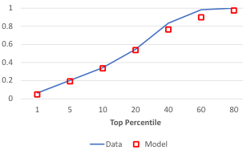
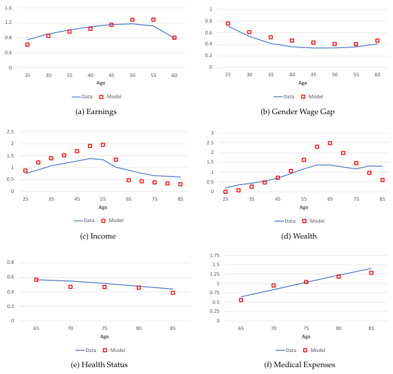
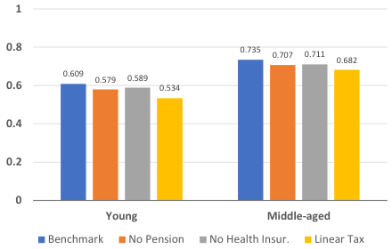
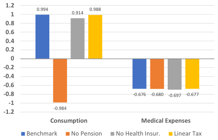
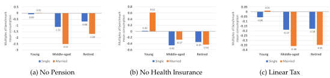
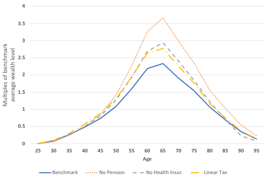
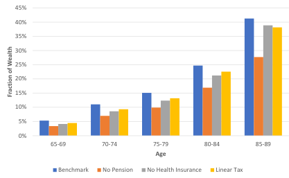

# Consumption Smoothing and Welfare Implications of Redistributive and Insurance Systems: The Case of Japan $^∗$

Charles Ka Yui Leung$^{†}$  David Leung$^{‡}$  Kazuto Sumita$^{§}$

September 2024

## Abstract

This paper examines the relative importance of progressive taxation, the pension system, and medical insurance in mitigating life cycle risks and improving household welfare. We evaluate the contributions of these systems to consumption smoothing, welfare improvements, and economic decisions across different demographic groups. Using a general equilibrium life cycle model with endogenous health accumulation, we find that the absence of pension benefits leads to significant welfare losses for middle-aged households, primarily due to the increased need for retirement savings. Progressive taxation provides substantial consumption insurance for younger households, though its impact on retirement savings is limited. Health insurance is indispensable for retired individuals, as its absence accelerates wealth depletion from rising out-of-pocket medical expenses. Although married households benefit from risk sharing and economies of scale, they experience greater welfare losses than single households without these insurance systems.

Keywords: Social insurance, Consumption smoothing, Precautionary savings

JEL Codes: D15, E21, H55, I10, I13

*We thank numerous seminar and conference participants as well as Sagiri Kitao, Reona Hagiwara, and Mike Orszag for many useful comments. David thanks the National Science and Technology Council in Taiwan (Grant no.111CD216) for providing financial support for this project. The usual disclaimer applies.

† Department of Economics and Finance, City University of Hong Kong, kycleung@cityu.edu.hk

† Corresponding author. Department of Economics, National Taiwan University. davidleung@ntu.edu.tw

§Faculty of Economics, Toyo University. sumita@toyo.jp

1

---

## 1 Introduction

Households face persistent income and health shocks over the life cycle. As individuals age, they face more uncertainty about their longevity, the future costs of healthcare, and the adequacy of their retirement savings. These uncertainties can lead to increased precautionary savings, which are savings set aside for potential future needs or emergencies. These savings lead to variability in consumption, especially if unexpected expenses occur. However, not all types of households can privately insure these risks efficiently. For example, married households' consumption is less affected by income and health shocks because they have the advantages of pooling risks, economies of scale, and potentially being able to help each other through labor supply coordination ( Wu & Krueger 2021 ) . Moreover, working age groups can effectively smooth consumption by precautionary saving and labor supply. On the contrary, retirees have limited self-insurance ability, which refers to their capacity to cover unexpected expenses or income fluctuations from their resources to smooth consumption, as they only rely on pension income and capital return every period. Given these discrepancies in households' ability to self-insure, publicly provided insurance systems such as progressive taxation, medical insurance, and pension systems are necessary. These policies are essential for maintaining living standards by protecting people during economic downturns, health crises, and retirement. However, they may also have unintended consequences, such as discouraging work effort and reducing personal savings, leading to inefficiencies in the labor market. In addition, the costs associated with maintaining generous pension and medical insurance systems could strain public finances, especially if the working-age population shrinks due to the aging population issue.

Our paper relates to a significant strand of the literature on consumption insurance, savings, and risks over the life cycle. Those studies have focused on estimating household consumption's response to income fluctuations. $^1$ However, existing studies have not comprehensively analyzed how various public insurance systems specifically support consumption insurance among households of different genders, marital statuses and ages. Our research fills this gap by detailing the relative contributions of these insurance systems. Understanding their contributions is essential for optimizing social insurance systems to address social challenges such as the aging population. This knowledge enables policymakers to ensure that social insurance systems

1See Blundell et al. (2008, 2016, 2024) and Kaplan & Violante (2010) for measurements of the magnitude of household consumption responses to transitory and permanent earnings shocks in the US.

2

---

Table 1: Comparison of income and consumption variances in the US and Japan from 1981-2005

<table><tr><td rowspan="2"></td><td colspan="3">Average level (var. of log)</td><td colspan="2">Insurance provided by</td></tr><tr><td>(1)</td><td>(2)</td><td>(3)</td><td>(2)/(1)</td><td>(3)/(2)</td></tr><tr><td></td><td>Pretax Inc.</td><td>Disp. Inc.</td><td>Cons.</td><td>Government</td><td>Private</td></tr><tr><td>USA</td><td>0.549</td><td>0.482</td><td>0.294</td><td>0.879</td><td>0.609</td></tr><tr><td>Japan</td><td>0.230</td><td>0.196</td><td>0.184</td><td>0.856</td><td>0.938</td></tr></table>

Notes: This table compares income and consumption variances in the US and Japan and highlights the effectiveness of public and private insurance. Data for Japan are from Lise et al. ( 2014 ) , and for the United States from Heathcote, Perri & Violante ( 2010 ) .

effectively improve household welfare throughout life.

This paper aims to determine how much households benefit from and are insured by various social insurance systems at different stages of their lives. To gain a deeper understanding of how each policy affects welfare and risk coverage, we decompose the effects of each policy on welfare changes and consumption smoothing among different demographic groups. We use a general equilibrium life-cycle model with endogenous health accumulation to measure the welfare and effects on the responses of consumption and medical expenses to shocks. The model incorporates life cycle uncertainties, including uninsurable earnings shocks during working age, health shocks, and mortality risks during retirement. Public insurance systems, including progressive taxation, pension, and medical insurance, are designed to mitigate households' exposure to these risks. $^2$

Japan is chosen as the case study in this paper due to its well-developed social insurance systems and its effectiveness in mitigating income fluctuation, as reflected in the variance data presented in Table 1 . The comparison between Japan and the US shows that Japan's government-provided insurance systems provide more substantial income stabilization, with a lower variance of disposable income relative to pretax income (0.856 compared to 0.879 in the US). This lower variance ratio indicates that Japan's redistributive tax and government transfer systems, including pensions and other social benefits, are more effective in buffering households against income fluctuations, resulting in more stable post-tax income levels. Furthermore, the higher ratio of consumption variance to disposable income variance in Japan (0.938 compared

2 The idea of progressive taxation as social insurance can be traced back to Hansson & Stuart (1985) . Moreover, Jung & Tran (2023) shows that the optimal progressivity of the income tax critically depends on whether health shocks are included.

3

---

to 0.609 in the US) indicates a lower reliance on private savings for consumption insurance. With an overall variance of logarithmic consumption at just 0.184, significantly lower than the 0.294 observed in the US, Japanese households maintain relatively stable consumption despite income fluctuations. This stability is primarily due to the greater role played by redistributive and insurance systems in Japan, which contribute more to consumption insurance than self-insurance through private savings. In contrast, the lower ratio of consumption variance to disposable income variance in the US suggests a greater dependence on private insurance and precautionary savings to smooth consumption. This comparison emphasizes the effectiveness of Japan's redistributive and insurance systems in providing stable consumption patterns across its population.

We employ a longitudinal dataset that combines the "Japan Household Panel Survey" (JHPS) and the "Keio Household Panel Survey" (KHPS), initially conducted separately. The dataset covers general topics, including employment, education, lifestyle, time allocation, health, and living environment, as well as more detailed subjects, such as the composition of the respondent's household and his or her income, expenditures, assets, and housing, starting in 2004. Section 2 provides more dataset details.

This paper provides an in-depth analysis of redistributive and insurance systems' role in enhancing household welfare and smoothing consumption throughout the life cycle. Our findings reveal that the pension system is particularly vital for middle-aged and retired individuals, as it significantly reduces the need for aggressive precautionary savings. In the absence of a pension system, households must drastically increase their savings during their peak earning years to self-insure against the uncertainties of retirement, leading to notable welfare losses. Retirees, in turn, face financial strain without a steady pension income, forcing them to draw heavily on their accumulated wealth, which can significantly reduce their consumption and quality of life. The health insurance system plays a crucial role in protecting households from catastrophic medical expenses, particularly in later life when healthcare needs are higher. Our findings show that retirees deplete their savings more rapidly without health insurance due to rising out-of-pocket medical costs. The absence of health insurance forces households to divert a larger portion of their savings toward medical costs, significantly reducing their ability to maintain stable consumption patterns. Progressive taxation serves as an important mechanism to support younger and lower-income households by redistributing income through lower tax

4

---

rates, which helps them save more efficiently. By offering reduced tax burdens, the progressive tax system provides individuals with more disposable income early in life, enabling them to accumulate assets and smooth consumption while insuring against income fluctuations. The lack of a redistributive tax system affects middle-aged individuals and retirees by diminishing their ability to protect against healthcare expenses and retirement uncertainties. We also find that public insurance systems significantly impact the welfare of middle-aged and retired couples, as the risk of spousal loss becomes more pronounced with age in married households. The concern that the lack of pension income and medical insurance to cover medical spending could increase the risk of losing a spouse drives couples to save more, intensifying the negative impact on their welfare without these systems.

Several studies in the literature on Japanese insurance systems emphasize the importance of pension systems, health insurance, and tax policies in determining household welfare and economic decisions. Yamada ( 2011 ) , Okamoto ( 2013 ) , and Kitao ( 2018 ) analyzed the impact of pension reform on the welfare of different generations. Our results support the need for these pension reforms by showing that pensions are the most important form of public insurance for middle-aged and retired individuals, significantly reducing their need for precautionary savings and providing income stability in retirement. Hsu & Yamada ( 2019 ) and Hagiwara ( 2022 ) examined the impact of raising co-payment rates in health insurance. They found that such reforms would enhance the welfare of future generations by lowering insurance premiums and increasing capital accumulation through precautionary savings. Our findings complement their results by showing that young groups, particularly married ones, experience welfare improvements when insurance premiums decrease in the absence of a medical insurance system. The reduced premiums allow young individuals to adjust their savings and labor supply to compensate for the lack of a health insurance system, with young married households benefiting even more due to their ability to share risks and resources efficiently. Furthermore, Fukai et al. ( 2021 ) analyzed the heterogeneous responses of households to health insurance reforms, showing that lower-income households reduce savings and consumption when faced with large medical expenses. Our findings confirm this response, as we find that the absence of health insurance disproportionately impacts retirees and low-income households, forcing them to draw down their savings at a faster rate, leading to more rapid wealth depletion.

Our model allows households to optimally choose their consumption and medical expenses in

5

---

the face of health shocks. While our modeling strategy differs from Blundell et al. ( 2024 ) , we reach a similar estimate in terms of the pass-through coefficients for health shocks on consumption and medical expenses: we find a pass-through coefficient of 0.006 for consumption and -0.324 for medical expenses, which are in line with their estimates of 0.003 and -0.49, respectively. $^3$ It follows that when consumption exhibits minimal fluctuation in response to health shocks, the potential welfare gains from additional consumption smoothing via social insurance are likely to be limited ( Baily ( 1978 ) , Chetty ( 2006 ) ). Hence, the welfare impact of public insurance systems on retirees may not be significant. However, our welfare analyses show that the welfare impact of insurance systems on retirees is substantial. This outcome is supported by Chetty & Looney ( 2006 ) , who argue that the value of insurance may be very large even in environments where consumption does not fluctuate much. It is because some retirees are often near a subsistence level of consumption, and a further reduction in consumption to cover tremendous medical expenses is not feasible. Their ability to maintain smooth consumption is mainly due to high precautionary savings and inefficient private insurance mechanisms. Therefore, public insurance is vital in improving their welfare by reducing the need for costly consumption-smoothing methods and providing a greater buffer against high medical expenses.

The paper is organized as follows: we provide the data description in Section 2, followed by the model in Section 3 and the calibration details in Section 4. The performance of the model is evaluated in Section 5, while the quantitative analysis and findings are discussed in Section 6. Finally, Section 7 presents the conclusion.

## 2 Data

To further investigate the link between the social insurance systems and household structure, and to calibrate the required parameters, we require panel data. The “Japan Household Panel Survey” (JHS/KHPS, from the following section JHPS in short) is used to estimate the earning process model. The JHPS/KHPS covers general topics, including employment, education, lifestyle, time allocation, health, and living environment, as well as more detailed subjects, such as the

3 In Blundell et al. ( 2024 ) , health shocks directly influence the marginal utility of consumption. In contrast, we model health capital as an accumulation process determined by individuals' medical spending, which affects intertemporal consumption decisions through its impact on survival probability. Other structural papers that endogenize the evolution of health status over the life cycle include Grossman ( 1972 ) , Ehrlich & Becker ( 1972 ) , Hall & Jones ( 2007 ) , Jung & Tran ( 2016 ) , Cole et al. ( 2019 ) , Halliday et al. ( 2019 ) , Mahler & Yum ( 2023 )

6

---

respondents, their spouses, and household's income, expenditures, assets, and housing. $^4$ The survey is analyzed in a lot of empirical studies of households (e.g.: Diamond ( 2018 ); Yoshida et al. ( 2016 ) , etc.).

This is a combination of the previous “Japan Household Panel Survey” (JHPS) and “Keo Household Panel Survey” (KHPS), which were previously conducted and managed as separate surveys. The characteristics of the surveys, such as the data structure and samples, are as follows. The KHPS began in 2004 and surveyed 4005 individuals, and the JHPS began in 2009 for 4,000 individuals from the entire Japanese population. In both surveys, the survey subjects are selected through stratified two-stage sampling. Although the KHPS survey subjects include men and women aged 20 to 69 years and those of the JHPS include men and women aged 20 or older, the demographic characteristics of the survey responses are representative of Japanese individuals and households. Even though the sampling populations overlap, ultimately, there is no overlap between KHPS and JHPS respondents. The two datasets have been combined since 2015 as the JHPS/KHPS since they contain questions that are the same or similar. The structure of the JHPS/KHPS sample is tabulated in Table 2 .

We used the surveyed earnings in JHPS/KHPS. By earning, we mean the amount of money earned by the respondents and their spouses who employed last year. Self-employed earners were excluded. To mitigate the effects of "outliers," the top and bottom one percent of the earning distribution were excluded from the analysis. Based on the remaining respondents, we constructed panel data of the respondents and their spouses between 2009 and 2021. We convert all the nominal variables into real variable by deflating with the consumer price index (whole Japan, 2020=100).

Medical expenditure is another important variable for our model, such as the medical expenditure to income ratio, Change in survival probability to change in medical expenditure ratio, and the health status of the survey subjects. However, surveying the medical expenditure of subjects using panel data faces difficulty because subjects tend to leave the survey when they deteriorated their health condition or died. The typical example is older people who are dropped out of the survey for such a reason ( Feng et al. ( 2006 ) , Herrera et al. ( 2021 ) ). However, previous studies showed that this attrition of survey subjects occurred at random and did not cause serious

4For the further information, see Panel Data Research Center, "Japan Household Panel Survey(IHPS/KHPS)" https://www.prn.keio.ac.jp/en/panalata/datasets/khpsks/ (accessed on September 4, 2024).

7

---

bias in the analysis. Feng et al. ( 2006 ) estimated two levels hierarchical linear models of growth curves of parents' health based on the sample that some subjects are dropped and the sample that such observations are proxied by children's report. They compared the results and found out that biases are not so large. Recently, Herrera et al. ( 2021 ) showed that the biases were not so large when they estimate probit models to explain subjective welfare of older people. Therefore, we mainly used JHPS/KHPS to conduct our analyses related to medical expenditure. However, to complement the analysis, other data source are used for the medical expenditure, we used "the Estimates of National Medical Care Expenditure" as the alternative source for the medical expenditure.

To assess the macro impact of the social security, we take the longevity seriously. In particular, we use the "Abridged Life Table" provided by the Ministry of Health, Labour and Welfare from 2007-2019 to calculate the ratio of survival probabilities for ages from 75 - 94 to that of 65-69.

Table 2: Structure of JHPS/KHPS sample

<table><tr><td>Year</td><td>KHPS</td><td>KHPS2007B</td><td>KHPS2012C</td><td>JHPS</td><td>JHPS2019D</td><td>Total</td></tr><tr><td>2004</td><td>8010</td><td></td><td></td><td></td><td></td><td>8010</td></tr><tr><td>2005</td><td>6628</td><td></td><td></td><td></td><td></td><td>6628</td></tr><tr><td>2006</td><td>5774</td><td></td><td></td><td></td><td></td><td>5774</td></tr><tr><td>2007</td><td>5286</td><td>2838</td><td></td><td></td><td></td><td>8124</td></tr><tr><td>2008</td><td>4902</td><td>2480</td><td></td><td></td><td></td><td>7382</td></tr><tr><td>2009</td><td>4580</td><td>2264</td><td></td><td>8044</td><td></td><td>14888</td></tr><tr><td>2010</td><td>4306</td><td>2108</td><td></td><td>6940</td><td></td><td>13354</td></tr><tr><td>2011</td><td>4096</td><td>1964</td><td></td><td>6320</td><td></td><td>12380</td></tr><tr><td>2012</td><td>3874</td><td>1856</td><td>2024</td><td>5642</td><td></td><td>13396</td></tr><tr><td>2013</td><td>3660</td><td>1744</td><td>1732</td><td>5162</td><td></td><td>12298</td></tr><tr><td>2014</td><td>3446</td><td>1662</td><td>1516</td><td>4716</td><td></td><td>11340</td></tr><tr><td>2015</td><td>3272</td><td>1590</td><td>1386</td><td>4396</td><td></td><td>10644</td></tr><tr><td>2016</td><td>3098</td><td>1508</td><td>1284</td><td>4096</td><td></td><td>9986</td></tr><tr><td>2017</td><td>2924</td><td>1408</td><td>1150</td><td>3770</td><td></td><td>9252</td></tr><tr><td>2018</td><td>2724</td><td>1314</td><td>1060</td><td>3484</td><td></td><td>8582</td></tr><tr><td>2019</td><td>2532</td><td>1242</td><td>982</td><td>3178</td><td>4406</td><td>12340</td></tr><tr><td>2020</td><td>2374</td><td>1190</td><td>924</td><td>2960</td><td>3492</td><td>10940</td></tr><tr><td>2021</td><td>2158</td><td>1098</td><td>852</td><td>2692</td><td>2834</td><td>9634</td></tr><tr><td>Total</td><td>73644</td><td>26266</td><td>12910</td><td>61400</td><td>10732</td><td>184952</td></tr></table>

Data source: JHPS/KHPS 2021

8

---

## 3 The Model Economy

We adopt a general equilibrium model for the analysis by employing an overlapping generations life cycle model to evaluate the value of each insurance policy for various demographic groups. Time is discrete and one model period is five years. Our model introduces an endogenous evolution of health status, where individuals' health status is determined by their medical expenditures, affecting their survival rates. Households are heterogeneous in age, gender, productivity, health status, marital status, and assets. The government uses insurance premiums, consumption tax, and income tax revenues to fund the exogenous expenditures, health insurance coverage, and the pension system.

### 3.1 Environment

The economy is populated by $J$ overlapping generations of finitely lived households with age indexed by $j \in J$ . The economy comprises three types of households: married couples, single males, and single females. The populations of men and women are normalized to 1. At the beginning of the economy, a fixed proportion $\varphi$ of men and women are married and remain so, while the remaining $1-\varphi$ are single and never marry. Households exhibit heterogeneity in several dimensions, including age ( $j$ ), asset holdings ( $k$ ), idiosyncratic productivity shocks ( $z$ ), marital status ( $m$ ), gender ( $g$ ), and health status ( $h$ ). Among these characteristics, gender and marital status remain constant throughout the life cycle, while other factors, such as age, assets, productivity, and health, evolve over time.

There is a strong preference for assortative mating based on education level in the marriage market. Specifically, women with higher educational attainment are more likely to marry men with similar educational achievements. This pattern is also observed among individuals with lower levels of educational attainment. The distribution of educational matching between wife and husband is determined exogenously before the start of the economy and is shown in Table 3 . The marriage and divorce decisions are abstracted from the model for simplicity. Married couples become single once their partners pass away after age 65.

In this model, households begin working at age 25, retire at age 65, and receive pension benefits until the maximum age of 99. The survival probability, denoted as $s_{i,g,h,t}$ , is dependent on the individual's age, gender and health status. It is important to note that these conditional

9

---

Table 3: The distribution of educational matching between wife and husband in year 2010

<table><tr><td></td><td colspan="2">Husband</td></tr><tr><td>Wife</td><td>&lt;College</td><td>$\geq$College</td></tr><tr><td>&lt;College</td><td>0.289</td><td>0.124</td></tr><tr><td>$\geq$College</td><td>0.163</td><td>0.424</td></tr></table>

Note: The data values are reported by Fukuda et al. (2021), who use the Population Census of Japan in 2010. The number in a cell shows the fraction of all matches that occur in the specified category.

survival probabilities depend on the health status, which is determined by the medical spending decision within the model. Additionally, it is assumed that survival probabilities are set to one during working years and only apply to retired households.

Households derive income from labor and capital. An individual's labor endowment is $z\varepsilon_{g,j}$ , where $z$ is subject to stochastic variation described by a first-order Markov process $F_z(z'|z)$ , and $\varepsilon_{g,j}$ is a deterministic component that captures age-dependent improvements in human capital influenced by factors such as experience and gender. Given this endowment, a worker earns a labor income of $w\varepsilon_{g,j}n_t$ where $w$ is the wage per skill unit and $n \in [0,1]$ is the hours worked. Income from capital is $r_k$ where $k$ denotes assets and $r$ is the rate of return on assets.

Upon retirement, households receive a pension income $SS(\bar{e})$ , based on their average earnings over their career $\bar{e}$ , and also continue to earn capital income. The total income is denoted by $y$ and is subject to progressive taxation. Consumption is subject to sales tax at the flat rate $\pi$ . Participation in the pension and medical insurance systems is mandatory, with each individual required to pay insurance premium $\pi$ . The amount of premium payment is calculated as a percentage (premium rate $t$ ) of earnings for the working age group. The government uses tax revenue to finance an exogenously given expenditure level, $G$ , pension, and medical insurance expenditures.

The consumption goods are produced by a representative firm using aggregate capital $K$ and total effective labor $N$ . Output is determined by a Cobb-Douglas production function: $y = \Psi K^{\alpha} N^{1-\alpha}$ . Capital depreciates at the rate $\delta$ . Firms aim to maximize profits under perfect competition such that:

$$\operatorname* { m a x } _ { K } \{ \Psi _ { K } ^ { a } N ^ { 1 - \alpha } - w N - ( r + \delta ) K \}$$

where $n$ is the capital share in production and $\Psi$ defines a technology parameters. As a result, the

10

---

net marginal product of capital is equal to the interest rate for capital $r$ , and the marginal product of labor is equal to the wage rate for effective labor $w$ .

### 3.2 Timeing in the model

The model's timing is as follows: at the start of each working-age period, individuals learn their productivity status and make decisions regarding consumption and labor supply based on this. Retired individuals experience health shocks and assess their health status before making consumption and medical spending decisions.

### 3.3 The single household decision problem

A worker's labor endowment is given by $z \varepsilon_{g,j}$ , where $z$ is a stochastic component that represents the level of productivity, and $\varepsilon_{g,j}$ is a deterministic component that captures age-dependent movements in skills, such as work experience. With this endowment, a worker generates a labor income of $w z \varepsilon_{g,j} n$ , where $w$ is the market wage per skill unit, and $n \in [0,1]$ is the hours worked. The fixed cost of working, $F$ is assumed to be zero for men, and thus there is an interior solution for the male labor supply. The fixed cost of working for females can be interpreted as the time cost for childcare, housework, and so on. Income on savings is denoted by $r k$ . All incomes are subject to a progressive tax system specific to the household type, and married households are assumed to be taxed on separate income. $^5$ The disposable income for single and married households, after all taxes and transfers, is denoted by $y_c^s$ and $y_M^t$ , respectively.

Agents value consumption and leisure. The problem of an agent is to choose labor supply, consumption, savings, and medical expenditure to maximize the expected present value of lifetime utility. At each period $j$ , agents are informed of their labor productivity $z$ for the period before taking their decisions. The future utility is discounted with a constant factor $\beta \in (0,1)$ . Formally, the Bellman equation for a single worker's problem is:

$$V ^ { \xi } ( j , k , z , \vec { e } , g ) = \operatorname* { m a x } _ { \vec { c } , \beta ^ { \prime } , \mu  } \{ u ( c , n ) - F ^ { \xi } | _ { \vec { s } = f , n > 0 } + \beta \mathbb { E } \left[ V ^ { \xi } [ j + 1 , k ^ { \prime } , z ^ { \prime } , \vec { e } , g ) | z ] \right] \}$$

5It is noted that Japanese taxes are calculated based on individual earnings, and spousal deductions are applied if a dependent spouse's income falls below a certain threshold ( Kitao & Mikoshiba 2022 ) . To keep things simple, we abstract from spousal deductions and assume individual taxation, enabling us to use the analytical forms for Japanese progressive tax functions, as provided by Holter et al. ( 2019 ) .

11

---

$$ subject to $$

$$\left(1+\tau_{c}\right) c+\pi+k^{\prime}=k+\gamma_{S}^{d}\left(w \varepsilon_{g, j} n+r k^{\prime}\right)$$

The expectation is taken over the future values of labor productivity $z^t$ given the labor productivity process.

Retirees do not work and receive pension benefits $SS(\tilde{e})$ , which are linked to their realized average annual earnings $\tilde{e}$ , which is a state variable in the value function. The average historical earnings $\tilde{e}$ for single household evolve according to

$$\tilde { \epsilon } ^ { \prime } = [ ( j - 1 ) \tilde { \epsilon } + \epsilon ] / f$$

The retirees face the risk of mortality and spend a $\phi$ fraction of healthcare cost to improve the likelihood of survival. The Bellman equation for a single retiree's problem is given by

$$V ^ { \xi } ( j , k , h , \xi , g ) = \underset { \xi , g , m } {  m a x  } u ( c , 0 ) + \beta s _ { i , g } \alpha ^ { V \xi } ( j + 1 , k ^ { \prime } , h ^ { \prime } , \xi ^ { \prime } , g ) ,$$

$$ subject to $$

$$\left(1+\tau_{c}\right) c+\phi m+k^{\prime}=k+\frac{1}{2} \delta\left(S S(\varepsilon)+r k^{\prime}\right)$$

### 3.4 The married household decision problem

Following the approach of Nishiyama (2010), Kaygusuz (2015), Fehr et al. (2017), we assume that married households make collective decisions to maximize a joint welfare function, placing equal weight on each spouse's instantaneous utility. The utility function of married couples, $U$ , depends on joint consumption, $c$ , hours worked by the husband, $n_m \in [0,1]$ , and the wife, $n_f \in [0,1]$ . The functional form is defined as

$$U ( c , n _ { m } , n _ { f } ) = u ( c / \eta , n _ { m } ) + u ( c / \eta , n _ { f } )$$

where $\eta$ is the equivalence scale in consumption. The Bellman equation for a working-age married household problem is as follows:

$$V ^ { M } ( j , k , z _ { m z } , f , \varepsilon ) = \operatorname* { m a x } _ { k ^ { \prime } , n _ { m } , \varepsilon } \left\{ I ( c , n _ { m } , n _ { f } ) - F ^ { M } | _ { \delta = f , n = 0 } + \beta \mathbb { E } \left[ V ^ { M } ( j + 1 , k ^ { \prime } , z _ { m } , z _ { f } , \varepsilon ^ { \prime } ) | z _ { m } , z _ { f } \right] \right\} .$$

12

---

$$ subject to $$

$$(1+\tau_{c})c+\pi+k^{\prime}=k+y_{M}^{d}(wz_{m}\varepsilon_{m_{j}})n_{m}+rk/2)+y_{M}^{d}(wz_{f}\varepsilon_{f_{j}})n_{f}+rk/2)$$

The average historical earnings $\bar{e}$ for married household are pooled:

$$\tilde{\epsilon}^{\prime}=((j-1) \tilde{\epsilon}+\left(\epsilon_{m}+\epsilon_{f}\right) / 2] / j$$

Retired couples are confronted with the risk of mortality and collectively decide on medical expenses to enhance their survival chances. This decision is based on the assumption that both partners share the same health status. This simplifies the analysis and reflects the common experience of aging couples who often experience similar health conditions and risks. The Bellman equation for the problem faced by retired couples is as follows:

$$\begin{array} { r } { V ^ { M } ( j , k , h , \overline { e } ) = \underset { c , k ^ { \prime } , m } {  m a x  } [ ( c , 0 , 0 ) + \beta _ { s , j , m } \delta _ { k ^ { \prime } , f } ^ { s } , f ) V ^ { M } ( j + 1 , k ^ { \prime } , h ^ { \prime } , \overline { e } ^ { \prime } ) + \beta _ { s , j , m , h } ( 1 - s _ { j , f , h } ) V } \\ { + \beta _ { s , j , f } ( 1 - s _ { j , m , h } ) V ^ { S } ( j + 1 , k ^ { \prime } , h ^ { \prime } , \overline { e } ^ { \prime } , f ) ] } \end{array}$$

$$ subject to $$

$$\left(1+\tau_{c}\right) c+\phi m+k^{\prime}=k+\frac{y_{M}^{\prime}}{2}(2 S S(\varepsilon)+r k)$$

### 3.5 Definition of competitive equilibrium

Let $\omega^M = \{j,k,h,z_m,z_f,\bar{\varepsilon}\} \in \Omega^M$ be a generic state vector of married households and $\omega^S = \{j,k,h,z_g,\bar{\varepsilon},g\} \in \Omega^S$ be a generic state vector of single households. The stationary equilibrium of the economy is given by a consumption function, $c^M(\omega^M)$ and $c^S(\omega^S)$ , a saving function, $k^{M}(\omega^M)$ and $k^{S}(\omega^S)$ , labor supply, $n_m^M(\omega^M), n_f^M(\omega^M)$ and $n^S(\omega^S)$ , a medical expenditure, $m^M(\omega^M)$ and $m^S(\omega^S)$ , a value function, $V^M(\omega^M)$ and $V^S(\omega^S)$ , a wage rate, w , an interest rate r , and a distribution of married households $\Gamma^M(\omega^M)$ and single households $\Gamma^S(\omega^S)$ over the state space, such that

1. The value functions $V^M(\omega^M), v^S(\omega^S)$ and policy functions $c^M(\omega^M), c^S(\omega^S), k^M(\omega^M), k^S(\omega^S),$ $m^M(\omega^M), m^S(\omega^S), n_m^M(\omega^M), n_m^S(\omega^M), n_m^S(\omega^S)$ solve the consumers' optimization problem given the factor prices and initial conditions.

2. Factor prices are given by the following inverse demand equations:

$$r=\alpha \Psi(K / N)^{\alpha-1}-\delta$$

$$w=(1-\alpha) \Psi(K / N)^{\alpha}$$

13

---

3. Factor markets clear

$$K = \int k ^ { M } ( \omega ^ { M } ) d I ^ { M } ( \omega ^ { M } ) + \int k ^ { S } ( \omega ^ { S } ) d I ^ { S } ( \omega ^ { S } )$$

$$\begin{array} { r } { \begin{array} { r } { N = \int \left[ z m \varepsilon _ { m } n _ { m } ^ { \prime } w _ { m } ^ { ( \mathcal { A } ) } \omega ^ { ( \mathcal { M } ) } + \Sigma _ { f } \varepsilon _ { f } j _ { f } n _ { f } ^ { \prime } ( \omega ^ { ( \mathcal { M } ) } ) d \Gamma _ { s - l r } ^ { ( \mathcal { A } ) } ( \omega ^ { ( \mathcal { M } ) } ) \right. } \\ { \left. + \int z m \varepsilon _ { m } n _ { m } ^ { \prime } s _ { m } ^ { ( \mathcal { A } ) } \omega ^ { ( \mathcal { M } ) } d \Gamma _ { s - l r } ^ { ( \mathcal { A } ) } ( \omega ^ { ( \mathcal { A } ) } ) + \int \Sigma _ { f } \varepsilon _ { f } j _ { f } n _ { f } ^ { \prime } ( \omega ^ { ( \mathcal { A } ) } ) d \Gamma _ { s - l r } ^ { ( \mathcal { A } ) } ( \omega ^ { ( \mathcal { A } ) } ) } \end{array} } \end{array}$$

4. The government budget balances:

$$\begin{array} { r l } { G + S S ( \overline { { \varepsilon } } ) \left[ 2 \int d \Gamma _ { i = k } ^ { M } + \int d \Gamma _ { i = k } ^ { S } \right] } & { = ~ \tau _ { \overline { { \varepsilon } } } \left[ \int c ^ { M } ( \omega ^ { M } ) d \Gamma ^ { M } + \int c ^ { S } ( \omega ^ { S } ) d \Gamma ^ { S } \right] } \\ & { + \phi \left[ \int m ^ { M } ( \omega ^ { M } ) d \Gamma _ { i = k } ^ { M } + \int m ^ { S } ( \omega ^ { S } ) d \Gamma _ { i = k } ^ { S } \right] } \\ & { ~ ~ ~ ~ ~ ~ ~ ~ ~ ~ ~ ~ ~ ~ ~ ~ ~ ~ ~ ~ ~ ~ ~ ~ ~ ~ ~ ~ ~ ~ ~ ~ ~ ~ ~ ~ ~ ~ ~ ~ ~ ~ ~ ~ ~ ~ ~ ~ ~ ~ ~ ~ ~ ~ ~ ~ ~ ~ ~ ~ ~ ~ ~ ~ ~ ~ ~ ~ ~ ~ ~ ~ ~ ~ ~ ~ ~ ~ ~ ~ ~ ~ ~ ~ ~ ~ ~ ~ ~ ~ ~ ~ ~ ~ ~ ~ ~ ~ ~ ~ ~ ~ ~ ~ ~ ~ ~ ~ ~ ~ ~ ~ ~ ~ ~ ~ ~ ~ ~ ~ ~ ~ ~ ~ ~ ~ ~ ~ ~ ~ ~ ~ ~ ~ ~ ~ ~ ~ ~ ~ ~ ~ ~ ~ ~ ~ ~ ~ ~ ~ ~ ~ ~ ~ ~ ~ ~ ~ ~ ~ ~ ~ ~ ~ ~ ~ ~ ~ ~ ~ ~ ~ ~ ~ ~ ~ ~ ~ ~ ~ ~ ~ ~ ~ ~ ~ ~ ~ ~ ~ ~ ~ ~ ~ ~ ~ ~ ~ ~ ~ ~ ~ ~ ~ ~ ~ ~ ~ ~ ~ ~ ~ ~ ~ ~ ~ ~ ~ ~ ~ ~ ~ ~ ~ ~ ~ ~ ~ ~ ~ ~ ~ ~ ~ ~ ~ ~ ~ ~ ~ ~ ~ ~ ~ ~ ~ ~ ~ ~ ~ ~ ~ ~ ~ ~ ~ ~ ~ ~ ~ ~ ~ ~ ~ ~ ~ ~ ~ ~ ~ ~ ~ ~ ~ ~ ~ ~ ~ ~ ~ ~ ~ ~ ~ ~ ~ ~ ~ ~ ~ ~ ~ ~ ~ ~ ~ ~ ~ ~ ~ ~ ~ ~ ~ ~ ~ ~ ~ ~ ~ ~ ~ ~ ~ ~ ~ ~ ~ ~ ~ ~ ~ ~ ~ ~ ~ ~ ~ ~ ~ ~ ~ ~ ~ ~ ~ ~ ~ ~ ~ ~ ~ ~ ~ ~ ~ ~ ~ ~ ~ ~ ~ ~ ~ ~ ~ ~ ~ ~ ~ ~ ~ ~ ~ ~ ~ ~ ~ ~ ~ ~ ~ ~ ~ ~ ~ ~ ~ ~ ~ ~ ~ ~ ~ ~ ~ ~ ~ ~ ~ ~ ~ ~ ~ ~ ~ ~ ~ ~ ~ ~ ~ ~ ~ ~ ~ ~ ~ ~ ~ ~ ~ ~ ~ ~ ~ ~ ~ ~ ~ ~ ~ ~ ~ ~ ~ ~ ~ ~ ~ ~ ~ ~ ~ ~ ~ ~ ~ ~ ~ ~ ~ ~ ~ ~ ~ ~ ~ ~ ~ ~ ~ ~ ~ ~ ~ ~ ~ ~ ~ ~ ~ ~ ~ ~ ~ ~ ~ ~ ~ ~ ~ ~ ~ ~ ~ ~ ~ ~ ~ ~ ~ ~ ~ ~ ~ ~ ~ ~ ~ ~ ~ ~ ~ ~ ~ ~ ~ ~ ~ ~ ~ ~ ~ ~ ~ ~ ~ ~ ~ ~ ~ ~ ~ ~ ~ ~ ~ ~ ~ ~ ~ ~ ~ ~ ~ ~ ~ ~ ~ ~ ~ ~ ~ ~ ~ ~ ~ ~ ~ ~ ~ ~ ~ ~ ~ ~ ~ ~ ~ ~ ~ ~ ~ ~ ~ ~ ~ ~ ~ ~ ~ ~ ~ ~ ~ ~ ~ ~ ~ ~ ~ ~ ~ ~ ~ ~ ~ ~ ~ ~ ~ ~ ~ ~ ~ ~ ~ ~ ~ ~ ~ ~ ~ ~ ~ ~ ~ ~ ~ ~ ~ ~ ~ ~ ~ ~ ~ ~ ~ ~ ~ ~ ~ ~ ~ ~ ~ ~ ~ ~ ~ ~ ~ ~ ~ ~ ~ ~ ~ ~ ~ ~ ~ ~ ~ ~ ~ ~ ~ ~ ~ ~ ~ ~ ~ ~ ~ ~ ~ ~ ~ ~ ~ ~ ~ ~ ~ ~ ~ ~ ~ ~ ~ ~ ~ ~ ~ ~ ~ ~ ~ ~ ~ ~ ~ ~ ~ ~ ~ ~ ~ ~ ~ ~ ~ ~ ~ ~ ~ ~ ~ ~ ~ ~ ~ ~ ~ ~ ~ ~ ~ ~ ~ ~ ~ ~ ~ ~ ~ ~ ~ ~ ~ ~ ~ ~ ~ ~ ~ ~ ~ ~ ~ ~ ~ ~ ~ ~ ~ ~ ~ ~ ~ ~ ~ ~ ~ ~ ~ ~ ~ ~ ~ ~ ~ ~ ~ ~ ~ ~ ~ ~ ~ ~ ~ ~ ~ ~ ~ ~ ~ ~ ~ ~ ~ ~ ~ ~ ~ ~ ~ ~ ~ ~ ~ ~ ~ ~ ~ ~ ~ ~ ~ ~ ~ ~ ~ ~ ~ ~ ~ ~ ~ ~ ~ ~ ~ ~ ~ ~ ~ ~ ~ ~ ~ ~ ~ ~ ~ ~ ~ ~ ~ ~ ~ ~ ~ ~ ~ ~ ~ ~ ~ ~ ~ ~ ~ ~ ~ ~ ~ ~ ~ ~ ~ ~ ~ ~ ~ ~ ~ ~ ~ ~ ~ ~ ~ ~ ~ ~ ~ ~ ~ ~ ~ ~ ~ ~ ~ ~ ~ ~ ~ ~ ~ ~ ~ ~ ~ ~ ~ ~ ~ ~ ~ ~ ~ ~ ~ ~ ~ ~ ~ ~ ~ ~ ~ ~ ~ ~ ~ ~ ~ ~ ~ ~ ~ ~ ~ ~ ~ ~ ~ ~ ~ ~ ~ ~ ~ ~ ~ ~ ~ ~ ~ ~ ~ ~ ~ ~ ~ ~ ~ ~ ~ ~ ~ ~ ~ ~ ~ ~ ~ ~ ~ ~ ~ ~ ~ ~ ~ ~ ~ ~ ~ ~ ~ ~ ~ ~ ~ ~ ~ ~ ~ ~ ~ ~ ~ ~ ~ ~ ~ ~ ~ ~ ~ ~ ~ ~ ~ ~ ~ ~ ~ ~ ~ ~ ~ ~ ~ ~ ~ ~ ~ ~ ~ ~ ~ ~ ~ ~ ~ ~ ~ ~ ~ ~ ~ ~ ~ ~ ~ ~ ~ ~ ~ ~ ~ ~ ~ ~ ~ ~ ~ ~ ~ ~ ~ ~ ~ ~ ~ ~ ~ ~ ~ ~ ~ ~ ~ ~ ~ ~ ~ ~ ~ ~ ~ ~ ~ ~ ~ ~ ~ ~ ~ ~ ~ ~ ~ ~ ~ ~ ~ ~ ~ ~ ~ ~ ~ ~ ~ ~ ~ ~ ~ ~ ~ ~ ~ ~ ~ ~ ~ ~ ~ ~ ~ ~ ~ ~ ~ ~ ~ ~ ~ ~ ~ ~ ~ ~ ~ ~ ~ ~ ~ ~ ~ ~ ~ ~ ~ ~ ~ ~ ~ ~ ~ ~ ~ ~ ~ ~ ~ ~ ~ ~ ~ ~ ~ ~ ~ ~ ~ ~ ~ ~ ~ ~ ~ ~ ~ ~ ~ ~ ~ ~ ~ ~ ~ ~ ~ ~ ~ ~ ~ ~ ~ ~ ~ ~ ~ ~ ~ ~ ~ ~ ~ ~ ~ ~ ~ ~ ~ ~ ~ ~ ~ ~ ~ ~ ~ ~ ~ ~ ~ ~ ~ ~ ~ ~ ~ ~ ~ ~ ~ ~ ~ ~ ~ ~ ~ ~ ~ ~ ~ ~ ~ ~ ~ ~ ~ ~ ~ ~ ~ ~ ~ ~ ~ ~ ~ ~ ~ ~ ~ ~ ~ ~ ~ ~ ~ ~ ~ ~ ~ ~ ~ ~ ~ ~ ~ ~ ~ ~ ~ ~ ~ ~ ~ ~ ~ ~ ~ ~ ~ ~ ~ ~ ~ ~ ~ ~ ~ ~ ~ ~ ~ ~ ~ ~ ~ ~ ~ ~ ~ ~ ~ ~ ~ ~ ~ ~ ~ ~ ~ ~ ~ ~ ~ ~ ~ ~ ~ ~ ~ ~ ~ ~ ~ ~ ~ ~ ~ ~ ~ ~ ~ ~ ~ ~ ~ ~ ~ ~ ~ ~ ~ ~ ~ ~ ~ ~ ~ ~ ~ ~ ~ ~ ~ ~ ~ ~ ~ ~ ~ ~ ~ ~ ~ ~ ~ ~ ~ ~ ~ ~ ~ ~ ~ ~ ~ ~ ~ ~ ~ ~ ~ ~ ~ ~ ~ ~ ~ ~ ~ ~ ~ ~ ~ ~ ~ ~ ~ ~ ~ ~ ~ ~ ~ ~ ~ ~ ~ ~ ~ ~ ~ ~ ~ ~ ~ ~ ~ ~ ~ ~ ~ ~ ~ ~ ~ ~ ~ ~ ~ ~ ~ ~ ~ ~ ~ ~ ~ ~ ~ ~ ~ ~ ~ ~ ~ ~ ~ ~ ~ ~ ~ ~ ~ ~ ~ ~ ~ ~ ~ ~ ~ ~ ~ ~ ~ ~ ~ ~ ~ ~ ~ ~ ~ ~ ~ ~ ~ ~ ~ ~ ~ ~ ~ ~ ~ ~ ~ ~ ~ ~ ~ ~ ~ ~ ~ ~ ~ ~ ~ ~ ~ ~ ~ ~ ~ ~ ~ ~ ~ ~ ~ ~ ~ ~ ~ ~ ~ ~ ~ ~ ~ ~ ~ ~ ~ ~ ~ ~ ~ ~ ~ ~ ~ ~ ~ ~ ~ ~ ~ ~ ~ ~ ~ ~ ~ ~ ~ ~ ~ ~ ~ ~ ~ ~ ~ ~ ~ ~ ~ ~ ~ ~ ~ ~ ~ ~ ~ ~ ~ ~ ~ ~ ~ ~ ~ ~ ~ ~ ~ ~ ~ ~ ~ ~ ~ ~ ~ ~ ~ ~ ~ ~ ~ ~ ~ ~ ~ ~ ~ ~ ~ ~ ~ ~ ~ ~ ~ ~ ~ ~ ~ ~ ~ ~ ~ ~ ~ ~ ~ ~ ~ ~ ~ ~ ~ ~ ~ ~ ~ ~ ~ ~ ~ ~ ~ ~ ~ ~ ~ ~ ~ ~ ~ ~ ~ ~ ~ ~ ~ ~ ~ ~ ~ ~ ~ ~ ~ ~ ~ ~ ~ ~ ~ ~ ~ ~ ~ ~ ~ ~ ~ ~ ~ ~ ~ ~ ~ ~ ~ ~ ~ ~ ~ ~ ~ ~ ~ ~ ~ ~ ~ ~ ~ ~ ~ ~ ~ ~ ~ ~ ~ ~ ~ ~ ~ ~ ~ ~ ~ ~ ~ ~ ~ ~ ~ ~ ~ ~ ~ ~ ~ ~ ~ ~ ~ ~ ~ ~ ~ ~ ~ ~ ~ ~ ~ ~ ~ ~ ~ ~ ~ ~ ~ ~ ~ ~ ~ ~ ~ ~ ~ ~ ~ ~ ~ ~ ~ ~ ~ ~ ~ ~ ~ ~ ~ ~ ~ ~ ~ ~ ~ ~ ~ ~ ~ ~ ~ ~ ~ ~ ~ ~ ~ ~ ~ ~ ~ ~ ~ ~ ~ ~ ~ ~ ~ ~ ~ ~ ~ ~ ~ ~ ~ ~ ~ ~ ~ ~ ~ ~ ~ ~ ~ ~ ~ ~ ~ ~ ~ ~ ~ ~ ~ ~ ~ ~ ~ ~ ~ ~ ~ ~ ~ ~ ~ ~ ~ ~ ~ ~ ~ ~ ~ ~ ~ ~ ~ ~ ~ ~ ~ ~ ~ ~ ~ ~ ~ ~ ~ ~ ~ ~ ~ ~ ~ ~ ~ ~ ~ ~ ~ ~ ~ ~ ~ ~ ~ ~ ~ ~ ~ ~ ~ ~ ~ ~ ~ ~ ~ ~ ~ ~ ~ ~ ~ ~ ~ ~ ~ ~ ~ ~ ~ ~ ~ ~ ~ ~ ~ ~ ~ ~ ~ ~ ~ ~ ~ ~ ~ ~ ~ ~ ~ ~ ~ ~ ~ ~ ~ ~ ~ ~ ~ ~ ~ ~ ~ ~ ~ ~ ~ ~ ~ ~ ~ ~ ~ ~ ~ ~ ~ ~ ~ ~ ~ ~ ~ ~ ~ ~ ~ ~ ~ ~ ~ ~ ~ ~ ~ ~ ~ ~ ~ ~ ~ ~ ~ ~ ~ ~ ~ ~ ~ ~ ~ ~ ~ ~ ~ ~ ~ ~ ~ ~ ~ ~ ~ ~ ~ ~ ~ ~ ~ ~ ~ ~ ~ ~ ~ ~ ~ ~ ~ ~ ~ ~ ~ ~ ~ ~ ~ ~ ~ ~ ~ ~ ~ ~ ~ ~ ~ ~ ~ ~ ~ ~ ~ ~ ~ ~ ~ ~ ~ ~ ~ ~ ~ ~ ~ ~ ~ ~ ~ ~ ~ ~ ~ ~ ~ ~ ~ ~ ~ ~ ~ ~ ~ ~ ~ ~ ~ ~ ~ ~ ~ ~ ~ ~ ~ ~ ~ ~ ~ ~ ~ ~ ~ ~ ~ ~ ~ ~ ~ ~ ~ ~ ~ ~ ~ ~ ~ ~ ~ ~ ~ ~ ~ ~ ~ ~ ~ ~ ~ ~ ~ ~ ~ ~ ~ ~ ~ ~ ~ ~ ~ ~ ~ ~ ~ ~ ~ ~ ~ ~ ~ ~ ~ ~ ~ ~ ~ ~ ~ ~ ~ ~ ~ ~ ~ ~ ~ ~ ~ ~ ~ ~ ~ ~ ~ ~ ~ ~ ~ ~ ~ ~ ~ ~ ~ ~ ~ ~ ~ ~ ~ ~ ~ ~ ~ ~ ~ ~ ~ ~ ~ ~ ~ ~ ~ ~ ~ ~ ~ ~ ~ ~ ~ ~ ~ ~ ~ ~ ~ ~ ~ ~ ~ ~ ~ ~ ~ ~ ~ ~ ~ ~ ~ ~ ~ ~ ~ ~ ~ ~ ~ ~ ~ ~ ~ ~ ~ ~ ~ ~ ~ ~ ~ ~ ~ ~ ~ ~ ~ ~ ~ ~ ~ ~ ~ ~ ~ ~ ~ ~ ~ ~ ~ ~ ~ ~ ~ ~ ~ ~ ~ ~ ~ ~ ~ ~ ~ ~ ~ ~ ~ ~ ~ ~ ~ ~ ~ ~ ~ ~ ~ ~ ~ ~ ~ ~ ~ ~ ~ ~ ~ ~ ~ ~ ~ ~ ~ ~ ~ ~ ~ ~ ~ ~ ~ ~ ~ ~ ~ ~ ~ ~ ~ ~ ~ ~ ~ ~ ~ ~ ~ ~ ~ ~ ~ ~ ~ ~ ~ ~ ~ ~ ~ ~ ~ ~ ~ ~ ~ ~ ~ ~ ~ ~ ~ ~ ~ ~ ~ ~ ~ ~ ~ ~ ~ ~ ~ ~ ~ ~ ~ ~ ~ ~ ~ ~ ~ ~ ~ ~ ~ ~ ~ ~ ~ ~ ~ ~ ~ ~ ~ ~ ~ ~ ~ ~ ~ ~ ~ ~ ~ ~ ~ ~ ~ ~ ~ ~ ~ ~ ~ ~ ~ ~ ~ ~ ~ ~ ~ ~ ~ ~ ~ ~ ~ ~ ~ ~ ~ ~ ~ ~ ~ ~ ~ ~ ~ ~ ~ ~ ~ ~ ~ ~ ~ ~ ~ ~ ~ ~ ~ ~ ~ ~ ~ ~ ~ ~ ~ ~ ~ ~ ~ ~ ~ ~ ~ ~ ~ ~ ~ ~ ~ ~ ~ ~ ~ ~ ~ ~ ~ ~ ~ ~ ~ ~ ~ ~ ~ ~ ~ ~ ~ ~ ~ ~ ~ ~ ~ ~ ~ ~ ~ ~ ~ ~ ~ ~ ~ ~ ~ ~ ~ ~ ~ ~ ~ ~ ~ ~ ~ ~ ~ ~ ~ ~ ~ ~ ~ ~ ~ ~ ~ ~ ~ ~ ~ ~ ~ ~ ~ ~ ~ ~ ~ ~ ~ ~ ~ ~ ~ ~ ~ ~ ~ ~ ~ ~ ~ ~ ~ ~ ~ ~ ~ ~ ~ ~ ~ ~ ~ ~ ~ ~ ~ ~ ~ ~ ~ ~ ~ ~ ~ ~ ~ ~ ~ ~ ~ ~ ~ ~ ~ ~ ~ ~ ~ ~ ~ ~ ~ ~ ~ ~ ~ ~ ~ ~ ~ ~ ~ ~ ~ ~ ~ ~ ~ ~ ~ ~ ~ ~ ~ ~ ~ ~ ~ ~ ~ ~ ~ ~ ~ ~ ~ ~ ~ ~ ~ ~ ~ ~ ~ ~ ~ ~ ~ ~ ~ ~ ~ ~ ~ ~ ~ ~ ~ ~ ~ ~ ~ ~ ~ ~ ~ ~ ~ ~ ~ ~ ~ ~ ~ ~ ~ ~ ~ ~ ~ ~ ~ ~ ~ ~ ~ ~ ~ ~ ~ ~ ~ ~ ~ ~ ~ ~ ~ ~ ~ ~ ~ ~ ~ ~ ~ ~ ~ ~ ~ ~ ~ ~ ~ ~ ~ ~ ~ ~ ~ ~ ~ ~ ~ ~ ~ ~ ~ ~ ~ ~ ~ ~ ~ ~ ~ ~ ~ ~ ~ ~ ~ ~ ~ ~ ~ ~ ~ ~ ~ ~ ~ ~ ~ ~ ~ ~ ~ ~ ~ ~ ~ ~ ~ ~ ~ ~ ~ ~ ~ ~ ~ ~ ~ ~ ~ ~ ~ ~ ~ ~ ~ ~ ~ ~ ~ ~ ~ ~ ~ ~ ~ ~ ~ ~ ~ ~ ~ ~ ~ ~ ~ ~ ~ ~ ~ ~ ~ ~ ~ ~ ~ ~ ~ ~ ~ ~ ~ ~ ~ ~ ~ ~ ~ ~ ~ ~ ~ ~ ~ ~ ~ ~ ~ ~ ~ ~ ~ ~ ~ ~ ~ ~ ~ ~ ~ ~ ~ ~ ~ ~ ~ ~ ~ ~ ~ ~ ~ ~ ~ ~ ~ ~ ~ ~ ~ ~ ~ ~ ~ ~ ~ ~ ~ ~ ~ ~ ~ ~ ~ ~ ~ ~ ~ ~ ~ ~ ~ ~ ~ ~ ~ ~ ~ ~ ~ ~ ~ ~ ~ ~ ~ ~ ~ ~ ~ ~ ~ ~ ~ ~ ~ ~ ~ ~ ~ ~ ~ ~ ~ ~ ~ ~ ~ ~ ~ ~ ~ ~ ~ ~ ~ ~ ~ ~ ~ ~ ~ ~ ~ ~ ~ ~ ~ ~ ~ ~ ~ ~ ~ ~ ~ ~ ~ ~ ~ ~ ~ ~ ~ ~ ~ ~ ~ ~ ~ ~ ~ ~ ~ ~ ~ ~ ~ ~ ~ ~ ~ ~ ~ ~ ~ ~ ~ ~ ~ ~ ~ ~ ~ ~ ~ ~ ~ ~ ~ ~ ~ ~ ~ ~ ~ ~ ~ ~ ~ ~ ~ ~ ~ ~ ~ ~ ~ ~ ~ ~ ~ ~ ~ ~ ~ ~ ~ ~ ~ ~ ~ ~ ~ ~ ~ ~ ~ ~ ~ ~ ~ ~ ~ ~ ~ ~ ~ ~ ~ ~ ~ ~ ~ ~ ~ ~ ~ ~ ~ ~ ~ ~ ~ ~ ~ ~ ~ ~ ~ ~ ~ ~ ~ ~ ~ ~ ~ ~ ~ ~ ~ ~ ~ ~ ~ ~ ~ ~ ~ ~ ~ ~ ~ ~ ~ ~ ~ ~ ~ ~ ~ ~ ~ ~ ~ ~ ~ ~ ~ ~ ~ ~ ~ ~ ~ ~ ~ ~ ~ ~ ~ ~ ~ ~ ~ ~ ~ ~ ~ ~ ~ ~ ~ ~ ~ ~ ~ ~ ~ ~ ~ ~ ~ ~ ~ ~ ~ ~ ~ ~ ~ ~ ~ ~ ~ ~ ~ ~ ~ ~ ~ ~ ~ ~ ~ ~ ~ ~ ~ ~ ~ ~ ~ ~ ~ ~ ~ ~ ~ ~ ~ ~ ~ ~ ~ ~ ~ ~ ~ ~ ~ ~ ~ ~ ~ ~ ~ ~ ~ ~ ~ ~ ~ ~ ~ ~ ~ ~ ~ ~ ~ ~ ~ ~ ~ ~ ~ ~ ~ ~ ~ ~ ~ ~ ~ ~ ~ ~ ~ ~ ~ ~ ~ ~ ~ ~ ~ ~ ~ ~ ~ ~ ~ ~ ~ ~ ~ ~ ~ ~ ~ ~ ~ ~ ~ ~ ~ ~ ~ ~ ~ ~ ~ ~ ~ ~ ~ ~ ~ ~ ~ ~ ~ ~ ~ ~ ~ ~ ~ ~ ~ ~ ~ ~ ~ ~ ~ ~ ~ ~ ~ ~ ~ ~ ~ ~ ~ ~ ~ ~ ~ ~ ~ ~ ~ ~ ~ ~ ~ ~ ~ ~ ~ ~ ~ ~ ~ ~ ~ ~ ~ ~ ~ ~ ~ ~ ~ ~ ~ ~ ~ ~ ~ ~ ~ ~ ~ ~ ~ ~ ~ ~ ~ ~ ~ ~ ~ ~ ~ ~ ~ ~ ~ ~ ~ ~ ~ ~ ~ ~ ~ ~ ~ ~ ~ ~ ~ ~ ~ ~ ~ ~ ~ ~ ~ ~ ~ ~ ~ ~ ~ ~ ~ ~ ~ ~ ~ ~ ~ ~ ~ ~ ~ ~ ~ ~ ~ ~ ~ ~ ~ ~ ~ ~ ~ ~ ~ ~ ~ ~ ~ ~ ~ ~ ~ ~ ~ ~ ~ ~ ~ ~ ~ ~ ~ ~ ~ ~ ~ ~ ~ ~ ~ ~ ~ ~ ~ ~ ~ ~ ~ ~ ~ ~ ~ ~ ~ ~ ~ ~ ~ ~ ~ ~ ~ ~ ~ ~ ~ ~ ~ ~ ~ ~ ~ ~ ~ ~ ~ ~ ~ ~ ~ ~ ~ ~ ~ ~ ~ ~ ~ ~ ~ ~ ~ ~ ~ ~ ~ ~ ~ ~ ~ ~ ~ ~ ~ ~ ~ ~ ~ ~ ~ ~ ~ ~ ~ ~ ~ ~ ~ ~ ~ ~ ~ ~ ~ ~ ~ ~ ~ ~ ~ ~ ~ ~ ~ ~ ~ ~ ~ ~ ~ ~ ~ ~ ~ ~ ~ ~ ~ ~ ~ ~ ~ ~ ~ ~ ~ ~ ~ ~ ~ ~ ~ ~ ~ ~ ~ ~ ~ ~ ~ ~ ~ ~ ~ ~ ~ ~ ~ ~ ~ ~ ~ ~ ~ ~ ~ ~ ~ ~ ~ ~ ~ ~ ~ ~ ~ ~ ~ ~ ~ ~ ~ ~ ~ ~ ~ ~ ~ ~ ~ ~ ~ ~ ~ ~ ~ ~ ~ ~ ~ ~ ~ ~ ~ ~ ~ ~ ~ ~ ~ ~ ~ ~ ~ ~ ~ ~ ~ ~ ~ ~ ~ ~ ~ ~ ~ ~ ~ ~ ~ ~ ~ ~ ~ ~ ~ ~ ~ ~ ~ ~ ~ ~ ~ ~ ~ ~ ~ ~ ~ ~ ~ ~ ~ ~ ~ ~ ~ ~ ~ ~ ~ ~ ~ ~ ~ ~ ~ ~ ~ ~ ~ ~ ~ ~ ~ ~ ~ ~ ~ ~ ~ ~ ~ ~ ~ ~ ~ ~ ~ ~ ~ ~ ~ ~ ~ ~ ~ ~ ~ ~ ~ ~ ~ ~ ~ ~ ~ ~ ~ ~ ~ ~ ~ ~ ~ ~ ~ ~ ~ ~ ~ ~ ~ ~ ~ ~ ~ ~ ~ ~ ~ ~ ~ ~ ~ ~ ~ ~ ~ ~ ~ ~ ~ ~ ~ ~ ~ ~ ~ ~ ~ ~ ~ ~ ~ ~ ~ ~ ~ ~ ~ ~ ~ ~ ~ ~ ~ ~ ~ ~ ~ ~ ~ ~ ~ ~ ~ ~ ~ ~ ~ ~ ~ ~ ~ ~ ~ ~ ~ ~ ~ ~ ~ ~ ~ ~ ~ ~ ~ ~ ~ ~ ~ ~ ~ ~ ~ ~ ~ ~ ~ ~ ~ ~ ~ ~ ~ ~ ~ ~ ~ ~ ~ ~ ~ ~ ~ ~ ~ ~ ~ ~ ~ ~ ~ ~ ~ ~ ~ ~ ~ ~ ~ ~ ~ ~ ~ ~ ~ ~ ~ ~ ~ ~ ~ ~ ~ ~ ~ ~ ~ ~ ~ ~ ~ ~ ~ ~ ~ ~ ~ ~ ~ ~ ~ ~ ~ ~ ~ ~ ~ ~ ~ ~ ~ ~ ~ ~ ~ ~ ~ ~ ~ ~ ~ ~ ~ ~ ~ ~ ~ ~ ~ ~ ~ ~ ~ ~ ~ ~$$

5. $\Gamma(\omega)$ is consistent with the policy functions and is stationary over time.

## 4 Calibration

To quantify the model parameters, we first choose a set of parameters based on information that is exogenous to the model. Then, we calibrate the remaining parameters so that the stationary equilibrium of the model economy is consistent with the data moments. In the following, we describe our calibration strategy and highlight key assumptions. We report a full list of calibration results, including target moments and parameter values, in Appendix A .

### 4.1 Preferences and production technology

The preferences are described by a discount rate $\beta$ , the Frisch elasticity of labor supply $\sigma$ , the equivalent scale in consumption $\eta$ and the disutility of work $\theta_g$ . $\beta$ is calibrated to match the annual interest rate 2 % as reported by Fukai et al. ( 2021 ) . The annual capital depreciation rate is set to 7 % , reported by Kitao & Mikoshiba ( 2020 ) . Following Kudoh et al. ( 2019 ) , we set $\sigma=1.8$ implies a Frisch elasticity of 0.56.

We allow the disutility of work to differ by gender and the fixed cost of work $\psi'$ for women to differ by marital status. The parameters governing the disutility of work $\theta_m$ and $\theta_f$ are identified by the data of working hour per person by gender. The fixed cost of working is assumed to be

14

---

zero for men and thus there is an interior solution for the male labor supply. The fixed cost of working for women can be interpreted as the time cost associated with childcare, housework, and other similar responsibilities. Using the OECD equivalence scale 6 , the equivalent scale in consumption $\eta$ for married households is set to 1.7.

Individuals have preferences over stochastic streams of consumption $c_j$ and leisure $1-n_\mu $ , which they value according to the standard discounted expected utility function: $E[\sum_{j=1}^n \beta^{j-1} u(c_j, n_j)]$ . The functional form of an individual utility $u$ is assumed to be additively separable:

$$u ( c , n ) = \log c - \theta _ { g } ^ { n } \alpha _ { s } ^ { 1 + \alpha } + \overline { \sigma } _ { g }$$

where $\beta$ is the discount rate, $\sigma$ is the inverse Frisch elasticity of labor supply and $\theta_g$ is the gender-specific disutility of work. Agents can smooth consumption over time and privately insure against labor income shocks by saving a risk-free asset $k$ without borrowing $k \geq 0$ . Married individuals who die during the retirement period leave savings to their remaining spouse. For singles and married couples who both die at the same age, they leave bequests. The government collects bequests at the end of the period $t$ and distributes the bequests uniformly to all workers.

Since survival rates are endogenous and can be changed by medical spending, the negative utility makes an individual prefer a shorter life over a longer life. To avoid this, we need to ensure that the level of utility is positive. Following Hall & Jones ( 2007 ) we add a gender-specific constant term $\overline{\vartheta}_s > 0$ to the period utility function to avoid negative utility.

The total factor productivity, $\Psi$ , of the production function is set at 1.45 to normalize the equilibrium wage rate, $w$ , to unity. The capital share in the output, $\alpha$ , is set at 0.29 so that the model produces a capital-output ratio of 3.2 as provided by Kitao & Mikoshiba ( 2020 ) .

### 4.2 Survival probability function

Following Halliday et al. ( 2019 ) , we model the survival probability as a logistic function of age and health status:

$$s _ { j h } = \frac { 1 } { 1 + \exp ( \omega _ { 0 } + \gamma _ { j } \omega + \omega _ { 2 } f ^ { 2 } + \omega _ { 3 } h ) }$$

where we ensure that $\omega_3 < 0$ so that survival probability positively correlates with an individual's

$^{6}$The OECD scale assigns a weight of 1.0 to the first adult and 0.7 to each additional adult.

15

---

health. Individuals with better health have a higher survival probability for a given age, which means $s'_1>0$ . The survival probability also depends on age, and we calibrate the parameters $\omega_1$ and $\omega_2$ to ensure that the survival probability decreases with age at an increasing rate. We jointly calibrate the four parameters of the survival probability function to match four key moment conditions related to survival probabilities observed in the data. To capture the declining curvature of the survival probability function, we consider the following ratios:

- 1. the survival probabilities for ages 75-79 relative to ages 65-69;
2. the survival probabilities for ages 80-84 relative to ages 65-69;
3. the survival probabilities for ages 90-94 relative to ages 65-69;
4. the change in survival probabilities from ages 75-79 to 85-89 relative to the change from ages
65-69 to 75-79.
### 4.3 Labor productivity process

Following Kaymak et al. ( 2022 ) , we employ a similar estimation approach for the labor productivity process. The stochastic component of labor productivity takes six values, denoted as $z_1$ to $z_6$ consisting of combinations of two components: a permanent component, $f \in \{f_L, f_H\}$ , which is fixed over a household's career, and a transitory component, $a \in \{a_L, a_M, a_H\}$ . Individuals randomly draw their value of $f$ in the first period of their lives. Idiosyncratic fluctuations in labor income risk over the life-cycle are captured by a 3-by-3 matrix $A = [A_{ij}]$ with $i,j \in \{L,M,H\}$ and $\sum_j A_{ij} = 1$ . It is assumed that the stochastic labor productivity process $\Pi$ is identical to all genders and is represented by the matrix in Table 4 .

In calibrating the productivity process, our working assumption is that survey data are informative on the values for the states $z$ and the transitions among them. To calibrate values and transitions of states, we assume that the transitory component, $a$ , follows an AR(1) process, with an annual persistence of 0.898, and variance $\sigma^2$ . Normalizing $a_M = 0$ and setting $a_L = -a_H < 0$ then allows us to determine $a_L$ and the elements of $A$ in terms of $\sigma$ using the Rouwenhorst approximation. Note that $\sigma^2$ is the variance corresponding to the long-run stationary state associated with the transition matrix. Since the wage distribution is not stationary over the life cycle, this object is not directly observed in the data. To determine $\sigma$ , we parameterize the

16

---

Table 4: Transition Matrix for the Labor Productivity Process

<table><tr><td rowspan="2"></td><td>z1</td><td>z2</td><td>z3</td><td>z4</td><td>z5</td><td>z6</td></tr><tr><td>$f_{L} + a_{L}$</td><td>$f_{L} + a_{M}$</td><td>$f_{L} + a_{H}$</td><td>$f_{H} + a_{L}$</td><td>$f_{H} + a_{M}$</td><td>$f_{H} + a_{H}$</td></tr><tr><td>$f_{L} + a_{L}$</td><td>A_{11}</td><td>A_{12}</td><td>A_{13}</td><td>0</td><td>0</td><td>0</td></tr><tr><td>$f_{L} + a_{M}$</td><td>A_{21}</td><td>A_{22}</td><td>A_{23}</td><td>0</td><td>0</td><td>0</td></tr><tr><td>$f_{L} + a_{H}$</td><td>A_{31}</td><td>A_{32}</td><td>A_{33}</td><td>0</td><td>0</td><td>0</td></tr><tr><td>$f_{H} + a_{L}$</td><td>0</td><td>0</td><td>0</td><td>A_{11}</td><td>A_{12}</td><td>A_{13}</td></tr><tr><td>$f_{H} + a_{M}$</td><td>0</td><td>0</td><td>0</td><td>A_{21}</td><td>A_{22}</td><td>A_{23}</td></tr><tr><td>$f_{H} + a_{H}$</td><td>0</td><td>0</td><td>0</td><td>A_{31}</td><td>A_{32}</td><td>A_{33}</td></tr><tr><td>initial dist.</td><td>$(1 - \kappa)\zeta/2$</td><td>$(1 - \kappa)(1 - \zeta)$</td><td>$(1 - \kappa)\zeta/2$</td><td>$\kappa\zeta/2$</td><td>$\kappa(1 - \zeta)$</td><td>$\kappa\zeta/2$</td></tr></table>

Note. — The transition probabilities from the state in Column 1 to the states in Columns 2 to 7. The last row shows the initial distribution of young workers across the productivity states at the time of labor market entry.

initial distribution of households over the productivity states at the beginning of their careers as in the last row of Table 4 . We jointly calibrate the parameters $\zeta$ and $\sigma$ such that the overall cross-sectional variance of wages equals 0.723 and the standard deviation of wages grows by 30.6 percent between the ages of 27 and 57, as in the JHPS. This requires that $\sigma=0.77$ and $\zeta=0.181$ .

The permanent component $f$ reflects an individual's educational attainments. Therefore, we use the college wage premium in Japan to determine the levels of the fixed components. According to the empirical findings in Kawaguchi & Mori ( 2016 ) , college graduates earned about 34 % more than non-graduates in the year 2008. In addition, the average populations with tertiary education, $\kappa$ , for males and females are 57.1 % and 62.6 % , respectively, as reported by the OECD from 2009 to 2021. Table 14 summarizes the transition probabilities and the corresponding productivity levels for the stochastic process. The stochastic process for labor productivity is combined with a deterministic age profile of wages, $\varepsilon_{g,j}$ , for each gender. We calibrate this profile to that from the JHPS.

Following the approach by Nishiyama ( 2010 ) , our paper considers the correlation between the earning abilities of husbands and wives within a married household. It is posited that in each period, the productivity states of both spouses are perfectly correlated with a probability of $\omega$ , and uncorrelated with a probability of $1-\omega$ . Then, the unconditional probability distribution of married households is obtained as

$$\pi _ { m , f } = \omega  d i a g  ( \pi _ { m } ) + ( 1 - w ) \pi _ { m } \pi _ { f } ^ { t }$$

17

---

where $\pi_m$ and $\pi_f$ are the unconditional probability distribution of single households respectively. The Markov transition matrix for married households is constructed as

$$\begin{array} { r } { \Pi _ { m , f } = \left\{ \begin{array} { l l } { \hat { \omega } ^ { 1 } ( z _ { m } ^ { \prime } ~ = ~ z _ { f } ) \tau ( z _ { m } ^ { \prime } | z _ { m } ) + ( 1 - \hat { \omega } ) \tau ( z _ { m } ^ { \prime } | z _ { m } ) \tau ( z ^ { \prime } | z _ { f } ) } & {  i f ~  z _ { m } = z _ { f } } \\ { \tau ( z _ { m } ^ { \prime } | z _ { m } ) \tau ( z _ { f } ^ { \prime } | z _ { f } ) } & {  i f ~  z _ { m } \neq z _ { f } } \end{array} \right. } \end{array}$$

where $\hat{\omega}$ is the conditional probability for a married household to be a perfectly correlated household given that they are on the diagonal, $z_m = z_f$ .

$$\hat { \omega } = \frac { \omega } { ( \omega + 1 - \omega ) \tau _ { m } ^ { 2 } \tau _ { t } ^ { 2 } } ,$$

The correlation between the wages of men and women in dual-income married households is 0.079 by our own calculation with JHPS. Consequently, the intrafamily wage correlation is set at $\omega=0.1$ , ensuring that the wage correlation of dual-earner married households in the baseline economy consistent with the data value.

### 4.4 Pension system

Individuals receive public pension benefits $SS(\varepsilon)$ once they reach the full retirement age $J$ . Following Fukai et al. ( 2021 ) , we model the formula of pension benefits to depend on past employment and earnings history:

$$S S(\hat{e})=\psi \hat{e}$$

where $\psi$ is the replacement rate of pension benefits relative to each individual's average past earnings $\tilde{e}$ . The replacement rate $\psi$ is determined in equilibrium so that the total pension expenditures to GDP ratio is 9.5 % , as reported by Kitao & Mikoshiba ( 2020 ) .

### 4.5 Tax and Transfer System

The government uses a progressive income tax and transfer system to redistribute resources and finance government expenditures. Consumption is taxed at a flat rate $\tau$ , while labor, capital, and pension incomes are subject to a progressive tax system.

18

---

The functional form used for the progressivity tax system in this paper is proposed by Benabou ( 2002 ) . Heathcote et al. ( 2017a ) show that this functional form offers a good approximation of the actual tax and transfer system in the United States. Let $T'(y)$ be the tax function, depending on martial status $i$ , at pre-tax income level $y$ relative to average labor income in the economy. The tax function is defined as:

$$T ^ { i } ( y ) = \underbrace { y } _ {  p r e - t a x ~ i n c o m e  } - \underbrace { \lambda ^ { i } y ^ { 1 - T ^ { i } } } _ {  d i s p l a y a b l e ~ i n c o m e  } \quad  f o r  \ i \in \{ S , M \}$$

The parameters $\lambda$ and $\tau$ depend on marital status and we take these estimates for Japan from Holter et al. ( 2019 ) . Taxes are determined based on an individual's earnings rather than the combined household earnings. Therefore, we treat the income tax of a married couple as a separate taxation. The tax system is progressive when $\tau > 0$ while it is regressive when $\tau < 0$ . When $\tau = 0$ , the system becomes a proportional tax (or flat tax) system with a rate $1 - \lambda$ . Notice that there are two key restrictions embedded in $T(y)$ : marginal tax rates are monotonic in income and lump-sum cash transfers are not allowed due to $T(0) = 0$ . $^7$

This class of policies has been commonly applied to dynamic macroeconomic models with heterogeneous agents. $^8$ The advantage of applying this functional form is that a single parameter $\tau$ measures the degree of tax progressivity which is not confounded by the level of tax rates $\lambda$ .

The tax function above also allows for negative taxes or transfers. There exists a threshold income level such that the average tax rate is negative for every income level below (above) the threshold if the system is progressive (regressive). Income transfers are, however, non-monotonic in income. When taxes are progressive, transfers initially increase and then decrease with income. Examples of such transfer schemes include the earned income tax credit, welfare-to-work programs, etc.

7 Heathcote & Tsuiyama (2015) show that the best policy in the class described above generates 84 percent of the maximum possible welfare gains from tax reform. Thus, the restrictions implicit in the tax function are not quantitatively important.

8For example: Benabou (2000), Heathcote & Tsujiyama (2015), Bakış et al. (2015), Kaymak & Pöschke (2016), Heathcote et al. (2017a,b), Kaymak et al. (2022)

19

---

### 4.6 Endogenous health accumulation process

Individuals are assumed to decide on medical expenses during retirement periods. $^9$ We denote by $h_j$ the health status of an individual at age $j$ and assume that survival probabilities depend on health status. We group individuals at each age into five health statuses. We follow the approach by Halliday et al. ( 2019 ) to model the law of motion of health status, in which the health accumulation process consists of two components:

$$h_{t+1}=I\left(m_{j}\right)+\left(1-\delta_{h_{j}}\right) h_{t}$$

where $\delta_{h_j}$ is the depreciation rate of the health stock, and it is assumed to be age-dependent and takes the form

$$\delta _ { h _ { j } } = \frac { 1 } { 1 + \exp ( - d _ { 0 } - d _ { j } ) }$$

This functional form guarantees that the depreciation rate is bounded between zero and one and (given suitable values for $d_0$ and $d_1$ ) increases with age. We choose values of $d_0$ and $d_1$ to match two moment conditions with respect to health status: the ratio of health status for ages 65-69 to ages 70-74 and the ratio of health status for ages 75-79 to ages 80-84. $I(m_j)$ is the new health capital produced, which is a function of medical spending at that age, $m_j$ . The production function for health takes the following form:

$$I(m_{j})=H m_{j}^{\gamma}$$

where $H$ measures the productivity of medical care, and $\gamma$ represents the return to scale for medical spending on health. $H$ determines the scale of medical expenses. We thus calibrate it to match the average medical expenditure to GDP ratio from 2009 to 2020, which is 7.74 % . $\gamma$ determines the curvature of health production technology. We calibrate it to match the average medical expense-labor income ratio from 2009 to 2020, which is 8.5 % .

The health status of an individual $h_j$ evolves according to an age-dependent Markov process $\mathcal{H}_j(h_{j+1}|I(m_j+h_j))$ . Health status is realized at the end of the period, depending on the medical spending decisions made at the beginning. We adopt the estimation method by Fukai et al. (2021) to calibrate the transition matrix for health status $\mathcal{H}_j$ , where we group individuals at each age

9 From Fukai et al. ( 2021 ) , expenditures remain relatively low and stay below 200,000 yen until age 50. They start to rise sharply from the age of 50 and particularly above the age of 60.

20

---

Table 5: Health Status Transition Matrices

<table><tr><td>ages 65-74</td><td>h = 0</td><td>h = 1</td><td>h = 2</td><td>h = 3</td><td>h = 4</td></tr><tr><td>h = 0 (excellent)</td><td>0.645</td><td>0.190</td><td>0.111</td><td>0.044</td><td>0.010</td></tr><tr><td>h = 1 (pretty good)</td><td>0.206</td><td>0.480</td><td>0.226</td><td>0.064</td><td>0.024</td></tr><tr><td>h = 2 (good)</td><td>0.086</td><td>0.219</td><td>0.533</td><td>0.131</td><td>0.030</td></tr><tr><td>h = 3 (fair)</td><td>0.074</td><td>0.081</td><td>0.317</td><td>0.439</td><td>0.088</td></tr><tr><td>h = 4 (bad)</td><td>0.067</td><td>0.101</td><td>0.240</td><td>0.318</td><td>0.274</td></tr><tr><td colspan="6"></td></tr><tr><td>ages 75+</td><td>h = 0</td><td>h = 1</td><td>h = 2</td><td>h = 3</td><td>h = 4</td></tr><tr><td>h = 0 (excellent)</td><td>0.603</td><td>0.179</td><td>0.166</td><td>0.026</td><td>0.026</td></tr><tr><td>h = 1 (pretty good)</td><td>0.207</td><td>0.480</td><td>0.220</td><td>0.069</td><td>0.024</td></tr><tr><td>h = 2 (good)</td><td>0.094</td><td>0.212</td><td>0.532</td><td>0.133</td><td>0.029</td></tr><tr><td>h = 3 (fair)</td><td>0.089</td><td>0.097</td><td>0.248</td><td>0.478</td><td>0.089</td></tr><tr><td>h = 4 (bad)</td><td>0.036</td><td>0.107</td><td>0.214</td><td>0.429</td><td>0.214</td></tr><tr><td colspan="6">Authors’ own estimation with JHPS data</td></tr></table>

into five health statuses based on the percentile of annual medical expenses. First, we make five groups of unequal sizes and call the health status excellent if expenditures are between 1 and 25 percentiles from the bottom within each annual age group, pretty good if between 26 and 50 percentiles, good if between 51 and 80 percentiles, fair if between 81 and 95 percentiles, and bad if they are in the top five percentiles, between 96 and 100. Second, we compute a first-order Markov process and a transition matrix of health status for ages 65-74 and above 75.

Table 5 displays the health transition matrices. The health status is highly persistent, and people with any current health status are likely to remain in the same health status in the next period. However, the probability of staying in the same health status is much less than unity, ranging between 0.65 to 0.21, and there are high probabilities of transiting to a different health status, sometimes changing by more than two ranges, from excellent to bad or bad to excellent, though such probabilities are small.

### 4.7 Medical Insurance

In Japan, all individuals are obligated to enroll in a health insurance program. Japan's medical insurance system is designed to provide broad coverage to its population, with specific copayment rates varying by age and income level. For individuals aged 75 and older, the standard copayment is 10%, but those with income comparable to the current workforce have a higher

21

---

copayment of 30 % . For those aged 70 to 74, the copayment is 20 % , again rising to 30 % for higher-income individuals. People aged 65 to 69 generally have a 30 % copayment. Across all age groups, the health insurance system in Japan covers roughly 80 % of medical expenses. Thus, we set the copay rates $\phi$ at 20 % . The health insurance program covers a fraction $1-\phi$ of gross medical expenses $m_i$ . In other words, an individual only needs to pay a $\phi$ fraction of total out-of-pocket medical expenses.

### 4.8 Government

The government collects tax revenues from consumption tax, progressive income tax, and social insurance premiums to finance exogenous government expenditures, pension payments, and medical copayment expenditures. The consumption tax rate is set at 10 % . $^10$ The exogenous government expenditures of $G$ are set at 11.6 % of GDP, as reported by Okamoto ( 2013 ) . The insurance premium rate $t$ is determined to balance the government budget in a steady state.

## 5 Model Performance

In this section, we evaluate the performance of the model along a number of dimensions not targeted by the calibration. In particular, we discuss the fit of the model to the distributions of earnings implied by our estimation of the earning process. We also compare the model's implications for the evolution of earnings, income, net worth, health status, and medical expenses over the life cycle to the data.

### 5.1 Distribution of earnings

The estimated earnings process in the model demonstrates a strong ability to capture the fundamental characteristics of the earnings distribution, closely aligned with empirical data on several key dimensions. Table 6 comparing non-targeted earnings distribution moments reveals that the model effectively replicates the concentration of earnings as measured by the Gini coefficient, as well as the earnings shares held by the top 1 % of earners. For instance, the model's

$^{10}$The consumption tax rate was raised to 10% in October 2019

22

---

Gini coefficient of 0.49 is moderately close to the observed data value of 0.57, and the earnings share of the top 1% is almost the same, with the model at 0.05 and the data at 0.06.

Table 6: Non-Targeted Earning Distribution Moments

<table><tr><td rowspan="2"></td><td colspan="4">Concentration</td><td>Skewness</td></tr><tr><td>Gini</td><td>Top 1%</td><td>Top 1% /median</td><td>Top 10% /median</td><td>mean to median</td></tr><tr><td>Data</td><td>0.57</td><td>0.06</td><td>5.54</td><td>3.00</td><td>1.27</td></tr><tr><td>Model</td><td>0.49</td><td>0.05</td><td>6.58</td><td>3.96</td><td>1.54</td></tr></table>

Note: The table compares key moments of the earnings distribution between the model and the data, focusing on concentration and skewness. The model closely aligns with empirical data, validating its precision in capturing earnings inequality dynamics. Empirical data are sourced from Kitao & Yamada ( 2019 ) .

Moreover, the model accurately captures the relationship between high earners and the median, as shown by the top 1 % to median and top 10 % to median ratios, which reflect the earnings inequality within the distribution. Although the model's top 1 % to median ratio (6.58) and top 10 % to median ratio (3.96) are slightly higher than the observed values (5.54 and 3.00, respectively), they still provide a realistic representation of the skewness and concentration of earnings. Furthermore, the skewness of the earnings distribution, indicated by the mean-to-median ratio, is well matched by the model (1.54) compared to the data (1.27).

Figure 1: Distribution of Earnings

Note: The graph shows the cumulative shares of earnings for the percentile groups. Data values come from Kitai & Yamada (2019).

23

---

Figure 1 demonstrates the close alignment between the cumulative earnings shares across percentile groups in the model and the data. This fit of the earnings distribution indicates that our model effectively captures the key economic mechanisms driving earnings inequality, such as heterogeneity in productivity, idiosyncratic shocks, and lifecycle earnings dynamics. These factors are essential for assessing how households with different income levels and at various life stages depend on public insurance systems to maintain stable consumption.

### 5.2 Implications for life-cycle dynamics

Next, we compare the model's implications for the evolution of earnings, wage gap, income, wealth, health status, and medical expenses over the life cycle with the data, as shown in Figure 2 . Since these are not targeted explicitly, we view this comparison as a test of the model's ability to accurately capture the savings and labor supply behavior among households.

The model demonstrates a strong fit with observed data across key life cycle patterns, including earnings, medical expenses, income, wealth, and health status. It effectively captures the economic mechanisms that drive these trends, such as lifecycle earnings dynamics, where earnings increase during young adulthood, peak in middle age, and decline as individuals approach retirement. The model also accurately reflects rising medical expenses as health deteriorates with age, particularly after 65, which aligns with the increased health costs typically observed in later life. In terms of income and wealth, the model closely tracks income peaking during prime working years and the steady accumulation of wealth that begins to decumulate during retirement as individuals draw on savings. Additionally, the model captures the decline in health status over time, influencing consumption and savings decisions, while also reflecting the narrowing gender wage gap as individuals age. Key economic mechanisms like precautionary savings and wealth accumulation are well-represented, with households saving to guard against future health and income shocks, particularly as medical expenses rise. Overall, the model's close match with the data across these dimensions makes it a valuable tool for analyzing how the redistributive insurance systems and policy interventions affect household welfare and consumption smoothing over the life cycle.

24

---

Figure 2: Life Cycle Profiles

## 6 Quantitative Analysis

In this section, we assess how public insurance systems contribute to consumption smoothing, welfare, and economic decisions across different demographic groups. We focus on how these insurance systems influence household responses to uncertainties, the welfare effects on various age groups, and their impacts on the aggregate economy. By breaking down the role of each

25

---

system, we aim to identify the most effective one in providing insurance and welfare over a life cycle.

### 6.1 Decomposing the aggregate effects of social insurance systems

Table 7 provides a detailed decomposition of the impact of various social insurance systems on aggregate variables. These findings highlight the relative importance of each system in influencing savings, labor participation, consumption, and overall welfare, with a focus on the interaction between private and public insurance.

Table 7: Decomposing the effects on aggregate variables

<table><tr><td></td><td>No Pension</td><td>No Health Insurance</td><td>Linear Tax</td></tr><tr><td>Aggregate Variables</td><td></td><td></td><td></td></tr><tr><td>Output</td><td>13.6%</td><td>6.8%</td><td>8.6%</td></tr><tr><td>Capital</td><td>44.8%</td><td>17.9%</td><td>17.5%</td></tr><tr><td>Labor</td><td>2.9%</td><td>2.6%</td><td>5.2%</td></tr><tr><td>Consumption</td><td>3.3%</td><td>8.3%</td><td>6.5%</td></tr><tr><td>Health Capital</td><td>-0.07%</td><td>-0.7%</td><td>-0.02%</td></tr><tr><td>Medical Expense</td><td>-0.18%</td><td>-1.9%</td><td>-0.04%</td></tr><tr><td>Factor Prices</td><td></td><td></td><td></td></tr><tr><td>Interest rate</td><td>-87.0%</td><td>-37.4%</td><td>-30.0%</td></tr><tr><td>Wage</td><td>10.4%</td><td>4.1%</td><td>3.3%</td></tr><tr><td>Working Hour</td><td></td><td></td><td></td></tr><tr><td>Single male</td><td>3.0%</td><td>5.1%</td><td>6.1%</td></tr><tr><td>Single female</td><td>5.8%</td><td>8.4%</td><td>5.8%</td></tr><tr><td>Married male</td><td>2.9%</td><td>2.2%</td><td>4.4%</td></tr><tr><td>Married female</td><td>3.6%</td><td>3.8%</td><td>-1.2%</td></tr><tr><td>Labor Participation</td><td></td><td></td><td></td></tr><tr><td>Single female</td><td>7.9%</td><td>4.0%</td><td>-1.4%</td></tr><tr><td>Married female</td><td>4.2%</td><td>2.0%</td><td>-5.0%</td></tr><tr><td>Welfare</td><td></td><td></td><td></td></tr><tr><td>Lifetime consumption</td><td>-3.7%</td><td>-0.3%</td><td>-0.9%</td></tr></table>

Note: The table shows the percentage change of each variable relative to the benchmark value. We calculate the steady-state utilitarian welfare change by determining the uniform percentage change in consumption that would make all households indifferent between remaining in the old steady state and transitioning to the new one.

A notable result is the substantial increase of 44.8 % in aggregate capital when the pension system is removed. This considerable change suggests that pension is the most important system providing public insurance. Without pension benefits, individuals are driven to substantially

26

---

increase their savings to self-insure against future uncertainties, reflecting an increase in precaution saving motives. The rise in savings acts as a form of private insurance, compensating for the lack of public pension support.

In contrast, the removal of health insurance results in a more moderate 17.9 % increase in aggregate capital, a figure similar to the change observed under a linear tax system (17.5 % ). These numbers underline the role of health insurance and progressive taxation in providing social insurance, albeit with a less pronounced impact on individual saving behavior compared to pensions. The substantial increase in capital when pensions are removed highlights the extent to which households depend on pension benefits for consumption smoothing and financial security in retirement.

The impacts on aggregate consumption vary in different situations, revealing meaningful insights into household welfare. Eliminating pension or medical insurance systems reduces insurance premium rates, leading to an increase in disposable income and aggregate consumption. Of all scenarios, the absence of a pension system results in the smallest increase in consumption (3.3 % ). Despite the largest increase in capital savings and labor participation, this minimal increase in consumption signifies a significant welfare loss. Households are compelled to sacrifice current consumption to accumulate a larger savings buffer for retirement, highlighting the role of pensions in smoothing consumption. In addition, the increased participation of labor to compensate for the lack of pension benefits further illustrates the trade-off between current consumption, savings, and leisure. These sacrifices do not achieve substantial increases in aggregate consumption, which is why the removal of pensions leads to the most significant decline in lifetime consumption among the scenarios.

The absence of pension benefits significantly impacts labor participation, especially for women. When pension benefits are unavailable, workforce participation increases by 7.9 % for single women and 4.2 % for married women. Households increase their work hours to compensate for the absence of public insurance, relying on additional income to replace pension support. A similar trend is observed when health insurance is not provided, as the work hours of single women increase by 8.4 % , indicating that households work more to cover the high out-of-pocket medical costs. However, removing the redistributive function of a tax system increases the average tax rate for the low-income group. The return of working for married women under the linear tax system is lower than their labor participation cost or disutility of

27

---

labor. Therefore, labor participation among married women decreased by 5.0%, and the working hours dropped by 1.2%. This result shows that progressive tax motivates low-income group to work.

Regarding the general equilibrium effect, the removal of pensions leads to a substantial decline of 87 % in the interest rate, driven by the significant increase in aggregate savings. This decrease has a particularly adverse effect on retirees, who rely on capital income as their primary source of support in the absence of pension system. As a result, the welfare of retirees declines sharply, further emphasizing the importance of pension system in maintaining financial security during retirement. In comparison, the absence of health insurance and progressive tax systems lead to smaller changes in the interest rate (-37.4 % and -30.0 % , respectively), indicating that these policies have a less dramatic effect on capital markets. Similarly, wage changes are more modest (4.1 % for no health insurance and 3.3 % for linear tax), suggesting that pension system has the most substantial impact on capital and labor market dynamics.

The removal of health insurance has the most significant impact on health capital and medical expenses, with a 0.67 % decrease in health capital and a 1.89 % decline in medical expenses. This finding suggests that households reduce healthcare spending when insurance coverage is not available, potentially compromising their health to save costs. In contrast, the absence of a pension or progressive tax system has a relatively minor effect on health capital and medical expenses, indicating that health insurance is the most important system for supporting healthcare spending.

### 6.2 Consumption Insurance

The rise in earnings shock increases savings through the precautionary saving channel to the extent that earnings shock is uninsured. In this section, we measure the degree of insurance available in the model and decompose it with each social insurance program. Economists often measure insurance through the computation of the pass-through from earnings shocks to consumption ( Blundell et al. 2008 , 2016 , 2024 ) . Specifically, the transmission coefficient from earnings shocks to consumption is determined by the regression coefficient $b$ in the following panel regression analysis:

$$\Delta c_{i, t}=b \Delta y_{i, t}+\epsilon_{i, t}$$

28

---

where $\Delta c_i$ denotes the change in household $i$ log consumption between $t-1$ and $t$ and $\Delta y_t$ denotes the change in household $i$ log earnings shocks. The estimated transmission coefficient $b$ measures how household consumption responds to income shocks and it is expected to take values between 0 and 1. A transmission coefficient of 0 would mean perfect insurance, whereas that of 1 would imply no insurance. To assess the amount of consumption insurance for each program, we define the consumption insurance coefficient $\chi = 1 - b$ , where $b = \frac{Cov(\Delta c_i, \Delta y_j)}{Var(\Delta y_j)}$ . To obtain this coefficient, we use model-simulated data to compute the pass-through from earnings and health shocks to consumption and medical expenses. Then, we use the quantitative model to decompose the insurance effects of each public insurance system on consumption and medical expenses.

### 6.3 Impact on consumption response to income shock

How do the redistributive and insurance systems affect consumption response to income uncertainties? Figure 3 presents the decomposition of the responses to income shocks for young and middle-aged households for different social insurance systems. Among the public insurance systems, progressive taxation is the most significant contributor to consumption insurance for both young and middle-aged households. Pension and health insurance systems also play a role, but their negative impacts are relieved by reductions in insurance premiums when these systems are absent.

First, middle-aged households exhibit stronger consumption insurance than the young, as indicated by their consistently higher insurance values across all scenarios. The higher insurance capacity is primarily due to the more accumulated savings middle-aged individuals have built up over their working years, providing a buffer against income shocks. In contrast, young households, with less time to accumulate assets, possess a weaker self-insurance ability and are more vulnerable to income fluctuations.

Our findings illustrate the significant role of the progressive tax system in providing insurance against income shocks for both young and middle-aged households. This system effectively smooths consumption primarily through income redistribution, where lower-income individuals (often the young) face a lower tax rate, while higher-income individuals (typically middle-aged) are taxed at a higher rate. However, when the progressive tax system is replaced with a linear

29

---

Figure 3: Decomposition of consumption response to income shock

Note: The bar represents the estimated value of insurance coefficient $\chi$ for young and middle-aged households under different scenarios. The magnitude indicate the ability to smooth consumption in response to income fluctuations.

tax, both groups experience a notable decline in their consumption response to income shocks. Specifically, the young suffer the most under a linear tax system, losing approximately 12 % of their insurance capacity. Middle-aged households experience a smaller loss of around 7 % . This reduction occurs because a linear tax system lacks the redistributive mechanism, charging a uniform tax rate across all income levels. As a result, younger households with lower incomes are burdened with higher taxes early in life, limiting their ability to save for self-insurance.

The modest impact of the absence of pension and health insurance systems on consumption smoothing can be partly attributed to changes in insurance premiums. When these insurance systems are removed, households' insurance premium rates are reduced. This reduction increases disposable income, which helps offset some of the costs of losing public insurance. Therefore, although the absence of pension and health insurance systems diminishes public insurance, the increased disposable income due to lower premiums partially offset the negative impact on consumption.

30

---

### 6.4 Impact on consumption and medical expenses responses to health shock

Figure 4 shows the impact of the redistributive and insurance systems on the consumption and medical expenses responses to health shocks for retired households. The estimated insurance coefficients reveal how health shocks influence consumption and medical spending under different scenarios.

Figure 4: Decomposition of consumption and medical expenses responses to health shock

Note: The bar represents the estimated value of insurance coefficient $\chi $ for retired households under different scenarios. The magnitude indicates the ability to smooth consumption and medical expenses in response to health shock. The positive (negative) sign of the coefficient represents the positive (negative) response of decisions to health shock.

Under the benchmark scenario, the consumption response to health shock is 0.994, while the medical expenses response to health shock is -0.676. The positive sign for consumption indicates that when health improves (a positive health shock), consumption also increases, likely because retirees have more budget flexibility to spend on non-medical goods. On the other hand, the negative coefficient for medical expenses reflects that the need for medical spending decreases as health conditions improve.

The structural model used here estimates the transmission coefficients by considering how health shocks affect medical spending and, in turn, influence intertemporal consumption decisions

31

---

through changes in survival probabilities. Unlike the model by Blundell et al. ( 2024 ) , which allows health shocks to directly impact the marginal utility of consumption, our model only captures the resource channel: how a health shock changes the budget constraint and thus consumption choices. Our findings closely match their estimates of the pass-through coefficients for health shocks: 0.003 for consumption (when health and medical expenses have no effect on the marginal utility of consumption) and -0.49 for medical expenses. In comparison, our estimates show a pass-through coefficient of 0.006 for consumption and -0.524 for medical expenses. Despite being compared with US estimates, this alignment supports the validity of our model's estimation of the pass-through of transitory health shocks to consumption and medical expenses. The pass-through for consumption is very low because many retirees are already close to a subsistence level, making further reductions in consumption to cover large medical expenses unfeasible.

In the absence of a pension system, the consumption response to health shocks becomes negative (-0.984). This result diverges from the other scenarios, where consumption typically increases when health improves. Here, the negative coefficient suggests that when retirees experience a health improvement, they decrease their consumption. The reason behind this behavior is the need for precautionary saving. Without a pension system, retirees rely solely on their savings to cover future expenses, including potentially high medical costs. Therefore, even if their health improves and immediate medical expenses decrease, they prefer to save the extra budget for future self-insurance. This precautionary motive overshadows the usual increase in consumption seen in the other scenarios. Essentially, the improved health condition does not translate into increased consumption because retirees are focused on preserving their financial stability in the absence of pension support. The medical expenses response under this scenario remains negative (-0.680), similar to the benchmark case. This is expected, as an improvement in health still leads to a reduction in medical spending. However, the combination of a negative consumption response and a negative medical expenses response highlights the unique role a pension system plays in providing social insurance and allowing retirees to consume more freely in response to positive health shocks.

Interestingly, we observe a relatively larger consumption response but a smaller medical expenses response when health insurance is removed. Retirees face the full cost of medical care, increasing their caution about spending and savings. Health improvements offer an immediate reduction in medical expenses, freeing up budget that retirees use to increase their current

32

---

consumption. This explains the relatively larger consumption response when health insurance is absent. However, the lack of insurance introduces uncertainty about future medical costs. To mitigate this risk, retirees opt to maintain a more constant medical spending pattern, even when their health improves, as a form of self-insurance. By steadily investing in their health, they aim to prevent future health issues and the associated unpredictable expenses. This approach reduces the likelihood of severe health shocks, providing more stability for their future finances. As a result, retirees can allocate more of their budget toward present consumption. In essence, without health insurance, retirees balance their resources by preserving a stable health condition to avoid future costs, allowing for increased consumption in the short term. This behavior emphasizes the central role health insurance plays in covering expenses and shaping how individuals manage their consumption and health status over time.

The linear tax scenario yields coefficients similar to the benchmark, suggesting that the progressive tax system has a limited impact on the consumption and medical expenses responses to health shocks. The consistency implies that tax progressivity plays a minor role compared to pension and health insurance systems in influencing retirees' decisions in response to health changes.

### 6.5 Impact on welfare changes

This section examines the welfare impacts of different public insurance systems on various demographic groups, including young, middle-aged, retirees, single and married households, as shown in Figure 5 . The analysis uses compensating variation as a measure to capture welfare changes, representing the consumption transfer needed to make households indifferent between the benchmark and counterfactual scenarios. Positive values indicate welfare gains, while negative values denote welfare losses.

Pension and health insurance systems are crucial to the welfare of middle-aged and retired individuals. The absence of either system leads to significant welfare losses, particularly for married households. Without pension, middle-aged individuals face compensating variations of -1.12 for singles and -2.51 for married individuals. This group relies heavily on pension system during their peak savings phase, and without this support, they must save more aggressively. Similarly, the lack of health insurance leads to welfare losses of -0.45 for single

33

---

Figure 5: Changes in welfare (compensating variation) relative to the benchmark

Note: The figure shows the average compensating variation in each group, which is calculated as follows. For each state, compute the compensating variation for the counterfactual in units of an asset transfer. This represents the amount of asset transfer that would make the individual indifferent between living in the benchmark economy or the counterfactual stationary equilibrium. The result is then multiplied by minus one so that positive numbers indicate that households are better off in the counterfactual economy. These transfers are then aggregated across states and all generations. Finally, a consumption flow equivalent to this asset value is computed and expressed relative to mean benchmark consumption.

middle-aged individuals and -0.27 for married individuals. Lack of coverage for health increases the uncertainty about future medical expenses, prompting households to save more, thereby reducing their current consumption.

For retirees, the absence of pensions results in substantial welfare losses of -0.68 for singles and -1.69 for married individuals, while losing health insurance leads to welfare losses of -0.35 for singles and -0.429 for married individuals. Retirees are highly dependent on their accumulated savings to cover living and medical expenses. Without steady income from pension system or the financial protection of health insurance, retirees must save even more to prepare for future medical costs, which will lead to reduced consumption. This effect is particularly pronounced for married retirees, who not only have higher combined savings needs, but also worry about the potential risk of spousal loss. The fear that inadequate healthcare could increase the risk of losing a spouse motivates couples to save even more, amplifying the welfare loss in the absence of these insurance systems.

In contrast, the welfare impact on young individuals is relatively mild in both scenarios. For the absence of pension, compensating variations are -0.09 for singles and a slight gain of 0.01 for married households. Similarly, without health insurance results in a gain of 0.02 for singles and 0.62 for married young households. Young individuals have more time to build up their savings and adjust labor supply to compensate for the loss of pension benefits or

34

---

medical expenses coverage. Married young households even show welfare gains, likely due to their ability to share risks and resources effectively. However, concern about losing a partner becomes more prominent with age, explaining why the absence of pension or health insurance system has a much more pronounced welfare impact on middle-aged and retired couples. In these scenarios, married households must prepare for the risk of becoming single, thereby facing increased savings pressures and consumption reductions.

The welfare impact of removing progressivity is relatively mild for young individuals. Singles experience a welfare loss of -0.06, while married young households show a slight welfare gain of 0.01. The negative impact on singles can be attributed to the fact that, at this stage, individuals typically have lower incomes and are still accumulating their assets. Under a progressive tax system, lower-income young individuals benefit from reduced tax rates, allowing them to save more effectively. However, they face a higher tax burden without progressive tax, limiting their capacity to accumulate savings and self-insure against future income fluctuations. However, married young households benefit slightly from the linear tax system. This positive welfare gain is due to the ability of married couples to pool resources and share risks more efficiently. With combined incomes, they are less affected by the absence of progressive tax benefits.

For both middle-aged individuals and retirees, the absence of progressive taxation results in notable welfare losses. These losses are significant, with compensating variations of -0.19 for single middle-aged individuals, -0.36 for married middle-aged households, -0.18 for single retirees, and -0.35 for married retirees. Middle-aged individuals are at their peak earning and saving phase, relying on the redistributive nature of progressive taxation to buffer against future risks, such as retirement and healthcare costs. The shift to a linear tax system increases their tax burden, reducing disposable income and diminishing their ability to save effectively, which in turn leads to increased precautionary savings and lower current consumption. For retirees, the lack of income redistribution throughout their working years leaves the low-income group with fewer resources in retirement. Married retirees face a larger welfare decline due to the increased risks of spousal loss. Without the redistribution and insurance provided by progressive taxation, their life cycle income streams are more volatile.

At first glance, the welfare impact of redistributive and insurance systems on retirees may be insignificant, as consumption response tends to remain stable despite health shocks. Consequently, the potential welfare gains from further consumption smoothing through social

35

---

insurance would be expected to be small. $^11$ However, our analysis reveals that the welfare impact of insurance systems on retirees is actually substantial. This finding aligns with Chetty & Looney ( 2006 ) , who argue that the value of insurance can be significant even in situations where consumption appears stable. Retirees, often close to a subsistence level, cannot easily reduce consumption to cover large medical expenses. Their ability to maintain stable consumption mainly stems from high precautionary savings and inefficient private insurance mechanisms. Thus, social insurance systems play a critical role in enhancing their welfare by reducing the reliance on costly self-insurance and allowing for more health expenses.

### 6.6 Impact on Precautionary Savings and Wealth Accumulation

This section examines how different public insurance systems affect precautionary savings and wealth accumulation throughout the life cycle. Figure 6 presents the life cycle wealth profiles for the counterfactual scenarios, with wealth levels normalized by the average in the benchmark economy. These results provide insight into the trade-offs between public and private insurance and how individuals adjust their savings behavior in response to the loss of public insurance benefits.

Without pension benefits, individuals accumulate wealth significantly at all life stages, particularly in middle age. By age 55, individuals without pension benefits accumulate wealth that is 2.27 times the average in the benchmark economy, compared to 1.59 in the benchmark. This trend continues into retirement, with wealth levels peaking at 3.66 times the benchmark at age 65. The key driver of this increase is the need for self-insurance. Without pension income in retirement, individuals are forced to save more aggressively during their working years to compensate for the anticipated loss of income and potential medical expenses in later life. The economic mechanism here revolves around precautionary savings. Pension system typically provides a guaranteed income stream during retirement, reducing the need for individuals to save excessively during their working years. When pension benefits are unavailable, individuals face greater uncertainty about their future financial stability. They must accumulate significant amount of wealth to protect against the risk of outliving their savings or facing high healthcare costs. This demonstrates the essential role of pension system in reducing

$^{11}$ See Baily (1978) and Chetty (2006).

36

---

Figure 6: The impact on life cycle wealth accumulation

Note: The figure displays the life cycle wealth profiles for the counterfactual scenarios, with wealth levels normalized by the average in the benchmark economy. It highlights the trade-off between public and private insurance, showing that when a public insurance system is removed, individuals increase their savings to self-insure against future risks, compensating for the lack of public coverage.

the need for precautionary savings, allowing individuals to maintain more balanced consumption and savings behavior throughout the life cycle.

The absence of health insurance system produces a different pattern. While individuals save more during their working years to prepare for future medical expenses, they deplete their wealth more quickly after retirement. By age 55, wealth accumulation without health insurance is 1.93 times the benchmark average, compared to 1.59 in the benchmark scenario. However, by age 80, wealth drops to 1.23, only slightly above the benchmark level of 1.06. This decline in retirement suggests that individuals without health insurance face high out-of-pocket medical expenses, leading to a faster wealth depletion. The economic intuition behind this is that without health insurance, individuals must save more to cover the uncertainty of future medical costs. As they approach retirement, medical expenses begin to materialize, forcing them to draw down their savings at a faster rate. Without health insurance coverage, retirees are more

37

---

vulnerable to uncertainty about medical expenses, leading to faster wealth depletion compared to the benchmark.

The redistributive mechanism of a tax system has a minimal effect on wealth accumulation. By age 80, wealth accumulation under the linear tax system is 1.17, only slightly higher than the benchmark value of 1.06. These small differences suggest that the progressive tax system has a limited effect on retirees' savings behavior. The key economic mechanism at play is that, while a progressive tax system redistributes income and provides more support for lower-income households, a linear tax system offers individuals slightly more disposable income during their peak earning years. This additional disposable income allows for modest increases in savings. However, the life cycle income path becomes more volatile without a redistributive tax system, leading individuals to rely more on private savings. Nonetheless, the overall effect on wealth accumulation is less pronounced than the removal of pension or health insurance systems.

### 6.7 Impact on medical expenditure

In this section, we study how various public insurance systems affect the share of wealth retirees allocate to medical expenses across different age cohorts. Figure 7 displays the percentage of wealth spent on medical expenses for retirees. The vertical axis represents the share of each age cohort's wealth dedicated to medical expenses.

When retirees do not have a pension system to rely on, they allocate the smallest share of their wealth to medical expenses compared to all other scenarios. This trend is consistent across all age groups. The decrease in medical spending is primarily due to the financial constraints retirees face when they lack pension income. Without pension benefits, retirees have less disposable income and are forced to rely more on their savings to cover living expenses. This leaves them with less budget for medical expenses, leading to cautious spending on healthcare. The economic mechanism behind this is the significant role of pension system in providing retirees with a steady income, allowing them to cover essential expenses, including medical costs. Without this retirement income support, retirees must prioritize other essential expenses, leading to a reduction in medical spending. Although health insurance still covers a large portion of the medical costs, the absence of pension income puts additional pressure on retirees' limited resources, causing them to allocate a smaller fraction of their wealth to healthcare. Progressive

38

---

Figure 7: The impact on medical expenses as a share of wealth

Note: The figure illustrates the impact of different social insurance systems on medical spending for different age cohorts. The values in the vertical axis represent the share of each cohort's wealth dedicated to medical expenses.

taxation has a more limited impact on medical spending, but its absence slightly reduces wealth accumulation, which indirectly affects retirees' ability to cover medical costs.

## 7 Conclusion

In conclusion, this paper emphasizes the individual roles and interconnections among pension, health insurance, and progressive taxation in creating an integrated social insurance system. We illustrate the trade-offs between public and private insurance mechanisms. When public insurance is absent, individuals are forced to compensate through increased precautionary savings and changes in labor supply, which directly impact their welfare and economic decisions.

Our findings reveal that the pension system is particularly crucial for middle-aged and retired individuals, who rely heavily on these benefits for financial protection in retirement. Without pension, these groups face significant welfare losses due to excessive precautionary savings and diminished ability to maintain a stable consumption path. Progressive taxation is a key mechanism for younger and lower-income households by redistributing income and enabling them to save more effectively. The redistributive nature of progressive tax policies helps smooth

39

---

consumption in early life by reducing the tax burden on low-income earners. Health insurance emerges as indispensable in preventing wealth depletion due to rising medical costs, particularly for retirees. The absence of health insurance leads to increased out-of-pocket medical expenses, forcing households to draw down their savings more quickly and disrupting stable consumption patterns.

Furthermore, marital status significantly influences welfare outcomes. Married households benefit from risk-sharing and economies of scale, which improve their ability to withstand financial shocks. However, the absence of public insurance systems has a greater impact on the welfare of middle-aged and retired couples, as they need to save more to mitigate the risks of uncertain healthcare costs and spousal loss.

Our findings have broader implications beyond Japan. Like Japan, many countries grapple with aging populations, escalating healthcare costs, and fiscal sustainability. $^12$ The main policy implication of this paper is to understand how different public insurance systems affect the tradeoffs between public and private insurance mechanisms over the life cycle and how each system influences private saving behavior, labor supply decisions, and medical spending in response to income and health shocks. Policymakers can implement policy changes that enhance welfare, mitigate risks, and ensure that limited resources are allocated efficiently to support those most in need.

---

## References

Baily, M. N. (1978). 'Some aspects of optimal unemployment insurance', Journal of public Economics 10(3), 379-402.

Bakić, O., Kaymak, B. & Poschke, M. (2015). 'Transitional dynamics and the optimal progressivity of income redistribution'. Review of Economic Dynamics 18(3), 679-693.

Benabou, R. (2000), 'Unequal societies: Income distribution and the social contract', American Economic Review 90(1), 96-129.

Benabou, R. (2002). Tax and education policy in a heterogeneous-agent economy: What levels of redistribution maximize growth and efficiency?. Econometrica 70(2), 481-517.

Blundell, R., Borella, M., Comnaught, J. & De Nardi, M. (2024), 'Old age risks, consumption, and insurance', American Economic Review 114(2), 575-613.

Blundell, R., Pistaferri, L. & Preston, I. (2008), 'Consumption inequality and partial insurance', American Economic Review 98(5), 1887-1921.

Blundell, R., Pistaferli, L. & Sørenk-Eksten, I. (2016), 'Consumption inequality and family labor supply', American Economic Review 106(2), 387-435.

Chetty, R. (2006), 'A general formula for the optimal level of social insurance', Journal of Public Economics 90(10-11), 1879-1901.

Chetty, R. & Looney, A. (2006). 'Consumption smoothing and the welfare consequences of social insurance in developing economies', Journal of public economics 90(12), 2351-2356.

Cole, H. L., Kim, S. & Krueger, D. (2019), ‘Analysing the effects of insuring health risks: On the trade-off between short-run insurance benefits versus long-run incentive costs’, The Review of Economic Studies 86 (3), 1123–1169.

Diamond, J. (2018), ‘Employment status persistence in the japanese labour market’, The Japanese Economic Review 69(1), 69–100.

Ehrlich, L. & Becker, G. S. (1972), 'Market insurance, self-insurance, and self-protection', Journal of political Economy 80(4), 623-648.

41

---

Fehr, H., Kallweit, M. & Kindermann, F. (2017), 'Families and social security', European Economic Review 91(November 2015), 30-56.

Feng, D., Silverstein, M., Giarrusso, R., McArdle, J. J. & Bengtson, V. L. (2006), 'Attrition of older adults in longitudinal surveys: Detection and correction of sample selection bias using multigenerational data', Journals of Gerontology - Series B Psychological Sciences and Social Sciences 61(6).

Fukai, T., Ichimura, H., Kitao, S. & Mikoshiba, M. (2021), ‘Medical expenditures over the life-cycle: Persistent risks and insurance’, Online Appendix .

Fukuda, S., Yoda, S. & Mogi, R. (2021). ‘Educational assortative mating in japan: Evidence from the 1980–2010 census’, Journal of Population Studies 57 , 1–20.

Grossman, M. (1972), 'On the concept of health capital and the demand for health', Journal of Political Economy 80(2), 223-255.

Hagiwara, R. (2022), 'Welfare effects of health insurance reform: The role of elastic medical demand', Available at SSRN 4193921 .

Hall, R. E. & Jones, C. I. (2007), 'The value of life and the rise in health spending', The Quarterly Journal of Economics 122(1), 39-72.

Halliday, T. J., He, H., Ning, L. & Zhang, H. (2019), 'Health investment over the life-cycle', Macroeconomic Dynamics 23 (1), 178–215.

Hansson, I. & Stuart, C. (1985), 'Progressive taxation as social insurance and as a median-voter outcome: An empirical assessment', Scandinavian Journal of Economics 87, 487-499.

Heathcote, J., Perri, F. & Violante, G. L. (2010), 'Unequal we stand: An empirical analysis of economic inequality in the united states, 1967-2006', Review of Economic dynamics 13(1), 15-51.

Heathcote, J., Storesletten, K. & Violante, G. L. (2010), 'The macroeconomic implications of rising wage inequality in the united states', Journal of political economy 118(4), 681-722.

Heathcote, J., Storesleton, K. & Violante, G. L. (2017a), 'Optimal tax progressivity: An analytical framework', The Quarterly Journal of Economics 132(4), 1693-1754.

42

---

Heathcote, J., Storesletten, K., Violante, G. L. et al. (2017b), ‘Optimal progressivity with age-dependent taxation’, URL: http://violante. mycpanel. princelon. edu/Workingpapers/hsv_agedep_tax_v17_JH_loan.pdf .

Heathcote, J. & Tsuiyama, H. (2015), 'Optimal income taxation: Mirrlees meets ramsey'.

Herrera, M. S., Devilat, D., Fernández, M. B. & Elguedra, R. (2021), ‘Does the selective attrition of a panel survey of older people affect the multivariate estimations of subjective well-being?’, Quality of Life Research 30 , 41–54.

Holter, H. A., Krueger, D. & Stepanchuk, S. (2019), 'How do tax progressivity and household heterogeneity affect laffer curves?', Quantitative Economics 10(4), 1317-1356.

Hsu, M. & Yamada, T. (2019), 'Population aging, health care, and fiscal policy reform: The challenges for japan', Scandinavian Journal of Economics 121(2), 547-577.

Imrohoroglu, S., Kitao, S. & Yamada, T. (2019), 'Fiscal sustainability in japan: What to tackle?', Journal of the Economics of Ageing 14, Article 100205.

Jung, J. & Tran, C. (2016), 'Market inefficiency, insurance mandate and welfare: Us health care reform 2010', Review of Economic Dynamics 20 , 132–159.

Jung, J. & Tran, C. (2023), 'Health risk, insurance, and optimal progressive income taxation', Journal of the European Economic Association 21 , 2043–2097.

Kaplan, G. & Violante, G. L. (2010), 'How much consumption insurance beyond self-insurance?', American Economic Journal: Macroeconomics 2(4), 53-87.

Kawaguchi, D. & Mori, Y. (2016), 'Why has wage inequality evolved so differently between japan and the us? the role of the supply of college-educated workers', Economics of Education Review 52 , 29–50.

Kaygusuz, R. (2015), 'Social security and two-earner households', Journal of Economic Dynamics and Control 59 , 163–178.

Kaymak, B., Leung, D. & Poschke, M. (2022), 'Accounting for wealth concentration in the united states'.

43

---

Kaymak, B. & Poschke, M. (2016), ‘The evolution of wealth inequality over half a century: The role of taxes, transfers and technology’, Journal of Monetary Economics 77 , 1–25.

Kitao, S. (2018), ‘Policy uncertainty and cost of delaying reform: The case of aging japan’, Review of Economic Dynamics 27 , 81–100.

Kitao, S. & Mikoshiba, M. (2020), 'Females, the elderly, and also males: Demographic aging and macroeconomy in japan', Journal of the Japanese and International Economies 56 , 101064.

Kitao, S. & Mikoshiba, M. (2022), ‘Why women work the way they do in japan: Roles of fiscal policies’, Available at SSRN 4054049 .

Kitao, S. & Yamada, T. (2019). 'Dimensions of inequality in japan: Distributions of earnings, income and wealth between 1984 and 2014'.

Kopecky, K. A. & Suen, R. M. (2010), 'Finite state markov-chain approximations to highly persistent processes', Review of Economic Dynamics 13 (3), 701-714.

Kudoh, N., Miyamoto, H. & Sasaki, M. (2019), ‘Employment and hours over the business cycle in a model with search frictions’, Review of Economic Dynamics 31 , 436–461.

Lise, J., Sudo, N., Suzuki, M., Yamada, K. & Yamada, T. (2014), ‘Wage, income and consumption inequality in japan, 1981–2008: From boom to lost decades’, Review of Economic Dynamics 17(4), 582–612.

Mahler, L. & Yum, M. (2023). 'Lifestyle behaviors and wealth-health gaps in germany'. Available at SSRN 4034661 .

Nishiyama, S. (2010), 'The joint labor supply decision of married couples and the social security pension system'.

Okamoto, A. (2013), 'Welfare analysis of pension reforms in an ageing japan', The Japanese Economic Review 64 , 452–483.

Rouwenhorst, K. G. (1995), 10 asset pricing implications of equilibrium business cycle models, in 'Frontiers of business cycle research', Princeton University Press, pp. 294-330.

---

Wu, C. & Krueger, D. (2021), ‘Consumption insurance against wage risk: Family labor supply and optimal progressive income taxation’, American Economic Journal: Macroeconomics 13 (1), 79–113.

Yamada, T. (2011), 'A politically feasible social security reform with a two-tier structure', Journal of the Japanese and international economies 25(3), 199-224.

Yoshida, J., Seko, M. & Sumita, K. (2016), 'The rent term premium for cancellable leases', The Journal of Real Estate Finance and Economics 52 , 480–511.

45

---

Appendix

## A Summary Tables

Table 8: Calibration of the Model: Preset Parameters

<table><tr><td>Parameter</td><td>Description</td><td>Value</td><td>Source</td></tr><tr><td colspan="4">Demographics</td></tr><tr><td>J</td><td>Maximum life span</td><td>15</td><td>Age 95-99</td></tr><tr><td>J_{r}</td><td>Mandatory retirement age</td><td>9</td><td>Age 65-69</td></tr><tr><td>$\varphi$</td><td>Share of married households</td><td>58.9%</td><td>National Population Census 2010</td></tr><tr><td colspan="4">Preferences</td></tr><tr><td>$\sigma_{m}^{2}, \sigma_{r}^{2}$</td><td>Inverse of Frisch elasticity</td><td>1.8, 1.8</td><td>Kudoh et al. (2019)</td></tr><tr><td>$\eta$</td><td>Equivalent scale</td><td>1.7</td><td>OECD</td></tr><tr><td colspan="4">Technology</td></tr><tr><td>$\delta$</td><td>Depreciation (annual)</td><td>0.07</td><td>Kitao &amp; Mikoshiba (2020)</td></tr><tr><td colspan="4">Labor Productivity</td></tr><tr><td>$\{a_{t}^{m}, a_{t}^{r}\}_{t=1}^{1-1}$</td><td>Gender age-efficiency profile</td><td>See text</td><td>2017 Employment Status Survey</td></tr><tr><td>$\rho$</td><td>persistence of productivity shock</td><td>0.898</td><td>JHPS/KHPS</td></tr><tr><td>$\sigma_{t}^{2}$</td><td>variance of productivity shock</td><td>0.723</td><td>JHPS/KHPS</td></tr><tr><td colspan="4">Faxes</td></tr><tr><td>$\tau$</td><td>Consumption tax rate</td><td>10%</td><td>Holter et al. (2019)</td></tr><tr><td>$[A_{t}^{S}, A_{t}^{R}]$</td><td>parameter estimates: single households</td><td>[0.917, 0.121]</td><td>Holter et al. (2019)</td></tr><tr><td>$[\lambda_{M}, \lambda_{T}]$</td><td>parameter estimates: married filing jointly</td><td>[0.949, 0.073]</td><td>Holter et al. (2019)</td></tr><tr><td colspan="4">Health insurance</td></tr><tr><td>$\phi$</td><td>Health insurance copayment rates</td><td>20%</td><td>MHLW</td></tr></table>

Table 9: Calibration of the Model: Jointly Calibrated Parameters

<table><tr><td>Parameter</td><td>Description</td><td>Value</td></tr><tr><td colspan="3">Demographics</td></tr><tr><td>$\omega_{1}^{m}, \omega_{2}^{m}, \omega_{3}^{m}, \omega_{4}^{m}$</td><td>Male survival probability by age and health</td><td>-6.097, 0.111, 0.022, -2.8</td></tr><tr><td>$\omega_{1}^{m}, \omega_{2}^{m}, \omega_{3}^{m}, \omega_{4}^{m}$</td><td>Female survival probability by age and health</td><td>-7.069, 0.115, 0.025, -2.8</td></tr><tr><td colspan="3">Preferences</td></tr><tr><td>$\beta$</td><td>Annual discount rate</td><td>0.966</td></tr><tr><td>$r^{S}, F^{M}$</td><td>Labor participation cost for women</td><td>0.79, 1.0</td></tr><tr><td>$\theta_{2}^{S}, \theta_{3}^{S}, \theta_{4}^{M}, \theta_{5}^{M}$</td><td>Labor disability</td><td>43, 40, 44, 13</td></tr><tr><td>v</td><td>constant term in utility</td><td>250, 120</td></tr><tr><td colspan="3">Technology</td></tr><tr><td>$\Psi$</td><td>Total factor productivity</td><td>1.45</td></tr><tr><td>$\alpha$</td><td>Capital elasticity</td><td>0.29</td></tr><tr><td colspan="3">Health accumulation</td></tr><tr><td>H</td><td>The productivity of medical care</td><td>0.47</td></tr><tr><td>$\gamma$</td><td>The return to scale for health investment</td><td>0.8</td></tr><tr><td>$d_{0}, d_{1}, d_{2}$</td><td>depreciation rate of health</td><td>-4.3, 0.31, 0.004</td></tr><tr><td colspan="3">Social Security</td></tr><tr><td>$\psi$</td><td>Public pension replacement rate</td><td>20.5%</td></tr></table>

46

---

Table 10: Summary of Target Moments

<table><tr><td>Moment</td><td>Source</td><td>Data Value</td><td>Model Fit</td></tr><tr><td>Annual Interest rate</td><td>Fukai et al. (2021)</td><td>2%</td><td>2.1%</td></tr><tr><td>Single female participation rate</td><td>Labour Force Survey</td><td>75.2%</td><td>77.3%</td></tr><tr><td>Married female participation rate</td><td>Labour Force Survey</td><td>33.7%</td><td>34.9%</td></tr><tr><td>Single male working hours</td><td>Labour Force Survey</td><td>0.258</td><td>0.259</td></tr><tr><td>Single female working hours</td><td>Labour Force Survey</td><td>0.220</td><td>0.227</td></tr><tr><td>Married male working hours</td><td>Labour Force Survey</td><td>0.279</td><td>0.286</td></tr><tr><td>Married female working hours</td><td>Labour Force Survey</td><td>0.171</td><td>0.171</td></tr><tr><td>K/Y</td><td>Kitao &amp; Mikoshiba (2020)</td><td>3.2</td><td>3.2</td></tr><tr><td>Pension expenditure/GDP</td><td>Kitao &amp; Mikoshiba (2020)</td><td>9.5%</td><td>9.4%</td></tr><tr><td>The ratio of survival probabilities for ages 75-79 to ages 65-69 (male,female)</td><td>MHLW-ALT</td><td>0.977,0.989</td><td>0.979,0.987</td></tr><tr><td>The ratio of survival probabilities for ages 80-84 to ages 65-69 (male,female)</td><td>MHLW-ALT</td><td>0.947,0.972</td><td>0.953,0.970</td></tr><tr><td>The ratio of survival probabilities for ages 90-94 to ages 65-69 (male,female)</td><td>MHLW-ALT</td><td>0.826,0.877</td><td>0.824,0.866</td></tr><tr><td>Change in sur. prob. (age 75-79 to 85-89) / change in sur. prob. (age 65-69 to 75-79)</td><td>MHLW-ALT</td><td>3.35,4.46</td><td>3.32,4.03</td></tr><tr><td>Change in sur. prob. (age 65-69 to 85-89) / Change in med. expenditure (65-69 to 85-89)</td><td>MHLW-ALT &amp; MHLW-ENMCE</td><td>-0.042,-0.017</td><td>-0.0246,-0.0142</td></tr><tr><td>Government expenditure in Medical insurance/GDP</td><td>MHLW-ANME</td><td>7.74%</td><td>7.64%</td></tr><tr><td>Medical Expenses to labor income ratio (2009-2020)</td><td>MHLW-ENMCE &amp; JHPS/KIPS</td><td>8.52%</td><td>8.45%</td></tr><tr><td>Average Health status from age 65 to 99</td><td>MHLW-CSLC</td><td>0.532</td><td>0.458</td></tr><tr><td>Health status age 65-69 / Health status age 70-74</td><td>MHLW-CSLC</td><td>1.03</td><td>1.21</td></tr><tr><td>Health status age 75-79 / Health status age 80-84</td><td>MHLW-CSLC</td><td>1.08</td><td>1.03</td></tr></table>

Notes: JHPS/KHPS: Panel Data Research Center, Keio University (2009-2021). "Japanese Household Panel Survey. " https://www.pdrc.kei.ac.jp/en/panel_data/datasets/jhpskpas/ (accessed on March 20, 2023) MIAC: Ministry of Internal Affairs and Communications (2008-2022) "Population, Demographics, and the Number of Households based on the Basic Resident Register. " https://www.e-stat.go.jp/stat-search/files?page=1&toukei=00200241&tstat=000001039591 (accessed on March 20, 2023) MHLW-ALI: Ministry of Health, Labour and Welfare (2007-2019) "Abridged Life Table." https://www.e-stat.go.jp./dbview/?sid=0003109558 (accessed on March 20, 2023) MHLW-ENMCE: Ministry of Health, Labour and Welfare (2014-2019) "Estimates of National Medical Care Expenditure." https://www.e-stat.go.jp/stat-search/files?page=1&toukei=00450032?tstat=000001020931 (accessed on March 20, 2023) MHLW-ANME: Ministry of Health, Labour and Welfare (2009-2020) "Abstract of National Medical Expenditure." https://www.mhlw.go.jp/toukei/saikin/hw/k-iriyoh/20/d1/data.pdf (accessed on March 20, 2023) MHLW-CSLC: Ministry of Health, Labour and Welfare (2013-2019) "Comprehensive Survey of Living Conditions."

47

---

## B Estimation of productivity process

We obtain the component of labor productivity of $y_i$ from the following regression of real wage, $w_{i,j,t}$ , of individual $i$ of age $j$ at time $t$ following Heathcote, Storesletten & Violante ( 2010 ) :

$$\begin{array} { r } { \ln w _ { i , j , t } = \beta _ { 1 } ^ { i } + \beta _ { 2 } ^ { j } \epsilon _ { t } + \beta _ { 3 } ^ { t } \pi _ { t } + L ( j ) + y _ { i , j , t } . } \end{array}$$

where $e_i$ is a college degree dummy and $r_i$ is a regular employment dummy (1 for regular employment and 0 otherwise, such as part-time or self-employment) and $L(j)$ is a cubic polynomial in experience (age minus years of education minus five). The estimation results based on JHPS/KHPS are tabulated in Table 11 . Summary statistics used to estimate the models are summarized in Table 12 .

The residuals of the annual wage equations are consistent estimates of the stochastic labor productivity component since education is predetermined with respect to the realization of $y_{i,j,t}$ . The autoregressive equation of labor productivity is assumed as follows:

$$y _ { i , j , t } = \rho y _ { i , j , t - 1 } + \epsilon _ { i , j , t }$$

$\rho$ is a persistence parameter with $|\rho| < 1$ and $\epsilon_{i,t,j}$ is an error process with variance $\sigma_e^2$ and the variance of $y_{ijt}$ is $\sigma_y^2 = \sigma_e^2/(1 - \rho^2)$ . Those estimation results based on the JHPS/KHPS are tabulated in Table 13 .

The log persistent shocks are discretized into three levels, and the Markov transition matrices are constructed by using the Rouwenhorst method ( Rouwenhorst 1995 , Kopecky & Suen 2010 ) .

To estimate the productivity process, we created the balanced panel data of respondents and their spouses from JHPS/KHPS from the observation periods from 2009 to 2021. Although JHPS/KHPS started in 2004, the maximum number of observations is available since 2009 because the JHPS sample was started to collect in addition to the KHPS sample.

---

Table 11: Estimation results of annual real wage equation

<table><tr><td rowspan="2">Variable</td><td>1</td><td>2</td><td>3</td></tr><tr><td>Whole</td><td>Male</td><td>Female</td></tr><tr><td>Experience</td><td>0.101*** (0.0134)</td><td>0.136*** (0.0155)</td><td>-0.0514* (0.0264)</td></tr><tr><td>Experience squared</td><td>-0.00261*** (0.000478)</td><td>-0.00340*** (0.000555)</td><td>0.00144 (0.000945)</td></tr><tr><td>Experience cubed</td><td>1.50e-05*** (5.19e-06)</td><td>1.97e-05*** (6.15e-06)</td><td>-1.62e-05 (1.00e-05)</td></tr><tr><td>Colleague degree (=1)</td><td>0.464*** (0.0421)</td><td>0.225*** (0.0345)</td><td>0.128 (0.127)</td></tr><tr><td>Colleague degree (=1)×Year 2010 (=1)</td><td>0.00179 (0.0194)</td><td>-0.00796 (0.0184)</td><td>0.0872 (0.0704)</td></tr><tr><td>Colleague degree (=1)×Year 2011 (=1)</td><td>-0.0131 (0.0240)</td><td>-0.0386* (0.0234)</td><td>0.150* (0.0874)</td></tr><tr><td>Colleague degree (=1)×Year 2012 (=1)</td><td>-0.00782 (0.0263)</td><td>-0.0308 (0.0275)</td><td>0.222*** (0.0826)</td></tr><tr><td>Colleague degree (=1)×Year 2013 (=1)</td><td>-0.0404 (0.0276)</td><td>-0.0388 (0.0287)</td><td>0.116 (0.0935)</td></tr><tr><td>Colleague degree (=1)×Year 2014 (=1)</td><td>-0.0323 (0.0287)</td><td>-0.0550* (0.0297)</td><td>0.228** (0.0923)</td></tr><tr><td>Colleague degree (=1)×Year 2015 (=1)</td><td>-0.0484 (0.0315)</td><td>-0.0696** (0.0333)</td><td>0.246*** (0.0913)</td></tr><tr><td>Colleague degree (=1)×Year 2016 (=1)</td><td>-0.0606* (0.0315)</td><td>-0.0975*** (0.0329)</td><td>0.262*** (0.0913)</td></tr><tr><td>Colleague degree (=1)×Year 2017 (=1)</td><td>-0.0919*** (0.0329)</td><td>-0.103*** (0.0340)</td><td>0.171 (0.106)</td></tr><tr><td>Colleague degree (=1)×Year 2018 (=1)</td><td>-0.0768** (0.0343)</td><td>-0.0899** (0.0357)</td><td>0.207** (0.0996)</td></tr><tr><td>Colleague degree (=1)×Year 2019 (=1)</td><td>-0.0805** (0.0368)</td><td>-0.0799** (0.0383)</td><td>0.196* (0.115)</td></tr><tr><td>Colleague degree (=1)×Year 2020 (=1)</td><td>-0.0920** (0.0389)</td><td>-0.0783* (0.0418)</td><td>0.208* (0.111)</td></tr><tr><td>Colleague degree (=1)×Year 2021 (=1)</td><td>-0.119*** (0.0427)</td><td>-0.118*** (0.0457)</td><td>0.231* (0.122)</td></tr><tr><td>Survey year fixed effects</td><td>Yes</td><td>Yes</td><td>Yes</td></tr><tr><td>Constant</td><td>4.644*** (0.114)</td><td>4.661*** (0.134)</td><td>5.507*** (0.218)</td></tr><tr><td>Observations</td><td>21,840</td><td>15,444</td><td>6,396</td></tr><tr><td>Adj. R-squared</td><td>0.150</td><td>0.217</td><td>0.081</td></tr></table>

Note: Dependent variable is logged annual real wage. Numerical value in the parentheses are heteroskedasticity consistent standard error. The base of survey year fixed effects is 2009. ***:1%; **:5%; *:10%

49

---

Table 12: Summary statistics

<table><tr><td>Variable</td><td>Obs</td><td>Mean</td><td>Std. dev.</td><td>Min</td><td>Max</td></tr><tr><td>A. Whole sample</td><td></td><td></td><td></td><td></td><td></td></tr><tr><td>Real earning income (10,000 Yen)</td><td>21,840</td><td>434.1762</td><td>274.4324</td><td>0</td><td>1395.349</td></tr><tr><td>Annual working hours</td><td>21,658</td><td>2127.795</td><td>912.8014</td><td>52</td><td>7800</td></tr><tr><td>Real earning income per working hour ($Yen$)</td><td>21,658</td><td>2558.136</td><td>3382.771</td><td>0</td><td>137559.2</td></tr><tr><td>Female (=1)</td><td>21,840</td><td>0.292857</td><td>0.455084</td><td>0</td><td>1</td></tr><tr><td>Age</td><td>21,840</td><td>49.61305</td><td>11.06631</td><td>20</td><td>90</td></tr><tr><td>Experience</td><td>21,840</td><td>30.95243</td><td>11.59404</td><td>0</td><td>71</td></tr><tr><td>Collage (=1)</td><td>21,840</td><td>0.348214</td><td>0.476415</td><td>0</td><td>1</td></tr><tr><td>Regular employment (=1)</td><td>21,840</td><td>0.588553</td><td>0.492107</td><td>0</td><td>1</td></tr><tr><td>B. Male sample</td><td></td><td></td><td></td><td></td><td></td></tr><tr><td>Real earning income (10,000 Yen)</td><td>15,444</td><td>528.9273</td><td>255.0645</td><td>0</td><td>1395.349</td></tr><tr><td>Annual working hours</td><td>15,297</td><td>2330.328</td><td>862.6312</td><td>52</td><td>7800</td></tr><tr><td>Real earning income per working hour ($Yen$)</td><td>15,297</td><td>2998.103</td><td>3813.112</td><td>0</td><td>137559.2</td></tr><tr><td>Female (=1)</td><td>15,444</td><td>0</td><td>0</td><td>0</td><td>0</td></tr><tr><td>Age</td><td>15,444</td><td>49.41492</td><td>10.85098</td><td>20</td><td>90</td></tr><tr><td>Experience</td><td>15,444</td><td>30.59492</td><td>11.3343</td><td>0</td><td>69</td></tr><tr><td>Collage (=1)</td><td>15,444</td><td>0.414141</td><td>0.492589</td><td>0</td><td>1</td></tr><tr><td>Regular employment (=1)</td><td>15,444</td><td>0.721704</td><td>0.448174</td><td>0</td><td>1</td></tr><tr><td>C. Female sample</td><td></td><td></td><td></td><td></td><td></td></tr><tr><td>Real earning income (10,000 Yen)</td><td>6,396</td><td>205.3868</td><td>161.4174</td><td>0</td><td>1377.219</td></tr><tr><td>Annual working hours</td><td>6,361</td><td>1640.74</td><td>843.5892</td><td>52</td><td>7280</td></tr><tr><td>Real earning income per working hour ($Yen$)</td><td>6,361</td><td>1500.1</td><td>1553.099</td><td>0</td><td>24346.75</td></tr><tr><td>Female (=1)</td><td>6,396</td><td>1</td><td>0</td><td>1</td><td>1</td></tr><tr><td>Age</td><td>6,396</td><td>50.09146</td><td>11.55661</td><td>20</td><td>85</td></tr><tr><td>Experience</td><td>6,396</td><td>31.81567</td><td>12.15607</td><td>0</td><td>71</td></tr><tr><td>Collage (=1)</td><td>6,396</td><td>0.189024</td><td>0.391559</td><td>0</td><td>1</td></tr><tr><td>Regular employment (=1)</td><td>6,396</td><td>0.267042</td><td>0.442449</td><td>0</td><td>1</td></tr></table>

50

---

Table 13: Estimation results of the autoregressive equation of the labor productivity

<table><tr><td rowspan="2">Variable</td><td>1</td><td>2</td><td>3</td></tr><tr><td>Whole</td><td>Male</td><td>Female</td></tr><tr><td>Lag of residuals</td><td>0.898*** (0.00319)</td><td>0.854*** (0.00473)</td><td>0.865*** (0.00678)</td></tr><tr><td>Constant</td><td>2.54e-10 (0.00264)</td><td>1.27e-10 (0.00284)</td><td>0 (0.00573)</td></tr><tr><td>Number of observation</td><td>20,160</td><td>14,256</td><td>5,904</td></tr><tr><td>R-squared</td><td>0.797</td><td>0.696</td><td>0.734</td></tr><tr><td>$\sigma_{y}^{2}$</td><td>0.375</td><td>0.339</td><td>0.440</td></tr><tr><td>$\sigma_{y}^{2}$</td><td>0.723</td><td>0.427</td><td>0.768</td></tr></table>

Note: Dependent variable is residuals of logged annual wage equation. ***,1%*, **5%*, *10%

Table 14: Calibrated Productivity Process in the Benchmark Economy

<table><tr><td></td><td>z_{1}</td><td>z_{2}</td><td>z_{3}</td><td>z_{4}</td><td>z_{5}</td><td>z_{6}</td></tr><tr><td>z_{1}=1.00</td><td>0.627</td><td>0.329</td><td>0.043</td><td>0</td><td>0</td><td>0</td></tr><tr><td>z_{2}=3.46</td><td>0.165</td><td>0.671</td><td>0.165</td><td>0</td><td>0</td><td>0</td></tr><tr><td>z_{3}=11.95</td><td>0.043</td><td>0.329</td><td>0.627</td><td>0</td><td>0</td><td>0</td></tr><tr><td>z_{4}=1.40</td><td>0</td><td>0</td><td>0</td><td>0.627</td><td>0.329</td><td>0.043</td></tr><tr><td>z_{5}=4.84</td><td>0</td><td>0</td><td>0</td><td>0.165</td><td>0.671</td><td>0.165</td></tr><tr><td>z_{6}=16.73</td><td>0</td><td>0</td><td>0</td><td>0.043</td><td>0.329</td><td>0.627</td></tr><tr><td>initial distribution (Male)</td><td>0.039</td><td>0.351</td><td>0.039</td><td>0.052</td><td>0.468</td><td>0.052</td></tr><tr><td>initial distribution (Female)</td><td>0.034</td><td>0.306</td><td>0.034</td><td>0.057</td><td>0.513</td><td>0.057</td></tr></table>

Notes. — Table shows the calibrated productivity levels and the corresponding transition probabilities. The initial distribution represents the share of male and female workers in each productivity state at labor market entry.

