# The joint labor supply decision of married couples and the U.S. Social Security pension system ✩

Shinichi Nishiyama

Graduate School and Faculty of Economics, Kyoto University, Yoshida-Honmachi, Sakyo-ku, Kyoto 606-8501, Japan

# a r t i c l e i n f o

Article history:

Received 17 December 2015

Received in revised form 31 July 2018

Available online 24 August 2018

JEL classification:

D15

E62

H55

Keywords:

Dynamic general equilibrium

Heterogeneous agents

Overlapping generations

Female labor supply

# a b s t r a c t

The current U.S. Social Security program redistributes resources from high-wage workers to low-wage workers through its progressive benefits schedule and from two-earner married couples and single workers to one-earner married couples through the program’s spousal and survivors benefits. This paper extends a standard general-equilibrium overlappinggenerations model with uninsurable wage shocks to analyze the effect of spousal and survivors benefits on the labor supply of married households and the overall economy. The heterogeneous-agent model calibrated to the U.S. economy predicts that removing spousal and survivors benefits would increase the female labor participation rate by $1 . 5 \mathrm { - } 1 . 6 \%$ , women’s total work hours by $1 . 7 { - } 1 . 8 \%$ , and the total output of the economy by $0 . 5 \mathrm { - } 0 . 6 \%$ in the long run. A phased-in cohort-by-cohort removal of these benefits would make all age cohorts, on average, better off under the balanced-budget assumption, although the policy change would make the majority of young married households worse off in the short run.

$©$ 2018 Elsevier Inc. All rights reserved.

# 1. Introduction

The current Old-Age and Survivors Insurance (OASI) program of the U.S. Social Security system redistributes resources from high-wage workers to low-wage workers through its progressive benefits schedule and from two-earner couples and single workers to one-earner couples through the program’s spousal and survivors benefits. Yet, to avoid complex models, most previous literature on dynamic general-equilibrium analysis of Social Security does not explicitly consider the redistribution between one-earner households and two-earner households.1 However, excluding these benefits from the model economy could cause the model to underestimate the labor supply distortion of the OASI payroll tax, as the effective payroll tax rate of the secondary earner is higher in an economy that provides spousal and survivors benefits.

This paper extends a standard dynamic general-equilibrium overlapping-generations (OLG) model with uninsurable wage shocks by implementing the joint labor supply decision of married couples. Assuming the spousal and survivors benefits under current law, this paper calibrates the heterogeneous-agent model to the U.S. economy in recent years. Then, the paper analyzes to what extent spousal and survivors benefits distort the labor supply decision of married households and examines whether the government can improve social welfare without significantly reducing the insurance aspect of the current Social Security OASI program.

In the model economy, households are heterogeneous with respect to their marital status, age, wealth, the husband’s wage rate, the wife’s wage rate, the husband’s average historical earnings, and the wife’s average historical earnings. In each period, which is a year in the model economy, a working-age household receives idiosyncratic wage shocks—one for the husband and one for the wife if the household includes a married couple—and jointly determines its consumption, work hours, and end-of-period wealth to maximize their rest-of-the-lifetime utility, taking factor prices and the government policy schedule as given.

This paper first constructs a baseline economy, which is on a balanced growth path, with the current OASI program that includes spousal and survivors benefits. Then, the paper assumes that the government removes the spousal and survivors benefits in a cohort-by-cohort phased-in manner, and this paper solves the model for equilibrium transition paths under two alternative financing assumptions of the government. Regarding the Social Security budget, this paper assumes that it is separate from the rest of the government budget and that workers’ own benefits (OA benefits) are increased proportionally to balance the budget, keeping the payroll tax rate unchanged. Regarding the rest of the government budget, this paper assumes the government either increases lump-sum transfer payments or reduces marginal income tax rates to balance the budget after the policy change.

The main findings of this paper are as follows: If the spousal and survivors benefits were removed, in the long run, the female labor participation rate would increase by $1 . 5 \mathrm { - } 1 . 6 \%$ , depending on the government financing assumption, the average work hours of female workers would increase by $0 . 2 \mathrm { - } 0 . 3 \%$ , and women’s total work hours would increase by $1 . 7 { - } 1 . 8 \%$ . Men’s total work hours would decrease by $0 . 3 \%$ , however, because of the intrafamilial substitution of work hours. The total labor supply in efficiency units would increase by $0 . 3 \mathrm { - } 0 . 4 \%$ , the capital stock would increase by $0 . 8 \mathrm { - } 1 . 1 \%$ , and the gross domestic product (GDP) would increase by $0 . 5 { - } 0 . 6 \%$ . (The macroeconomic effect would be larger if the government cut marginal income tax rates to balance the rest of the government budget rather than increased lump-sum transfers.)

Because of the higher economic activity and the lower distortion from the Social Security benefit schedule, future newborn (age 21) households would be, on average, better off by $0 . 4 7 { - } 0 . 5 1 \%$ in the long run with the consumption equivalence measure. (The welfare effect of this policy change would be a little better if the government balanced the rest of its budget by increasing lump-sum transfer payments.) Moreover, the phased-in removal of spousal and survivors benefits would make all age cohorts over the transition path, on average, better off under both financing assumptions, although the policy change would make the majority of young married households worse off in the short run.

The Social Security Old-Age Insurance (OAI) program was created by the Social Security Act of 1935. Under this program, individuals age 65 and older were insured by the program if they had worked at least 5 years in jobs covered by the program and earned at least $\$ 2000$ in total. Although coverage was linked to the recipients’ work history, the program was considered social insurance aimed to lower the poverty rates among elderly individuals during the Great Depression. Then, the 1939 amendments extended the OAI program to provide benefits for dependents of insured workers. The dependents included wives and widows age 65 and older and children younger than age 16 or 18 (if attending school). These spousal and survivors benefits were also implemented as social insurance to protect elderly families from the sudden decrease in family income.2

Although the welfare implication of this paper might be surprising at first, spousal and survivors benefits are welfarereducing for the following reasons: First, these benefits distort the labor supply decision of married households. Spousal and survivors benefits increase the effective payroll tax rate of the secondary earner of a married household, although these benefits decrease that of the primary earner. As, under the current U.S. tax system, the marginal labor income tax rate of the secondary earner is already higher than that of the primary earner and a single household, the total size of the tax distortion could be significantly large. Second, these benefits are regressive; that is, spousal and survivors benefits redistribute wealth from relatively low-income households to high-income households. Households with a high-wage husband and a low-wage wife tend to be one-earner households and benefit most from spousal and survivors benefits, although these households are relatively affluent; whereas households with a low-wage husband and a low-wage wife tend to be two-earner households, and these households are much less likely to benefit from spousal and survivors benefits.

To the best of my knowledge, few studies have used a large-scale dynamic general-equilibrium OLG model to analyze the effect of spousal and survivors benefits on the labor supply of married households, the macroeconomy, and social welfare. Kaygusuz (2015) is probably the first study that constructs a heterogeneous-agent OLG model to explicitly analyze the effect of spousal and survivors benefits. The present paper, however, is different from Kaygusuz’s in two main aspects: First, the present paper assumes uninsurable idiosyncratic wage shocks in the model economy. This is important because

if a husband and a wife were not certain about their future wage rates and thus, their own old-age benefits, a possible labor supply distortion caused by spousal and survivors benefits would be attenuated, especially when the couple were young.3 Second, the present paper solves the model for an equilibrium transition path to check whether the removal of these benefits are welfare improving even in the short run. To evaluate the welfare effect of a policy change, it is necessary to solve the model for a transition path in addition to a long-run equilibrium. It is well-known, for example, that partial privatization of Social Security pensions would hurt current generations significantly through the transition costs, although future generations would gain from the policy reform in the long run.

Kaygusuz (2010) and Guner et al. (2012a, 2012b) construct a deterministic general-equilibrium OLG model with heterogeneous married and single households, similar to Kaygusuz (2015), and these papers instead analyze the effect of the U.S. income tax system on the female labor supply. Hong and Ríos-Rull (2007) also construct a heterogeneous-agent OLG model of married and single households to analyze the welfare effect of Social Security in the presence/absence of life insurance and annuity markets. However, in their model, the household’s labor supply is inelastic, the age-earning profiles of the workers are deterministic, and Social Security benefits are uniform and independent of the household’s earning histories. Thus, the present paper contributes to the current literature by demonstrating how married couples react to a future Social Security benefit schedule by choosing their optimal labor supply and saving.

The present paper is also related to recent studies on the female labor supply with a partial-equilibrium life cycle model. Olivetti (2006) constructs a life cycle model of married couples that includes the home production of childcare and the learning-by-doing type of human capital accumulation, and she analyzes the importance of these factors for the increase in female market work hours. Attanasio et al. (2008) also construct a life cycle model of female labor participation (the male labor supply is assumed to be inelastic). They explain how the female labor supply has been changed by the declining cost of raising children and labor participation. They assume that the earnings of the husband and wife are subject to positively correlated permanent shocks. Similar to these studies, the present paper assumes unitary households—perfectly altruistic married couples—but focuses more on the household’s reaction to the current and future OASI policy. More recently, Sánchez-Marcos and Bethencourt (2018) construct a partial-equilibrium life cycle model with married and widowed households, and they analyze the effect of the U.S. Social Security system, including survivors benefits, on female labor participation rates.

The rest of this paper is presented as follows: Section 2 describes the heterogeneous-agent OLG model with the joint decision making of married couples, Section 3 shows the calibration of the baseline economy to the U.S. economy, Section 4 explains the effects of removing spousal and survivors benefits in equilibrium transition paths, Section 5 examines the robustness of the model, and Section 6 concludes the paper. The computational algorithm used to solve the household’s optimization problem is described in Appendix A.

# 2. The model economy

The economy consists of a large number of overlapping-generations households, a perfectly competitive representative firm with constant-returns-to-scale technology, and a government with commitment technology. Time is discrete, and one model period is a year.

# 2.1. The households

There are three types of households in the model economy: married households where the husband and wife are both alive $( m = 0$ ), single-male (never married or widowered) households $m = 1$ ), and single-female (never married or widowed) households $m = 2$ ). The households, both married and single, enter the economy at age $i = 2 1$ . For simplicity, the husband and wife of each married household are the same age. In the model economy, a fixed proportion $\eta$ of men and women are married when they enter the economy at age 21 and never divorce, and $1 - \eta$ of men and women are single and never marry. The men and women start receiving Social Security benefits at age $I _ { R }$ and live to, at most, age $I = 1 0 0$ .

The households are heterogeneous with respect to marital status, $m = \{ 0 , 1 , 2 \}$ ; age, $i = 2 1 , \dots , I$ ; beginning-of-period wealth, $a \in A = [ a _ { \operatorname* { m i n } } , a _ { \operatorname* { m a x } } ]$ ; the average historical earnings of the husband $( m = 0 )$ ) or the single man $( m = 1 ) .$ ), $b _ { 1 } \in B =$ $[ 0 , { b _ { \mathrm { m a x } } } ]$ ; the average historical earnings of the wife $( m = 0$ ) or the single woman $( m = 2 )$ ), $b _ { 2 } \in B$ ; the earning ability of the husband or the single man, $e _ { 1 } \in E = [ 0 , e _ { \operatorname* { m a x } } ]$ ; and the earning ability of the wife or the single woman, $e _ { 2 } \in E$ . In each period, t, a married household receives earning ability shocks, $e _ { 1 }$ and $e _ { 2 }$ , and chooses joint consumption, c, the husband’s hours of market work, $h _ { 1 }$ , the wife’s hours of market work, $h _ { 2 }$ , and the end-of-period joint wealth, $a ^ { \prime }$ , to maximize their expected lifetime utility. Similarly, an unmarried (single-person or single-parent) household receives earning ability shocks, $e _ { 1 }$ or $e _ { 2 }$ , and chooses consumption spending, c, hours of market work, $h _ { 1 }$ or $h _ { 2 }$ , and end-of-period wealth, $a ^ { \prime }$ , to maximize his or her expected lifetime utility.

The average historical earnings approximate the average indexed monthly earnings (AIME). These historical earnings determine the primary insurance amounts (PIAs) of the Social Security pension. The earning abilities of the husband and wife follow the first-order Markov process, and they are correlated to each other but independent of the mortality shocks. The PIA of a married or widow(er)ed household is calculated separately for the husband and wife. For a married elderly household $[ m = 0$ ), the secondary earner receives either his or her own old-age benefit or spousal benefit $50 \%$ of the spouse’s old-age benefit), whichever is higher. For a widow(er)ed elderly household $[ m = 1$ or 2), the survivor receives either his or her own old-age benefit or survivors benefit ( $1 0 0 \%$ of the spouse’s old-age benefit), whichever is higher.4

State variables Let s and $\pmb { S } _ { t }$ be the individual state of a household and the aggregate state of the economy in year t, respectively,

$$
\mathbf {s} = (i, a, b _ {1}, b _ {2}, e _ {1}, e _ {2}, m), \quad \mathbf {S} _ {t} = (x (\mathbf {s}), W _ {G, t}),
$$

where $x ( \pmb { \mathsf { s } } )$ is the population density function of households, and $W _ { G , t }$ is the government net worth at the beginning of year t. Let $\Psi _ { t }$ be the government policy schedule as of year t,

$$
\boldsymbol {\Psi} _ {t} = \left\{C _ {G, s}, t r _ {L S, s}, \tau_ {I, s} (\cdot), \tau_ {P, s} (\cdot), t r _ {S S, s} (\cdot), W _ {G, s + 1}, q _ {s} \right\} _ {s = t} ^ {\infty},
$$

where $C _ { G , t }$ is the government consumption, $t r _ { L S , t }$ is a lump-sum transfer to each adult family member, $\tau _ { I , t } ( \cdot )$ is a progressive income tax function, $\tau _ { P , t } ( \cdot )$ is a Social Security payroll tax function, $t r _ { S S , t } ( \cdot )$ is a Social Security benefit function, $W _ { G , t + 1 }$ is the government net worth at the beginning of the next year, and $q _ { t }$ is an accidental bequest distributed through the government.

The optimization problem Let $\nu ( \pmb { \mathscr { s } } , \pmb { \mathscr { s } } _ { t } ; \pmb { \Psi } _ { t } )$ be the value function of a heterogeneous household at the beginning of year t. The household’s optimization problem is then

$$
\begin{array}{l} v \left(\mathbf {s}, \mathbf {S} _ {t}; \boldsymbol {\Psi} _ {t}\right) = \max  _ {c, h _ {1}, h _ {2}} \left\{u \left(c, h _ {1}, h _ {2}; m, n _ {m, i}\right) + \chi \left(h _ {1}, h _ {2}; m, n _ {m, i}\right) \right. \tag {1} \\ \left. + \tilde {\beta} \sum_ {m ^ {\prime} = 0} ^ {2} \int_ {E ^ {2}} v (\mathbf {s} ^ {\prime}, \mathbf {S} _ {t + 1}; \boldsymbol {\Psi} _ {t + 1}) d \Pi_ {i} (e _ {1} ^ {\prime}, e _ {2} ^ {\prime}, m ^ {\prime} | e _ {1}, e _ {2}, m) \right\} \\ \end{array}
$$

subject to the constraints for the decision variables,

$$
c > 0, \tag {2}
$$

$$
0 \leq h _ {1} <   1 \quad \text {i f} m \neq 2, \quad h _ {1} = 0 \quad \text {i f} m = 2, \tag {3}
$$

$$
0 \leq h _ {2} <   1 - \kappa n _ {m, i} \quad \text {i f} m \neq 1, \quad h _ {2} = 0 \quad \text {i f} m = 1, \tag {4}
$$

and the law of motion of the individual state,

$$
\mathbf {s} ^ {\prime} = \left(i + 1, a ^ {\prime}, b _ {1} ^ {\prime}, b _ {2} ^ {\prime}, e _ {1} ^ {\prime}, e _ {2} ^ {\prime}, m ^ {\prime}\right), \tag {5}
$$

$$
\begin{array}{l} a ^ {\prime} = \frac {1}{1 + \mu} \left[ \left(1 + r _ {t}\right) a + w _ {t} e _ {1} h _ {1} + w _ {t} e _ {2} h _ {2} - \tau_ {I, t} \left(r _ {t} a + w _ {t} e _ {1} h _ {1} + w _ {t} e _ {2} h _ {2}; m, n _ {m, i}\right) \right. \tag {6} \\ \left. - \tau_ {P, t} \left(w _ {t} e _ {1} h _ {1}, w _ {t} e _ {2} h _ {2}\right) + t r _ {S S, t} (i, b _ {1}, b _ {2}, m) + \left(1 + \mathbf {1} _ {\{m = 0 \}}\right) \left(t r _ {L S, t} + \mathbf {1} _ {\{i <   l _ {R} \}} q _ {t}\right) - c \right] \geq a _ {\min } ^ {\prime} (\mathbf {s}), \\ \end{array}
$$

$$
b _ {1} ^ {\prime} = \mathbf {1} _ {\{i <   I _ {R}, m \neq 2 \}} \frac {1}{i - 2 0} [ (i - 2 1) b _ {1} + \min  \left(w _ {t} e _ {1} h _ {1}, v _ {\max }\right) ] + \mathbf {1} _ {\{i \geq I _ {R} \text {o r} m = 2 \}} b _ {1}, \tag {7}
$$

$$
b _ {2} ^ {\prime} = \mathbf {1} _ {\{i <   I _ {R}, m \neq 1 \}} \frac {1}{i - 2 0} [ (i - 2 1) b _ {2} + \min  \left(w _ {t} e _ {2} h _ {2}, v _ {\max }\right) ] + \mathbf {1} _ {\{i \geq I _ {R} \text {o r} m = 1 \}} b _ {2}, \tag {8}
$$

where $u ( \cdot )$ is a period utility function, $n _ { m , i }$ is the average number of newborns by age, $\chi \left( \cdot \right)$ is a random variable of utility from staying at home, $\tilde { \beta }$ is the growth-adjusted time discount factor, $\Pi _ { i } ( \cdot | \cdot )$ is the transition probability function of exogenous state variables, and $\kappa$ is the time cost of childbirth and childcare per newborn, which is assumed only for a mother. In the budget constraint (the law of motion of a), $\mu$ is the long-run productivity growth rate, $r _ { t }$ is the interest rate, $w _ { t }$ is the wage rate per efficiency unit of labor, and $\pmb { 1 } _ { \{ \cdot \} }$ is an indicator function that returns 1 if the condition in { } holds and 0 otherwise. This paper does not assume intergenerational bequest motives, and all working-age family members $\left( i < I _ { R } \right)$ receive uniform accidental bequests, $q _ { t }$ . In the law of motion of $b _ { 1 }$ and $b _ { 2 }$ , $\vartheta _ { \mathrm { { m a x } } }$ are the maximum taxable earnings for the OASI program. To describe a balanced growth path with a steady-state equilibrium, individual variables other than work hours are normalized by using the long-run growth rate, $1 + \mu$ .

Preferences The household’s period utility function depends on the marital status. The utility function of a single household $m = 1$ or 2) is a combination of Cobb–Douglas and constant relative risk aversion,

$$
u (c, h _ {1}, h _ {2}; m = j, n _ {m, i}) = \tilde {u} _ {j} (c, h _ {j}; n _ {j, i}) = \left\{ \begin{array}{l l} \frac {\left[ c ^ {\alpha} (1 - h _ {1}) ^ {1 - \alpha} \right] ^ {1 - \gamma}}{1 - \gamma} & \mathrm {i f} j = 1, \\ \frac {\left[ c ^ {\alpha} (1 - \kappa n _ {2 , i} - h _ {2}) ^ {1 - \alpha} \right] ^ {1 - \gamma}}{1 - \gamma} & \mathrm {i f} j = 2, \end{array} \right.
$$

where the time cost parameter, $\kappa$ , is used to replicate the average work hours of female workers relative to the average work hours of male workers. The utility function of a married household $( m = 0$ ) has the following additively separable form,

$$
u (c, h _ {1}, h _ {2}; m = 0, n _ {m, i}) = \tilde {u} _ {1} \bigg (\frac {c}{1 + \lambda}, h _ {1}; 0 \bigg) + \tilde {u} _ {2} \bigg (\frac {c}{1 + \lambda}, h _ {2}; n _ {0, i} \bigg),
$$

where $1 - \lambda \in [ 0 , 1 ]$ is the degree of joint consumption. All of the household consumption, c, is consumed jointly when $\lambda = 0$ , and all is consumed separately when $\lambda = 1$ .5 With this specification, the growth-adjusted time discount factor is calculated as $\tilde { \beta } = \beta ( 1 + \mu ) ^ { \alpha ( 1 - \gamma ) }$ when $\beta$ is the unadjusted time discount factor.

The utility from staying at home The household receives additional utility from home-produced services when one of the adult family members stays at home; i.e., $h _ { 1 } = 0$ or $h _ { 2 } = 0$ . The utility from staying at home, $\chi ( h _ { 1 } , h _ { 2 } ; m , n _ { m , i } )$ , follows the Gamma distribution with parameters $\bar { \alpha }$ and $\bar { \theta }$ . 6 The two parameters are assumed to satisfy

$$
E (\chi) = \bar {\alpha} \bar {\theta} = \left\{ \begin{array}{l l} \kappa_ {1} & \text {i f} (m = 0, h _ {1} = 0, h _ {2} > 0) \text {o r} (m = 1, h _ {1} = 0), \\ \kappa_ {1} + n _ {m, i} \kappa_ {2} & \text {i f} (m = 0, h _ {1} \geq 0, h _ {2} = 0) \text {o r} (m = 2, h _ {2} = 0), \end{array} \right.
$$

where the coefficient $\kappa _ { 1 }$ indicates the utility from staying at home, and $\kappa _ { 2 }$ indicates an additional utility from the mother’s childbirth and childcare per newborn. Parameters, $\kappa _ { 1 }$ and $\kappa _ { 2 }$ , are used to match the labor force participation rates of men and women age 25–54 in the model economy to the data. The scale parameter, $\bar { \theta }$ , is set to be 2.0; thus, $E ( \chi ) = \bar { \alpha } \bar { \theta } = 2 \bar { \alpha }$ and $V ( \chi ) = \bar { \alpha } \bar { \theta } ^ { 2 } = 4 \bar { \alpha }$ . 7

The state transition function The model assumes that the husband’s earning ability and the wife’s earning ability are correlated to each other, but the deaths of the husband and wife are independent of each other. The exogenous state transition probability function is then described as

$$
\Pi_ {i} (e _ {1} ^ {\prime}, e _ {2} ^ {\prime}, m ^ {\prime} | e _ {1}, e _ {2}, m) = \left\{ \begin{array}{l l} \Pi_ {(e _ {1}, e _ {2}), i} (e _ {1} ^ {\prime}, e _ {2} ^ {\prime} | e _ {1}, e _ {2}) p _ {m, i} (m ^ {\prime} | m) & \text {i f} m = 0, \\ \Pi_ {e _ {1}, i} (e _ {1} ^ {\prime} | e _ {1}) p _ {m, i} (m ^ {\prime} | m) & \text {i f} m = 1, \\ \Pi_ {e _ {2}, i} (e _ {2} ^ {\prime} | e _ {2}) p _ {m, i} (m ^ {\prime} | m) & \text {i f} m = 2, \end{array} \right.
$$

where $\Pi _ { ( e _ { 1 } , e _ { 2 } ) , i } ( \cdot ) , \Pi _ { e _ { 1 } , i } ( \cdot )$ , and $\Pi _ { e _ { 2 } , i } ( \cdot )$ are transition probability functions of earning ability. The transition probabilities of the marital status are determined solely by the mortality rates of men and women as

$$
p _ {m, i} (0 | 0) = \phi_ {1, i} \phi_ {2, i}, \qquad \qquad p _ {m, i} (1 | 0) = \phi_ {1, i} (1 - \phi_ {2, i}), \qquad \qquad p _ {m, i} (2 | 0) = (1 - \phi_ {1, i}) \phi_ {2, i},
$$

$$
p _ {m, i} (0 | 1) = 0, \quad p _ {m, i} (1 | 1) = \phi_ {1, i}, \quad p _ {m, i} (2 | 1) = 0,
$$

$$
p _ {m, i} (0 | 2) = 0, \quad p _ {m, i} (1 | 2) = 0, \quad p _ {m, i} (2 | 2) = \phi_ {2, i},
$$

where $\phi _ { 1 , i }$ and $\phi _ { 2 , i }$ are the conditional survival rates of men and women, respectively, at the end of age i given that they are alive at the beginning of age i.

The income tax function Let $y$ be the taxable income of a household,

$$
y = \max  \left(r _ {t} a + w _ {t} e _ {1} h _ {1} + w _ {t} e _ {2} h _ {2} - (1 + \mathbf {1} _ {\{m = 0 \}}) \xi , 0\right),
$$

where $\xi$ is the sum of the standard deduction and exemptions per adult family member. The individual income tax function is from Gouveia and Strauss (1994),

$$
\tau_ {I, t} (y; m) = \varphi_ {t} \left[ y - \left(y ^ {- \varphi_ {m, 1}} + \varphi_ {m, 2}\right) ^ {- 1 / \varphi_ {m, 1}} \right],
$$

where the parameters (thus, the progressive tax rates) depend on the marital status: $m = 0$ (married filing jointly) or $m = 1 , 2$ (single).

Social Security pensions Let $y _ { 1 } = w _ { t } e _ { 1 } h _ { 1 }$ and $y _ { 2 } = w _ { t } e _ { 2 } h _ { 2 }$ be the earnings of the husband and the wife, respectively, and let $\vartheta _ { \mathrm { m a x } }$ be the maximum taxable earnings for the OASI program. Then, the OASI payroll tax function is

$$
\tau_ {P, t} (y _ {1}, y _ {2}) = \bar {\tau} _ {P, t} \left[ \min  \left(y _ {1}, \vartheta_ {\max }\right) + \min  \left(y _ {2}, \vartheta_ {\max }\right) \right],
$$

where $\bar { \tau } _ { P , t }$ is a flat OASI tax rate that includes the employer portion of the tax. Let $\vartheta _ { 1 }$ and $\vartheta _ { 2 }$ be the thresholds for the 3 replacement rate brackets $9 0 \%$ , 32%, and $1 5 \%$ that calculate the PIA from the average historical earnings. The PIAs of the husband and the wife, $\psi ( i , b _ { 1 } )$ and $\psi ( i , b _ { 2 } )$ , are then

$$
\begin{array}{l} \psi (i, b _ {j}) = \mathbf {1} _ {\{i \geq I _ {R} \}} (1 + \mu) ^ {6 0 - i} \left\{0. 9 0 \min  \left(b _ {j}, \vartheta_ {1}\right) \right. \\ + 0. 3 2 \max  \left[ \min  \left(b _ {j}, \vartheta_ {2}\right) - \vartheta_ {1}, 0 \right] + 0. 1 5 \max  \left(b _ {j} - \vartheta_ {2}, 0\right) \quad f o r j = 1, 2, \\ \end{array}
$$

and the current-law OASI benefit function of each household is

$$
t r _ {S S, t} (i, b _ {1}, b _ {2}, m) = \left\{ \begin{array}{l l} \psi_ {t} \max  \big [ \psi (i, b _ {1}) + \psi (i, b _ {2}), 1. 5 \psi (i, b _ {1}), 1. 5 \psi (i, b _ {2}) \big ] & \text {i f} m = 0, \\ \psi_ {t} \max  \big [ \psi (i, b _ {1}), \psi (i, b _ {2}) \big ] & \text {i f} m = 1, 2, \end{array} \right.
$$

where $\psi _ { t }$ is an OASI benefit adjustment factor. The adjustment factor is set at 1.0 in the baseline economy. When the husband and the wife are alive $( m = 0 )$ ), the household’s OASI benefit is $1 . 5 \psi ( i , b _ { 1 } )$ if $\psi ( i , b _ { 2 } ) < 0 . 5 \psi ( i , b _ { 1 } )$ , it is $1 . 5 \psi ( i , b _ { 2 } )$ if $\psi ( i , b _ { 1 } ) < 0 . 5 \psi ( i , b _ { 2 } )$ , and it is $\psi ( i , b _ { 1 } ) + \psi ( i , b _ { 2 } )$ otherwise. When either the husband or wife is deceased $m = 1 , 2$ ), the OASI benefit is either $\psi ( i , b _ { 1 } )$ or $\psi ( i , b _ { 2 } )$ , whichever is larger.

Decision rules Solving the household’s problem for c, $h _ { 1 }$ , and $h _ { 2 }$ for all possible states, the household’s decision rules, $c ( \mathsf { \pmb { s } } , \mathsf { \pmb { s } } _ { t } ; \Psi _ { t } )$ , $h _ { 1 } ( \pmb { \mathscr { s } } , \pmb { \mathscr { s } } _ { t } ; \Psi _ { t } )$ , and $h _ { 2 } ( \pmb { s } , \pmb { S } _ { t } ; \Psi _ { t } )$ , are obtained numerically.8 The other decision rules are also obtained as

$$
\begin{array}{l} a ^ {\prime} (\mathbf {s}, \mathbf {S} _ {t}; \boldsymbol {\Psi} _ {t}) = \frac {1}{1 + \mu} \left[ (1 + r _ {t}) a + w _ {t} e _ {1} h _ {1} (\mathbf {s}, \mathbf {S} _ {t}; \boldsymbol {\Psi} _ {t}) + w _ {t} e _ {2} h _ {2} (\mathbf {s}, \mathbf {S} _ {t}; \boldsymbol {\Psi} _ {t}) \right. \\ - \tau_ {I, t} \left(r _ {t} a + w _ {t} e _ {1} h _ {1} (\mathbf {s}, \mathbf {S} _ {t}; \boldsymbol {\Psi} _ {t}) + w _ {t} e _ {2} h _ {2} (\mathbf {s}, \mathbf {S} _ {t}; \boldsymbol {\Psi} _ {t}); m, n _ {m, i}\right) \\ - \tau_ {P, t} \big (w _ {t} e _ {1} h _ {1} (\mathbf {s}, \mathbf {S} _ {t}; \boldsymbol {\Psi} _ {t}), w _ {t} e _ {2} h _ {2} (\mathbf {s}, \mathbf {S} _ {t}; \boldsymbol {\Psi} _ {t}) \big) + t r _ {S S, t} (i, b _ {1}, b _ {2}, m) \\ \left. + \left(1 + \mathbf {1} _ {\{m = 0 \}}\right) \left(t r _ {L S, t} + \mathbf {1} _ {\{i <   I _ {R} \}} q _ {t}\right) - c (\mathbf {s}, \mathbf {S} _ {t}; \boldsymbol {\Psi} _ {t}) \right] \geq a _ {\min } ^ {\prime} (\mathbf {s}), \\ \end{array}
$$

$$
b _ {1} ^ {\prime} (\mathbf {s}, \mathbf {S} _ {t}; \boldsymbol {\Psi} _ {t}) = \mathbf {1} _ {\{i <   I _ {R}, m \neq 2 \}} \frac {1}{i - 2 0} \left[ (i - 2 1) b _ {1} + \min  \left(w _ {t} e _ {1} h _ {1} (\mathbf {s}, \mathbf {S} _ {t}; \boldsymbol {\Psi} _ {t}), \vartheta_ {\max }\right) \right] + \mathbf {1} _ {\{i \geq I _ {R} \text {o r} m = 2 \}} b _ {1},
$$

$$
b _ {2} ^ {\prime} (\mathbf {s}, \mathbf {S} _ {t}; \boldsymbol {\Psi} _ {t}) = \mathbf {1} _ {\{i <   I _ {R}, m \neq 1 \}} \frac {1}{i - 2 0} \left[ (i - 2 1) b _ {2} + \min  \left(w _ {t} e _ {2} h _ {2} (\mathbf {s}, \mathbf {S} _ {t}; \boldsymbol {\Psi} _ {t}), \vartheta_ {\max }\right) \right] + \mathbf {1} _ {\{i \geq I _ {R} \text {o r} m = 1 \}} b _ {2}.
$$

The distribution of households Let $x _ { t } ( \pmb { \mathsf { s } } )$ be the growth-adjusted population density of households in period t, and let $X _ { t } ( \pmb { \mathsf { s } } )$ be the corresponding cumulative distribution function. At age 21, a proportion $\eta$ of men and women are married, and a proportion $1 - \eta$ are single. For simplicity, households enter the economy with no assets and work histories; i.e., $a = b _ { 1 } =$ $b _ { 2 } = 0$ . The growth-adjusted populations of men and women age 21 are each normalized to unity. Thus, the populations of age 21 households with marital status $m = 0$ , 1, and 2 are

$$
\int_ {A \times B ^ {2} \times E ^ {2}} d X _ {t} (2 1, a, b _ {1}, b _ {2}, e _ {1}, e _ {2}, m = 0) = \int_ {E ^ {2}} d X _ {t} (2 1, 0, 0, 0, e _ {1}, e _ {2}, 0) = \eta ,
$$

$$
\int_ {A \times B ^ {2} \times E ^ {2}} d X _ {t} (2 1, a, b _ {1}, b _ {2}, e _ {1}, e _ {2}, m = 1) = \int_ {E} d X _ {t} (2 1, 0, 0, 0, e _ {1}, 0, 1) = 1 - \eta ,
$$

$$
\int_ {A \times B ^ {2} \times E ^ {2}} d X _ {t} (2 1, a, b _ {1}, b _ {2}, e _ {1}, e _ {2}, m = 2) = \int_ {E} d X _ {t} (2 1, 0, 0, 0, 0, e _ {2}, 2) = 1 - \eta ,
$$

respectively, and the total population of age 21 households is $2 - \eta$ . Let $\nu$ be the time-invariant population growth rate. The law of motion of the growth-adjusted population distribution is then

$$
\begin{array}{l} x _ {t + 1} \left(\mathbf {s} ^ {\prime}\right) = \frac {1}{1 + \nu} \sum_ {m = 0} ^ {2} \int_ {A \times B ^ {2} \times E ^ {2}} \mathbf {1} _ {\left\{a ^ {\prime} = a ^ {\prime} (\mathbf {s}, \mathbf {S} _ {t}; \Psi_ {t}), b _ {1} ^ {\prime} = b _ {1} ^ {\prime} (\mathbf {s}, \mathbf {S} _ {t}; \Psi_ {t}), b _ {2} ^ {\prime} = b _ {2} ^ {\prime} (\mathbf {s}, \mathbf {S} _ {t}; \Psi_ {t}) \right\}} \\ \times \pi_ {i} \left(e _ {1} ^ {\prime}, e _ {2} ^ {\prime}, m ^ {\prime} | e _ {1}, e _ {2}, m\right) d X _ {t} (\mathbf {s}), \\ \end{array}
$$

where $\pi _ { i } ( e _ { 1 } ^ { \prime } , e _ { 2 } ^ { \prime } , m ^ { \prime } | e _ { 1 } , e _ { 2 } , m )$ is the transition probability density function of the exogenous state variables.

Aggregation The growth-adjusted private wealth, $W _ { P , t }$ , the capital stock (national wealth), $K _ { t }$ , and the labor supply in efficiency units, $L _ { t }$ , are

$$
W _ {P, t} = \sum_ {i = 2 1} ^ {I} \sum_ {m = 0} ^ {2} \int_ {A \times B ^ {2} \times E ^ {2}} a d X _ {t} (\mathbf {s}),
$$

$$
K _ {t} = W _ {P, t} + W _ {G, t},
$$

$$
L _ {t} = \sum_ {i = 2 1} ^ {I _ {R} - 1} \sum_ {m = 0} ^ {2} \int_ {A \times B ^ {2} \times E ^ {2}} \left(e _ {1} h _ {1} (\mathbf {s}, \mathbf {S} _ {t}; \boldsymbol {\Psi} _ {t}) + e _ {2} h _ {2} (\mathbf {s}, \mathbf {S} _ {t}; \boldsymbol {\Psi} _ {t})\right) d X _ {t} (\mathbf {s}).
$$

# 2.2. The firm

In each period, the representative firm chooses the capital input, $\tilde { K } _ { t }$ , and the labor input in efficiency units, ${ \tilde { L } } _ { t }$ , to maximize its profit, taking factor prices, $r _ { t }$ and $w _ { t }$ , as given; i.e.,

$$
\max  _ {\tilde {K} _ {t}, \tilde {L} _ {t}} F (\tilde {K} _ {t}, \tilde {L} _ {t}) - (r _ {t} + \delta) \tilde {K} _ {t} - w _ {t} \tilde {L} _ {t}, \tag {9}
$$

where $F ( \cdot )$ is a constant-returns-to-scale production function,

$$
F \left(\tilde {K} _ {t}, \tilde {L} _ {t}\right) = A \tilde {K} _ {t} ^ {\theta} \tilde {L} _ {t} ^ {1 - \theta},
$$

with A as the growth-adjusted total factor productivity, and $\delta$ is the capital depreciation rate. The profit-maximizing conditions are

$$
F _ {K} \left(\tilde {K} _ {t}, \tilde {L} _ {t}\right) = r _ {t} + \delta , \quad F _ {L} \left(\tilde {K} _ {t}, \tilde {L} _ {t}\right) = w _ {t}, \tag {10}
$$

and the factor markets are cleared when $K _ { t } = \tilde { K } _ { t }$ and $L _ { t } = \tilde { L } _ { t }$ .

# 2.3. The government

In the model economy, the payroll tax rate is fixed at the same level, and the benefits are adjusted proportionately so that the Social Security budget is always balanced.9 The government’s OASI payroll tax revenue, $T _ { P , t }$ , is

$$
T _ {P, t} \left(\bar {\tau} _ {P, t}\right) = \sum_ {i = 2 1} ^ {I _ {R} - 1} \sum_ {m = 0} ^ {2} \int_ {A \times B ^ {2} \times E ^ {2}} \tau_ {P, t} \left(w _ {t} e _ {1} h _ {1} (\mathbf {s}, \mathbf {S} _ {t}; \boldsymbol {\Psi} _ {t}), w _ {t} e _ {2} h _ {2} (\mathbf {s}, \mathbf {S} _ {t}; \boldsymbol {\Psi} _ {t}); \bar {\tau} _ {P, t}\right) d X _ {t} (\mathbf {s}), \tag {11}
$$

and the OASI benefit expenditure, $T R _ { S S , t }$ , is

$$
T R _ {S S, t} \left(\psi_ {t}\right) = \sum_ {i = I _ {R}} ^ {I} \sum_ {m = 0} ^ {2} \int_ {A \times B ^ {2} \times E ^ {2}} t r _ {S S, t} \left(i, b _ {1}, b _ {2}, m; \psi_ {t}\right) d X _ {t} (\mathbf {s}). \tag {12}
$$

In the baseline economy, the parameter, $\psi _ { t }$ , of the benefit function set at 1.0, and the OASI residual is calculated as $T R _ { 0 } =$ $T _ { P , t } ( \bar { \tau } _ { P , t } ) - T R _ { S S , t } ( \psi _ { t } )$ . In the policy experiments below, $\bar { \tau } _ { P , t }$ and $T R _ { 0 }$ are kept at the baseline levels, and the benefit parameter, $\psi _ { t }$ , is adjusted so that the OASI budget is balanced; i.e., $T R _ { S S , t } ( \psi _ { t } ) = T _ { P , t } ( \bar { \tau } _ { P , t } ) - T R _ { O }$ .

The government’s income tax revenue is

$$
T _ {I, t} \left(\varphi_ {t}\right) = \sum_ {i = 2 1} ^ {I} \sum_ {m = 0} ^ {2} \int_ {A \times B ^ {2} \times E ^ {2}} \tau_ {I, t} \left(r _ {t} a + w _ {t} e _ {1} h _ {1} (\mathbf {s}, \mathbf {S} _ {t}; \boldsymbol {\Psi} _ {t}) + w _ {t} e _ {2} h _ {2} (\mathbf {s}, \mathbf {S} _ {t}; \boldsymbol {\Psi} _ {t}); m, n _ {m, i}, \varphi_ {t}\right) d X _ {t} (\mathbf {s}), \tag {13}
$$

and the aggregate lump-sum transfer expenditure is

$$
T R _ {L S, t} \left(t r _ {L S, t}\right) = \sum_ {i = 2 1} ^ {I} \sum_ {m = 0} ^ {2} \int_ {A \times B ^ {2} \times E ^ {2}} \left(1 + \mathbf {1} _ {\{m = 0 \}}\right) t r _ {L S, t} d X _ {t} (\mathbf {s}). \tag {14}
$$

The government collects accidental bequests—remaining wealth held by deceased households—at the end of period t and uniformly distributes the bequests to all working-age adults in the same period.10 The total revenue from the accidental bequests is

$$
Q _ {t} = \sum_ {i = 2 1} ^ {I} \sum_ {m = 0} ^ {2} \int_ {A \times B ^ {2} \times E ^ {2}} (1 - \phi_ {m, i}) (1 + \mu) a ^ {\prime} (\mathbf {s}, \mathbf {S} _ {t}; \boldsymbol {\Psi} _ {t}) d X _ {t} (\mathbf {s}), \tag {15}
$$

where the survival rate of a married couple $[ m = 0$ ) is calculated as $\phi _ { 0 , i } = 1 - ( 1 - \phi _ { 1 , i } ) ( 1 - \phi _ { 2 , i } )$ . The accidental bequests per working-age adult is

$$
q _ {t} = \left(\sum_ {i = 2 1} ^ {I _ {R} - 1} \sum_ {m = 0} ^ {2} \int_ {A \times B ^ {2} \times E ^ {2}} (1 + \mathbf {1} _ {\{m = 0 \}}) d X _ {t} (\mathbf {s})\right) ^ {- 1} Q _ {t}. \tag {16}
$$

The law of motion of the government’s net worth is

$$
W _ {G, t + 1} = \frac {1}{(1 + \mu) (1 + \nu)} \left[ \left(1 + r _ {t}\right) W _ {G, t} + T _ {I, t} \left(\varphi_ {t}\right) - C _ {G, t} - T R _ {L S, t} \left(t r _ {L S, t}\right) \right]. \tag {17}
$$

Note that the aggregate variables are normalized by the long-run productivity growth rate, $1 + \mu$ , and the population growth rate, $1 + \nu$ , so that the balanced growth path of the economy is obtained as a steady-state equilibrium.

# 2.4. Recursive competitive equilibrium

The recursive competitive equilibrium of this model economy is defined as follows.

Definition Recursive Competitive Equilibrium: Let $\pmb { \mathscr { s } } = ( i , a , b _ { 1 } , b _ { 2 } , e _ { 1 } , e _ { 2 } , m )$ be the individual state of the households, let $\mathbf { S } _ { t } = ( x ( \pmb { \mathscr { s } } ) , W _ { G , t } )$ be the state of the economy, and let $\Psi _ { t }$ be the government policy schedule known at the beginning of period t,

$$
\Psi_ {t} = \left\{C _ {G, s}, t r _ {L S, s}, \tau_ {I, s} (\cdot), \tau_ {P, s} (\cdot), t r _ {S S, s} (\cdot), W _ {G, s + 1}, q _ {s} \right\} _ {s = t} ^ {\infty}.
$$

A time series of factor prices and the government policy variables,

$$
\boldsymbol {\Omega} _ {t} = \left\{r _ {s}, w _ {s}, C _ {G, s}, t r _ {L S, s}, \varphi_ {s}, \bar {\tau} _ {P, s}, \psi_ {s}, W _ {G, s}, q _ {s} \right\} _ {s = t} ^ {\infty},
$$

where $\varphi _ { t }$ is a parameter of the individual income tax function, $\bar { \tau } _ { P , t }$ is a parameter of the payroll tax function, and $\psi _ { t }$ is a parameter of the Social Security benefit function; the value functions of households, $\{ \nu ( \pmb { \mathscr { s } } , \pmb { S } _ { s } ; \pmb { \Psi } _ { s } ) \} _ { s = t } ^ { \infty }$ , the decision rules of households,

Table 1 Main parameter values and baseline government policy values.   

<table><tr><td>Parameters</td><td></td><td>Values</td><td>Comments / Targets</td></tr><tr><td>Maximum possible age</td><td>I</td><td>100</td><td></td></tr><tr><td>Retirement age</td><td>IR</td><td>66</td><td>Current full retirement agea</td></tr><tr><td>Share of married people at age 21</td><td>η</td><td>0.667</td><td>Share of married households at age 21 is 0.50b</td></tr><tr><td>Productivity growth rate</td><td>μ</td><td>0.015</td><td>Average rate in 1995-2015</td></tr><tr><td>Population growth rate</td><td>ν</td><td>0.009</td><td>Average rate in 1995-2015</td></tr><tr><td>Discount factor</td><td>β</td><td>0.9827</td><td>Kt/Yt=3.0 in the baseline</td></tr><tr><td>Growth-adjusted discount factor</td><td>β</td><td>0.9732</td><td>β = β(1+μ)α(1-γ)</td></tr><tr><td>Share parameter of consumption</td><td>α</td><td>0.6530</td><td>Frisch elasticity 0.5</td></tr><tr><td>Coefficient of relative risk aversion</td><td>γ</td><td>2.0</td><td></td></tr><tr><td>Adjustment parameter of consumption</td><td>λ</td><td>0.6</td><td>Bernheim et al. (2003)</td></tr><tr><td>Utility from staying at home (common)</td><td>κ1</td><td>0.4997</td><td>Male (age 25-54) participation rate 88.7%</td></tr><tr><td>Utility from staying at home (childbirth/care)</td><td>κ2</td><td>1.1153</td><td>Female (age 25-54) participation rate 74.5%</td></tr><tr><td>Time cost parameter for women</td><td>κ</td><td>1.1655</td><td>Women-men work hour ratio 0.895</td></tr><tr><td>Autocorrelation parameter of log wage</td><td>ρ</td><td>0.87</td><td>Shares of spousal and survivors benefits</td></tr><tr><td>Standard deviation of log wage shocks</td><td>σ</td><td>0.390</td><td>Survey of Consumer Finances (2013)</td></tr><tr><td>Average wage: men age 21-65</td><td>ε1</td><td>1.0</td><td></td></tr><tr><td>Intrafamily wage correlation</td><td>ω</td><td>0.29</td><td>Hyslop (2001) with adjustment</td></tr><tr><td>Share parameter of capital stock</td><td>θ</td><td>0.375</td><td>NIPA data</td></tr><tr><td>Depreciation rate of capital stock</td><td>δ</td><td>0.0750</td><td>r = 0.050 in the baseline</td></tr><tr><td>Total factor productivity</td><td>A</td><td>0.8885</td><td>w = 1.0 in the baseline</td></tr><tr><td>Income tax parameters: tax rate limit</td><td>φt</td><td>0.3454</td><td>Tl,t/Yt=0.10 in the baseline</td></tr><tr><td>married (m=0): curvature</td><td>φm,1</td><td>0.8564</td><td rowspan="2">} Estimated by OLS</td></tr><tr><td>: scale</td><td>φm,2</td><td>0.4823</td></tr><tr><td>single (m=1,2): curvature</td><td>φm,1</td><td>0.6785</td><td rowspan="2">} Estimated by OLS</td></tr><tr><td>: scale</td><td>φm,2</td><td>0.5763</td></tr><tr><td>Standard deduction per person</td><td>ξ1</td><td>0.0695</td><td>$6100 in 2013c</td></tr><tr><td>Exemption per family member</td><td>ξ2</td><td>0.0444</td><td>$3900 in 2013c</td></tr><tr><td>Social Security payroll tax rate</td><td>τP,t</td><td>0.1007</td><td>Effective OASI tax rate 0.106/1.053</td></tr><tr><td>Maximum taxable earnings</td><td>θmax</td><td>1.2955</td><td>$113,700 in 2013c</td></tr><tr><td>Replacement rate threshold: 0.90 &amp; 0.32</td><td>θ1</td><td>0.1082</td><td>$791 × 12 = $9492 in 2013c</td></tr><tr><td>: 0.32 &amp; 0.15</td><td>θ2</td><td>0.6519</td><td>$4768 × 12 = $57,216 in 2013c</td></tr><tr><td>Government consumption</td><td>CG,t</td><td>5.7994</td><td></td></tr><tr><td>Lump-sum transfers per person</td><td>trL,S,t</td><td>0.0</td><td></td></tr><tr><td>OASI benefit adjustment factor</td><td>ψt</td><td>1.0</td><td></td></tr><tr><td>OASI residual</td><td>TR0</td><td>-0.0571</td><td>TR0 = TP,t - TRSS,t</td></tr><tr><td>Accidental bequests per working-age adult</td><td>qt</td><td>0.0188</td><td></td></tr></table>

a When the populations of men and women age 21 are both normalized to unity, the working-age population (age 21–65) is 71.6, and the retired population (age 66–100) is 19.11 in the model economy.   
b When $\eta$ is 0.667, the number of working-age households is 48.60, and the number of retired households is 15.10.   
c One model unit is equal to $87,766 in 2013 growth-adjusted dollars.

$$
\left\{c (\mathbf {s}, \mathbf {S} _ {s}; \boldsymbol {\Psi} _ {s}), h _ {1} (\mathbf {s}, \mathbf {S} _ {s}; \boldsymbol {\Psi} _ {s}), h _ {2} (\mathbf {s}, \mathbf {S} _ {s}; \boldsymbol {\Psi} _ {s}), a ^ {\prime} (\mathbf {s}, \mathbf {S} _ {s}; \boldsymbol {\Psi} _ {s}), b _ {1} ^ {\prime} (\mathbf {s}, \mathbf {S} _ {s}; \boldsymbol {\Psi} _ {s}), b _ {2} ^ {\prime} (\mathbf {s}, \mathbf {S} _ {s}; \boldsymbol {\Psi} _ {s}) \right\} _ {s = t} ^ {\infty},
$$

and the distribution of households, $\{ x _ { s } ( \pmb { \mathscr { s } } ) \} _ { s = t } ^ { \infty }$ , are in a recursive competitive equilibrium if, for all $s = t , \ldots , \infty$ , (i) each household solves the optimization problem (1)–(8), taking $\pmb { \mathscr { s } } _ { s }$ and $\Psi _ { s }$ as given; (ii) the firm solves its profit maximization problem (9)–(10); (iii) the government policy schedule is satisfied (11)–(17); and (iv) the goods and factor markets are cleared. The economy is in a steady-state equilibrium and on a balanced growth path if, in addition, ${ \pmb S } _ { s } = { \pmb S } _ { s + 1 }$ and $\Psi _ { s + 1 } = \Psi _ { s }$ for all $s = t , \ldots , \infty$ .

# 3. Calibration

The model is calibrated to the 2013 U.S. economy with the current-law Social Security system that includes spousal and survivors benefits. The baseline economy is assumed to be in a steady-state (stationary) equilibrium and on a balancedgrowth path. Table 1 shows the main parameter values and the baseline government policy values.

# 3.1. Demographics

Households are assumed to enter the economy at age 21 and possibly live up to age 100 $I = 1 0 0$ ). For simplicity, all households are assumed to start receiving Social Security benefits when they turn age 66 $I _ { R } = 6 6$ ), which is the current full retirement age for workers born in 1943–54. The share of the married population, $\eta$ , is set to be 0.667, and under

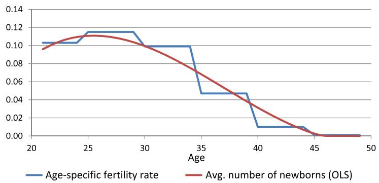  
Fig. 1. The average number of newborns by age. (For interpretation of the colors in the figure(s), the reader is referred to the web version of this article.)

this assumption, the share of married households is $\eta / ( \eta + 2 ( 1 - \eta ) ) = 0 . 5 0$ , which is roughly consistent with the U.S. economy.1

From the estimates by the Social Security Administration (SSA), the average population growth rate is calculated as $0 . 8 9 \%$ in 1995–2015. The population growth rate, $\nu$ , in the model economy is set at $0 . 9 \%$ . The conditional survival rates of men and women at the end of each year of age, $\phi _ { 1 , i }$ and $\phi _ { 2 , i } ,$ , are calculated from Table 4.C6 2010 Period Life Table in Social Security Administration (2016). The survival rates at the end of age 100 are replaced with zero. For simplicity, households are assumed to be either married or single when they enter the economy, and the model abstracts from possible marriages and divorces after that. Thus, the transition matrix of the marital status, $\Pi _ { m , i } = [ p _ { m , i } ( m ^ { \prime } | m ) ]$ for $i < I - 1$ , is solely determined by the survival rates as

$$
\Pi_ {m, i} = \left( \begin{array}{c c c} \phi_ {1, i} \phi_ {2, i} & \phi_ {1, i} (1 - \phi_ {2, i}) & (1 - \phi_ {1, i}) \phi_ {2, i} \\ 0 & \phi_ {1, i} & 0 \\ 0 & 0 & \phi_ {2, i} \end{array} \right).
$$

To avoid introducing an additional heterogeneity of households to the model economy, the numbers of newborns, $n _ { m , i }$ , in a married household and a single female household are assumed to be uniform and dependent only on the household’s marital status $[ m = 0$ or 2) and age. The average number of newborns by age in a household is calculated from the agespecific fertility rates for 2006 in United Nations (2009). The fertility rates for 5-year age groups of women (age 15–19, 20–24, . . . , 45–49) are smoothed out by linear regression. Fig. 1 shows the average number of newborns assumed in the model economy.

# 3.2. Household preferences

The coefficient of relative risk aversion, γ , for the combination of consumption and leisure is set at 2.0, which is within the range of numbers assumed in macroeconomic and public finance literature.12 The share parameter of consumption in the utility function, $\alpha$ , is set at 0.6530 so that the Frisch elasticity of work hours for the average worker (the worker with the average work hours, $\bar { h }$ ) is 0.5. In this paper, the Frisch elasticity is calculated as

$$
\frac {1 - \bar {h}}{\bar {h}} \frac {1 - \alpha (1 - \gamma)}{\gamma} = 0. 5,
$$

where $\bar { h } = 0 . 6 2 3 1$ in the baseline economy. With these parameter values of $\alpha$ and $\gamma$ , the coefficient of relative risk aversion for consumption is calculated as

$$
- \frac {c u _ {c c} (c , l)}{u _ {c} (c , l)} = 1 - \alpha (1 - \gamma) = 1 - 0. 6 5 3 0 (1 - 2. 0) = 1. 6 5 3 0.
$$

The elasticity of inter-temporal substitution of work hours and the elasticity of intra-temporal substitution of the husband’s work hours for the wife’s work hours are both calculated as 0.4491.13 The consumption adjustment factor for a married couple, λ is assumed to be 0.6, following Bernheim et al. (2003).14

According to Table 3 from the Bureau of Labor Statistics (2013a), the average labor force participation rates of men and women age 25–54 in 2012 are $8 8 . 7 \%$ and $7 4 . 5 \%$ , respectively. The parameters of utility from staying at home, $\kappa _ { 1 }$ and $\kappa _ { 2 }$ , are set at 0.4997 and 1.1153, respectively, so that the male and female labor force participation rates are matched to the data. For workers age 56 and older, the labor force participation rates of men and women decline significantly for a variety of reasons: health condition and disability, difficulty in finding a job, incentives in defined-benefit pensions, eligibility for Social Security pensions, availability of employer-sponsored health insurance, COBRA continuation coverage, and eligibility for Medicare benefits.15 Incorporating these factors into the model to match the labor force participation rates to the data is beyond the scope of this paper, however. Therefore, the model makes a simpler assumption that utility from staying at home (or equivalently, disutility from working outside the home) is increasing in age when the households are age 56 or older,

$$
\kappa_ {1} = 0. 4 9 9 7 \bigl \{1 + 0. 0 5 \max (i - 5 5, 0) + 0. 1 0 \max (i - 6 0, 0) ^ {2} \bigr \}.
$$

See Fig. 5 below for the labor force participation rates of men and women in the data and in the baseline economy.

Using Table 5 of Bureau of Labor Statistics (2013b), the average weekly work hours of female workers is calculated as 36.7 in 2012, which is $8 9 . 5 \%$ of the average work hours of male workers, 41.0. The parameter of time cost for childbirth and childcare, $\kappa$ , is set at 1.1655 per newborn so that the average work hours of female workers (age 21–65) is $8 9 . 5 \%$ of the average work hours of male workers.

The discount factor of households, $\beta$ , is set at 0.9827 so that the capital–output ratio, $K _ { t } / Y _ { t }$ , is equal to 3.0 in the baseline economy. According to the national income and product accounts (NIPAs) and fixed assets accounts (FAAs), the capital–output ratio in the United States, defined by the ratio of fixed assets to the GDP is, on average, 2.97 in 2006–2015. For simplicity, the present paper assumes a closed economy and the capital stock to be equal to national wealth.

# 3.3. Production technology

The share parameter of capital, $\theta$ , is set at 0.375, which is consistent with the NIPA data.16 The depreciation rate of the capital stock, δ, is chosen so that the interest rate, $r _ { t }$ , is $5 . 0 \%$ , and the total factor productivity scalar, A, is adjusted so that the average wage rate, $w _ { t }$ , is normalized to 1.0 in the baseline economy. When the capital–output ratio, $K _ { t } / Y _ { t }$ , is 3.0, the Cobb–Douglas production function implies

$$
r _ {t} + \delta = \frac {\theta Y _ {t}}{K _ {t}} = \frac {0 . 3 7 5}{3 . 0} = 0. 1 2 5 \quad \Longrightarrow \quad \delta = 0. 1 2 5 - r _ {t} = 0. 1 2 5 - 0. 0 5 = 0. 0 7 5,
$$

$$
w _ {t} = A (1 - \theta) \left(\frac {K _ {t}}{L _ {t}}\right) ^ {\theta} = A (1 - \theta) ^ {1 - \theta} \left(\frac {K _ {t}}{Y _ {t}}\right) ^ {\theta} = 0. 6 2 5 ^ {0. 6 2 5} 3. 0 ^ {0. 3 7 5} A = 1. 0 \quad \Longrightarrow \quad A = 0. 8 8 8 5.
$$

According to the NIPA data, the average growth rate of real GDP per capita (in chained 2009 dollars) is $1 . 5 1 \%$ between 1995 and 2015. The labor-augmenting productivity growth rate, $\mu$ , is set at $1 . 5 \%$ in the model economy. The growth-adjusted time discount factor is thus, calculated as

$$
\tilde {\beta} = \beta (1 + \mu) ^ {\alpha (1 - \gamma)} = 0. 9 8 2 7 (1 + 0. 0 1 5) ^ {0. 6 5 3 0 (1 - 2. 0)} = 0. 9 7 3 2.
$$

# 3.4. Earning ability processes

The individual earning ability processes of men and women, $e _ { 1 , i }$ and $e _ { 2 , i }$ , for age $i = 2 1 , \ldots , 6 5$ in the model economy are assumed to be

Fig. 2. The variance in log labor income by age.   
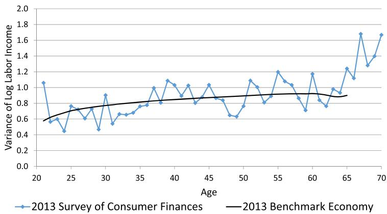  
Source: The author’s calculations and the 2013 Survey of Consumer Finances (Federal Reserve Board of Governors, 2015).

$$
\ln e _ {j, i} = \ln \bar {e} _ {j, i} + \ln z _ {j, i}
$$

for $j = 1$ and 2, where $\bar { e } _ { j , i }$ is the mean wage rate of men or women at age i. The persistent shock, $z _ { j , i }$ , follows an AR(1) process,

$$
\ln z _ {j, i} = \rho \ln z _ {j, i - 1} + \epsilon_ {j, i}
$$

for $i = 2 2 , \ldots , 6 5$ , where $\epsilon _ { j , i } \sim N ( 0 , \sigma ^ { 2 } )$ . The autocorrelation parameter, $\rho$ , is assumed to be 0.87, and the standard deviation, $\sigma$ , is set at 0.39 for all i and $j$ so that both the labor income inequality of households at each age and the lifetime labor income inequalities of men and women are consistent with the data. The latter, the lifetime inequalities, mainly affect the share of spousal benefits in total OASI benefits.17 See Table 2 below for the shares of spousal and survivors benefits in the data and in the baseline economy.

The log deviation from the mean, $\ln z _ { i }$ , is normally distributed, and the variance is increasing in age. The variance of $\ln z _ { j , i }$ is calculated as

$$
V (\ln z _ {j, i + 1}) = \rho^ {2} V (\ln z _ {j, i}) + \sigma^ {2}
$$

for $i = 2 2 , \ldots , 6 5$ , so that the variance in log labor income by age is close to the variances calculated from the household wage income data in the 2013 Survey of Consumer Finances (SCF).18 Fig. 2 shows that the variances in log labor income calculated using the 2013 SCF data (Federal Reserve Board of Governors, 2015) and those in the baseline economy are similar.

The average wage rates (earning abilities) of men and women age 21–65, $\bar { e } _ { 1 , i }$ and $\bar { e } _ { 2 , i }$ , are constructed from the 2013 SCF data (Federal Reserve Board of Governors, 2015) as well. First, the average wage rates of a household head (male or female) and its spouse (if married) are calculated as the ratios of earnings to imputed work hours. Workers whose earnings (work hours) are zero could be out of the labor force either voluntarily or involuntarily. For simplicity, to calculate the average wage rates of men and women, the potential wage distributions of men and women who are not working voluntarily are assumed to be same as those of men and women who are working, and the potential wages of men and women who are not working involuntarily are assumed to be zero. In addition, among those who are not working, $5 0 \%$ of men and $2 0 \%$ of women are assumed to be staying at home involuntarily with zero potential wages. Fig. 3 shows the average potential wage rates and their OLS estimates by age and gender. The estimated wage rates of men and women are then normalized so that the average wage rate of men age 21–65 is 1.0.

In the baseline economy, the average labor income of all working-age households is 0.7458. The average labor income of working-age households (age 21–65) is $65,453 in the 2013 SCF (Federal Reserve Board of Governors, 2015). Therefore, in the baseline economy, one model unit is approximately equal to $\ S 6 5 , 4 5 3 / 0 . 7 4 5 8 = \ S 8 7 , 7 6 6$ in 2013 growth-adjusted dollars.

Fig. 3. The hourly wage profiles of men and women (2013).   
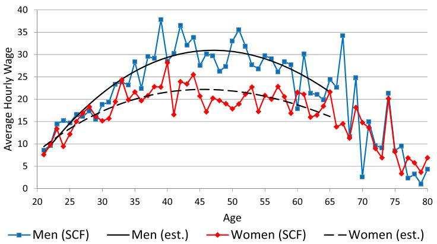  
Source: The author’s calculations from the 2013 Survey of Consumer Finances (Federal Reserve Board of Governors, 2015).

The log persistent shocks of men and women, $\ln z _ { j , i }$ , are discretized into 5 levels each, and the Markov transition matrices are constructed by using the Rouwenhorst method (Rouwenhorst, 1995; Kopecky and Suen, 2010). The unconditional probability distribution of single households is

$$
\pi_ {e _ {1}, i} = \pi_ {e _ {2}, i} = (0. 0 6 2 5, 0. 2 5 0 0, 0. 3 7 5 0, 0. 2 5 0 0, 0. 0 6 2 5) ^ {\prime}
$$

for $i = 2 1 , \ldots , 6 5$ . The Markov transition matrix for single households, $\Pi _ { e _ { 1 } , i } = [ \pi ( e _ { 1 , i + 1 } ^ { j ^ { \prime } } | e _ { 1 , i } ^ { j } ) ]$ and $\Pi _ { e _ { 2 } , i } = [ \pi ( e _ { 2 , i + 1 } ^ { k ^ { \prime } } | e _ { 2 , i } ^ { k } ) ]$ for $i = 2 1 , \ldots , 6 4$ , that corresponds to $\rho = 0 . 8 7$ is calculated as

$$
\Pi_ {e _ {1}, i} = \Pi_ {e _ {2}, i} = \left( \begin{array}{c c c c c} 0. 7 6 4 3 & 0. 2 1 2 5 & 0. 0 2 2 2 & 0. 0 0 1 0 & 0. 0 0 0 0 \\ 0. 0 5 3 1 & 0. 7 7 5 4 & 0. 1 6 0 2 & 0. 0 1 1 1 & 0. 0 0 0 3 \\ 0. 0 0 3 7 & 0. 1 0 6 8 & 0. 7 7 9 1 & 0. 1 0 6 8 & 0. 0 0 3 7 \\ 0. 0 0 0 3 & 0. 0 1 1 1 & 0. 1 6 0 2 & 0. 7 7 5 4 & 0. 0 5 3 1 \\ 0. 0 0 0 0 & 0. 0 0 1 0 & 0. 0 2 2 2 & 0. 2 1 2 5 & 0. 7 6 4 3 \end{array} \right).
$$

The earning ability processes of the husband and wife in a married household are assumed to be correlated. Suppose that, in each period, the wage rates of the husband and wife are perfectly correlated with probability $\omega$ and uncorrelated with probability $1 - \omega$ . Then, the unconditional probability distribution of married households is obtained as

$$
\pi_ {\left(e _ {1}, e _ {2}\right), i} = \omega \operatorname {d i a g} \left(\pi_ {e _ {1}, i}\right) + (1 - \omega) \left(\pi_ {e _ {1}, i}\right) \left(\pi_ {e _ {2}, i}\right) ^ {\prime}.
$$

The Markov transition matrix for married households, $\Pi _ { ( e _ { 1 } , e _ { 2 } ) , i } = [ \pi ( e _ { 1 , i + 1 } ^ { j ^ { \prime } } , e _ { 2 , i + 1 } ^ { k ^ { \prime } } | e _ { 1 , i } ^ { j } , e _ { 2 , i } ^ { k } ) ] ,$ , which corresponds to $\rho = 0 . 8 7$ and $\mathrm { c o r r } ( e _ { 1 } , e _ { 2 } ) = \omega$ is constructed as

$$
\begin{array}{l} \pi \left(e _ {1, i + 1} ^ {j ^ {\prime}}, e _ {2, i + 1} ^ {k ^ {\prime}} \mid e _ {1, i} ^ {j}, e _ {2, i} ^ {k}\right) \\ = \left\{ \begin{array}{l l} \hat {\omega} \mathbf {1} _ {\{j ^ {\prime} = k ^ {\prime} \}} \pi (e _ {1, i + 1} ^ {j} | e _ {1, i} ^ {k}) + (1 - \hat {\omega}) \pi (e _ {1, i + 1} ^ {j ^ {\prime}} | e _ {1, i} ^ {j}) \pi (e _ {2, i + 1} ^ {k ^ {\prime}} | e _ {2, i} ^ {k}) & \text {i f} j = k, \\ \pi (e _ {1, i + 1} ^ {j ^ {\prime}} | e _ {1, i} ^ {j}) \pi (e _ {2, i + 1} ^ {k ^ {\prime}} | e _ {2, i} ^ {k}) & \text {i f} j \neq k, \end{array} \right. \\ \end{array}
$$

where $\hat { \omega }$ is the conditional probability for a married household to be a perfectly correlated household given that they are on the diagonal, $j = k$

$$
\hat {\omega} = \frac {\omega}{\omega + (1 - \omega) (\pi_ {e _ {1} , i}) ^ {\prime} (\pi_ {e _ {2} , i})}.
$$

According to Hyslop (2001), the correlation between men’s and women’s wages of married households with both spouses working is 0.340. The intrafamily wage correlation is set to be $\omega = 0 . 2 9$ so that the wage correlation of dual-earner married households in the baseline economy equals 0.340.

In the model economy, the household’s minimum wealth level depends only on its age as $a ^ { \prime } \geq a _ { \mathrm { m i n } } ^ { \prime } ( \pmb { \mathscr { s } } ) = a _ { \mathrm { m i n } } ^ { \prime } ( i )$ , and

$$
a _ {\min} ^ {\prime} (i) = \left\{ \begin{array}{l l} \left[ (1 + \mu) a _ {\min} (i + 1) - 0. 1 0 \bar {w} e _ {1, i + 1} ^ {1} \bar {h} \right] / (1 + \bar {r}) & \text {i f} i = 2 1, \ldots , I - 1, \\ 0 & \text {i f} i = I, \end{array} \right.
$$

where $e _ { 1 , i + 1 } ^ { 1 }$ is the lowest men’s working ability at age $i + 1$ , and where r¯, w¯ , and $\bar { h }$ are the interest rate, the wage rate, and the average work hours, respectively, in the baseline economy. One might expect minimum assets to be set at what a household could repay under the worst possible realizations for working ability, which is known as the natural borrowing constraint. However, labor income with the lowest working ability and with the highest number of work hours is instead multiplied by 0.10 to align household debt to the U.S. economy.

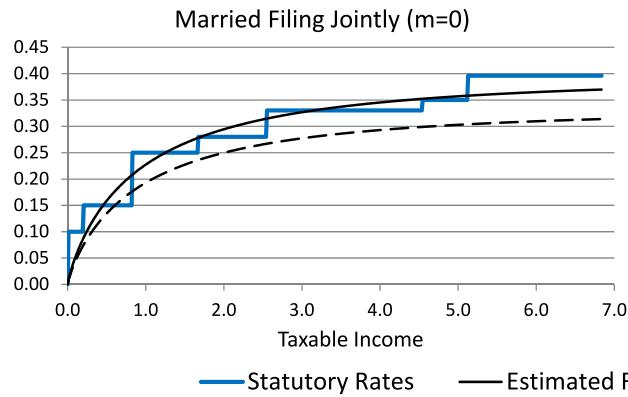

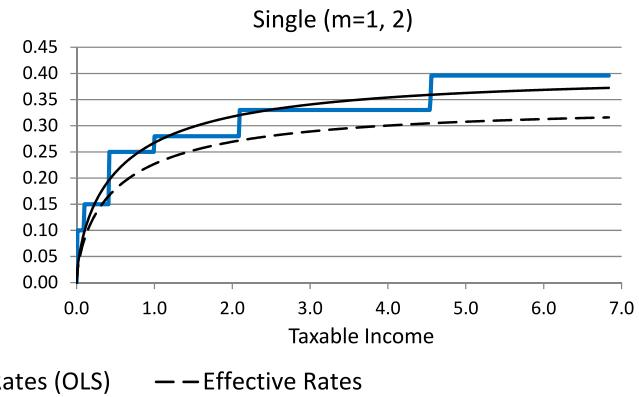  
Fig. 4. The marginal income tax rate schedule of married and single households.

Table 2 The shares of OASI benefits by the type of recipient (percent). Source: The author’s calculations from Table 4.A5 in Social Security Administration (2016).   

<table><tr><td>Year</td><td>Retired workers</td><td>Wives and husbands</td><td>Widows and widowers</td></tr><tr><td>2008</td><td>78.9</td><td>4.52</td><td>16.6</td></tr><tr><td>2009</td><td>79.5</td><td>4.43</td><td>16.1</td></tr><tr><td>2010</td><td>80.1</td><td>4.34</td><td>15.5</td></tr><tr><td>2011</td><td>80.6</td><td>4.23</td><td>15.1</td></tr><tr><td>2012</td><td>81.2</td><td>4.14</td><td>14.7</td></tr><tr><td>2013</td><td>81.8</td><td>4.07</td><td>14.1</td></tr><tr><td>2014</td><td>82.3</td><td>4.04</td><td>13.7</td></tr><tr><td>2015</td><td>82.7</td><td>4.02</td><td>13.3</td></tr><tr><td>Baseline</td><td>81.3</td><td>4.00</td><td>14.7</td></tr></table>

# 3.5. The government’s policy functions

The parameters of the Gouveia–Strauss type individual income tax function are estimated with OLS using statutory marginal tax rates in 2013. One of the parameters, $\varphi _ { t }$ , is the limit of the marginal tax rate as taxable income goes to infinity. Thus, $\varphi _ { t }$ is first set at 0.396, the highest marginal tax rate in 2013. The other two parameters, $\varphi _ { m , 1 }$ and $\varphi _ { m , 2 }$ , are estimated with OLS (equally weighted for taxable income between $\$ 0$ and $600,000), separately for married households filing jointly and single households. Then, $\varphi _ { t }$ is adjusted to 0.3454 to reflect the effective income tax rates and to make the individual income tax revenue, $T _ { I , t }$ , $1 0 . 0 \%$ of GDP in the baseline economy. Fig. 4 indicates the statutory and estimated marginal income tax rates.

The OASI payroll tax rate is $5 . 3 \%$ for an employee and $5 . 3 \%$ for an employer. Thus, $\bar { \tau } _ { P , t }$ is set at $0 . 1 0 6 / 1 . 0 5 3 = 0 . 1 0 0 7 .$ . The thresholds to calculate PIAs are set for each age cohort when they reach age 62 in the U.S. system. For simplicity, the growth-adjusted thresholds for all age cohorts are fixed in the model economy, and the PIA of each age cohort is adjusted later by using the long-term productivity growth rate and the number of years from age 60. Thus, after a scale adjustment, the model simply uses the thresholds for age 62 households in 2013. The OASDI benefit adjustment factor, $\psi _ { t }$ , is 1.0 in the baseline economy. To balance the OASI budget, the OASI residual, $T R _ { 0 }$ , is set at $- 0 . 0 5 7 1$ , which is $1 . 8 \%$ of the OASI payroll tax revenue in the baseline economy.

# 3.6. Baseline economy

Table 2 shows the shares of OASI benefits by the type of recipient in the data (Social Security Administration, 2016) and the baseline economy. The calibration targets are the shares in 2015. The shares of the old-age retirement benefits, spousal benefits, and survivors benefits (received by spouses) are $8 1 . 3 \%$ , $4 . 0 \%$ , and $1 4 . 7 \%$ , respectively. The share of the survivors benefits, $1 4 . 7 \%$ , in the baseline economy is higher than the actual share, $1 3 . 3 \%$ , in 2015. However, the higher share in the baseline economy is probably justifiable, because baby-boom generation has recently started receiving old-age benefits, but this generation is still too young to receive survivors benefits.19

Fig. 5. The labor force participation rates by age.   
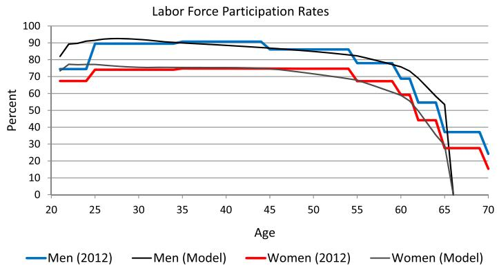  
Source: Table 3.3 in Bureau of Labor Statistics (2013a) and the author’s calculations.

Fig. 5 shows the labor participation rates by age of men and women in the data (Bureau of Labor Statistics, 2013a) and the baseline economy. As explained above, the average labor participation rates of men and women age 25–54 are targeted to $8 8 . 7 \%$ and $7 4 . 5 \%$ , respectively. Thus, the model economy captures the labor force participation rates of men and women age 25–54 well. In addition, the model is fairly successful in replicating the lower labor force participation rates of those age 55 and older.

# 4. Removing spousal and survivors benefits

The policy experiments in this paper are straightforward. The economy is assumed to be in the initial steady-state equilibrium (and on the balanced growth path) in year 0. Starting at the beginning of year 1, the government removes the spousal and survivors benefits of the current OASI program cohort by cohort in a phased-in manner.

More specifically, for households age 61 and older in year 1, their OASI benefit function is unchanged because it is too late for these households to adjust their labor supply to the policy change. Thus, for $i - ( t - 1 ) \geq 6 1$ and $1 \leq t \leq I - 6 0 = 4 0 ,$ ,

$$
t r _ {S S, t} ^ {0} (i, b _ {1}, b _ {2}, m) = \left\{ \begin{array}{l l} \psi_ {t} (\psi_ {0} / \psi_ {T}) \max  \big [ \psi (i, b _ {1}) + \psi (i, b _ {2}), 1. 5 \psi (i, b _ {1}), 1. 5 \psi (i, b _ {2}) \big ] & \text {i f} m = 0, \\ \psi_ {t} (\psi_ {0} / \psi_ {T}) \max  \big [ \psi (i, b _ {1}), \psi (i, b _ {2}) \big ] & \text {i f} m = 1, 2, \end{array} \right.
$$

where $\psi _ { 0 }$ and $\psi _ { T }$ are benefit adjustment parameters in the initial steady state and the final steady state, respectively, and $\psi _ { t }$ is adjusted to balance the OASI budget in each transition period. Because the government introduces the policy change cohort by cohort, most current households continue receiving (part of) spousal and survivors benefits. To keep generational equity, in this experiment, the government first discounts the benefits under the old schedule with ${ \psi } _ { 0 } / { \psi } _ { T }$ , and then, the government adjusts all benefits proportionally with $\psi _ { t }$ to balance the Social Security budget each year.

For households age 21 and younger in year 1, their OASI benefit function is fully replaced by the new benefit function without spousal and survivors benefits; i.e., for $i - ( t - 1 ) \le 2 1$ and $t \geq I _ { R } - 2 0 = 4 6$ ,

$$
t r _ {S S, t} ^ {1} (i, b _ {1}, b _ {2}, m) = \left\{ \begin{array}{l l} \psi_ {t} \big [ \psi (i, b _ {1}) + \psi (i, b _ {2}) \big ] & \text {i f} m = 0, \\ \psi_ {t} \psi (i, b _ {j}) & \text {i f} m = j = 1, 2. \end{array} \right.
$$

Finally, for households age 22–60 in year 1, their possible spousal and survivors benefits are reduced linearly cohort by cohort. The OASI benefit function is set as the weighted average of the two functions above; i.e., for $2 2 \leq i - ( t - 1 ) \leq 6 0$ and $6 = I _ { R } - 6 0 \leq t \leq I - 2 1 = 7 9$ ,

$$
t r _ {S S, t} (i, b _ {1}, b _ {2}, m) = \frac {(i - 2 0) - t}{4 0} t r _ {S S, t} ^ {0} (i, b _ {1}, b _ {2}, m) + \Big (1 - \frac {(i - 2 0) - t}{4 0} \Big) t r _ {S S, t} ^ {1} (i, b _ {1}, b _ {2}, m).
$$

The government’s financing assumptions Any changes in the current Social Security system would alter the government’s income and payroll tax revenue. If spousal and survivors benefits were eliminated, then all other things being equal, the government’s benefit expenditures would decrease, and the payroll tax revenue would likely increase because of a larger labor supply. For simplicity, the OASI budget is balanced each year in the model economy, the payroll tax rate, $\bar { \tau } _ { P , t }$ , is fixed at the baseline level, and the OASI benefits are changed proportionally each year by the adjustment factor, $\psi _ { t }$ , to match the

benefit expenditure to the payroll tax revenue. For the rest of the government budget, the removal of spousal and survivors benefits would likely increase the labor supply and individual income tax revenues. The rest of the government budget is also balanced each year, and either the lump-sum transfer, $t r _ { L S , t }$ , or the marginal income tax rate parameter, $\varphi _ { t }$ , is changed to balance the budget. The government’s financing rules assumed in this paper are summarized as follows:

(a) $\begin{array} { r l r } { t r _ { L S , t } } & { { } \quad \longleftarrow } & { \quad T R _ { L S , t } ( t r _ { L S , t } ) = T _ { I , t } ( \varphi _ { 0 } ) - C _ { G , 0 } + ( 1 + r _ { t } ) W _ { G , t } - ( 1 + \mu ) ( 1 + \nu ) W _ { G , t + 1 } , } \end{array}$

$$
W _ {G, t + 1} = W _ {G, t};
$$

(b)

$$
W _ {G, t + 1} = W _ {G, t};
$$

(a) and (b)

Welfare measure The change in social welfare by the policy reform is evaluated based on the ex ante expected (remaining) lifetime utility of each age cohort (the veil of ignorance). The welfare gains or losses of age 21 households at the beginning of $t = 1 , \ldots , \infty$ are calculated as the uniform percentage changes, $\lambda _ { 2 1 , t }$ , in the baseline consumption path, such that these changes would make the household’s expected lifetime utility equivalent to the expected utility after the policy change; that is,

$$
\lambda_ {2 1, t} = \left[ \left(\frac {E v (\mathbf {s} _ {2 1} , \mathbf {S} _ {t} ; \boldsymbol {\Psi} _ {t})}{E v (\mathbf {s} _ {2 1} , \mathbf {S} _ {0} ; \boldsymbol {\Psi} _ {0})}\right) ^ {\frac {1}{\alpha (1 - \gamma)}} - 1 \right] \times 1 0 0,
$$

where $\pmb { \mathscr { s } } _ { 2 1 } = ( 2 1 , a , b _ { 1 } , b _ { 2 } , e _ { 1 } , e _ { 2 } , m )$ . Similarly, the average welfare changes of age i households at the time of the policy change $\left. t = 1 \right.$ ) are calculated as the uniform percent changes, $\lambda _ { i , 1 }$ , which are required in the baseline consumption path so that the rest-of-the-lifetime value would be equal to the rest-of-the-lifetime value after the policy change; that is,

$$
\lambda_ {i, 1} = \left[ \left(\frac {E \nu (\mathbf {s} _ {i} , \mathbf {S} _ {1} ; \boldsymbol {\Psi} _ {1})}{E \nu (\mathbf {s} _ {i} , \mathbf {S} _ {0} ; \boldsymbol {\Psi} _ {0})}\right) ^ {\frac {1}{\alpha (1 - \gamma)}} - 1 \right] \times 1 0 0.
$$

Note that $\lambda _ { i , 1 }$ for $i = I , \ldots , 1$ shows the cohort-average welfare changes of all current households alive at the time of the policy change, and $\lambda _ { 2 1 , t }$ for $t = 2 , \ldots , \infty$ shows the cohort-average welfare changes of all future households.

# 4.1. Long-run effects over the life cycle

Fig. 6 shows the long-run effects of removing spousal and survivors benefits over the life cycle as percent changes from the baseline averages. In each of the 8 charts, the dashed blue line shows Run 1 (a), in which the government increases lump-sum transfers; and the long-dashed red line shows Run 1 (b), in which the government reduces marginal income tax rates.

When spousal and survivors benefits are replaced with old-age benefits, women’s labor force participation rate would increase, on average, by $1 . 5 \mathrm { - } 1 . 6 \%$ in the long run. The increase in the participation rate becomes larger as women get older, and the participation rate of women age around 60 would increase by almost $3 . 0 \%$ , because these relatively old workers can predict their future PIAs more accurately and respond to the policy change. The removal of spousal and survivors benefits would also increase the average work hours of female workers. However, the increase in the average work hours is much smaller than the increase in the participation rate. Whether or not women are working is more important than how many hours they work because OASI benefits are progressive.

The effect of the policy change on the labor supply of men is much smaller than that of women. Only a small number of male workers receive spousal and survivors benefits in the baseline economy. Thus, men’s labor force participation rate changes very little. The average work hours of male workers decrease slightly because of the higher effective payroll tax rate and the substitution between the husband’s work hours and the wife’s work hours.

The policy change would increase the total labor supply and the income tax revenue, which would allow the government to increase lump-sum transfers to households or reduce marginal income tax rates. Private consumption would increase, on average, by $0 . 4 \mathrm { - } 0 . 5 \%$ in the long run, although consumption of very old households (age 97–100) would decline because of the removal of survivors benefits. The increased rate is slightly higher when the government reduces marginal income tax rates proportionally to balance the rest of the government budget. Private wealth would increase, on average, by $0 . 8 \mathrm { - } 1 . 1 \%$ , which increase is mainly generated by the reduction in the Social Security’s annuity effect due to the removal of spousal and survivors benefits.

When spousal and survivors benefits are replaced with old-age benefits, the OASI benefits would be, on average, larger for retired households age 78 and younger but smaller for those age 79 and older. In the baseline economy, per-capita OASI benefits are, on average, increasing by age because some widow(er)s switch their benefits from their own benefits to survivors benefits when their spouses die. After the policy change, the number of widow(er)ed people would increase as households grow older, but their OASI benefits would be lower because of the removal of survivors benefits.

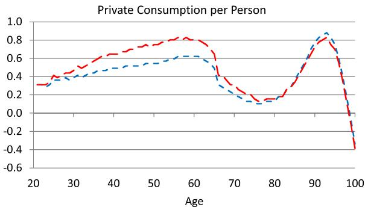

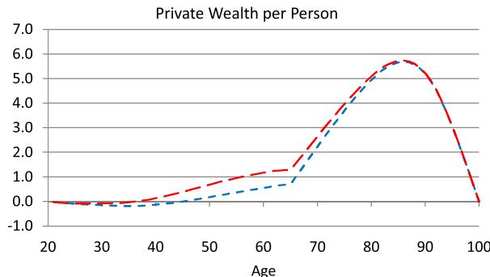

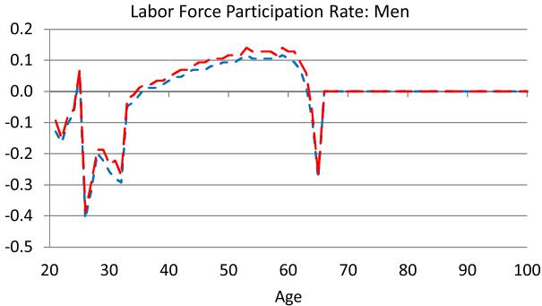

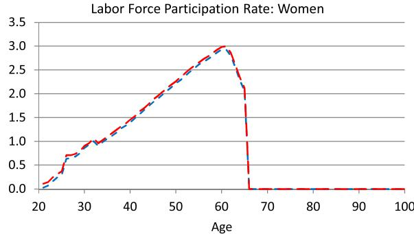

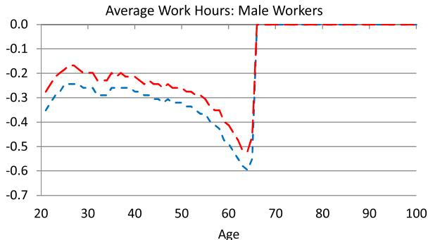

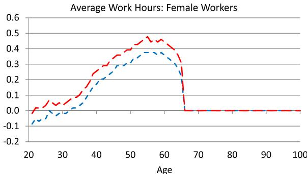

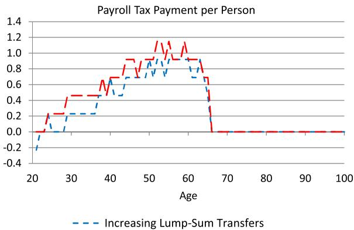

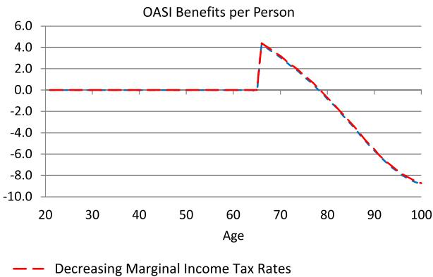  
Fig. 6. The long-run effects of removing spousal and survivors benefits over the life cycle (changes as a percentage of the baseline average).

Table 3 shows the long-run changes in the work hours of age 40 married and single households from the baseline economy. The rows, $e _ { 1 } ^ { 1 } , \ldots , e _ { 1 } ^ { 5 }$ , are the husband’s wage levels at age 40, and the columns, $e _ { 2 } ^ { 1 } , \ldots , e _ { 2 } ^ { 5 }$ , are the wife’s wage levels. Column $m = 1$ and row $m = 2$ show the changes in the work hours of single male and female households, respectively. Because some people do not work outside the home, the changes in the market work hours of husbands and wives are calculated as percentages of the average market hours of age 40 men and women, respectively, before the policy change.

Under both financing assumptions, the work hours of the majority of married men age 40 would decrease slightly as their wives’ work hours increase. However, the work hours of married men with higher wage rates coupled with women

Table 3 Long-run changes in hours of market work of men and women age 40 (changes as a percentage of the average baseline hours).   

<table><tr><td rowspan="2" colspan="2"></td><td colspan="6">Husband or single man</td><td colspan="6">Wife or single woman</td></tr><tr><td>e12</td><td>e22</td><td>e32</td><td>e42</td><td>e52</td><td>m=1</td><td>e12</td><td>e22</td><td>e32</td><td>e42</td><td>e52</td><td>m=1</td></tr><tr><td>Run 1(a)</td><td>e11</td><td>-0.5</td><td>-0.5</td><td>0.1</td><td>0.3</td><td>0.0</td><td>0.1</td><td>0.4</td><td>0.4</td><td>0.0</td><td>-0.3</td><td>0.0</td><td>-</td></tr><tr><td>Increasing</td><td>e12</td><td>-0.5</td><td>-0.7</td><td>-0.6</td><td>0.6</td><td>1.5</td><td>0.0</td><td>1.6</td><td>1.8</td><td>0.5</td><td>-0.1</td><td>0.0</td><td>-</td></tr><tr><td>lump-sum</td><td>e13</td><td>-0.6</td><td>-0.6</td><td>-0.7</td><td>-0.5</td><td>0.5</td><td>-0.1</td><td>0.0</td><td>4.4</td><td>2.9</td><td>0.5</td><td>-0.1</td><td>-</td></tr><tr><td>transfers</td><td>e14</td><td>0.4</td><td>0.3</td><td>0.1</td><td>0.0</td><td>-0.4</td><td>-0.3</td><td>0.0</td><td>3.7</td><td>6.1</td><td>3.0</td><td>-0.1</td><td>-</td></tr><tr><td></td><td>e15</td><td>0.3</td><td>0.3</td><td>0.2</td><td>0.1</td><td>0.0</td><td>-0.2</td><td>0.0</td><td>0.0</td><td>7.2</td><td>5.2</td><td>0.7</td><td>-</td></tr><tr><td></td><td>m=2</td><td>-</td><td>-</td><td>-</td><td>-</td><td>-</td><td></td><td>0.2</td><td>0.1</td><td>-0.1</td><td>-0.1</td><td>-0.3</td><td></td></tr><tr><td>Run 1(b)</td><td>e11</td><td>-0.4</td><td>-0.3</td><td>0.2</td><td>0.3</td><td>0.0</td><td>0.2</td><td>0.7</td><td>0.5</td><td>0.1</td><td>-0.2</td><td>0.1</td><td>-</td></tr><tr><td>Reducing</td><td>e12</td><td>-0.5</td><td>-0.6</td><td>-0.5</td><td>0.7</td><td>1.6</td><td>0.1</td><td>1.8</td><td>2.0</td><td>0.6</td><td>0.0</td><td>0.0</td><td>-</td></tr><tr><td>income</td><td>e13</td><td>-0.5</td><td>-0.6</td><td>-0.6</td><td>-0.4</td><td>0.7</td><td>-0.1</td><td>0.0</td><td>4.5</td><td>3.0</td><td>0.6</td><td>0.0</td><td>-</td></tr><tr><td>tax rates</td><td>e14</td><td>0.4</td><td>0.3</td><td>0.2</td><td>0.0</td><td>-0.3</td><td>-0.2</td><td>0.0</td><td>3.8</td><td>6.2</td><td>3.1</td><td>0.0</td><td>-</td></tr><tr><td></td><td>e15</td><td>0.4</td><td>0.3</td><td>0.2</td><td>0.1</td><td>0.0</td><td>-0.2</td><td>0.0</td><td>0.0</td><td>7.4</td><td>5.4</td><td>0.8</td><td>-</td></tr><tr><td></td><td>m=2</td><td>-</td><td>-</td><td>-</td><td>-</td><td>-</td><td></td><td>0.4</td><td>0.2</td><td>0.1</td><td>0.1</td><td>-0.2</td><td></td></tr></table>

The rows, $e _ { 1 } ^ { 1 } , \ldots , e _ { 1 } ^ { 5 }$ , are men’s wage levels at age 40 from the lowest to the highest, and the columns, $e _ { 2 } ^ { 1 } , \ldots , e _ { 2 } ^ { 5 }$ , are women’s wage levels at age 40.

with lower wage rates, e.g., $( e _ { 1 } ^ { 4 } , e _ { 2 } ^ { 1 } )$ , $( e _ { 1 } ^ { 5 } , e _ { 2 } ^ { 1 } )$ , and $( e _ { 1 } ^ { 5 } , e _ { 2 } ^ { 2 } )$ , and married men with lower wage rates coupled with women with higher wage rates, e.g., $( e _ { 1 } ^ { 2 } , e _ { 2 } ^ { 4 } )$ , $( e _ { 1 } ^ { 2 } , e _ { 2 } ^ { 5 } )$ , and $( e _ { 1 } ^ { 3 } , e _ { 2 } ^ { 5 } )$ , would increase. Married men with the lowest wage rate coupled with women with the highest wage rate, $( e _ { 1 } ^ { 1 } , e _ { 2 } ^ { 5 } )$ , would not work before and after the policy change; thus, there would be no change in their work hours. The work hours of single men would increase slightly if their wage rates are relatively lower but decrease slightly if their wage rates are higher.

The work hours of most married women age 40 would increase more significantly. The changes are especially large for married women with moderate wage rates coupled with men with relatively high wage rates, e.g., (e3 , e2 ), (e4 , e3 ), $( e _ { 1 } ^ { \bar { 5 } } , e _ { 2 } ^ { 3 } )$ , and $( e _ { 1 } ^ { 5 } , e _ { 2 } ^ { 4 } )$ , because these women are affected most by the removal of spousal and survivors benefits. The work hours of married women with the lowest wage rate coupled with men with higher wage rates, (e41, e12), $( e _ { 1 } ^ { 5 } , e _ { 2 } ^ { 1 } )$ , and $( e _ { 1 } ^ { 5 } , e _ { 2 } ^ { 2 } )$ , would be zero before and after the policy change; thus, there would be no change in the women’s work hours. The work hours of single women would also increase slightly if their wage rates are relatively lower but decrease slightly if their wage rates are higher.

# 4.2. Transition effects on macroeconomy and welfare

Table 4 and Fig. 7 show the transition effects of removing spousal and survivors benefits from the current OASI program. In each of these 10 charts in Fig. 7, the dashed blue line indicates the percentage changes from the baseline economy in Run 1 (a) with increasing lump-sum transfers, and the long-dashed red line indicates the percentage changes in Run 1 (b) with decreasing income tax rates.

Women’s total work hours would increase by $0 . 5 { - } 0 . 6 \%$ in the first year of the policy change and by $1 . 7 { - } 1 . 8 \%$ in the long run, relative to the baseline level. The increase in women’s work hours would be slightly larger in Run 1 (b) because of the lower marginal income tax rates. Women’s labor force participation rate would increase by $1 . 5 \mathrm { - } 1 . 6 \%$ in the long run, but the average work hours of female workers would increase only by $0 . 2 \mathrm { - } 0 . 3 \%$ in the long run. As explained above, this is due partly to the current progressive Social Security benefit schedule. If married women do not work at all, after the removal of spousal and survivors benefits, they will not receive any OA benefits. However, if they work part-time even at lower wages, they will still be eligible for relatively large OA benefits. Men’s labor force participation rate would change very little with the policy change. Men’s total work hours as well as the average work hours of male workers would decrease by $0 . 3 \%$ in the long run.

The total labor supply in efficiency units would increase by $0 . 3 \mathrm { - } 0 . 4 \%$ in the long run. The increase is relatively small because women with lower wage rates tend to increase their work hours more than women with higher wage rates after the policy change. Thus, the productivity-weighted labor supply would not increase as much as the total work hours of men and women combined. The capital stock (national wealth) would increase by $0 . 8 \mathrm { - } 1 . 1 \%$ , and the total output (gross domestic product) would increase by $0 . 5 \mathrm { - } 0 . 6 \%$ in the long run. Because of the increased economic activity, OASI payroll tax revenue would increase by $0 . 5 \mathrm { - } 0 . 6 \%$ in the long run although the payroll tax rate is kept at the same level. When spousal and survivors benefits are removed, the government could increase the old-age benefits by $7 . 9 \mathrm { - } 8 . 4 \%$ during the transition path and by $8 . 2 \substack { - 8 . 3 \% }$ in the long run to balance the Social Security budget.

The bottom right chart in Fig. 7 shows the average welfare change by age cohort. The horizontal axis is the age of the households when the policy is changed (in year 1). The vertical line in the middle indicates the youngest age cohort (age 21 households) at the time of the policy change. Households shown to the left of the vertical line are current households age 21–100 at the time of the policy change, and those households shown to the right of the vertical line are future households age 20 and younger at the time of the policy change.

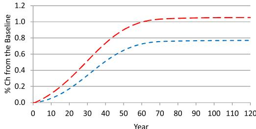  
Capital Stock (National Wealth)

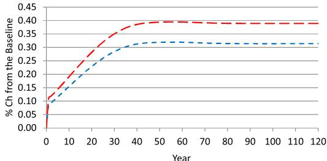  
Labor Supply in Efficiency Units

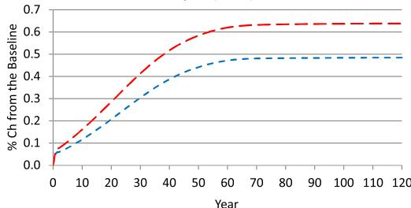  
Output (GDP)

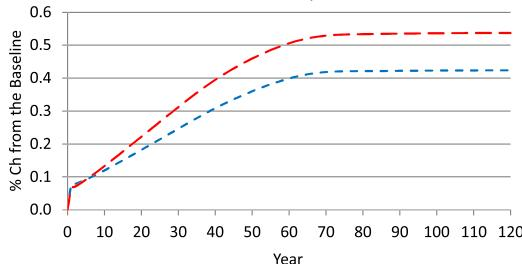  
Private Consumption

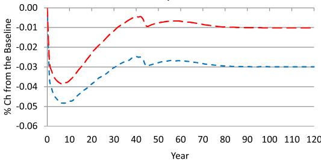  
Labor Force Participation Rate: Men

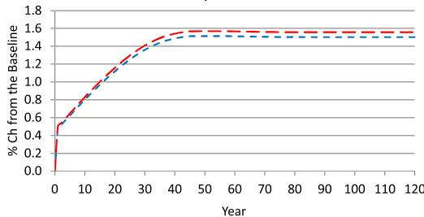  
Labor Force Participation Rate: Women

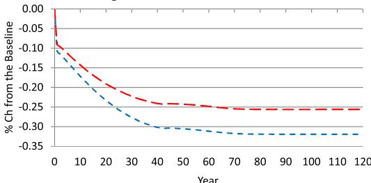  
Average Work Hours: Male Workers

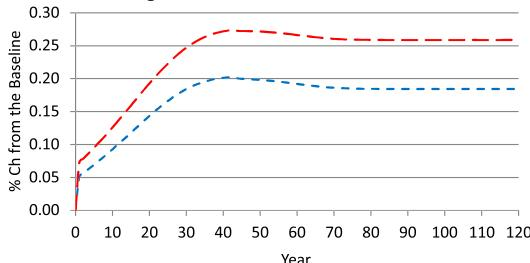  
Average Work Hours: Female Workers

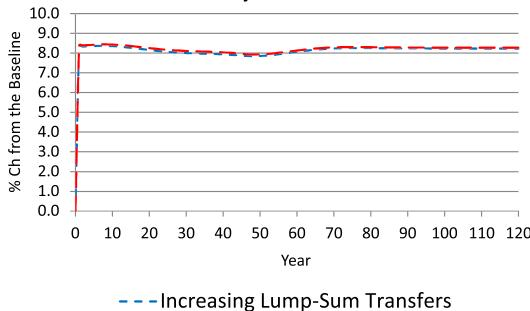  
Benefit Adjustment Factor

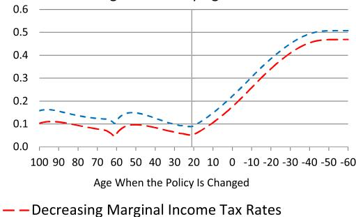  
Average Welfare by Age Cohort   
Fig. 7. The transition effects of removing spousal and survivors benefits.

Table 4 The effects of removing spousal and survivors benefits (% changes from the baseline economy).   

<table><tr><td rowspan="2">Run 1(a) Increasing lump-sum transfers</td><td colspan="6">Year</td><td rowspan="2">Long Run</td></tr><tr><td>1</td><td>6</td><td>11</td><td>21</td><td>51</td><td>81</td></tr><tr><td>Capital stock (national wealth)</td><td>0.0</td><td>0.0</td><td>0.1</td><td>0.2</td><td>0.7</td><td>0.8</td><td>0.8</td></tr><tr><td>Labor supply (in efficiency units)</td><td>0.1</td><td>0.1</td><td>0.2</td><td>0.2</td><td>0.3</td><td>0.3</td><td>0.3</td></tr><tr><td>Gross domestic product</td><td>0.1</td><td>0.1</td><td>0.1</td><td>0.2</td><td>0.4</td><td>0.5</td><td>0.5</td></tr><tr><td>Private consumption</td><td>0.1</td><td>0.1</td><td>0.1</td><td>0.2</td><td>0.4</td><td>0.4</td><td>0.4</td></tr><tr><td>Interest rate</td><td>0.1</td><td>0.2</td><td>0.2</td><td>0.1</td><td>-0.5</td><td>-0.7</td><td>-0.7</td></tr><tr><td>Average wage rate</td><td>0.0</td><td>0.0</td><td>0.0</td><td>0.0</td><td>0.1</td><td>0.2</td><td>0.2</td></tr><tr><td>Welfare of age 21 households</td><td>0.1</td><td>0.1</td><td>0.1</td><td>0.2</td><td>0.4</td><td>0.5</td><td>0.5</td></tr><tr><td>\( Transfer~spending^a \)</td><td>0.1</td><td>0.2</td><td>0.2</td><td>0.4</td><td>0.6</td><td>0.6</td><td>0.6</td></tr><tr><td>Marginal income tax rate</td><td>0.0</td><td>0.0</td><td>0.0</td><td>0.0</td><td>0.0</td><td>0.0</td><td>0.0</td></tr><tr><td>OASI payroll tax revenue</td><td>0.1</td><td>0.1</td><td>0.2</td><td>0.3</td><td>0.5</td><td>0.5</td><td>0.5</td></tr><tr><td>OASI benefit adjustment</td><td>8.3</td><td>8.4</td><td>8.3</td><td>8.1</td><td>7.9</td><td>8.2</td><td>8.2</td></tr><tr><td>Labor supply: men</td><td>-0.1</td><td>-0.1</td><td>-0.2</td><td>-0.2</td><td>-0.2</td><td>-0.2</td><td>-0.2</td></tr><tr><td>Labor supply: women</td><td>0.4</td><td>0.5</td><td>0.7</td><td>0.9</td><td>1.2</td><td>1.2</td><td>1.2</td></tr><tr><td>Total work hours: men</td><td>-0.1</td><td>-0.2</td><td>-0.2</td><td>-0.3</td><td>-0.3</td><td>-0.3</td><td>-0.3</td></tr><tr><td>Total work hours: women</td><td>0.5</td><td>0.7</td><td>0.9</td><td>1.3</td><td>1.7</td><td>1.7</td><td>1.7</td></tr><tr><td>Labor participation rate: men</td><td>0.0</td><td>0.0</td><td>0.0</td><td>0.0</td><td>0.0</td><td>0.0</td><td>0.0</td></tr><tr><td>Labor participation rate: women</td><td>0.5</td><td>0.7</td><td>0.8</td><td>1.1</td><td>1.5</td><td>1.5</td><td>1.5</td></tr><tr><td>Average work hours: male workers</td><td>-0.1</td><td>-0.1</td><td>-0.2</td><td>-0.2</td><td>-0.3</td><td>-0.3</td><td>-0.3</td></tr><tr><td>Average work hours: female workers</td><td>0.1</td><td>0.1</td><td>0.1</td><td>0.1</td><td>0.2</td><td>0.2</td><td>0.2</td></tr><tr><td rowspan="2">Run 1(b) Decreasing income tax rates</td><td colspan="6">Year</td><td rowspan="2">Long Run</td></tr><tr><td>1</td><td>6</td><td>11</td><td>21</td><td>41</td><td>81</td></tr><tr><td>Capital stock (national wealth)</td><td>0.0</td><td>0.1</td><td>0.1</td><td>0.3</td><td>0.9</td><td>1.0</td><td>1.1</td></tr><tr><td>Labor supply (in efficiency units)</td><td>0.1</td><td>0.2</td><td>0.2</td><td>0.3</td><td>0.4</td><td>0.4</td><td>0.4</td></tr><tr><td>Gross domestic product</td><td>0.1</td><td>0.1</td><td>0.2</td><td>0.3</td><td>0.6</td><td>0.6</td><td>0.6</td></tr><tr><td>Private consumption</td><td>0.1</td><td>0.1</td><td>0.1</td><td>0.2</td><td>0.5</td><td>0.5</td><td>0.5</td></tr><tr><td>Interest rate</td><td>0.2</td><td>0.2</td><td>0.1</td><td>0.0</td><td>-0.8</td><td>-1.0</td><td>-1.0</td></tr><tr><td>Average wage rate</td><td>0.0</td><td>0.0</td><td>0.0</td><td>0.0</td><td>0.2</td><td>0.2</td><td>0.2</td></tr><tr><td>Welfare of age 21 households</td><td>0.1</td><td>0.1</td><td>0.1</td><td>0.2</td><td>0.4</td><td>0.5</td><td>0.5</td></tr><tr><td>\( Transfer~spending^a \)</td><td>0.0</td><td>0.0</td><td>0.0</td><td>0.0</td><td>0.0</td><td>0.0</td><td>0.0</td></tr><tr><td>Marginal income tax rate</td><td>-0.1</td><td>-0.2</td><td>-0.3</td><td>-0.5</td><td>-0.8</td><td>-0.8</td><td>-0.8</td></tr><tr><td>OASI payroll tax revenue</td><td>0.1</td><td>0.2</td><td>0.2</td><td>0.3</td><td>0.6</td><td>0.6</td><td>0.6</td></tr><tr><td>OASI benefit adjustment</td><td>8.4</td><td>8.4</td><td>8.4</td><td>8.2</td><td>7.9</td><td>8.3</td><td>8.3</td></tr><tr><td>Labor supply: men</td><td>-0.1</td><td>-0.1</td><td>-0.1</td><td>-0.1</td><td>-0.2</td><td>-0.2</td><td>-0.2</td></tr><tr><td>Labor supply: women</td><td>0.4</td><td>0.6</td><td>0.7</td><td>1.0</td><td>1.3</td><td>1.3</td><td>1.3</td></tr><tr><td>Total work hours: men</td><td>-0.1</td><td>-0.2</td><td>-0.2</td><td>-0.2</td><td>-0.3</td><td>-0.3</td><td>-0.3</td></tr><tr><td>Total work hours: women</td><td>0.6</td><td>0.8</td><td>1.0</td><td>1.4</td><td>1.8</td><td>1.8</td><td>1.8</td></tr><tr><td>Labor participation rate: men</td><td>0.0</td><td>0.0</td><td>0.0</td><td>0.0</td><td>0.0</td><td>0.0</td><td>0.0</td></tr><tr><td>Labor participation rate: women</td><td>0.5</td><td>0.7</td><td>0.9</td><td>1.2</td><td>1.6</td><td>1.6</td><td>1.6</td></tr><tr><td>Average work hours: male workers</td><td>-0.1</td><td>-0.1</td><td>-0.1</td><td>-0.2</td><td>-0.2</td><td>-0.3</td><td>-0.3</td></tr><tr><td>Average work hours: female workers</td><td>0.1</td><td>0.1</td><td>0.1</td><td>0.2</td><td>0.3</td><td>0.3</td><td>0.3</td></tr></table>

a Changes as percentages of the baseline income tax revenue.

The current elderly households age 61 and older would be aided by the policy change. Their OASI benefit function is unaffected by the policy change, but their OASI benefits would increase slightly because of the higher payroll tax revenue due to the larger labor supply. The interest income would also increase in the short run. These households also receive higher lump-sum transfers or pay lower income taxes. The spousal and survivors benefits of current households age 22–60 are partially replaced with the OA benefits, depending on their age in year 1. Due to the phased-in policy change, the welfare gains of these households would be slightly smaller for younger households. Because of the higher economic activity and the lower distortion from the Social Security benefit schedule, the economy grows gradually over the transition path. Future newborn (age 21) households would be, on average, better off by $0 . 5 \%$ in the long run with the consumption equivalence measure.

Even in the short run before the economy fully grows, the phased-in replacement of spousal and survivors benefits with OA benefits would make all age cohorts, on average, better off, although the policy change would make the majority of young married households worse off in the short run.

Table 5 shows the welfare gains and losses of age 21 households in year 1 and in the long run by their initial wage level. The rows, $e _ { 1 } ^ { 1 } , \ldots , e _ { 1 } ^ { 5 }$ , correspond to the husband’s wage levels at age 21, and the columns, $e _ { 2 } ^ { 1 } , \ldots , e _ { 2 } ^ { 5 }$ , correspond to the wife’s wage levels at age 21. Column $m = 1$ and row $m = 2$ and show the welfare gains and losses of single male and female households, respectively. Under both financing assumptions, the policy change—removing spousal and survivors benefits—would hurt the majority of married households age 21 in the short run, but the policy change would aid most married households in the long run. All single households age 21 would be better off in the short run and in the long run.

Table 5 Welfare change of age 21 households in the transition path.   

<table><tr><td rowspan="2" colspan="2"></td><td colspan="6">At the policy change (t=1)</td><td colspan="6">In the final steady state (t=∞)</td></tr><tr><td>e21</td><td>e22</td><td>e23</td><td>e24</td><td>e25</td><td>m=1</td><td>e21</td><td>e22</td><td>e23</td><td>e24</td><td>e25</td><td>m=1</td></tr><tr><td>Run 1(a)</td><td>e11</td><td>-0.1</td><td>-0.1</td><td>0.0</td><td>0.0</td><td>0.0</td><td>0.5</td><td>0.5</td><td>0.4</td><td>0.4</td><td>0.4</td><td>0.4</td><td>1.0</td></tr><tr><td>Increasing</td><td>e12</td><td>-0.2</td><td>-0.2</td><td>-0.1</td><td>0.0</td><td>0.0</td><td>0.5</td><td>0.3</td><td>0.3</td><td>0.3</td><td>0.4</td><td>0.3</td><td>1.0</td></tr><tr><td>lump-sum</td><td>e13</td><td>-0.4</td><td>-0.3</td><td>-0.2</td><td>-0.1</td><td>0.0</td><td>0.5</td><td>0.1</td><td>0.1</td><td>0.2</td><td>0.3</td><td>0.3</td><td>0.9</td></tr><tr><td>transfers</td><td>e14</td><td>-0.6</td><td>-0.5</td><td>-0.4</td><td>-0.2</td><td>-0.1</td><td>0.6</td><td>-0.2</td><td>-0.1</td><td>0.0</td><td>0.1</td><td>0.2</td><td>0.9</td></tr><tr><td></td><td>e15</td><td>-0.8</td><td>-0.7</td><td>-0.6</td><td>-0.4</td><td>-0.2</td><td>0.6</td><td>-0.5</td><td>-0.4</td><td>-0.3</td><td>-0.2</td><td>0.0</td><td>0.9</td></tr><tr><td></td><td>m=2</td><td>0.6</td><td>0.6</td><td>0.6</td><td>0.7</td><td>0.7</td><td></td><td>1.2</td><td>1.1</td><td>1.1</td><td>1.0</td><td>0.9</td><td></td></tr><tr><td>Run 1(b)</td><td>e11</td><td>-0.2</td><td>-0.1</td><td>-0.1</td><td>0.0</td><td>0.0</td><td>0.4</td><td>0.3</td><td>0.3</td><td>0.4</td><td>0.4</td><td>0.4</td><td>0.9</td></tr><tr><td>Reducing</td><td>e12</td><td>-0.3</td><td>-0.2</td><td>-0.1</td><td>-0.1</td><td>0.0</td><td>0.4</td><td>0.2</td><td>0.3</td><td>0.3</td><td>0.3</td><td>0.3</td><td>0.9</td></tr><tr><td>income</td><td>e13</td><td>-0.4</td><td>-0.3</td><td>-0.2</td><td>-0.1</td><td>0.0</td><td>0.5</td><td>0.0</td><td>0.1</td><td>0.2</td><td>0.3</td><td>0.3</td><td>0.9</td></tr><tr><td>tax rates</td><td>e14</td><td>-0.6</td><td>-0.5</td><td>-0.4</td><td>-0.2</td><td>-0.1</td><td>0.5</td><td>-0.2</td><td>-0.1</td><td>0.0</td><td>0.1</td><td>0.2</td><td>0.9</td></tr><tr><td></td><td>e15</td><td>-0.8</td><td>-0.7</td><td>-0.6</td><td>-0.4</td><td>-0.2</td><td>0.6</td><td>-0.5</td><td>-0.4</td><td>-0.3</td><td>-0.1</td><td>0.1</td><td>0.9</td></tr><tr><td></td><td>m=2</td><td>0.5</td><td>0.5</td><td>0.6</td><td>0.6</td><td>0.6</td><td></td><td>1.0</td><td>1.0</td><td>1.0</td><td>1.0</td><td>1.0</td><td></td></tr></table>

The consumption equivalence variation measure, $\% .$ . The rows, $e _ { 1 } ^ { 1 } , \ldots , e _ { 1 } ^ { 5 }$ , are men’s wage levels at age 21 from the lowest to the highest, and the columns, $e _ { 2 } ^ { 1 } , \ldots , e _ { 2 } ^ { 5 }$ , are women’s wage levels at age 21.

Married households age 21 would be worse off significantly if the husband’s wage rate is high and the wife’s wage rate is low, e.g., $( e _ { 1 } ^ { 4 } , e _ { 2 } ^ { 1 } )$ , $( e _ { 1 } ^ { 5 } , \bar { e } _ { 2 } ^ { 1 } )$ , and $( e _ { 1 } ^ { 5 } , e _ { 2 } ^ { 2 } )$ . The majority of married households with the highest-wage husband, $e _ { 1 } ^ { 5 }$ , would be worse off even in the long run. Married households would be worse off least in the short run and better off most in the long run if the husband’s wage rate is lower than the wife’s wage rate. The welfare gains of single households do not depend significantly on their initial wage levels, but the welfare gains increase slightly in wages in the short run.

# 4.3. Individual contributions of spousal and survivors benefits

This section analyzes the effects of removing spousal benefits and survivors benefits separately, and it discusses the relative importance of these two benefits. As before, the payroll tax rate is kept at the baseline level, and old-age benefits are increased proportionally to balance the Social Security budget each year over the transition path. This section considers only the policy changes that assume increasing lump-sum transfers to balance the rest of the government budget because the overall welfare effect is slightly better in Run 1 (a) than in Run 1 (b).

The first panel of Table 6 shows the effects of removing spousal benefits. Women’s labor force participation rate would increase by $0 . 6 \%$ in the long run, but the average work hours of female workers would change little. Thus, women’s total work hours would also increase by $0 . 6 \%$ in the long run. Removing spousal benefits accounts for $3 6 \%$ of the increase in women’s work hours when both benefits are removed. The average work hours of male workers would decrease by $0 . 1 \%$ in the long run, but men:s total work hours would be almost unchanged. The total labor supply in efficiency units would increase by $0 . 1 \%$ , the capital stock would stay at the same level, and the total output would increase modestly by $0 . 1 \%$ in the long run. The welfare of age 21 households would also stay at the same level over the transition path.

The second panel of the table shows the effect of removing survivors benefits. Women’s labor force participation rate would increase by $1 . 0 \%$ in the long run, and the average work hours of female workers would increase by $0 . 1 \%$ . Thus, women’s total work hours would increase by $1 . 2 \%$ in the long run. Removing survivors benefits accounts for $6 9 \%$ of the increase in women’s work hours when spousal and survivors benefits are removed. Men’s total work hours would decrease by $0 . 3 \%$ in the long run, and the total labor supply in efficiency units would increase by $0 . 2 \% .$ . The capital stock and the total output would increase gradually and by $0 . 8 \%$ and $0 . 4 \%$ , respectively, in the long run. These macroeconomic effects are almost as large as those of removing both benefits in Run 1 (a). The welfare effect on age 21 households is also similar. On average, newborn households would be better off by $0 . 5 \%$ in the long run.

# 5. Policy reform in the alternative baseline economies

How would the effects of removing spousal and survivors benefits differ depending on the model’s assumptions? This section shows the policy effects in three alternative baseline economies: the economy with a higher coefficient of relative risk aversion (Run 4), the economy with a higher persistence in wage shocks (Run 5), and the economy consisting of married couples with a higher wage correlation (Run 6). Each of these parameter changes would affect women’s labor supply decisions directly or indirectly through the change in the share of spousal and survivors benefits in the baseline economy. These alternative baseline economies assume the same target values for the capital–output ratio, the Frisch elasticity of work hours, labor participation rates, income tax revenue as a share of the GDP, and factor prices as those in the main baseline economy. Table 7 shows the revised parameter values and the corresponding OASI benefit shares in these alternative baseline economies.

Table 6 The effects of removing spousal and survivors benefits separately (increasing lump-sum transfers, % changes from the baseline economy).   

<table><tr><td rowspan="2">Run 2(a) Removing spousal benefits</td><td colspan="6">Year</td><td rowspan="2">Long Run</td></tr><tr><td>1</td><td>6</td><td>11</td><td>21</td><td>51</td><td>81</td></tr><tr><td>Capital stock (national wealth)</td><td>0.0</td><td>0.0</td><td>0.0</td><td>0.0</td><td>0.0</td><td>0.0</td><td>0.0</td></tr><tr><td>Labor supply (in efficiency units)</td><td>0.0</td><td>0.0</td><td>0.1</td><td>0.1</td><td>0.1</td><td>0.1</td><td>0.1</td></tr><tr><td>Gross domestic product</td><td>0.0</td><td>0.0</td><td>0.0</td><td>0.1</td><td>0.1</td><td>0.1</td><td>0.1</td></tr><tr><td>Welfare of age 21 households</td><td>0.0</td><td>0.0</td><td>0.0</td><td>0.0</td><td>0.0</td><td>0.0</td><td>0.0</td></tr><tr><td>OASI payroll tax revenue</td><td>0.0</td><td>0.0</td><td>0.1</td><td>0.1</td><td>0.1</td><td>0.1</td><td>0.1</td></tr><tr><td>OASI benefit adjustment</td><td>1.4</td><td>1.4</td><td>1.4</td><td>1.5</td><td>1.4</td><td>1.3</td><td>1.3</td></tr><tr><td>Labor supply: men</td><td>0.0</td><td>0.0</td><td>0.0</td><td>0.0</td><td>0.0</td><td>0.0</td><td>0.0</td></tr><tr><td>Labor supply: women</td><td>0.1</td><td>0.2</td><td>0.2</td><td>0.3</td><td>0.4</td><td>0.4</td><td>0.4</td></tr><tr><td>Total work hours: men</td><td>0.0</td><td>0.0</td><td>0.0</td><td>0.0</td><td>0.0</td><td>0.0</td><td>0.0</td></tr><tr><td>Total work hours: women</td><td>0.2</td><td>0.3</td><td>0.3</td><td>0.5</td><td>0.6</td><td>0.6</td><td>0.6</td></tr><tr><td>Labor participation rate: men</td><td>0.0</td><td>0.0</td><td>0.0</td><td>0.0</td><td>0.0</td><td>0.0</td><td>0.0</td></tr><tr><td>Labor participation rate: women</td><td>0.2</td><td>0.3</td><td>0.3</td><td>0.4</td><td>0.6</td><td>0.6</td><td>0.6</td></tr><tr><td>Average work hours: male workers</td><td>0.0</td><td>0.0</td><td>0.0</td><td>-0.1</td><td>-0.1</td><td>-0.1</td><td>-0.1</td></tr><tr><td>Average work hours: female workers</td><td>0.0</td><td>0.0</td><td>0.0</td><td>0.0</td><td>0.0</td><td>0.0</td><td>0.0</td></tr><tr><td rowspan="2">Run 3(a) Removing survivors benefits</td><td colspan="6">Year</td><td rowspan="2">Long Run</td></tr><tr><td>1</td><td>6</td><td>11</td><td>21</td><td>51</td><td>81</td></tr><tr><td>Capital stock (national wealth)</td><td>0.0</td><td>0.0</td><td>0.1</td><td>0.2</td><td>0.7</td><td>0.8</td><td>0.8</td></tr><tr><td>Labor supply (in efficiency units)</td><td>0.1</td><td>0.1</td><td>0.1</td><td>0.2</td><td>0.2</td><td>0.2</td><td>0.2</td></tr><tr><td>Gross domestic product</td><td>0.0</td><td>0.1</td><td>0.1</td><td>0.2</td><td>0.4</td><td>0.4</td><td>0.4</td></tr><tr><td>Welfare of age 21 households</td><td>0.1</td><td>0.1</td><td>0.1</td><td>0.2</td><td>0.5</td><td>0.5</td><td>0.5</td></tr><tr><td>OASI payroll tax revenue</td><td>0.0</td><td>0.1</td><td>0.1</td><td>0.2</td><td>0.4</td><td>0.4</td><td>0.4</td></tr><tr><td>OASI benefit adjustment</td><td>7.0</td><td>7.0</td><td>6.9</td><td>6.7</td><td>6.4</td><td>6.9</td><td>6.9</td></tr><tr><td>Labor supply: men</td><td>-0.1</td><td>-0.1</td><td>-0.1</td><td>-0.2</td><td>-0.2</td><td>-0.2</td><td>-0.2</td></tr><tr><td>Labor supply: women</td><td>0.3</td><td>0.4</td><td>0.5</td><td>0.7</td><td>0.9</td><td>0.9</td><td>0.9</td></tr><tr><td>Total work hours: men</td><td>-0.1</td><td>-0.2</td><td>-0.2</td><td>-0.2</td><td>-0.3</td><td>-0.3</td><td>-0.3</td></tr><tr><td>Total work hours: women</td><td>0.3</td><td>0.5</td><td>0.6</td><td>0.9</td><td>1.2</td><td>1.2</td><td>1.2</td></tr><tr><td>Labor participation rate: men</td><td>0.0</td><td>-0.1</td><td>-0.1</td><td>-0.1</td><td>0.0</td><td>0.0</td><td>-0.1</td></tr><tr><td>Labor participation rate: women</td><td>0.3</td><td>0.4</td><td>0.5</td><td>0.8</td><td>1.0</td><td>1.0</td><td>1.0</td></tr><tr><td>Average work hours: male workers</td><td>-0.1</td><td>-0.1</td><td>-0.1</td><td>-0.2</td><td>-0.2</td><td>-0.3</td><td>-0.3</td></tr><tr><td>Average work hours: female workers</td><td>0.0</td><td>0.1</td><td>0.1</td><td>0.1</td><td>0.1</td><td>0.1</td><td>0.1</td></tr></table>

Table 7 Parameter and baseline policy values in the alternative economies.   

<table><tr><td></td><td></td><td>Main 
baseline</td><td>Higher 
γ</td><td>Higher 
ρ</td><td>Higher 
ω</td></tr><tr><td>Coefficient of relative risk aversion</td><td>γ</td><td>2.0</td><td>4.0</td><td>2.0</td><td>2.0</td></tr><tr><td>Autocorrelation parameter of log wage</td><td>ρ</td><td>0.87</td><td>0.87</td><td>0.92</td><td>0.87</td></tr><tr><td>Standard deviation of log wage shocks</td><td>σ</td><td>0.39</td><td>0.39</td><td>0.31</td><td>0.39</td></tr><tr><td>Intrafamilym wage correlation</td><td>ω</td><td>0.29</td><td>0.29</td><td>0.29</td><td>0.40</td></tr><tr><td>Discount factor</td><td>β</td><td>0.9827</td><td>0.9902</td><td>0.9859</td><td>0.9814</td></tr><tr><td>Growth-adjusted discount factor</td><td>β̅</td><td>0.9732</td><td>0.9627</td><td>0.9766</td><td>0.9720</td></tr><tr><td>Share parameter of consumption</td><td>α</td><td>0.6530</td><td>0.6313</td><td>0.6396</td><td>0.6498</td></tr><tr><td>Utility from home production (common)</td><td>κ1</td><td>0.4997</td><td>2.2019</td><td>0.5634</td><td>0.5523</td></tr><tr><td>Utility from home production (childcare)</td><td>κ2</td><td>1.1153</td><td>3.6724</td><td>0.6483</td><td>0.2550</td></tr><tr><td>Time cost parameter of female market work</td><td>κ</td><td>1.1655</td><td>1.3261</td><td>1.1329</td><td>1.0898</td></tr><tr><td>Income tax parameters: tax rate limit</td><td>φt</td><td>0.3454</td><td>0.3518</td><td>0.3472</td><td>0.3421</td></tr><tr><td>married (m=0): curvature</td><td>φm,1</td><td>0.8564</td><td>0.8564</td><td>0.8564</td><td>0.8564</td></tr><tr><td>: scale</td><td>φm,2</td><td>0.4823</td><td>0.5164</td><td>0.4947</td><td>0.4868</td></tr><tr><td>single (m=1,2): curvature</td><td>φm,1</td><td>0.6785</td><td>0.6785</td><td>0.6785</td><td>0.6785</td></tr><tr><td>: scale</td><td>φm,2</td><td>0.5763</td><td>0.6084</td><td>0.5880</td><td>0.5806</td></tr><tr><td>Maximum taxable earnings</td><td>θmax</td><td>1.2955</td><td>1.1960</td><td>1.2575</td><td>1.2813</td></tr><tr><td>Replacement rate threshold: 0.90 &amp; 0.32</td><td>θ1</td><td>0.1082</td><td>0.0998</td><td>0.1050</td><td>0.1070</td></tr><tr><td>: 0.32 &amp; 0.15</td><td>θ2</td><td>0.6519</td><td>0.6018</td><td>0.6328</td><td>0.6448</td></tr><tr><td>Government consumption</td><td>CG,t</td><td>5.7994</td><td>5.3537</td><td>5.6292</td><td>5.7357</td></tr><tr><td>Accidental bequests per working-age adult</td><td>qt</td><td>0.0188</td><td>0.0204</td><td>0.0188</td><td>0.0182</td></tr><tr><td>OASI benefit share: workers benefits</td><td>82.7%</td><td>81.3%</td><td>80.8%</td><td>80.1%</td><td>81.3%</td></tr><tr><td>: spousal benefits</td><td>4.0%</td><td>4.0%</td><td>4.4%</td><td>5.0%</td><td>3.8%</td></tr><tr><td>: survivors benefits</td><td>13.3%</td><td>14.7%</td><td>14.9%</td><td>14.9%</td><td>14.9%</td></tr></table>

Table 8 The long-run effects of removing spousal and survivors benefits in alternative economies $\%$ changes from the baseline economy).   

<table><tr><td rowspan="2"></td><td colspan="2">Main</td><td colspan="2">Higher γ</td><td colspan="2">Higher ρ</td><td colspan="2">Higher ω</td></tr><tr><td>1(a)</td><td>1(b)</td><td>4(a)</td><td>4(b)</td><td>5(a)</td><td>5(b)</td><td>6(a)</td><td>6(b)</td></tr><tr><td>Capital stock (national wealth)</td><td>0.8</td><td>1.1</td><td>1.4</td><td>2.1</td><td>0.9</td><td>1.2</td><td>0.8</td><td>1.1</td></tr><tr><td>Labor supply (in efficiency units)</td><td>0.3</td><td>0.4</td><td>0.4</td><td>0.5</td><td>0.4</td><td>0.5</td><td>0.3</td><td>0.4</td></tr><tr><td>Gross domestic product</td><td>0.5</td><td>0.6</td><td>0.8</td><td>1.1</td><td>0.6</td><td>0.8</td><td>0.5</td><td>0.6</td></tr><tr><td>Welfare of age 21 households</td><td>0.5</td><td>0.5</td><td>1.2</td><td>1.1</td><td>0.6</td><td>0.5</td><td>0.5</td><td>0.5</td></tr><tr><td>OASI payroll tax revenue</td><td>0.5</td><td>0.6</td><td>0.7</td><td>0.9</td><td>0.6</td><td>0.7</td><td>0.5</td><td>0.6</td></tr><tr><td>OASI benefit adjustment</td><td>8.2</td><td>8.3</td><td>8.8</td><td>8.9</td><td>9.7</td><td>9.8</td><td>8.1</td><td>8.1</td></tr><tr><td>Labor supply: men</td><td>-0.2</td><td>-0.2</td><td>-0.2</td><td>-0.1</td><td>-0.2</td><td>-0.2</td><td>-0.2</td><td>-0.2</td></tr><tr><td>Labor supply: women</td><td>1.2</td><td>1.3</td><td>1.3</td><td>1.5</td><td>1.4</td><td>1.5</td><td>1.2</td><td>1.3</td></tr><tr><td>Total work hours: men</td><td>-0.3</td><td>-0.3</td><td>-0.4</td><td>-0.2</td><td>-0.3</td><td>-0.2</td><td>-0.4</td><td>-0.3</td></tr><tr><td>Total work hours: women</td><td>1.7</td><td>1.8</td><td>1.6</td><td>1.8</td><td>2.0</td><td>2.2</td><td>1.7</td><td>1.8</td></tr><tr><td>Labor participation rate: men</td><td>0.0</td><td>0.0</td><td>-0.2</td><td>-0.1</td><td>0.1</td><td>0.1</td><td>0.0</td><td>0.0</td></tr><tr><td>Labor participation rate: women</td><td>1.5</td><td>1.6</td><td>1.4</td><td>1.5</td><td>1.9</td><td>2.0</td><td>1.4</td><td>1.5</td></tr><tr><td>Average work hours: male workers</td><td>-0.3</td><td>-0.3</td><td>-0.2</td><td>-0.1</td><td>-0.4</td><td>-0.3</td><td>-0.3</td><td>-0.3</td></tr><tr><td>Average work hours: female workers</td><td>0.2</td><td>0.3</td><td>0.1</td><td>0.3</td><td>0.1</td><td>0.2</td><td>0.2</td><td>0.3</td></tr></table>

In the first alternative baseline economy, the coefficient of relative risk aversion, $\gamma$ , is increased from 2.0 to 4.0. The increase in $\gamma$ affects the economy in two ways. First, it increases the household’s precautionary saving; thus, removing spousal and survivors benefits would increase the capital stock, the wage rate, and women’s work hours more. Second, it decreases the elasticity of inter-temporal substitution; thus, the policy change would increase women’s work hours less. The intra-temporal (intra-household) elasticity of substitution of the husband’s work hours for the wife’s work hours is also changed, although the Frisch elasticity of the average worker is kept at 0.5. The elasticity of substitution is decreased to 0.3281 from 0.4491. In this baseline economy, the shares of spousal and survivors benefits in the total OASI benefits are $4 . 4 \%$ and $1 4 . 9 \%$ , respectively, which are a little higher than the shares in the main baseline economy.

Table 8 shows the long-run effects of removing spousal and survivors benefits in the three alternative economies, as well as the main baseline economy. In Runs 4 (a) and 4 (b), women’s total work hours would increase by $1 . 6 { - } 1 . 8 \%$ relative to the new baseline economy. Women’s labor force participation rate would rise by $1 . 4 \mathrm { - } 1 . 5 \%$ , and the average work hours of female workers would increase by $0 . 1 { - } 0 . 3 \%$ . The increase in the female labor supply is not very different in this alternative economy from the main baseline economy, although the elasticity of substitution is smaller.

The overall macroeconomic effects are larger than those in Runs 1 (a) and 1 (b). The total labor supply in efficiency units would increase by $0 . 4 \mathrm { - } 0 . 5 \%$ , the capital stock would increase by $1 . 4 \mathrm { - } 2 . 1 \%$ , and the total output would increase by $0 . 8 \mathrm { - } 1 . 1 \%$ in the long run. The slightly larger change in the total labor supply is explained by the higher wage rate generated by the larger increase in precautionary savings, as the households in the alternative economy are more risk averse. The average welfare of age 21 households would improve significantly by $1 . 1 - 1 . 2 \%$ in the long run.

In the second alternative baseline economy, the autocorrelation of wages, $\rho$ , is increased from 0.87 to 0.92. The new transition matrix single workers that corresponds to $\rho = 0 . 9 2$ is calculated as

$$
\Pi_ {e _ {1}, i} = \Pi_ {e _ {2}, i} = \left( \begin{array}{c c c c c} 0. 8 4 9 3 & 0. 1 4 1 6 & 0. 0 0 8 8 & 0. 0 0 0 2 & 0. 0 0 0 0 \\ 0. 0 3 5 4 & 0. 8 5 3 8 & 0. 1 0 6 4 & 0. 0 0 4 4 & 0. 0 0 0 1 \\ 0. 0 0 1 5 & 0. 0 7 0 9 & 0. 8 5 5 2 & 0. 0 7 0 9 & 0. 0 0 1 5 \\ 0. 0 0 0 1 & 0. 0 0 4 4 & 0. 1 0 6 4 & 0. 8 5 3 8 & 0. 0 3 5 4 \\ 0. 0 0 0 0 & 0. 0 0 0 2 & 0. 0 0 8 8 & 0. 1 4 1 6 & 0. 8 4 9 3 \end{array} \right).
$$

The change in $\rho$ increases the standard deviations of men’s and women’s lifetime earnings, even if the standard deviations of earnings in each period are unchanged. Then, the change increases the share of elderly households in which the wife’s PIA is less than half of the husband’s PIA. Thus, it increases the share of spousal benefits in the model economy. The shares of spousal and survivors benefits in total OASI benefits become larger, $5 . 0 \%$ and $1 4 . 9 \%$ , respectively, in this alternative economy. When these benefits are replaced with old-age benefits, therefore, the households would likely make larger labor supply and saving responses to the policy change.

In Runs 5 (a) and 5 (b), women’s total work hours would increase by $2 . 0 { - } 2 . 2 \%$ in the long run relative to the new baseline economy. Not surprisingly, the labor supply response is larger than those in Runs 1 (a) and 1 (b). Women’s labor force participation rate would increase by $1 . 9 \mathrm { - } 2 . 0 \%$ in the long run, and the average work hours of female workers would increase by $0 . 1 { - } 0 . 2 \%$ . The macroeconomic and welfare effects of the policy change are also a little larger than those in the main baseline economy. The total labor supply in efficiency units would increase by $0 . 4 \mathrm { - } 0 . 5 \%$ , the capital stock would increase by $0 . 9 \mathrm { - } 1 . 2 \%$ , and the total output would increase by $0 . 6 { - } 0 . 8 \%$ in the long run. The average welfare of age 21 households would improve by $0 . 5 \mathrm { - } 0 . 6 \%$ in the long run.

In the third alternative baseline economy, the correlation between the husband’s wage and the wife’s wage is assumed to be 0.4, increased from 0.29 in the main baseline economy. When $\omega$ is increased, the husband’s wage and the wife’s wage are relatively close to each other in each married household, and these households are more likely to be two-earner

households. Thus, fewer married couples would receive spousal benefits, although more widows would possibly receive survivors benefits. The share of spousal benefits in total OASI benefits is decreased to $3 . 8 \%$ , and the share of survivors benefits is increased to $1 4 . 9 \%$ , in this new baseline economy. Therefore, the changes in the effect of removing spousal and survivors benefits would be ambiguous.

In Runs 6 (a) and 6 (b), women’s total work hours would increase by $1 . 7 { - } 1 . 8 \%$ in the long run, which is very close to the increase rates in the main baseline economy. Women’s labor force participation rate would increase by $1 . 4 \mathrm { - } 1 . 5 \%$ . The average work hours of female workers would increase by $0 . 2 \mathrm { - } 0 . 3 \%$ . Thus, the effect on the total labor supply is not very different from that in the main baseline economy. The total labor supply in efficiency units would increase by $0 . 3 \mathrm { - } 0 . 4 \%$ in the long run, the capital stock would increase by $0 . 8 \mathrm { - } 1 . 1 \%$ , and the total output would increase by $0 . 5 \mathrm { - } 0 . 6 \%$ . The average welfare of age-21 households would improve by $0 . 5 \%$ in the long run.

Overall, the effects of removing spousal and survivors benefits on the female labor supply, macroeconomic variables, and social welfare would depend on the values of several parameters assumed in the baseline economy. However, the effects on the overall macroeconomy and welfare would not differ greatly in the alternative baseline economies considered above, as long as the shares of spousal and survivors benefits in the baseline economies are consistent with the data.

# 6. Concluding remarks

This paper extends a standard heterogeneous-agent general-equilibrium OLG model with idiosyncratic wage shocks by incorporating joint decision making of married households and OASI spousal and survivors benefits. The model is calibrated to the current-law U.S. economy and used to analyze the possible labor supply, macroeconomic, and welfare effects of removing survivors and spousal benefits.

According to the numerical policy experiments, in the long run, the removal of those benefits would increase the labor force participation of women by $1 . 5 \mathrm { - } 1 . 6 \%$ and the average work hours of female workers by $0 . 2 \mathrm { - } 0 . 3 \%$ ; thus, the policy change would increase women’s total work hours by $1 . 7 { - } 1 . 8 \%$ . The policy change would also increase the overall labor supply, the capital stock, and the total output of the economy. Although the macroeconomic effects are not very large, the model predicts that replacing spousal and survivors benefits with regular old-age benefits would make all age cohorts—current and future—over the transition path, on average, better off if the budget surplus due to the higher economic activity is redistributed by either increasing lump-sum transfers or cutting marginal income tax rates.

To make the model and the decision making of married couples as simple as possible, this paper assumes a unitary utility model of married households. This means that a husband and a wife are considered fully altruistic to each other and that they jointly choose their optimal consumption, work hours, and savings. In addition, this paper does not consider the possibilities of divorce and remarriage, because keeping the historical earnings of ex-spouses as state variables would make the general equilibrium model computationally intractable. Due to precautionary motives, however, the risk of separation would likely affect the labor supply and saving decisions. Introducing imperfect altruism, the strategic interactions between a husband and a wife, and marriage and divorce decisions is left for future studies.

In addition to Social Security reform plans, the model developed in this paper could predict the effects of various changes in fiscal policy and technology. The model could address issues such as how much the female labor supply would increase if the individual income tax schedule of married households was changed, if the wage disparity between men and women was reduced, if private firms changed their policy on health insurance coverage, if the government changed the subsidies for child care services, and so on. An extended version of the model would also help policymakers weigh the costs and benefits of different designs for the Social Security OASI program.

# Appendix A. Computational algorithm

The household’s optimization problem in this paper is solved recursively from age $i = I$ to 21 by discretizing the asset space, $A = [ 0 , a _ { \mathrm { m a x } } ]$ , into 27 nodes, $\hat { A } = \{ a ^ { 1 } , a ^ { 2 } , \dotsc , \dotsc , 2 ^ { 2 7 } \}$ , the average historical earning space, $B = [ 0 , { b } _ { \operatorname* { m a x } } ]$ , into 15 nodes each, $\hat { \boldsymbol { B } } = \{ b ^ { 1 } , b ^ { 2 } , \ldots , b ^ { 1 5 } \}$ , and the working ability space, $E = [ 0 , e _ { \mathrm { m a x } } ]$ , into 5 nodes for a husband and a wife of each age, $\hat { \boldsymbol { E } } _ { 1 , i } = \{ e _ { 1 , i } ^ { 1 } , e _ { 1 , i } ^ { 2 } , \ldots , e _ { 1 , i } ^ { 5 } \}$ and $\hat { \boldsymbol { E } } _ { 2 , i } = \{ e _ { 2 , i } ^ { 1 } , e _ { 2 , i } ^ { \bar { 2 } } , \ldots , \bar { e } _ { 2 , i } ^ { 5 } \}$ .

Let $\pmb { \Omega } _ { t }$ be a time series of vectors of factor prices and government policy variables that describes a future path of the aggregate economy,

$$
\boldsymbol {\Omega} _ {t} = \left\{r _ {s}, w _ {s}, C _ {G, s}, t r _ {L S, s}, \varphi_ {s}, \bar {\tau} _ {P, s}, \psi_ {s}, W _ {G, s}, q _ {s} \right\} _ {s = t} ^ {\infty}.
$$

The household’s value function is shown as $\nu ( \pmb { \mathscr { s } } , \pmb { \mathscr { s } } _ { t } ; \pmb { \Psi } _ { t } )$ , and factor prices and the government’s endogenous policy variables are shown as $r _ { s } ( \pmb { S } _ { s } ; \pmb { \Psi } _ { s } )$ , $w _ { s } ( \pmb { S } _ { s } ; \pmb { \Psi } _ { s } )$ , $\psi _ { s } ( \pmb { S } _ { s } ; \Psi _ { s } )$ , and so on, for $s \geq t$ . However, it is impossible to solve the model of this form because the dimension of $\pmb { S } _ { t }$ is infinite. This paper avoids this curse of dimensionality problem, without changing the solution, by replacing $( \pmb { \mathsf { S } } _ { t } , \pmb { \Psi } _ { t } )$ with $\pmb { \Omega } _ { t }$ . Because the model economy does not include aggregate shocks, the time series $\pmb { \Omega } _ { t }$ is deterministic and perfectly foreseeable by the household; thus, it will suffice to find the fixed point of $\pmb { \Omega } _ { t }$ to solve the model economy for an equilibrium transition path.

Appendix A.1 explains the algorithm for solving the household’s optimization problem for each individual state node,

$$
\mathbf {s} = (i, a, b _ {1}, b _ {2}, e _ {1}, e _ {2}, m) \in \{1, 2, \dots , I \} \times \hat {A} \times \hat {B} ^ {2} \times \hat {E} _ {1, i} \times \hat {E} _ {2, i} \times \{0, 1, 2 \},
$$

taking $\pmb { \Omega } _ { t }$ as given. Appendix A.2 then explains the algorithm for finding the household’s labor participation decisions. For numerical methods used to solve a Kuhn–Tucker condition for a household’s optimal decision, see Judd (1998) and Miranda and Fackler (2002). For a more general algorithm for computing steady-state equilibrium and an equilibrium transition path, see Nishiyama and Smetters (2014).

# A.1. Algorithm for solving the household problem

The household’s optimization problem can be solved backward from $i = I$ to 21 by assuming the terminal value $\nu ( \pmb { \mathscr { s } } ; \pmb { \Omega } _ { t + 1 } ) \big | _ { i = I + 1 } = 0$ . Let $\hat { \nu } ( \pmb { \mathscr { s } } ; \pmb { \Omega } _ { t } )$ be the value function without the current utility from home production, $\chi ( h _ { 1 } , h _ { 2 } , m , n _ { m , i } )$ . The household’s problem at age i in period $t$ is modified to

$$
\hat {v} (\mathbf {s}; \boldsymbol {\Omega} _ {t}) = \max  _ {c, l _ {1}, l _ {2}} \left\{u (c, l _ {1}, l _ {2}; m) + \tilde {\beta} E \left[ v \left(\mathbf {s} ^ {\prime}; \boldsymbol {\Omega} _ {t + 1}\right) | \mathbf {s} \right] \right\}
$$

subject to the constraints for the decision variables,

$$
0 <   c \leq c _ {\max }, \quad h _ {1} = 1 - l _ {1}, \quad h _ {2} = 1 - \kappa n _ {m, i} - l _ {2},
$$

$$
0 <   l _ {1} \leq 1 \quad \text {i f} m \neq 2, \quad l _ {1} = 1 \quad \text {i f} m = 2,
$$

$$
0 <   l _ {2} \leq 1 - \kappa n _ {m, i} \quad \text {i f} m \neq 1, \quad l _ {2} = 1 - \kappa n _ {m, i} \quad \text {i f} m = 1,
$$

and the law of motion of the state variables,

$$
\mathbf {s} ^ {\prime} = (i + 1, a ^ {\prime}, b _ {1} ^ {\prime}, b _ {2} ^ {\prime}, e _ {1} ^ {\prime}, e _ {2} ^ {\prime}, m ^ {\prime}),
$$

$$
\begin{array}{l} c _ {\max } = (1 + r _ {t}) a + w _ {t} e _ {1} h _ {1} + w _ {t} e _ {2} h _ {2} - \tau_ {l, t} (r _ {t} a + w _ {t} e _ {1} h _ {1} + w _ {t} e _ {2} h _ {2}; m, n _ {m, i}) - \tau_ {P, t} (w _ {t} e _ {1} h _ {1}, w _ {t} e _ {2} h _ {2}) \\ + t r _ {S S, t} (i, b _ {1}, b _ {2}, m) + \left(1 + \mathbf {1} _ {\{m = 0 \}}\right) \left(t r _ {L S, t} + \mathbf {1} _ {\{i <   I _ {R} \}} q _ {t}\right) - (1 + \mu) a _ {\min } ^ {\prime} (\mathbf {s}), \\ \end{array}
$$

$$
a ^ {\prime} = \frac {1}{1 + \mu} \left(c _ {\max } - c\right) + a _ {\min } ^ {\prime} (\mathbf {s}),
$$

$$
b _ {1} ^ {\prime} = \mathbf {1} _ {\{i <   I _ {R}, m \neq 2 \}} \frac {1}{i - 2 0} \left[ (i - 2 1) b _ {1} + \min  \left(w _ {t} e _ {j} h _ {1}, \vartheta_ {\max }\right) \right] + \mathbf {1} _ {\{i \geq I _ {R} \text {o r} m = 2 \}} b _ {1},
$$

$$
b _ {2} ^ {\prime} = \mathbf {1} _ {\{i <   I _ {R}, m \neq 1 \}} \frac {1}{i - 2 0} \left[ (i - 2 1) b _ {2} + \min  \left(w _ {t} e _ {j} h _ {2}, \vartheta_ {\max }\right) \right] + \mathbf {1} _ {\{i \geq I _ {R} \text {o r} m = 1 \}} b _ {2}.
$$

Let the objective function be

$$
f \left(c, l _ {1}, l _ {2}; \mathbf {s}, \boldsymbol {\Omega} _ {t}\right) = u \left(c, l _ {1}, l _ {2}; m\right) + \tilde {\beta} E \left[ v \left(\mathbf {s} ^ {\prime}; \boldsymbol {\Omega} _ {t + 1}\right) \mid \mathbf {s} \right].
$$

The first-order conditions for an interior solution are then

$$
f _ {1} \left(c, l _ {1}, l _ {2}; \mathbf {s}, \boldsymbol {\Omega} _ {t}\right) = u _ {1} \left(c, l _ {1}, l _ {2}; m\right) - \frac {\tilde {\beta}}{1 + \mu} E \left[ v _ {a} \left(\mathbf {s} ^ {\prime}; \boldsymbol {\Omega} _ {t + 1}\right) \mid \mathbf {s} \right] = 0, \tag {18}
$$

$$
\begin{array}{l} f _ {2} \left(c, l _ {1}, l _ {2}; \mathbf {s}, \boldsymbol {\Omega} _ {t}\right) = u _ {2} \left(c, l _ {1}, l _ {2}; m\right) \tag {19} \\ - w _ {t} e _ {1} \left[ 1 - \tau_ {I, t} ^ {\prime} \left(r _ {t} a + w _ {t} e _ {1} h _ {1} + w _ {t} e _ {2} h _ {2}; m, n _ {m, i}\right) - \tau_ {P, 1, t} \left(w _ {t} e _ {1} h _ {1}, w _ {t} e _ {2} h _ {2}\right) \right] u _ {1} \left(c, l _ {1}, l _ {2}; m\right) \\ \left. \right. - \mathbf {1} _ {\{i <   I _ {R}, w _ {t} e _ {1} h _ {1} <   \vartheta_ {\max } \}} \frac {w _ {t} e _ {1}}{i - 2 0} \tilde {\beta} E \left[ v _ {b _ {1}} \left(\mathbf {s} ^ {\prime}; \boldsymbol {\Omega} _ {t + 1}\right) \mid \mathbf {s} \right] = 0, \\ \end{array}
$$

$$
\begin{array}{l} f _ {3} \left(c, l _ {1}, l _ {2}; \mathbf {s}, \boldsymbol {\Omega} _ {t}\right) = u _ {3} \left(c, l _ {1}, l _ {2}; m\right) \tag {20} \\ - w _ {t} e _ {2} \left[ 1 - \tau_ {I, t} ^ {\prime} \left(r _ {t} a + w _ {t} e _ {1} h _ {1} + w _ {t} e _ {2} h _ {2}; m, n _ {m, i}\right) - \tau_ {P, 2, t} \left(w _ {t} e _ {1} h _ {1}, w _ {t} e _ {2} h _ {2}\right) \right] u _ {1} \left(c, l _ {1}, l _ {2}; m\right) \\ \left. \right. - \mathbf {1} _ {\{i <   I _ {R}, w _ {t} e _ {2} h _ {2} <   \vartheta_ {\max} \}} \frac {w _ {t} e _ {2}}{i - 2 0} \tilde {\beta} E \left[ v _ {b _ {2}} \left(\mathbf {s} ^ {\prime}; \boldsymbol {\Omega} _ {t + 1}\right) \mid \mathbf {s} \right] = 0, \\ \end{array}
$$

where $\tau _ { I , t } ^ { \prime } ( r _ { t } a + w _ { t } e _ { 1 } h _ { 1 } + w _ { t } e _ { 2 } h _ { 2 } ; m , n _ { m , i } )$ and $\tau _ { P , k , t } ( w _ { t } e _ { 1 } h _ { 1 } , w _ { t } e _ { 2 } h _ { 2 } )$ are the marginal income tax rate and the marginal payroll tax rate with respect to the kth argument, respectively. Equation (18) is the Euler equation, and equations (19) and (20) are the marginal rate of substitution conditions of consumption for leisure.

With the inequality constraints for the decision variables, the Kuhn–Tucker conditions of the household’s problem are expressed as the following nonlinear complementarity problem,

$$
\begin{array}{l} f _ {1} \left(c, l _ {1}, l _ {2}; \mathbf {s}, \boldsymbol {\Omega} _ {t}\right) = 0 \quad \text {i f} 0 <   c <   c _ {\max }, \quad > 0 \quad \text {i f} c = c _ {\max }, \\ f _ {2} \left(c, l _ {1}, l _ {2}; \mathbf {s}, \boldsymbol {\Omega} _ {t}\right) = 0 \quad \text {i f} 0 <   l _ {1} <   1, \quad > 0 \quad \text {i f} l _ {1} = 1, \\ f _ {3} \left(c, l _ {1}, l _ {2}; \mathbf {s}, \boldsymbol {\Omega} _ {t}\right) = 0 \quad \text {i f} 0 <   l _ {2} <   1 - \kappa n _ {m, i}, \quad > 0 \quad \text {i f} l _ {2} = 1 - \kappa n _ {m, i}. \\ \end{array}
$$

As explained in Billups (2002) and Miranda and Fackler (2002), the complementarity problem above is expressed compactly as the nonlinear system of equations,

$$
\min  \left\{\max  \left[ \left( \begin{array}{l} f _ {1} \left(c, l _ {1}, l _ {2}; \mathbf {s}, \boldsymbol {\Omega} _ {t}\right) / u _ {1} \left(c, l _ {1}, l _ {2}; m\right) \\ f _ {2} \left(c, l _ {1}, l _ {2}; \mathbf {s}, \boldsymbol {\Omega} _ {t}\right) / u _ {1} \left(c, l _ {1}, l _ {2}; m\right) \\ f _ {3} \left(c, l _ {1}, l _ {2}; \mathbf {s}, \boldsymbol {\Omega} _ {t}\right) / u _ {1} \left(c, l _ {1}, l _ {2}; m\right) \end{array} \right), \binom {\varepsilon - c} {\varepsilon - l _ {1}} \right], \binom {c _ {\max } - c} {1 - l _ {1}} \right\} = \mathbf {0}, \tag {21}
$$

where $\varepsilon$ is a small positive number. Following Billups and Miranda and Fackler, the $\operatorname* { m i n } ( u , v )$ and $\boldsymbol \mathrm { m a x } ( \boldsymbol { u } , \boldsymbol { \nu } )$ operators are replaced with the Fischer–Burmeister function and its variation,

$$
\phi^ {-} (u, v) \equiv u + v - \sqrt {u ^ {2} + v ^ {2}}, \quad \phi^ {+} (u, v) \equiv u + v + \sqrt {u ^ {2} + v ^ {2}},
$$

respectively, to make this system of equations differentiable without altering the solutions. Equation (21) can be solved for $\hat { c } ( \pmb { s } ; \pmb { \Omega } _ { t } )$ , $\hat { l } _ { 1 } ( \pmb { \mathscr { s } } ; \pmb { \Omega } _ { t } )$ , and $\hat { l } _ { 2 } ( \pmb { s } ; \pmb { \Omega } _ { t } )$ by using a Newton-type nonlinear equation solver, NEQNF, of the IMSL Fortran Numerical Library. Then, the other decisions, $\hat { h } _ { 1 } ( \pmb { \mathscr { s } } ; \pmb { \Omega } _ { t } )$ , $\hat { h } _ { 2 } ( { \pmb s } ; { \pmb \Omega } _ { t } )$ , aˆ  (s; t ), $\hat { b } _ { 1 } ^ { \prime } ( \pmb { s } ; \hat { \pmb { \Omega } } _ { t } )$ , and $\hat { b } _ { 2 } ^ { \prime } ( \pmb { s } ; \pmb { \Omega } _ { t } )$ are obtained.20

Once the optimal decisions are obtained, next the value of the household with state s in period t, before the utility from home production, is calculated as

$$
\hat {\nu} (\mathbf {s}; \boldsymbol {\Omega} _ {t}) = u (\hat {c} (\mathbf {s}; \boldsymbol {\Omega} _ {t}), \hat {l} _ {1} (\mathbf {s}; \boldsymbol {\Omega} _ {t}), \hat {l} _ {2} (\mathbf {s}; \boldsymbol {\Omega} _ {t}); m) + \tilde {\beta} E \big [ \nu (\mathbf {s} ^ {\prime}; \boldsymbol {\Omega} _ {t + 1}) | \mathbf {s} \big ],
$$

and the corresponding marginal values are calculated as

$$
\begin{array}{l} \hat {v} _ {a} (\mathbf {s}; \boldsymbol {\Omega} _ {t}) = \left[ \right. 1 + r _ {t} \left( \right.1 - \tau_ {I, t} ^ {\prime} \left(r _ {t} a + w _ {t} e _ {1} \hat {h} _ {1} (\mathbf {s}; \boldsymbol {\Omega} _ {t}) + w _ {t} e _ {2} \hat {h} _ {2} (\mathbf {s}; \boldsymbol {\Omega} _ {t})) ; m, n _ {m, i}\right)\left. \right] \\ \times u _ {c} (\hat {c} ({\bf s}; {\pmb \Omega} _ {t}), \hat {l} _ {1} ({\bf s}; {\pmb \Omega} _ {t}), \hat {l} _ {2} ({\bf s}; {\pmb \Omega} _ {t}); m), \\ \end{array}
$$

$$
\begin{array}{l} \hat {v} _ {b _ {1}} (\mathbf {s}; \boldsymbol {\Omega} _ {t}) = t r _ {S S, b _ {1}, t} (i, b _ {1}, b _ {2}, m) u _ {c} (\hat {c} (\mathbf {s}; \boldsymbol {\Omega} _ {t}), \hat {l} _ {1} (\mathbf {s}; \boldsymbol {\Omega} _ {t}), \hat {l} _ {2} (\mathbf {s}; \boldsymbol {\Omega} _ {t}); m) \\ \left. + \left(\mathbf {1} _ {\{i <   I _ {R}, m \neq 2 \}} \frac {i - 2 1}{i - 2 0} + \mathbf {1} _ {\{i \geq I _ {R} \text {o r} m = 2 \}}\right)\right) \tilde {\beta} E \left[ v _ {b _ {1}} \left(\mathbf {s} ^ {\prime}; \boldsymbol {\Omega} _ {t + 1}\right) | \mathbf {s} \right], \\ \end{array}
$$

$$
\begin{array}{l} \hat {v} _ {b _ {2}} (\pmb {s}; \pmb {\Omega} _ {t}) = t r _ {S S, b _ {2}, t} (i, b _ {1}, b _ {2}, m) u _ {c} (c (\pmb {s}; \pmb {\Omega} _ {t}), l _ {1} (\pmb {s}; \pmb {\Omega} _ {t}), l _ {2} (\pmb {s}; \pmb {\Omega} _ {t}); m) \\ \left. + \left(\mathbf {1} _ {\{i <   I _ {R}, m \neq 1 \}} \frac {i - 2 1}{i - 2 0} + \mathbf {1} _ {\{i \geq I _ {R} \text {o r} m = 1 \}}\right)\right) \tilde {\beta} E \left[ v _ {b _ {2}} \left(\mathbf {s} ^ {\prime}; \boldsymbol {\Omega} _ {t + 1}\right) | \mathbf {s} \right], \\ \end{array}
$$

where $t r _ { S S , b _ { 1 } , t } ( i , b _ { 1 } , b _ { 2 } , m )$ and $t r _ { S S , b _ { 2 } , t } ( i , b _ { 1 } , b _ { 2 } , m )$ are the marginal OASI benefits corresponding to $b _ { 1 }$ and $b _ { 2 }$ , respectively. These marginal values are used to solve the household’s problem at age i − 1 in period $t - 1$ . The marginal benefit functions in the baseline economy are obtained as

$$
\begin{array}{l} \operatorname {t r} _ {S S, b _ {1}, t} (i, b _ {1}, b _ {2}, m) \\ = \left\{ \begin{array}{l l} \psi_ {t} \left[ \mathbf {1} _ {\{\psi (i, b _ {1}) \geq 0. 5 \psi (i, b _ {2}) \}} \psi_ {b} (i, b _ {1}) + \mathbf {1} _ {\{\psi (i, b _ {1}) > 2. 0 \psi (i, b _ {2}) \}} 0. 5 \psi_ {b} (i, b _ {1}) \right] & \text {i f} m = 0, \\ \psi_ {t} \mathbf {1} _ {\{\psi (i, b _ {1}) \geq \psi (i, b _ {2}) \}} \psi_ {b} (i, b _ {1}) & \text {i f} m = 1, 2, \end{array} \right. \\ \end{array}
$$

$$
\begin{array}{l} t r _ {S S, b _ {2}, \mathfrak {t}} (i, b _ {1}, b _ {2}, m) \\ = \left\{ \begin{array}{l l} \psi_ {t} \left[ \mathbf {1} _ {\{\psi (i, b _ {2}) \geq 0. 5 \psi (i, b _ {1}) \}} \psi_ {b} (i, b _ {2}) + \mathbf {1} _ {\{\psi (i, b _ {2}) > 2. 0 \psi (i, b _ {1}) \}} 0. 5 \psi_ {b} (i, b _ {2}) \right] & \text {i f} m = 0, \\ \psi_ {t} \mathbf {1} _ {\{\psi (i, b _ {2}) \geq \psi (i, b _ {1}) \}} \psi_ {b} (i, b _ {2}) & \text {i f} m = 1, 2, \end{array} \right. \\ \end{array}
$$

where $\psi _ { b } ( i , b _ { j } )$ is the marginal primary insurance amount (PIA) function,

$$
\psi_ {b} (i, b _ {j}) = \mathbf {1} _ {\{i \geq I _ {R} \}} (1 + \mu) ^ {6 0 - i} \left\{\mathbf {1} _ {\{b _ {j} <   \vartheta_ {1} \}} 0. 9 0 + \mathbf {1} _ {\{\vartheta_ {1} \leq b _ {j} <   \vartheta_ {2} \}} 0. 3 2 + \mathbf {1} _ {\{\vartheta_ {2} \leq b _ {j} \}} 0. 1 5 \right\}
$$

for $j = 1$ and 2. The marginal benefit functions in the economy without spousal and survivors benefits are

$$
t r _ {S S, b _ {1}, t} ^ {1} (i, b _ {1}, b _ {2}, m) = \psi_ {t} \psi_ {b} (i, b _ {1}) \quad \text {i f} m = 0 \text {o r} 1, \quad \quad = 0 \quad \text {i f} m = 2,
$$

$$
t r _ {S S, b _ {2}, t} ^ {1} (i, b _ {1}, b _ {2}, m) = \psi_ {t} \psi_ {b} (i, b _ {2}) \quad \text {i f} m = 0 \text {o r} 2, \quad \quad = 0 \quad \text {i f} m = 1.
$$

# A.2. Algorithm for finding labor force participation decisions

Let’s assume the household is married $( m = 0$ ). This paper first solves the household problem without any restriction for $\hat { c } ( \pmb { s } ; \pmb { \Omega } _ { t } )$ , $\hat { h } _ { 1 } ( \pmb { \mathscr { s } } ; \pmb { \Omega } _ { t } )$ , hˆ 2(s; t ), $\hat { a } ^ { \prime } ( \pmb { \mathscr { s } } ; \pmb { \Omega } _ { t } )$ , $\hat { b } _ { 1 } ^ { \prime } ( \pmb { s } ; \pmb { \Omega } _ { t } )$ , $\hat { b } _ { 2 } ^ { \prime } ( \pmb { s } ; \pmb { \Omega } _ { t } )$ , vˆ (s; t ), $\hat { \nu } _ { a } ( \pmb { s } ; \pmb { \Omega } _ { t } )$ , $\hat { \nu } _ { b _ { 1 } } ( \pmb { s } ; \pmb { \Omega } _ { t } )$ , and $\hat { \nu } _ { b _ { 2 } } ( \pmb { s } ; \pmb { \Omega } _ { t } )$ . If $\hat { h } _ { 1 } ( \pmb { \mathscr { s } } ; \pmb { \Omega } _ { t } ) = 0$ or $\hat { h } _ { 2 } ( { \pmb s } ; \pmb { \Omega } _ { t } ) = 0$ or both, the expected value of this household, with additional utility from staying at home, is set as

$$
v (\mathbf {s}; \boldsymbol {\Omega} _ {t}) = \hat {v} (\mathbf {s}; \boldsymbol {\Omega} _ {t}) + E \left[ \chi (\hat {h} _ {1} (\mathbf {s}; \boldsymbol {\Omega} _ {t}), \hat {h} _ {2} (\mathbf {s}; \boldsymbol {\Omega} _ {t}); m, n _ {m, i}) \right],
$$

and the decision rules and value functions are set as

$$
c (\mathbf {s}; \boldsymbol {\Omega} _ {t}) = \hat {c} (\mathbf {s}; \boldsymbol {\Omega} _ {t}), \quad h _ {1} (\mathbf {s}; \boldsymbol {\Omega} _ {t}) = \hat {h} _ {1} (\mathbf {s}; \boldsymbol {\Omega} _ {t}), \quad h _ {2} (\mathbf {s}; \boldsymbol {\Omega} _ {t}) = \hat {h} _ {2} (\mathbf {s}; \boldsymbol {\Omega} _ {t}),
$$

$$
a ^ {\prime} (\mathbf {s}; \boldsymbol {\Omega} _ {t}) = \hat {a} ^ {\prime} (\mathbf {s}; \boldsymbol {\Omega} _ {t}), \quad b _ {1} ^ {\prime} (\mathbf {s}; \boldsymbol {\Omega} _ {t}) = \hat {b} _ {1} ^ {\prime} (\mathbf {s}; \boldsymbol {\Omega} _ {t}), \quad b _ {2} ^ {\prime} (\mathbf {s}; \boldsymbol {\Omega} _ {t}) = \hat {b} _ {2} ^ {\prime} (\mathbf {s}; \boldsymbol {\Omega} _ {t}),
$$

$$
v _ {a} (\mathbf {s}; \boldsymbol {\Omega} _ {t}) = \hat {v} _ {a} (\mathbf {s}; \boldsymbol {\Omega} _ {t}), \qquad v _ {b _ {1}} (\mathbf {s}; \boldsymbol {\Omega} _ {t}) = \hat {v} _ {b _ {1}} (\mathbf {s}; \boldsymbol {\Omega} _ {t}), \qquad v _ {b _ {2}} (\mathbf {s}; \boldsymbol {\Omega} _ {t}) = \hat {v} _ {b _ {2}} (\mathbf {s}; \boldsymbol {\Omega} _ {t}).
$$

If $\hat { h } _ { 1 } ( { \bf s } ; \Omega _ { t } ) \ge \hat { h } _ { 2 } ( { \bf s } ; \Omega _ { t } ) > 0$ , this paper solves the above household problem again with an additional constraint $h _ { 2 } = 0$ for $\hat { c } ( \pmb { \mathscr { s } } ; \pmb { \Omega } _ { t } , h _ { 2 } = 0 )$ , $\hat { h } _ { 1 } ( { \bf s } ; \Omega _ { t } , h _ { 2 } = 0 )$ ), $\hat { a } ^ { \prime } ( \pmb { \mathscr { s } } ; \pmb { \Omega } _ { t } , h _ { 2 } = 0 )$ , $\hat { b } _ { 1 } ^ { \prime } ( \pmb { \mathscr { s } } ; \pmb { \Omega } _ { t } , h _ { 2 } = 0 )$ , $\hat { b } _ { 2 } ^ { \prime } ( \pmb { \mathscr { s } } ; \pmb { \Omega } _ { t } , h _ { 2 } = 0 )$ , $\hat { \nu } ( \pmb { \mathscr { s } } ; \pmb { \Omega } _ { t } , h _ { 2 } = 0 )$ , $\hat { \nu } _ { a } ( \pmb { s } ; \pmb { \Omega } _ { t } , h _ { 2 } = 0 )$ ), $\hat { \nu } _ { b _ { 1 } } ( \pmb { s } ; \pmb { \Omega } _ { t } , h _ { 2 } = 0 )$ , and $\hat { \nu } _ { b _ { 2 } } ( \pmb { s } ; \Omega _ { t } , h _ { 2 } = 0 )$ . Then, the expected value with additional utility from staying at home is obtained as

$$
\begin{array}{l} v (\mathbf {s}; \boldsymbol {\Omega} _ {t}) = \Pr (\tilde {\chi} \leq d) \hat {v} (\mathbf {s}; \boldsymbol {\Omega} _ {t}) + \Pr (\tilde {\chi} > d) \left\{\hat {v} (\mathbf {s}; \boldsymbol {\Omega} _ {t}, h _ {2} = 0) + E [ \tilde {\chi} | \tilde {\chi} > d ] \right\} \\ = \hat {v} (\mathbf {s}; \boldsymbol {\Omega} _ {t}) + \Pr (\tilde {\chi} > d) E [ \tilde {\chi} - d | \tilde {\chi} > d ] \\ = \hat {v} (\mathbf {s}; \boldsymbol {\Omega} _ {t}) + E [ (\tilde {\chi} - d) _ {+} ], \\ \end{array}
$$

where $\tilde { \chi } = \chi \left( \hat { h } _ { 1 } ( \mathbf { s } ; \Omega _ { t } , h _ { 2 } = 0 ) , 0 ; m , n _ { m , i } \right)$ , $d = \hat { \nu } ( \pmb { \mathscr { s } } ; \pmb { \Omega } _ { t } ) - \hat { \nu } ( \pmb { \mathscr { s } } ; \pmb { \Omega } _ { t } , h _ { 2 } = 0 )$ , and

$$
E [ (\tilde {\chi} - d) _ {+} ] = \bar {\alpha} \bar {\theta} (1 - \Gamma (d / \bar {\theta}; \bar {\alpha} + 1)) - d (1 - \Gamma (d / \bar {\theta}; \bar {\alpha})),
$$

$$
\Gamma (\alpha ; x) \equiv \frac {1}{\Gamma (\alpha)} \int_ {0} ^ {x} t ^ {\alpha - 1} e ^ {- t} d t, \qquad \Gamma (\alpha) \equiv \int_ {0} ^ {\infty} t ^ {\alpha - 1} e ^ {- t} d t, \qquad \alpha > 0, \quad x > 0.
$$

The decision rules and value functions are set as

$$
\begin{array}{l} \{c (\mathbf {s}; \boldsymbol {\Omega} _ {t}), h _ {1} (\mathbf {s}; \boldsymbol {\Omega} _ {t}), h _ {2} (\mathbf {s}; \boldsymbol {\Omega} _ {t}), a ^ {\prime} (\mathbf {s}; \boldsymbol {\Omega} _ {t}), b _ {1} ^ {\prime} (\mathbf {s}; \boldsymbol {\Omega} _ {t}), b _ {2} ^ {\prime} (\mathbf {s}; \boldsymbol {\Omega} _ {t}) \} \\ = \left\{ \begin{array}{l l} \{\hat {c} (\mathbf {s}; \boldsymbol {\Omega} _ {t}), \hat {h} _ {1} (\mathbf {s}; \boldsymbol {\Omega} _ {t}), \hat {h} _ {2} (\mathbf {s}; \boldsymbol {\Omega} _ {t}), \hat {a} ^ {\prime} (\mathbf {s}; \boldsymbol {\Omega} _ {t}), \hat {b} _ {1} ^ {\prime} (\mathbf {s}; \boldsymbol {\Omega} _ {t}), \hat {b} _ {2} ^ {\prime} (\mathbf {s}; \boldsymbol {\Omega} _ {t}) \} & \text {w i t h p r o b . P r} (\tilde {\chi} \leq d), \\ \{\hat {c} (\mathbf {s}; \boldsymbol {\Omega} _ {t}, h _ {2} = 0), \hat {h} _ {1} (\mathbf {s}; \boldsymbol {\Omega} _ {t}, h _ {2} = 0), \hat {h} _ {2} (\mathbf {s}; \boldsymbol {\Omega} _ {t}, h _ {2} = 0), \\ \quad \hat {a} ^ {\prime} (\mathbf {s}; \boldsymbol {\Omega} _ {t}, h _ {2} = 0), \hat {b} _ {1} ^ {\prime} (\mathbf {s}; \boldsymbol {\Omega} _ {t}, h _ {2} = 0), \hat {b} _ {2} ^ {\prime} (\mathbf {s}; \boldsymbol {\Omega} _ {t}, h _ {2} = 0) \} & \text {w i t h p r o b . P r} (\tilde {\chi} > d), \end{array} \right. \\ \end{array}
$$

$$
v _ {a} (\mathbf {s}; \boldsymbol {\Omega} _ {t}) = \Pr (\tilde {\chi} \leq d) \hat {v} _ {a} (\mathbf {s}; \boldsymbol {\Omega} _ {t}) + \Pr (\tilde {\chi} > d) \hat {v} _ {a} (\mathbf {s}; \boldsymbol {\Omega} _ {t}, h _ {2} = 0),
$$

$$
v _ {b _ {1}} (\mathbf {s}; \boldsymbol {\Omega} _ {t}) = \Pr (\tilde {\chi} \leq d) \hat {v} _ {b _ {1}} (\mathbf {s}; \boldsymbol {\Omega} _ {t}) + \Pr (\tilde {\chi} > d) \hat {v} _ {b _ {1}} (\mathbf {s}; \boldsymbol {\Omega} _ {t}, h _ {2} = 0),
$$

$$
v _ {b _ {2}} (\mathbf {s}; \boldsymbol {\Omega} _ {t}) = \Pr (\tilde {\chi} \leq d) \hat {v} _ {b _ {2}} (\mathbf {s}; \boldsymbol {\Omega} _ {t}) + \Pr (\tilde {\chi} > d) \hat {v} _ {b _ {2}} (\mathbf {s}; \boldsymbol {\Omega} _ {t}, h _ {2} = 0).
$$

If instead $\hat { h } _ { 2 } ( \pmb { s } ; \pmb { \Omega } _ { t } ) > \hat { h } _ { 1 } ( \pmb { s } ; \pmb { \Omega } _ { t } ) > 0$ , then the above household problem with an additional constraint $h _ { 1 } = 0$ is solved for $\hat { c } ( \pmb { \mathscr { s } } ; \pmb { \Omega } _ { t } , h _ { 1 } = 0 )$ , $\hat { h } _ { 1 } ( { \bf s } ; \Omega _ { t } , h _ { 1 } = 0 )$ , $\hat { a } ^ { \prime } ( \pmb { \mathscr { s } } ; \pmb { \Omega } _ { t } , h _ { 1 } = 0 )$ , $\hat { b } _ { 1 } ^ { \prime } ( \pmb { \mathscr { s } } ; \pmb { \Omega } _ { t } , h _ { 1 } = 0 )$ , $\hat { b } _ { 2 } ^ { \prime } ( \pmb { \mathscr { s } } ; \pmb { \Omega } _ { t } , h _ { 1 } = 0 )$ , $\hat { \nu } ( s ; \Omega _ { t } , h _ { 1 } = 0 )$ , $\hat { \nu } _ { a } ( \pmb { s } ; \Omega _ { t } , h _ { 1 } = 0 )$ , $\hat { \nu } _ { b _ { 1 } }$ $\hat { \nu } _ { b _ { 1 } } ( \pmb { s } ; \pmb { \Omega } _ { t } , h _ { 1 } = 0 )$ , and $\hat { \nu } _ { b _ { 2 } } ( \pmb { s } ; \pmb { \Omega } _ { t } , h _ { 1 } = 0 )$ ; and the rest of the algorithm is the same as above. The algorithm is similar when the household is single $\cdot m = 1$ or $m = 2$ ).

# References

Attanasio, O., Low, H., Sánchez-Marcos, V., 2008. Explaining changes in female labor supply in a life-cycle model. The American Economic Review 98 (4), 1517–1522.   
Auerbach, A.J., Kotlikoff, L.J., 1987. Dynamic Fiscal Policy. Cambridge Univ. Press, Cambridge, UK.  
Bernheim, D., Forni, L., Gokhale, J., Kotlikoff, L.J., 2003. The mismatch between life insurance holdings and financial vulnerabilities: evidence from the health and retirement study. The American Economic Review 93 (1), 354–365.   
Billups, S.C., 2002. A homotopy-based algorithm for mixed complementarity problems. SIAM Journal on Optimization 12, 583–605.   
Brown, J.R., Poterba, J.M., 2000. Joint life annuities and annuity demand by married couples. The Journal of Risk and Insurance 67 (4), 527–554.   
Bureau of Labor Statistics, 2013a. Civilian labor force participation rates by age, sex, race, and ethnicity. BLS Employment Projections. http://www.bls.gov/ emp/ep_table_303.htm. (Accessed 3 September 2014).   
Bureau of Labor Statistics, 2013b. Highlights of Women’s Earnings in 2012. BLS Report 1045.   
Butrica, B.A., Smith, K.E., 2012. The retirement prospects of divorced women. Social Security Bulletin 72 (1), 11–22.   
Conesa, J.C., Kitao, S., Krueger, D., 2009. Taxing capital? Not a bad idea after all! The American Economic Review 99 (1), 25–48.

Conesa, J.C., Krueger, D., 1999. Social security reform with heterogeneous agents. Review of Economic Dynamics 2 (4), 757–795.   
Domeij, D., Heathcote, J., 2004. On the distributional effects of reducing capital taxes. International Economic Review 45 (2), 523–554.   
Federal Reserve Board of Governors, 2015. 2013 Survey of Consumer Finances. http://www.federalreserve.gov/econresdata/scf/scfindex.htm.   
Gouveia, M., Strauss, R.P., 1994. Effective federal individual income tax functions: an exploratory empirical analysis. National Tax Journal 47 (2), 317–339.   
Guner, N., Kaygusuz, R., Ventura, G., 2012a. Taxing women: a macroeconomic analysis. Journal of Monetary Economics 59, 111–128.   
Guner, N., Kaygusuz, R., Ventura, G., 2012b. Taxation and household labour supply. The Review of Economic Studies 79, 1113–1149.   
Hong, J.H., Ríos-Rull, J.V., 2007. Social security, life insurance and annuities for families. Journal of Monetary Economics 54, 118–140.   
Huggett, M., Parra, J.C., 2010. How well does the U.S. social insurance system provide social insurance? Journal of Political Economy 118 (1), 76–112.   
Hyslop, D.R., 2001. Rising U.S. earnings inequality and family labor supply: the covariance structure of intrafamily earnings. The American Economic Review 91 (4), 755–777.   
˙Imrohoroglu,˘ A., ˙Imrohoroglu,˘ S., Joines, D., 1995. A life cycle analysis of social security. Economic Theory 6 (1), 83–114.   
˙Imrohoroglu,˘ S., Kitao, S., 2012. Social security reforms: benefit claiming, labor force participation, and long-run sustainability. American Economic Journal: Macroeconomics 4 (3), 96–127.   
Judd, K.L., 1998. Numerical Methods in Economics. MIT Press, Cambridge, MA.   
Kaygusuz, R., 2010. Taxes and female labor supply. Review of Economic Dynamics 13, 725–741.   
Kaygusuz, R., 2015. Social security and two-earner households. Journal of Economic Dynamics & Control 59, 163–178.   
Kollmann, G., 1996. Summary of Major Changes in the Social Security Cash Benefits Program: 1935–1996. CRS Report for Congress. Congressional Research Service.   
Kopecky, K.A., Suen, R.M.H., 2010. Finite state Markov-chain approximations to highly persistent processes. Review of Economic Dynamics 13 (3), 701–714.   
Kotlikoff, L.J., Smetters, K., Walliser, J., 1999. Privatizing social security in the United States—comparing the options. Review of Economic Dynamics 2 (4), 532–574.   
Kotlikoff, L.J., Spivak, A., 1981. The family as an incomplete annuities market. Journal of Political Economy 89 (2), 372–391.   
Miranda, M.J., Fackler, P.L., 2002. Applied Computational Economics and Finance. MIT Press, Cambridge, MA.   
Nishiyama, S., Smetters, K., 2007. Does social security privatization produce efficiency gains? The Quarterly Journal of Economics 122 (4), 1677–1719.   
Nishiyama, S., Smetters, K., 2014. Analyzing fiscal policies in a heterogeneous-agent overlapping-generations economy. In: Judd, K.L., Schmedders, K. (Eds.), Handbook of Computational Economics, vol. 3. Chapter 3.   
Olivetti, C., 2006. Changes in women’s hours of market work: the role of returns to experience. Review of Economic Dynamics 9, 557–587.   
Rouwenhorst, K.G., 1995. Asset pricing implications of equilibrium business cycle models. In: Cooley, T.F. (Ed.), Frontiers of Business Cycle Research. Chapter 10.   
Sánchez-Marcos, V., Bethencourt, C., 2018. The effect of public pensions on women’s labor market participation over a full life-cycle. Quantitative Economics 9 (2), 707–733.   
Social Security Administration, 2016. Annual Statistical Supplement to the Social Security Bulletin. 2015, SSA Publication 13-11700.   
Stevenson, B., Wolfers, J., 2007. Marriage and divorce: changes and their driving forces. The Journal of Economic Perspectives 21 (2), 27–52.   
United Nations, Department of Economic and Social Affairs, Population Division, 2009. World Fertility Data 2008 (POP/DB/Fert/Rev2008). United Nations. http://www.un.org/esa/population/publications/WFD%202008/Main.html.   
Wallenius, J., 2013. Social security and cross-country differences in hours: a general equilibrium analysis. Journal of Economic Dynamics & Control 37, 163–178.