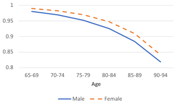
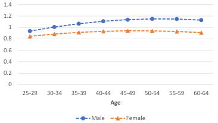
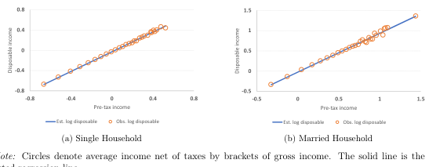
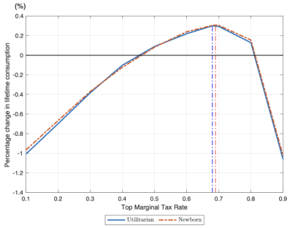
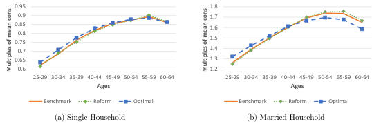
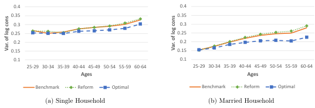
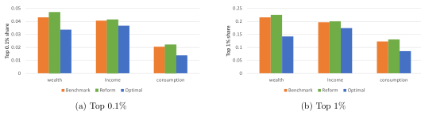
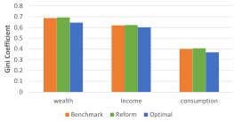

# The Welfare Implications of Top Marginal Tax Reform in Taiwan $^∗$

Xiao Yan Jiang † , David Leung ‡ , Ming-Jen Lin §

## Abstract

This paper examines the effects of top marginal tax reform on household behavior and economic outcomes in Taiwan. We empirically estimate the structure of Taiwan's progressive income tax system using data from the Household Income and Expenditure Surveys. Subsequently, we conduct a quantitative analysis of the 2017 tax reform, which reduced the top marginal tax rate from 45 % to 40 % , to evaluate its economic impacts. By employing a life cycle model with heterogeneous households, our results indicate that while the reform stimulated economic activity, it also increased the top 1 % of income and wealth shares by 1.8 % and 4.4 % , respectively. We find that an optimal top marginal tax rate of 69 % significantly reduces inequality and enhances welfare through improved redistribution and economic security. These findings have practical implications for policymakers and economists, providing crucial insights for designing equitable and efficient income tax policies.

JEL Codes: D31, E62, H21, H24

Keywords: Wealth and Income Inequality, Progressive Taxation, Heterogeneous Households

We gratefully acknowledge the valuable comments and suggestions provided by the two anonymous reviewers, which greatly contributed to the revision and improvement of this paper.

1 Department of Mathematics and Statistics, Memorial University of Newfoundland, xiaoyanj@mun.ca

† Corresponding author. Department of Economics, National Taiwan University. davidleung@ntu.edu.tw

$^{\S}$ Department of Economics, National Taiwan University. mjin@ntu.edu.tw

---

## 1 Introduction

Income inequality in Taiwan has been increasing for the past 17 years. The share of pre-tax income for the top 1 % increased from 17 % in 2001 to 19 % in 2017 ( Lee et al. , 2022 ) . This trend coincided with a reduction in the top marginal tax rate from 45 % to 40 % in 2017. These developments raise important questions about the impacts of Taiwan's 2017 top marginal tax rate reduction on the economy and household behavior, as well as the optimal top marginal tax rate to maximize welfare. This paper assesses whether the reform, lowering the top marginal tax rates for high-income earners, improves welfare within a dynamic general equilibrium macroeconomic model. Our model considers households facing uninsurable idiosyncratic labor productivity shocks and making labor supply and intertemporal savings decisions.

To ensure that our model accurately captures the highly concentrated income distribution, especially at the top 1 % , we calibrate our model using a labor productivity process featuring "superstar" states, as outlined in Castaneda et al. ( 2003 ) . This calibration method allows households with a low probability to potentially earn exceptionally high wages, reflecting realworld opportunities in entrepreneurship, entertainment, or sports. Through this approach, our model closely matches the data for the top 1 % in terms of key economic characteristics. Recent studies by Chu et al. ( 2023 ) and Lee et al. ( 2022 ) have reported a growing concentration of labor earnings and income at the top of the distribution.

The study by Brüggemann and Yoo ( 2015 ) examines the steady-state effects of increasing the top marginal tax rate, looking at both aggregate and distributional consequences. The results indicate significant negative overall effects but positive distributional impacts, leading to net welfare gains. Similarly, recent research has also investigated the role of the top marginal tax rate in the context of income inequality and risk. Kindermann and Krueger ( 2022 ) argue that high marginal tax rates on top earners can serve as an effective tool for social insurance, even in the presence of idiosyncratic income risk. Their life cycle model incorporates varying labor productivity among households. It demonstrates how such tax structures can contribute to consumption smoothing over a lifetime, particularly for households experiencing income shocks during their working years. This finding implies that an optimal tax policy should consider not only revenue generation but also its redistributive and insurance effects.

This paper aims to enrich the existing literature by exploring the distinct effects of income

1

---

tax systems on single and married households in Taiwan. Our study uses data from the 2014 to 2021 Household Income and Expenditure Surveys to accurately model tax functions that capture the characteristics of Taiwan's progressive income tax framework. These estimated tax functions serve as practical instruments for researchers delving into Taiwan's macroeconomics and public finance, strengthening the applicability of their research.

In addition, we examine a specific tax reform implemented in Taiwan in 2017, reducing the top marginal tax rate from 45 % to 40 % . We analyze the reform's impact on economic decisions using a life cycle model with varying household types. Our model considers both intensive and extensive labor supply margins, providing a more comprehensive understanding of how households responded to the tax change. Our findings suggest that the reduction of the top marginal tax rate from 45 % to 40 % slightly increases economic output and capital, encouraging higher-income earners to invest or save more. However, this reform also exacerbated income and wealth inequality, as indicated by the rise in the top 1 % income and wealth shares. By quantifying the effects on labor supply, savings, and consumption decisions, our study provides valuable information on the economic implications of such a tax reform.

Extending on this analysis, we find that a top marginal tax rate of 69 % maximizes welfare within the framework of our model. Comparing our results to the 79 % optimal marginal tax rate for the top 1 % of U.S. earners as found by Kindermann and Krueger ( 2022 ) , we have validated our results in line with the existing literature. This rate effectively reduces inequality, improves redistribution and insurance effects, and decreases income and wealth concentration at the top. In addition, it reduces the Gini coefficient of income, wealth, and consumption. It improves welfare for low- and middle-income groups by lowering their tax burden and increasing disposable income through decreased pension contributions.

In summary, this paper aims to bridge the gap between theoretical and empirical studies on tax policy by addressing two key research questions. First, how does Taiwan's income tax system affect married and single households differently? Second, what are the economic and behavioral effects of Taiwan's 2017 top marginal tax rate reform, and what is the optimal top marginal tax rate for maximizing social welfare? To answer these questions, we begin by empirically estimating the tax functions that represent Taiwan's progressive income tax system. Subsequently, we assess the behavioral effects of the recent tax reform on married and single households, employing a life cycle model with both intensive and extensive labor supply margins. Finally, we compute the

2

---

optimal top marginal tax rate within our framework. Our findings contribute to the literature on optimal taxation and inform policy discussions surrounding tax reform in Taiwan and beyond.

## 2 The Model Economy

For the analysis, we use an overlapping generations life cycle model within a general equilibrium framework. This model allows us to simulate individuals' economic behaviors and interactions at different stages of their lives, capturing the dynamics of labor supply, savings, and consumption decisions over time. By incorporating single and married households into this framework, we can assess the differential impacts of tax policies on diverse demographic groups and determine the top marginal tax rate that maximizes social welfare.

Our model builds on the dynamic general equilibrium framework established in prior studies like Kindermann and Krueger ( 2022 ) and Castaneda et al. ( 2003 ) . However, we extend this foundation with novel features tailored to Taiwan's tax system. Unlike the simplified tax functions used in prior research, we employ a parametric approximation calibrated to Taiwan's progressive income tax system using household-level data from the Household Income and Expenditure Surveys (2014-2021). This approach allows us to capture redistributive effects across income brackets more realistically.

Furthermore, we distinguish between single and married households to account for differences in income levels, labor supply behavior, and risk-sharing mechanisms. Married households, typically dual earners with higher incomes, face greater exposure to top marginal tax rates while benefiting from intra-household risk-sharing. These distinctions enable a meaningful analysis of tax progressivity's effects across household types, offering insights relevant to Taiwan's policy context.

### 2.1 Environment

The model features an economy with $J$ overlapping generations of households, where age is indexed by $j \in J$ . The population consists of three household types: married couples, single males, and single females. The total populations of men and women are normalized to 1. At the beginning of the economy, a fixed proportion $\varphi$ of men and women are married, while the remaining $1-\varphi$ are single, and marital status is assumed to remain unchanged throughout their

3

---

lifetimes. All households begin their working lives at age 25, retire at age $J_r = 65$ , and receive social security benefits until the maximum age of $J = 99$ . During the working phase, survival is guaranteed, but retired households face age- and gender-specific survival probabilities, $s_{g,j}$ . For single individuals and married couples who both pass away at the same age, they leave accidental bequests. These bequests are collected by the government at the end of the period and are uniformly distributed to all working-age individuals with the amount $b$ .

Households derive income from both labor and capital. A worker's labor endowment is represented by $z \varepsilon_{g,j}$ , where $z$ is a stochastic productivity component governed by a first-order Markov process, $F_z(z'|z)$ , and $\varepsilon_{g,j}$ is a deterministic factor reflecting gender- and age-specific human capital accumulation, such as gains from work experience. Labor income is calculated as $w z \varepsilon_{g,j} n$ , where $w$ represents the wage per skill unit, and $n \in [0,1]$ denotes hours worked. Capital income, on the other hand, is derived as $r k$ , where $k$ represents the household's asset holdings, and $r$ is the rate of return on those assets.

Retired households no longer earn labor income but receive pension benefits, $SS(\tilde{e})$ , which are based on their average lifetime earnings, $\tilde{e}$ , in addition to capital income. The total household income is denoted by $y$ and is subject to taxation. The tax structure includes both income taxes and transfers, with after-tax disposable income represented by $y^d$ . Additionally, consumption is taxed at a sales tax rate $\tau_c$ . Participation in the social insurance system is mandatory, with each individual required to pay premiums $\pi$ . These premiums are calculated as a percentage (premium rate $t$ ) of earnings for the working-age group. Moreover, the government provides social in-kind transfers of $Tr$ to all households. Revenue generated from taxes and premiums is allocated by the government to finance public expenditures, $G$ , pension payments, and other transfers.

Production in the economy is carried out by a representative firm that utilizes aggregate capital, $K$ , and total effective labor, $N$ . The firm's output is governed by a Cobb-Douglas production function, $Y = \Psi K^{\alpha} Y^{1-\alpha}$ . Operating in a competitive market, the firm hires labor and capital to maximize profits,

---

### 2.2 The single household consumption-savings problem

A worker's labor endowment, which is gender-specific, is represented by $xz_{g,j}$ . Here, $z$ is a stochastic component that signifies productivity levels, while $\varepsilon_{g,j}$ is a deterministic component that accounts for age-dependent skill variations for males and females, such as work experience. With this endowment, a worker generates a labor income of $wzz_{g,j}n$ , where $w$ is the market wage per skill unit and $n \in [0,1]$ represents hours worked. The income from savings is denoted by $rk$ . All incomes are subject to a progressive tax system specific to the household type, and it is assumed that married households are taxed on joint income. $^1$ The disposable income for single and married households, after all taxes and transfers, is denoted by $y_S^d$ and $y_M^t$ , respectively.

Agents value consumption and leisure. The agent's problem is choosing labor supply, consumption, and savings to maximize the expected present value of their lifetime utility. At the start of each period $j$ , agents are informed of their labor productivity $z$ for that period before they make their decisions. The future utility is discounted with a constant factor $\beta \in (0,1)$ . Formally, this can be represented by the Bellman equation for a single worker's problem, which is as follows:

$$V ^ { S } ( j , k , z , \overline { e } , g ) = \operatorname* { m a x } _ { c , \underline { { z } } , \underline { { u } } } \left[ u ( c , n ) + \beta \mathbb { E } \left[ V ^ { S } ( j + 1 , k ^ { \prime } , z ^ { \prime } , \underline { { e } } ^ { \prime } , g ) | \underline { { s } } \right] \right] .$$

$$ subject to $$

$$(1+\tau_{c})c+k^{\prime}+\pi(wz\varepsilon_{g,j}n)=k+y_{S}^{\prime}(wz\varepsilon_{g,j}n+rk)+Tr+b$$

The expectation is taken over the future values of labor productivity $z^t$ given the processes $F_z$ . The social security benefits $SS(\tilde{e})$ are linked to their realized average annual earnings $\tilde{e}$ , which is a state variable in the value function. The average historical earnings $\tilde{e}$ for a single household evolve according to

$$\vec { e } ^ { \prime } = [ ( j - 1 ) \vec { e } + e ] / j$$

The term $e$ represents the current-period labor income, which is used to update the average historical earnings $\bar{e}$ where $\tilde{e}'$ denotes the updated average earnings for the next period, $j$ is

$^{1}$Despite the option for married households to be taxed on separate income, data from the Statistics of Comprehensive Income Tax indicates that only 12 % of married couples choose this option, leading to the assumption that all married households are taxed on joint filing.

5

---

the number of periods over which historical earnings are averaged, and $c$ is the current period's labor income. This formulation ensures that $\bar{e}$ reflects a weighted average of past and current earnings.

Since retirees do not engage in work, the Bellman equation for a single retiree's problem is represented as follows:

$$R ^ { S } ( j , k , \vec { e } , g ) = \underset { c , k ^ { \prime } } {  v  } | u ( c , 0 ) + \beta _ { S , j } R ^ { S } ( j + 1 , k ^ { \prime } , \vec { e } , g ) |$$

subject to

$$(1+\tau_{c})c+k^{\prime}=k+y_{S}^{d}(SS(\overline{\epsilon})+rk)+Tr$$

### 2.3 The married household consumption-savings problem

Following the approach of Nishiyama ( 2010 ); Kaygusuz ( 2015 ); Fehr et al. ( 2017 ) , married households make collective decisions to maximize a joint utility function that both spouses are equally weighted. This utility function of married couples, $U$ , depends on joint consumption, $c$ , hours worked by both the husband, $n_m \in [0,1]$ and the wife $n_f \in [0,1]$ . The functional form of this utility function is defined as follows: $^2$

$$U\left(c, n_{m}, n_{f}\right)=u\left(c / \eta, n_{m}\right)+u\left(c / \eta, n_{f}\right)$$

where $\eta$ is the equivalence scale in consumption. The Bellman equation for a working-age married household problem is:

$$V ^ { M } ( j , k , z _ { m } , z _ { f } , \overline { c } ) = \operatorname* { m a x } _ { c ^ { \prime } : k ^ { \prime } , n _ { f } } \{ U ( c , n _ { m } , n _ { f } ) + \beta \mathbb { E } \left[ V ^ { M } ( j + 1 , k ^ { \prime } , z _ { m } ^ { \prime } , z _ { f } ^ { \prime } , \overline { c } ) | z _ { m } , z _ { f } \right] \}$$

subject to

$$(1+\tau_{c})c+k^{\prime}+\pi(wz_{m}\varepsilon_{m_{j}}n_{m}+wz_{f}\varepsilon_{f_{j}}n_{f})=k+y_{M}^{d}(wz_{m}\varepsilon_{m_{j}}n_{m}+wz_{f}\varepsilon_{f_{j}}n_{f}+rk)+2(Tr+b)$$

For simplicity, the average historical earnings $\tilde{e}$ for married household are assumed to be pooled:

$$\tilde{e}^{\prime}=\left[(j-1) \tilde{e}+\left(e_{m}+e_{f}\right) / 2\right] / j$$

$^{2}$The detailed functional form and calibration are discussed in Section 3.

6

---

The Bellman equation for a retired married household's problem is given by

$$\begin{array} { r } { R ^ { M } ( j , k , \vec { e } ) = \underset { c , e } { \operatorname* { m a x } } ( U ( c , 0 , 0 ) + \beta s _ { m _ { j } } s _ { f _ { j } } R ^ { M } ( j + 1 , k ^ { \prime } , \vec { e } ^ { \prime } ) + \beta s _ { m _ { j } } ( 1 - s _ { f _ { j } } ) R ^ { S } ( j + 1 , k ^ { \prime } , \vec { e } ^ { \prime } , m ) } \\ { + \beta s _ { f _ { j } } ( 1 - s _ { m _ { j } } ) R ^ { S } ( j + 1 , k ^ { \prime } , \vec { e } ^ { \prime } , f ) ) } \end{array}$$

subject to

$$(1+\tau_{c})c+k^{\prime}=k+y_{M}^{d}(2SS(\overline{e})+rk)+2Tr$$

### 2.4 Stationary equilibrium

Let $\omega^M = \{j, k, z_m, z_f, \bar{\epsilon}\} \in \Omega^M$ be a generic state vector of married households and $\omega^S =$ $\{j, k, z_g, \bar{\ell}, g\} \in \Omega^S$ be a generic state vector of single households. The stationary equilibrium of the economy is given by a consumption function, $c^M(\omega^M)$ and $c^S(\omega^S)$ , a saving function, $k^{M}(\omega^M)$ and $k^{S}(\omega^S)$ , labor supply, $n_m^M(\omega^M), n_f^M(\omega^M)$ and $n^S(\omega^S)$ , a value function, $V^M(\omega^M)$ , $V^S(\omega^S)$ , $R^M(\omega^M)$ and $R^S(\omega^S)$ , a wage rate, w , an interest rate r , and a distribution of married households $\Gamma^M(\omega^M)$ and single households $\Gamma^S(\omega^S)$ over the state space, such that

1. The value functions $V^M(\omega^M), V^S(\omega^S), R^M(\omega^M), R^S(\omega^S)$ and policy functions $c^M(\omega^M), c^S(\omega^S),$ $k^M(\omega^M), k^S(\omega^S), n_m^M(\omega^M), n_l^M(\omega^M), n_S(\omega^S)$ solve the consumers' optimization problem given the factor prices and initial conditions.

2. Firms maximize profits with factor prices:

$$r=\alpha \Psi(K / N)^{\alpha-1}-\delta$$

$$w=(1-\alpha) \Psi(K / N)^{\alpha}$$

3. Factor markets clear

$$K = \int \, k ^ { M } ( \omega ^ { M } ) d t \, \tau ^ { A } ( \omega ^ { M } ) + \int \, k ^ { S } ( \omega ^ { S } ) d t \, \tau ^ { A } ( \omega ^ { S } ) ,$$

$$\begin{array} { r } { \mathcal { N } = \int \left[ z _ { m } \varepsilon _ { m } n _ { m } ^ { S } \delta \ell ^ { ( M ) } + z _ { f } \varepsilon _ { f } n _ { f } ^ { M } \delta \ell ^ { ( M ) } \right] d M ^ { ( M ) } } \\ { + \int z _ { m } \varepsilon _ { m } n _ { m } ^ { S } \delta \ell ^ { ( S ) } d S ^ { ( S ) } + \int z _ { f } \varepsilon _ { f } n _ { f } ^ { S } \delta \ell ^ { ( S ) } d D ^ { S } \delta \ell ^ { ( S ) } } \end{array}$$

$\Gamma^S(\omega^S)$ and $\Gamma^M(\omega^M)$ are consistent with the policy functions and are stationary.

---

5. The government budget balances:

$$\begin{array} { r l } { G + 2 \int _ { j \geq J _ { r } } S S ( \overline { { e } } ) d \Gamma ^ { M } ( \omega ^ { M } ) + \int _ { j \geq J _ { r } } S S ( \overline { { e } } ) d \Gamma ^ { S } ( \omega ^ { S } ) = \tau _ { e } } & { \bigg [ \int e ^ { M } ( \omega ^ { M } ) d \Gamma ^ { M } ( \omega ^ { M } ) + \int e ^ { S } ( \omega ^ { S } ) d \Gamma ^ { S } ( \omega ^ { S } ) \bigg ] } \\ & { \quad + \int \left[ y ( \omega ^ { M } ) - y _ { M } ^ { l } ( y ( \omega ^ { M } ) ) \right] d \Gamma ^ { M } ( \omega ^ { M } ) } \\ & { \quad + \int \left[ y ( \omega ^ { S } ) - y _ { S } ^ { l } ( y ( \omega ^ { S } ) ) \right] d \Gamma ^ { S } ( \omega ^ { S } ) } \\ & { \quad + \int _ { j < J _ { r } } \pi ( \omega ^ { M } ) d \Gamma ^ { M } ( \omega ^ { M } ) + \int _ { j < J _ { r } } \pi ( \omega ^ { S } ) d \Gamma ^ { S } ( \omega ^ { S } ) } \end{array}$$

The government budget ensures that revenue sources fully balance total expenditures. The left-hand side of the equation represents government expenditures spending on public goods and social security payments, while the right-hand side includes revenues from consumption taxes, income taxes on single and married households, and social insurance premiums.

### 2.5 Measuring Social Welfare

Our method for evaluating welfare is described below. First, we determine the equilibrium path resulting from a tax reform. Subsequently, we calculate a steady-state welfare measure. This measure determines the uniform percentage increase in consumption — constant over time and across various states — that a household born into the old steady state would need, prior to any knowledge of existing conditions, to be indifferent about being born into the new steady state shaped by the new policy.

The expected lifetime utility of a newborn household, denoted by $\mathcal{W}^N$ , represents the ex-ante welfare (under the veil of ignorance) of individuals entering the economy. It is evaluated at the long-run steady state and aggregates across all possible initial household types:

$$\begin{array} { r l } { \mathcal { W } ^ { N } } & { = \underbrace { \sum _ { g = m , f } \int V ^ { S } ( 1 , k , z , \overline { e } , g ) d \Gamma ^ { S } ( 1 , k , z , \overline { e } , g ) } _ {  s i ngle ~ h o u s e h o l d s  } + \underbrace { \int V ^ { M } ( 1 , k , z _ { m } , f , \overline { e } ) d \Gamma ^ { M } ( 1 , k , z _ { m } , f , \overline { e } ) } _ {  m a r i e d ~ h o u s e h o l d s  } } \end{array}$$

We also compute the steady-state utilitarian social welfare measure, $\mathcal{W}^U$ , which aggregates the lifetime utility of all households in the economy, weighted by their population share:

---

$$\begin{array} { r l } { \mathcal { W } ^ { U } = } & { \underbrace { \sum _ { g = m , f } \left[ \int V ^ { S } ( j , k , z , \tilde { e } , g ) d \Gamma ( j , k , z , \tilde { e } , g ) + \int R ^ { S } ( j , k , \tilde { e } , g ) d \Gamma ( j , k , \tilde { e } , g ) \right] } _ {  s i n g l e ~ h o u s e h o l d s  } } \\ { + } & { \underbrace { \int V ^ { M } ( j , k , z _ { m } , z _ { f } , \tilde { e } ) d \Gamma ( j , k , z _ { m } , z _ { f } , \tilde { e } ) + \int R ^ { M } ( j , k , \tilde { e } ) d \Gamma ( j , k , \tilde { e } ) } _ {  m a r r i e d ~ h o u s e h o l d s  } } \end{array}$$

The differences between the perspectives of newborns and utilitarians stem from their consideration of different time horizons. Newborns experience the long-term effects of policy changes throughout their lives, while the utilitarian perspective focuses on the immediate impact on the current population.

## 3 Calibration of the Model

In order to determine the model parameters, we begin by selecting preset parameters that are exogenous to the model. After that, we calibrate the remaining parameters so that the stationary equilibrium of the model economy matches the data. In the following, we describe our calibration strategy and highlight the key assumptions. We provide a detailed list of the parameter values and target moments in the Appendix.

Source: Ministry of Interior and authors' calculation

Figure 1: Conditional Survival Probability

9

---

The model period is five years, starting at ages 25 to 29. Retirement is mandatory at age 65 ( $J_{c}=9$ ), and people are assumed to pass away after ages 95-99 ( $J=15$ ). By considering the heterogeneous household structures, individuals are classified based on their marital status $t$ (either single, denoted by S , or married, denoted by M ) and their gender (either male or female, represented as $g \in (m,f)$ ). The survival rates for male and female retirees at the end of each year of age, denoted $s_{m,j}$ and $s_{f,j}$ , are obtained from the life table of the 2009-2011 period from the Ministry of Interior. Survival rates in the last period are assumed to be zero. The age profile of survival probabilities for males and females is shown in Figure 1 . Upon entering the economy, households are assumed to be either married or single. Marriages and divorces are not explicitly modeled. However, married couples become single once their partners pass away after age 65.

### 3.1 Preferences and production technology

Preferences are described by a discount rate, $\beta$ , the gender-specific Frisch elasticity of labor supply, $\sigma_g$ , the equivalent scale in consumption $\eta$ and the disutility of work, $\theta_g$ . $\beta$ is set to 0.912 so that the capital-to-income ratio is 2.1 given an annual depreciation rate of 9.05 % . We set $\sigma_m$ = 1.47 and $\sigma_f$ = 1.04, which implies a Frisch elasticity of 0.68 for males and 0.96 for females, respectively, reported by Blundell et al. ( 2016 ) .

We account for gender differences in the disutility of work, $\theta_g$ , and allow the fixed cost of work, $\phi_g^*$ , to vary based on both gender and marital status. The parameters governing the disutility of working are identified by the data of working hours per person by gender from the Ministry of Labor. The fixed cost of working can be interpreted as the time cost associated with childcare, housework, and other similar responsibilities. Using the OECD equivalence scale $^3$ , the equivalent scale in consumption $\eta$ for married households is set to 1.7.

Individuals have preferences over stochastic streams of consumption $c_j$ and leisure $1-n_{j,t}$ which they value according to the standard discounted expected utility function:

$$E \left[ \sum _ { j = 1 } ^ { J } \beta ^ { j - 1 } u ( c _ { j } , n _ { j } ) \right]$$

The functional form of an individual utility $u$ is assumed to be additively separable: $^4$

$^{3}$The OECD scale assigns a weight of 1.0 to the first adult, 0.7 to each additional adult.

10

---

$$u ( c , n ) = \log c - \theta _ { q } ^ { - \frac { 1 + \sigma } { 2 } } + \frac { 1 } { 1 + \sigma _ { q } } \cdot  \rho _ { p } ^ { - \frac { 1 } { 2 } } \ln \left( \frac { 1 } { 1 + \sigma _ { q } } \right) .$$

This utility function captures the trade-off between consumption and labor supply, accounting for diminishing returns to consumption and the increasing burden of work as hours rise. The disutility of labor $\theta_g$ highlights that working longer hours becomes increasingly costly in terms of effort and lost leisure, with gender-specific parameters capturing differences in labor preferences. The fixed cost of participation $\phi_g^i$ introduces a threshold effect, where individuals only choose to work if their potential earnings outweigh entry costs, such as childcare or transportation. Agents can smooth consumption over time and privately insure against labor income shocks by saving a risk-free asset $k$ , with no borrowing allowed ( $k \geq 0$ ).

The total factor productivity, $\Psi$ , of the production function is set at 1.78 to normalize the equilibrium wage rate, $w$ , to unity. The capital's share in output, $\alpha$ , is set to 0.34 as provided by Directorate General Budget, Accounting Statistics (DGBAS).

### 3.2 Labor productivity process

The stochastic component of labor productivity takes five values from $z_1$ to $z_5$ . Four of these are ordinary states and the remaining one is an extraordinary state that generates exceptionally high earnings levels. The ordinary levels $z_1$ to $z_4$ and the transition probabilities are taken from Cheng et al. ( 2020 ) .

Idiosyncratic fluctuations in labor income risk over the life cycle are captured by a 5-by-5 transition matrix $A=[A_{ij}]$ with $i,j\in\{1,2,3,4\}$ and $\sum_j A_{ij}=1-\lambda_{in}$ , as well as by $\lambda_{in}$ which represents the probability of entering an extraordinary state of productivity. It is assumed that the stochastic labor productivity process $\Pi$ is identical to all genders and is summarized by the matrix in Table 1 .

The following additional assumptions are explicit in the formulation of the matrix. The probability of reaching an extraordinary status, $\lambda_{\rm in}$ , is independent of one's current productivity state and age. Likewise, if a household loses its extraordinary status, then it is equally likely to

4 The rationale for this choice, as explained in Castaneda et al. ( 2003 ) , is that households in the model face large and temporary productivity fluctuations, leading to significant changes in earnings. Using non-separable preferences, would result in unrealistically large variations in hours worked due to these substantial productivity shocks. In contrast, additively separable preferences offer greater flexibility by allowing independent curvatures for consumption and leisure, avoiding extreme labor supply fluctuations and ensuring more realistic outcomes.

11

---

Table 1: Transition Matrix for the Labor Productivity Process

<table><tr><td></td><td>z1</td><td>z2</td><td>z3</td><td>z4</td><td>z5</td></tr><tr><td>z1</td><td>$\tilde{A}_{11}$</td><td>$\tilde{A}_{12}$</td><td>$\tilde{A}_{13}$</td><td>$\tilde{A}_{14}$</td><td>$\lambda_{lm}$</td></tr><tr><td>z2</td><td>$\tilde{A}_{21}$</td><td>$\tilde{A}_{22}$</td><td>$\tilde{A}_{23}$</td><td>$\tilde{A}_{24}$</td><td>$\lambda_{lm}$</td></tr><tr><td>z3</td><td>$\tilde{A}_{31}$</td><td>$\tilde{A}_{32}$</td><td>$\tilde{A}_{33}$</td><td>$\tilde{A}_{34}$</td><td>$\lambda_{lm}$</td></tr><tr><td>z4</td><td>$\tilde{A}_{41}$</td><td>$\tilde{A}_{42}$</td><td>$\tilde{A}_{43}$</td><td>$\tilde{A}_{44}$</td><td>$\lambda_{lm}$</td></tr><tr><td>z5</td><td>$\lambda_{out}$</td><td>$\lambda_{out}$</td><td>$\lambda_{out}$</td><td>$\lambda_{out}$</td><td>$\lambda_{stay}$</td></tr></table>

transition to any ordinary productivity state with probability $\lambda_{out}$ . $^5$

Our working assumption is that the values of the ordinary states and the transitions among them can be inferred from the Panel Study of Family Dynamics (PSFD) data, whereas the transitions to, from, and among extraordinary states cannot. The extraordinary productivity levels $z_5$ and the transition probabilities $\lambda_{in}, \lambda_{stay}$ are pinned down by targeting moments on the marginal distribution of income, specifically, the top 1 and 10 percent shares, as well as the Gini coefficient for income as reported by Chu et al. ( 2023 ) . The calibrated transition matrix is summarized in the Appendix in Table 10 .

The stochastic process for labor productivity is combined with a deterministic age profile of wages for male and female workers separately. We calibrate this profile using data from the Ministry of Labor and the result is illustrated in Figure 2 .

Source: Ministry of Labor and authors' calculation

Figure 2: Age-Specific Labor Efficiency Profile.

$^{5}$The effect of these assumptions on our quantitative analysis is negligible, as mentioned in Kaymak and Pochie ( 2016 ) and Kaymak et al. ( 2022 ) .

12

---

### 3.3 Tax and transfer system

The tax system consists of personal income taxes levied on capital and labor earnings and a sales tax. The tax receipts are used to support exogenous government expenditures, transfers to households, and pensions. Consumption is taxed at a flat rate, denoted $\tau_e$ , which is set to 5 % of consumption. Personal income taxes are applied to earnings, capital income, and pension income, if any. Taxable personal income is given by:

$$y_{f}=z w \epsilon_{j} h+r k \quad \forall j<J_{r}$$

$$y_{f}=S S(\overline{e})+r k \quad \forall j \geq J_{r}$$

The functional form used for the progressivity tax system in this paper is proposed by Benabou ( 2002 ) . As demonstrated by Guner et al. ( 2014 ) , Heathcote et al. ( 2017 ) , and Bakus et al. ( 2015 ) , this functional form provides a good approximation of the actual tax and transfer system in the United States.

Total disposable income is obtained after applying personal income taxes and adding lumpsum transfers from the government:

$$y^{d}=\lambda_{i}\min\{y_{b},y_{f}\}^{1-\tau_{i}}+(1-\tau_{max})\max\{0,y_{f}-y_{b}\}+Tr-\pi(y_{f})\quad  for \ i\in\{S,M\}$$

The first two terms above represent our formulation of the current Taiwan's income tax system, which can be approximated by a log-linear form for income levels outside the top of the income distribution, is augmented by a flat rate for the top income tax bracket. Different tax systems are applied to married and single households, with parameters $\lambda$ and $\tau$ specific to each household type. The power parameter $0 \leq  \tau \leq  1$ controls the degree of progressivity of the tax system, while $\lambda$ determines the level of tax rates. The application of this functional form offers the advantage of having a single parameter, $\tau$ , to measure the degree of tax progressivity, which is not influenced by the level of tax rates, $\lambda$ .

The second term in the maximum operator imposes a cap on the marginal tax rate, $\tau_{max}$ set to 45%, as reported by the Ministry of Finance. $y_b$ denotes the critical level of taxable income at which the top marginal tax rate is reached: $\lambda(1-\tau)y_b^{-\gamma}=1-\tau_{max}$ . $^6$ We empirically estimate

$^{6}$For 2017, this threshold is set at NT\$10,310,001, as the Ministry of Finance reported. Given that the average

13

---

the progressivity of the income tax system for single and married households $\tau_S$ and $\tau_M$ .

Tax revenue finances exogenous expenditures, pension payments, and transfers. The government consumption $G$ is set at 4.4 % of GDP to yield a sum of expenditure and transfers of 17 % of GDP, as observed in the data from DGBAS. In addition, the government makes social in-kind transfers to all households. In the data, these transfers represent 9.2 % of GDP in the form of health insurance benefits and other social services. We set $Tr$ accordingly.

In addition, every individual is required to pay insurance premiums $\pi(y_t)$ to contribute to the social insurance system, which offers public pension, health insurance, and transfer benefits to all citizens. The payment amount varies according to the levels of income, allowing the government to set the insurance premium tax rate of $t$ to balance the government budget.

### 3.4 How progressive is the Taiwan tax system?

To construct income tax functions for married and single individuals, we estimate the effective taxes paid as a function of reported income and marital status.

The progressivity of the current tax system is estimated using household-level data from the Household Income and Expenditure Survey (HIES) conducted by the Survey Research Data Archive (SRDA) of the Academia Sinica for the years 2014-2021. Approximately 16,000 households were surveyed each year as part of the interview sample. The initial sample used in this study comprised a total of 131,641 records from the sample periods.

According to "Explanation of Classification Codes for Household Organization Type and Marital Status," household types were classified into seven groups: single-person households, two-person married households, single-parent households, core households, two-generation households (grandparents and grandchildren), three-generation households (grandparents, parents, and children living together), and other unclassified households. For simplicity, we mainly focus on analyzing two primary types: single-person households, which included single individuals with the economic head being male or female, excluding single-parent households and married households, which included two-person married households and core households, with the economic head being of the parental generation. After excluding households with

income for the same year is NT$788,031 ( Lee et al. , 2022 ) , we express this threshold in the context of our model as multiples of average income. Thus, the top marginal tax rate is applied to incomes at least 13 times the average income, reflecting the steep progression in the tax system.

14

---

missing tax data, the sample consisted of around 17 thousand single-person households and 60 thousand married households. In addition to household status, we also analyzed the economic head category, gender, income, and tax payments of the samples. We removed households with tax amounts less than or equal to zero. Our measure of pre-tax income is gross earnings, as reported by the household, plus the payroll tax.

Our paper employs the procedure proposed by Heathcote et al. ( 2017 ) to estimate tax progressivity. We assume that the relationship between pre-tax income $y$ , and post-tax income $y^a$ , for each individual $i$ is given by the following tax function:

$$y_{i}^{d}=\lambda y_{i}^{1-\tau}$$

where $\lambda$ is the mean level of taxation and $\tau$ is the progressivity parameter. The progressivity parameter can be estimated using pretax and after-tax income microdata. We partition the sample into income brackets and for each of these, we calculate the total income taxes paid, the total income earned, and the number of returns. Hence, we find the mean pretax income and the disposable income (after-tax income) corresponding to every income bracket. To compute $\tau$ , we run the following regression using OLS:

$$\log y_{i}^{d}=\log \lambda+(1-\tau) \log y_{i}+\epsilon_{i}$$

Table 2 presents the estimated progressivity parameters for single and married households in Taiwan, alongside the $R^2$ values, which indicate the goodness of fit for these estimates. For single households, the estimated progressivity parameter is 0.027, with a standard error of 0.0071, suggesting a modest increase in tax rates with rising income levels. For married households, the progressivity parameter is slightly higher at 0.041, with a standard error of 0.0180, indicating a more progressive tax system that places a relatively higher tax burden on higher-income earners within this group. The $R^2$ values for both single and married households are 0.99, demonstrating an excellent fit of the estimated tax functions to the observed data. This high value $R^2$ indicates a reliable representation of the progressivity of Taiwan's tax system for these types of households.

Figure 3 visually confirms this by plotting the observed log disposable income (circles) over the regression line (solid). To support our estimated progressivities, we compare these estimates with those for the United States as reported by Guner et al. ( 2014 ) . In the U.S.,

15

---

Table 2: Tax function parameters

<table><tr><td></td><td>Progressivity ($\tau$)</td><td>$R^{2}$</td></tr><tr><td rowspan="2">Single Married</td><td>0.027 (0.0071)</td><td>0.99</td></tr><tr><td>0.041 (0.0180)</td><td>0.99</td></tr></table>

Note: Values in parentheses are standard errors of the estimated progressivity parameters.

the progressivity parameter for single households without children is 0.036, and for married households without children, it is 0.058. This comparison shows that Taiwan's estimated tax progressivity is consistent with existing literature. It suggests that Taiwan's tax progressivity is slightly lower than that of the U.S. but within a similar range. This alignment with established estimates demonstrates the reliability of our model and its applicability in understanding tax reform contexts.

Figure 3: The progressivity of the Taiwan tax system

It is important to note that household survey data may not accurately capture the top 1 % earners, which could limit the suitability of our estimates for the entire population. However, to address this issue, we only applied the estimated tax function outside the highest income bracket, to which most of the top 1 % of earners belong. The top marginal tax rate was capped for individuals in the top income bracket.

To ensure the reliability of our estimates of the tax function, we calibrated the parameter $\lambda$ to match the average tax rate observed in the data for single and married households. Furthermore, we validated our estimated tax function by comparing it to the average income tax rate for

16

---

the entire population, finding a close alignment: the data indicated a rate of 14 % , while our estimated function yielded 13.2 % . This alignment, along with our consideration of data limitations, reinforces the validity of our approach. Thus, despite the potential limitations of household survey data, our methodology effectively captures the progressivity of the tax system for the broader population, excluding the top 1 % income bracket.

### 3.5 Pension system

Individuals receive public pension benefits $SS(\hat{c})$ once they reach the full retirement age $J_{r}$ . We model the formula of pension benefits to depend on past employment and earnings history:

$$S S ( \overline { e } ) = \psi \overline { e }$$

where $\psi$ is the replacement rate of pension benefits relative to each individual's average past earnings $\tilde{e}$ . Since the model is based on households, which may contain non-working spouses or survivors, we calibrate the replacement rate $\psi$ to match the ratio of pension expenditures to GDP in the data, which is 3.6 % Lee et al. ( 2022 ) .

## 4 The Benchmark Economy

### 4.1 Model Performance

In this section, we assess the fit of the benchmark model and evaluate its reliability for quantitative experiments. We examine the model's performance across several dimensions not directly targeted by the calibration. Ensuring that the model aligns with the observed data guarantees a realistic capture of these behaviors and is vital for a comprehensive analysis and policy recommendations.

Table 3: Summary of Non-Targeted Moments

<table><tr><td>Moment</td><td>Source</td><td>Data Value</td><td>Model Fit</td></tr><tr><td>Top 1% income threshold relative to average</td><td>$\text{Lee et al. (2022)}$</td><td>7.0</td><td>7.0</td></tr><tr><td>Total Tax revenue / GDP</td><td>Ministry of Finance</td><td>13.2%</td><td>16.6%</td></tr><tr><td>Population average income tax rate</td><td>$\text{Lee et al. (2022)}$</td><td>14%</td><td>13.2%</td></tr><tr><td>Gender Wage Gap</td><td>Ministry of Labor</td><td>0.84</td><td>0.84</td></tr></table>

17

---

The performance of the model in capturing the characteristics of the benchmark economy, as summarized in Table 3 , presents an overview of its effectiveness in various economic indicators. For instance, the model accurately replicates the income threshold for the top 1 % relative to the average, predicting a value of 7.0, which perfectly matches the observed data. This alignment is especially important because the reform specifically targets income levels above NTD $ 10,310,001, which falls between the top 1 % threshold of NTD $ 5,533,975 and the top 0.1 % threshold of NTD $ 20,391,656 ( Lee et al. , 2022 ) . The model's ability to replicate these thresholds demonstrates its accuracy in evaluating tax policies for the intended income group. This strengthens its effectiveness in analyzing the distributional impacts of tax reforms on affluent households.

Our model demonstrates strong performance in capturing key aspects of the tax system, which is crucial for evaluating the distributional effects of tax reforms. Specifically, it accurately simulates the average income tax rate for the entire population, with a close match of 13.2 % compared to the observed 14 % reported by Lee et al. ( 2022 ) . Although the model slightly overestimates total tax revenue as a percentage of GDP at 16.6 % , compared to the actual 13.2 % reported by the Ministry of Finance, it still effectively represents the current tax structure. This enhances its reliability in proposing and analyzing the top marginal tax rate reforms.

Furthermore, the model's accurate representation of the gender wage gap highlights its ability to capture Taiwan's labor market disparities. This is particularly relevant for top marginal tax reforms, which can disproportionately affect higher-earning men. Considering this crucial element, the model allows for a more comprehensive examination of how tax burdens can be biased against one gender. This insight directly informs the design of tax reforms that promote economic equity and ensure policies are fair.

The model's ability to replicate the wealth distribution in Taiwan is demonstrated in Table 4 , which compares the wealth shares predicted by the model between quintiles and the top percentiles with the observed data. Notice that we do not explicitly target on any wealth distribution moments. However, our model can closely align with the data for most wealth brackets, particularly in the top wealth distribution. By accurately capturing the wealth concentration at the upper end of the distribution, the model ensures a robust framework for analyzing how tax reforms impact wealth inequality and redistribution among affluent households.

18

---

Table 4: Wealth Distribution in Benchmark Economy

<table><tr><td rowspan="2"></td><td colspan="6">Quintiles</td><td colspan="4">Top (%)</td></tr><tr><td>1st</td><td>2nd</td><td>3rd</td><td>4th</td><td>5th</td><td></td><td>90-95</td><td>95-99</td><td>99-100</td><td>Gini</td></tr><tr><td>Data</td><td>0.0</td><td>1.8</td><td>8.0</td><td>17.0</td><td>73.2</td><td></td><td>13.0</td><td>20.3</td><td>23.9</td><td>0.73</td></tr><tr><td>Model</td><td>0.0</td><td>0.5</td><td>7.7</td><td>21.5</td><td>70.4</td><td></td><td>13.4</td><td>15.5</td><td>21.6</td><td>0.69</td></tr></table>

Source: World Inequality Database

## 5 Quantitative Analysis

### 5.1 Tax Reform Evaluation

To study the impacts of top marginal tax reform using the life cycle general equilibrium framework, we compare the stationary equilibrium in the benchmark economy (initial steady state) with an alternative economy with the same set of parameters but different top marginal tax rates. We also assume that other parameters are the same as those in the benchmark, and the government's consumption $G$ is fixed at the benchmark level. The government changes the insurance premium tax rate $t$ to satisfy the government budget constraint.

The Taiwan government reduced the top marginal tax rate from 45 % to 40 % at the income threshold NT $ 10,310,001 in the year 2017. The tax reform results are summarized in the Table 5 . We compare the effects of the reforms as the changes relative to the benchmark economy because we emphasize the differences across different steady states.

The analysis of the effects of Taiwan's reduction in the top marginal tax rate from 45 % to 40 % reveals several critical dynamics across the economic spectrum. The slight increase in overall output (0.35 % ) and capital stock (0.52 % ) suggests that the tax cut has stimulated economic activity. Typically, lower tax liabilities encourage higher income earners to increase their investments and engage more actively in productive activities, leading to improved economic output and capital accumulation.

At the same time, the financial markets have reacted by decreasing interest rates by 0.33 % due to the increased capital accumulation. On the other hand, the market wage rate has increased slightly by 0.1 % as a result of higher labor demand and improved productivity stemming from increased capital investment.

From a fiscal perspective, the reduction in the top marginal tax rate necessitated adjustments

19

---

Table 5: Effects of Top Marginal Tax Reform

<table><tr><td></td><td>Reform</td></tr><tr><td>Output</td><td>0.35%</td></tr><tr><td>Capital</td><td>0.52%</td></tr><tr><td>Interest</td><td>-0.33%</td></tr><tr><td>Wage</td><td>0.10%</td></tr><tr><td>Income Gini</td><td>0.49%</td></tr><tr><td>Top 1% income share</td><td>1.81%</td></tr><tr><td>Top 1% wealth share</td><td>4.42%</td></tr><tr><td>Top 1% relative income threshold</td><td>0.29%</td></tr><tr><td>Total tax revenue/GDP</td><td>-0.41%</td></tr><tr><td>Average tax rate</td><td>-4.01%</td></tr><tr><td>Mean hours worked</td><td></td></tr><tr><td>Single male</td><td>0.12%</td></tr><tr><td>Single female</td><td>-0.25%</td></tr><tr><td>Married male</td><td>-0.03%</td></tr><tr><td>Married female</td><td>-0.16%</td></tr><tr><td>Labor Participation</td><td></td></tr><tr><td>Single female</td><td>-0.31%</td></tr><tr><td>Married female</td><td>-0.25%</td></tr><tr><td>Single male</td><td>0.22%</td></tr><tr><td>Married male</td><td>-0.02%</td></tr><tr><td>Lifetime consumption change</td><td></td></tr><tr><td>Newborn</td><td>-0.12%</td></tr><tr><td>Utilitarian</td><td>-0.10%</td></tr></table>

in other areas to balance the government's budget. Notably, the insurance premium tax rate increased significantly by 33.2 % . Despite these efforts, total tax revenue as a percentage of GDP decreased by 0.41 % , reflecting the challenges of maintaining fiscal sustainability following tax cuts. Moreover, the average tax rate across the economy decreased by 4.01 % , indicating a substantial reduction in the overall tax burden.

The tax reforms also had notable implications for income and wealth distribution. The slight increase in the income Gini coefficient (0.49 % ) combined with the much larger increases in the top 1 % income (1.81 % ) and wealth shares (4.42 % ) point to the widening of economic disparities. Such increases highlight the concentration of tax reform benefits at the higher end of the income spectrum, potentially exacerbating wealth inequality. Moreover, the relative income threshold for the top 1 % increased by 0.29 % , indicating upward shifts in the income distribution among high earners.

The effects of the labor market are relatively stable, with minor changes in mean hours

20

---

worked in different demographics. The labor participation rate for married females decreases by 0.25 % , likely influenced by the secondary earner effect, where changes in marginal tax rates make additional labor supply less attractive for married women, who often serve as secondary earners. The change is negligible for married males at -0.02 % , reflecting their relatively inelastic labor supply, as they are typically primary earners in households. These variations show how tax reforms interact with gender roles and household decision making, highlighting the importance of considering demographic-specific responses when evaluating the labor market implications of tax policy changes.

Despite these shifts in the labor market, the lifetime consumption changes for newborns and all living households are slightly negative. This is attributed to the tax burden shifting from high-income earners to low-income earners after the top marginal tax rate was reduced. The substantial increase in the insurance premium tax rate, which affects all income brackets, can disproportionately harm low-income groups who spend a larger portion of their income on mandatory expenses like insurance. This redistribution of tax burden can lead to increased financial strain on these groups, potentially reducing overall welfare. While high-income individuals may benefit from lower income tax rates, leading to increased savings and investment, low-income individuals facing higher relative tax burdens reduce their consumption and savings. This decrease in consumption leads to a contraction in demand for goods and services, offsetting some of the economic gains from increased investment at the top.

### 5.2 Optimal Top Marginal Tax Rate

Having thoroughly examined the implications of the decreased top marginal tax reform, we now turn to our analysis of socially optimal rates. We begin by explaining how we measure social welfare. We compute the steady-state welfare measure that determines the uniform percentage increase in consumption (consistent over time and across states) required for a household born into the old steady state to be equally satisfied with being born into the new steady state under the new policy without knowing their productivity levels.

In Figure 4 , we have plotted two welfare measures against the top marginal tax rate $\tau_{max}$ . The graph shows the percentage change in lifetime consumption for newborn households $W^N$ and for all living households (Utilitarian) $W^U$ . We find that the measure for newborn households peaks

21

---

Figure 4: Welfare Measures as Functions of $\tau_{max}$

at a top marginal tax rate of 69 % , with a corresponding maximum percentage change in lifetime consumption of 0.30 % . On the other hand, the utilitarian measure reaches its optimal point at a top marginal tax rate of 68 % , achieving a maximum percentage change in lifetime consumption of 0.31 % . When comparing our results to the 79 % marginal tax rate for the U.S. top 1 % earners as found by Kindermann and Krueger ( 2022 ) , we find consistency with the existing literature.

Table 6 provides a comprehensive analysis of the steady-state outcomes when the top marginal tax rate is optimized to 69 % , with values reported as percentages relative to the benchmark economy. This analysis uncovers several important insights into the economic implications and underlying mechanisms of this higher tax rate.

A key channel through which the 69 % top marginal tax rate improves welfare is the redistribution of the tax burden. By imposing a higher tax on the top income group, the government can reduce the tax burden on lower- and middle-income groups by reducing the insurance premium tax rate. This can increase their disposable income, improve their ability to consume and save, and ultimately enhance their overall welfare.

The welfare gains also come from improved insurance against not reaching the very top of

22

---

Table 6: Effects of Optimal Top Marginal Tax Rate

<table><tr><td></td><td>Optimal</td></tr><tr><td>Top marginal tax rate</td><td>69%</td></tr><tr><td>Output</td><td>-2.90%</td></tr><tr><td>Capital</td><td>-4.17%</td></tr><tr><td>Interest</td><td>2.23%</td></tr><tr><td>Wage</td><td>-0.66%</td></tr><tr><td>Income Gini</td><td>-2.96%</td></tr><tr><td>Top 1% income share</td><td>-11.43%</td></tr><tr><td>Top 1% wealth share</td><td>-34.26%</td></tr><tr><td>Top 1% relative income threshold</td><td>-1.51%</td></tr><tr><td>Total tax revenue/GDP</td><td>1.57%</td></tr><tr><td>Average tax rate</td><td>13.99%</td></tr><tr><td>Mean hours worked</td><td></td></tr><tr><td>Single male</td><td>-0.76%</td></tr><tr><td>Single female</td><td>-0.86%</td></tr><tr><td>Married male</td><td>-0.12%</td></tr><tr><td>Married female</td><td>-0.14%</td></tr><tr><td>Labor Participation</td><td></td></tr><tr><td>Single female</td><td>-1.30%</td></tr><tr><td>Married female</td><td>-0.24%</td></tr><tr><td>Single male</td><td>-0.73%</td></tr><tr><td>Married male</td><td>0.0%</td></tr><tr><td>Lifetime consumption change</td><td></td></tr><tr><td>Newborn</td><td>0.30%</td></tr><tr><td>Utilitarian</td><td>0.31%</td></tr></table>

the earnings ladder. In a progressive tax system, higher taxes on top earners provide insurance for those who do not reach the highest income state. This system helps mitigate the risks and uncertainties associated with income inequality. This protection can increase their economic security and stability, contributing to welfare.

The data in the table provides quantitative support for these mechanisms. The notable decrease in income (-11.43 % ) and wealth (-34.26 % ) shares for the top 1 % , along with a significantly reduced income Gini coefficient (-2.96 % ), indicates the effectiveness of the higher tax rate in mitigating economic inequality. Furthermore, the modest increases in lifetime consumption for newborns (0.30 % ) and all living households (0.31 % ) suggest that the tax reform's redistributive impact has positively influenced consumption and living standards, particularly for lower-income groups.

To sum up, having an optimal top marginal tax rate of 69% is crucial in redistributing the tax

23

---

burden to improve welfare across different income groups. This policy promotes greater equity and economic security by imposing heavier taxes on the top income group and reducing the tax burden on lower and middle income groups through lower insurance premium contributions. The increased insurance coverage against income disparities and the redistribution across diverse households determine the welfare gains from this tax reform. These findings highlight the importance of progressive taxation in achieving a fair and inclusive economy, where the benefits of economic growth and prosperity are more evenly distributed among all members of society.

## 6 Welfare implications from the reform and optimal cases

Understanding the welfare implications of different top marginal tax rates requires a comprehensive and thorough examination of their impacts on various aspects of the economy, including efficiency, consumption insurance, and redistribution. The following analysis explores how these tax rates influence the overall economic environment and individual behaviors across different demographic groups, highlighting the trade-offs and benefits of each policy approach. By comparing scenarios with lower (reform) and higher (optimal) top marginal tax rates against a benchmark, we can assess the consequences of these policies on aggregate consumption, consumption risk, and the distribution of wealth, income, and consumption. This analysis explains why a high top marginal tax rate is favorable to Taiwan's economy.

### 6.1 Efficiency

Analyzing life cycle consumption patterns at various top marginal tax rates provides valuable insights into the efficiency implications across different age groups and the overall economy. Figure 5 presents the average consumption paths over the life cycle for singles and married households across the benchmark, reform, and optimal tax scenarios. In a reform scenario where the top marginal tax rate decreases from 45 % to 40 % , there is an increase in aggregate consumption. This suggests an immediate efficiency improvement, likely stemming from a rise in disposable income due to reduced tax burdens, particularly benefiting older individuals (singles aged 55-64 and couples aged 45-64). However, younger individuals generally experienced decreased consumption, suggesting a relative loss in efficiency due to increased contributions to the pension fund.

24

---

Figure 5: Average consumption over the life cycles

In contrast, in the optimal scenario where the top marginal tax rate increased to 69 % , there is a decrease in aggregate consumption, indicating an overall efficiency loss. However, younger age groups (singles and couples aged 25-44) experienced higher consumption levels, suggesting an efficiency gain through reduced pension fund contribution and redistributive measures. On the other hand, older households, particularly those aged 45-64, experienced decreased consumption. This decline, concentrated among high-income earners, is attributed to higher tax burdens that reduce disposable income.

The changes in the top marginal tax rate have varying effects on different age groups and overall economic efficiency. Lowering the rate initially increases consumption, especially for older individuals, but it also raises pension contributions for younger ones. On the other hand, a higher rate reduces overall consumption but benefits younger groups through redistribution. This shows the trade-off between equity and efficiency in tax policy.

### 6.2 Consumption Insurance

Examining consumption variance across different life stages under various top marginal tax rates provides insights into the impact of consumption insurance and economic risks. We use the variance of log consumption to be a key measure of consumption insurance, as it reflects the stability of consumption levels across individuals; a lower variance indicates better consumption smoothing, where individuals maintain consistent living standards despite income fluctuations. Figure 6 illustrates the variance of log consumption over the life cycle for single and married households under different tax regimes. The left panel shows single households, while the right

25

---

panel displays married households. The plots reveal how changes in the top marginal tax rate affect consumption volatility across age groups.

In the reform scenario where the top tax rate decreased from 45 % to 40 % , the variance of log consumption increased for single individuals and couples, especially among older singles (aged 5564) and older couples (aged 60-64). However, married households generally have lower variance due to enhanced risk-sharing capabilities. The reduced support due to the lower top marginal tax rate increases the income risk exposure for the top earners, leading to less consumption smoothing.

Figure 6: Variance of log consumption over the life cycles

When the top marginal tax rate is increased to 69 % in the optimal scenario, we see a reduction in the variation of log consumption among most age groups, indicating an improved consumption insurance. Married households experience a more significant decrease, demonstrating their increased ability to share risks. The higher tax rate allows for broader funding of public insurance and redistributive programs, providing better economic stability and defense against income fluctuations. This is particularly beneficial for older individuals, who are more susceptible to income instability as they approach retirement. The decrease in consumption variance suggests that higher taxes can strengthen economic security by enabling the government to offer improved public insurance. Married households benefit from a more significant reduction in consumption variability due to their advantage in sharing risks.

The analysis indicates a strong connection between the top marginal tax rates and consumption insurance. Lower tax rates amplify consumption risk, especially for older individuals, due to fewer government safety nets. In contrast, higher tax rates improve

26

---

consumption smoothing by better public insurance programs. This key finding suggests a significant trade-off between individual risk-taking and the government's role in providing economic security. Married couples with built-in risk sharing abilities benefit more from the higher tax rates.

### 6.3  Redistribution

Figure 7 shows the changes in wealth, income, and consumption shares among the top 1 % and top 0.1 % under different tax scenarios, which reveals the substantial redistributive effects of varying top marginal tax rates. Under the benchmark scenario, with a top marginal tax rate of 0.45, the top 1 % held 21.6 % of wealth, 19.2 % of income, and 12.3 % of consumption. For the top 0.1 % , these shares were 4.3 % , 4.1 % , and 2.0 % , respectively. These figures indicate a substantial concentration of economic resources among the wealthiest individuals.

Figure 7: Top shares of Wealth, Income and Consumption

In the reform scenario, reducing the top marginal tax rate to 0.4 has a pronounced impact on the wealth, income, and consumption distribution, particularly favoring the highest income brackets. For the top 1 % earners, the reform leads to a substantial increase in wealth share, rising from its baseline level to 22.6 % , a relative growth of 4.4 % . This trend is accompanied by more modest but still significant increases in income and consumption shares, growing by 1.8 % and 5.8 % , respectively, to reach 20.1 % and 13 % . An even more concentrated impact is observed among the top 0.1 % . Their wealth share increases to 4.7 % (a 9.1 % increase), income share to 4.1 % (a 2.0 % increase), and consumption share to 2.2 % (an 7.8 % increase). These findings collectively indicate a pronounced shift in resource allocation towards the wealthiest segments of society. The tax cut disproportionately benefits these high-income groups, enabling

---

them to accumulate wealth faster, boost their earnings, and increase their spending relative to the broader population. This pattern suggests weakening the tax system's redistributive role, potentially exacerbating existing economic inequality.

The optimal scenario, with a top marginal tax rate of 69 % , demonstrates a pronounced shift in wealth, income, and consumption distribution away from the highest income brackets. The wealth share of the top 1 % decreases to 14.2 % , marking a 34.3 % reduction. Their income share falls to 17.5 % , reflecting a 11.4 % reduction, and their consumption share drops to 8.6 % , showing a 30.4 % reduction. An equally significant impact is observed among the top 0.1 % . Their wealth share decreases dramatically by 21.9 % to 3.4 % , while their income and consumption shares also fall, dropping by 9.5 % to 3.7 % and 32.2 % to 1.4 % , respectively.

Figure 8: Gini Coefficients of Wealth, Income and Consumption

Figure 8 shows the changes in the Gini coefficients, a key measure of economic inequality, across the different scenarios, demonstrating the redistributive impact of varying the top marginal tax rates. With a lower tax rate, the reform scenario increases inequality across all measured dimensions, suggesting that the tax cuts primarily benefit the wealthy. In contrast, with a higher tax rate, the optimal scenario significantly reduces inequality, indicating that progressive taxation can be an effective tool for achieving a more equitable distribution of economic resources. The decreased Gini coefficients in the optimal case highlight the role of higher taxes in promoting social equity.

The contrast between the reform and optimal scenarios emphasizes the critical role of progressive taxation in addressing economic inequality. Although lower top marginal tax rates amplify wealth concentration among the highest earners, higher rates effectively redistribute income and wealth, fostering a more equitable society. The optimal scenario demonstrates that governments can significantly mitigate economic disparities and enhance social welfare by shifting

28

---

resources from the wealthiest to the broader population.

## 7 Conclusion

This paper examines the effects of the top marginal tax reforms in Taiwan, focusing on reducing the top marginal tax rate from 45 % to 40 % in 2017. It aims to determine the optimal top marginal tax rate within a dynamic general compensation framework. We empirically estimate tax functions that capture Taiwan's progressive income tax structure by utilizing microdata from the Household Income and Expenditure Surveys spanning from 2014 to 2021. Furthermore, we intend to analyze the behavioral responses of different household types to these tax changes.

Our findings highlight several important dynamics. The reduction of the top marginal tax rate from 45 % to 40 % resulted in slight increases in economic output and capital, suggesting that lower tax liabilities for high-income earners encourage investment and productive activities. However, the reform also led to an increase in income and wealth inequality, as seen in the rise in the top 1 % income and wealth shares. This results in the concentration of benefits among high-income earners exacerbating economic disparities.

In contrast, our analysis of the optimal top marginal tax rate, set at 69 % , demonstrates significant welfare gains through improved redistribution and insurance effects. The higher tax rate effectively reduces income and wealth concentration at the top, leading to substantial decreases in the top 1 % income share and wealth share and a reduction in the income Gini coefficient. These redistributive effects enhance the welfare of low and middle-income groups by lessening their relative tax burden and increasing their disposable income by reducing their insurance contributions. The benefits of having a high top marginal tax rate include providing economic security to those who do not achieve high income levels. This ensures that the advantages of economic growth are more equitably distributed across society, leading to an overall increase in welfare.

In conclusion, reducing the top marginal tax rate encourages economic activity and investment among the wealthy, but it also widens economic inequality. Conversely, raising the top marginal tax rate promotes significant welfare gains through redistribution and enhanced economic security, supporting a more equitable and inclusive economy.

---

## Appendix

### Calibration Results

Table 7: Calibration of the Model: Preset Parameters

<table><tr><td>Parameter</td><td>Description</td><td>Value</td><td>Source</td></tr><tr><td colspan="4">Demographics</td></tr><tr><td>J</td><td>Maximum life span</td><td>15</td><td>corresponds to age 99</td></tr><tr><td>J_{r}</td><td>Mandatory retirement age</td><td>9</td><td>corresponds to age 65</td></tr><tr><td>$\{s_{m}, s_{r}\}_{J_{r}}$</td><td>Survival probability</td><td></td><td>Ministry of Interior</td></tr><tr><td>$\kappa$</td><td>Share of married households</td><td>51.1%</td><td>Ministry of Interior</td></tr><tr><td colspan="4">Preferences</td></tr><tr><td>$\sigma_{m}, \sigma_{f}$</td><td>Inverse Frisch elasticity</td><td>1.47, 1.04</td><td>Blundell et al. (2016)</td></tr><tr><td>$\eta$</td><td>Equivalent scale</td><td>1.7</td><td>Heathcote et al. (2010)</td></tr><tr><td colspan="4">Technology</td></tr><tr><td>$\alpha$</td><td>Capital share</td><td>0.34</td><td>DGBAS</td></tr><tr><td>$\delta$</td><td>Depreciation rate of capital</td><td>0.0905</td><td>Liao (2011)</td></tr><tr><td colspan="4">Labor Productivity</td></tr><tr><td>$\{s_{j}^{m}, s_{j}^{r}\}_{j=1}^{J-1}$</td><td>Gender age-efficiency profile</td><td></td><td>Ministry of Labor</td></tr><tr><td colspan="4">Taxes and transfers</td></tr><tr><td>$\tau_{c}$</td><td>Consumption tax rate</td><td>5.0%</td><td>Cheng et al. (2020)</td></tr><tr><td>$\tau_{S}, \tau_{M}$</td><td>Tax progressivity for single and married households</td><td>0.027, 0.041</td><td>Own estimation with SRDA</td></tr><tr><td>y_{h}</td><td>Taxable Income Threshold for top marginal tax rate</td><td>13.0</td><td>Lee et al. (2022)</td></tr></table>

Table 8: Calibration of the Model: Jointly Calibrated Parameters

<table><tr><td>Parameter</td><td>Description</td><td>Value</td></tr><tr><td>$\beta$</td><td>Annual discount rate</td><td>0.912</td></tr><tr><td>$\lambda_{S}, \lambda_{M}$</td><td>Level of taxes for single and married households</td><td>0.94, 0.945</td></tr><tr><td>$\phi_{m}^{S}, \phi_{m}^{M}$</td><td>Labor participation cost for single and married men</td><td>0.47, 0.32</td></tr><tr><td>$\phi_{r}^{S}, \phi_{r}^{M}$</td><td>Labor participation cost for single and married women</td><td>0.52, 0.50</td></tr><tr><td>$\theta_{m}, \theta_{j}$</td><td>Labor disutility</td><td>6.3, 3.3</td></tr><tr><td>$\psi$</td><td>Replacement rate</td><td>0.095</td></tr><tr><td>$\psi$</td><td>Total factor productivity</td><td>1.78</td></tr><tr><td>G/Y</td><td>Expenditures/GDP</td><td>4.4%</td></tr><tr><td>Tr</td><td>Health insurance and social service in-kind transfers</td><td>0.32</td></tr></table>

30

---

Table 9: Summary of Targeted Moments

<table><tr><td>Parameter</td><td>Target Moment</td><td>Source</td><td>Data Value</td><td>Model Fit</td></tr><tr><td>$\phi_{S}^{S}$</td><td>Single Male Labor Participation</td><td>Ministry of Labor</td><td>70.8%</td><td>71.8%</td></tr><tr><td>$\phi_{M}^{M}$</td><td>Married Male Labor Participation</td><td>Ministry of Labor</td><td>66.8%</td><td>66.2%</td></tr><tr><td>$\phi_{F}^{F}$</td><td>Single Female Labor Participation</td><td>Ministry of Labor</td><td>64.7%</td><td>64.1%</td></tr><tr><td>$\phi_{f}^{M}$</td><td>Married Female Labor Participation</td><td>Ministry of Labor</td><td>49.3%</td><td>49.6%</td></tr><tr><td>$\theta_{m}$</td><td>Male Hours</td><td>Ministry of Labor</td><td>36.4%</td><td>35.6%</td></tr><tr><td>$\theta_{f}$</td><td>Female Hours</td><td>Ministry of Labor</td><td>35.3%</td><td>34.9%</td></tr><tr><td>$\beta$</td><td>K/Y</td><td>DGBAS</td><td>2.1</td><td>2.1</td></tr><tr><td>$\psi$</td><td>Pension Exp / GDP</td><td>Lee et al. (2022)</td><td>3.6%</td><td>3.4%</td></tr><tr><td>Tr</td><td>(Health Insur. Trans.+Social Trans)/GDP</td><td>Lee et al. (2022)</td><td>9.2%</td><td>9.2%</td></tr><tr><td>Jointly</td><td>Gini coefficient of Income</td><td>Chu et al. (2023)</td><td>0.60</td><td>0.62</td></tr><tr><td>calibrate</td><td>Top 1% of income share</td><td>Chu et al. (2023)</td><td>19.2%</td><td>19.7%</td></tr><tr><td>z_{5}, \lambda_{in}, \lambda_{out}</td><td>Top 10% of income share</td><td>Chu et al. (2023)</td><td>47.8%</td><td>46.8%</td></tr><tr><td>\lambda_{S}</td><td>Single household average tax rate</td><td>Ministry of Finance</td><td>10.1%</td><td>10.5%</td></tr><tr><td>\lambda_{M}</td><td>Married household average tax rate</td><td>Ministry of Finance</td><td>14.1%</td><td>14.5%</td></tr></table>

Table 10: Productivity Transitions in the Benchmark Economy

<table><tr><td></td><td>z_{1}</td><td>z_{2}</td><td>z_{3}</td><td>z_{4}</td><td>z_{5}</td></tr><tr><td>z_{1}=1</td><td>0.383</td><td>0.254</td><td>0.215</td><td>0.146</td><td>0.002</td></tr><tr><td>z_{2}=2</td><td>0.353</td><td>0.250</td><td>0.231</td><td>0.164</td><td>0.002</td></tr><tr><td>z_{3}=2.85</td><td>0.357</td><td>0.240</td><td>0.228</td><td>0.172</td><td>0.002</td></tr><tr><td>z_{4}=5.91</td><td>0.393</td><td>0.244</td><td>0.209</td><td>0.152</td><td>0.002</td></tr><tr><td>z_{5}=70.59</td><td>0.038</td><td>0.038</td><td>0.038</td><td>0.038</td><td>0.850</td></tr></table>

## References

Bakiş, Ozan, Barış Kaynak, and Markus Pockels (2015). "Transitional dynamics and the optimal progressivity of income redistribution." Review of Economic Dynamics , 18(3), pp. 679–693.

Benabou, Roland (2002). "Tax and education policy in a heterogeneous agent economy: What levels of redistribution maximize growth and efficiency?" Econometrica, 70(2), pp. 481-517.

Blundell, Richard, Luigi Pistaferri, and Itay Saporta-Elestein (2016). “Consumption inequality and family labor supply.” American Economic Review , 106(2), pp. 387–435.

Brüggemann, Bettina and Jinhyuk Yoo (2015). "Aggregate and distributional effects of increasing taxes on top income earners."

Castañeda, Ana, Javier Díaz-Giménez, and José-Víctor Rius-Rull (2003), "Accounting for the us earnings and wealth inequality," Journal of Political Economy , 111(4), pp. 818-857.

31

---

Cheng, Yu-Hsiang, Hsuan-Chih Lin, and Atsuko Tanaka (2020). “Pension reform in taiwan: a macroeconomic analysis,” Taiwan Econ Rev , 48(1), pp. 1–30.

Chu, Cyrus, Chien-Yu Chen, Ming-Jen Lin, and Hsuan-Li Su (2023). “Distributional national accounts of taiwan, 1981-2017. Taiwan Economic Review , 51(2), pp. 137–181.

Fehr, Hans, Manuel Kallweit, and Fabian Kindermann (2017). “Families and social security,” European Economic Review , 91(November 2015), pp. 30–56. doi:10.1016/j.euroecorev.2016. 09.007.

Guner, Nezh, Reniz Kugusuz, and Gustavo Ventura (2014) “Income taxation of us households: Facts and parametric estimates.” Review of Economic Dynamics , 17(4), pp. 559–581.

Heathcote, Jonathan, Fabrizio Perri, and Giovanni L Violante (2010). "Unequal we stand: An empirical analysis of economic inequality in the united states, 1967–2006." Review of Economic dynamics , 13(1), pp. 15–51.

Heathcote, Jonathan, Kjetil Storesletten, and Giovanni L Violante (2017), “Optimal tax progressivity: An analytical framework.” The Quarterly Journal of Economics , 132(4), pp. 1693–1754.

Kaygusuz, Renzi (2015). "Social security and two-earner households." Journal of Economic Dynamics and Control, 59, pp. 163-178.

Kaynak, Barış and Markus Poschke (2016). "The evolution of wealth inequality over half a century: The role of taxes, transfers and technology." Journal of Monetary Economics, 77, pp. 1-25.

Kaymak, Baris, David Leung, and Markus Poschke (2022). "Accounting for wealth concentration in the united states."

Kindermann, Fabian and Dirk Krueger (2022). “High marginal tax rates on the top 1 percent: lessons from a life-cycle model with idiosyncratic income risk.” American Economic Journal: Macroeconomics , 14(2), pp. 319–366.

Lee, Wei-Lun, Ming-Jen Lin, Hsuan-Li Su, and Yi-Chan Tsai (2022). “Income inequality, growth inequality, and redistribution in taiwan, 2001-2017: Evidence from distributional national accounts.” Technical report, Working paper.

Liao, Pei-Ju (2011), “Does demographic change matter for growth?” European Economic Review , 55(5), pp. 659–677.

Nishiyama, Shin-ichi (2010). "The joint labor supply decision of married couples and the social security pension system."

