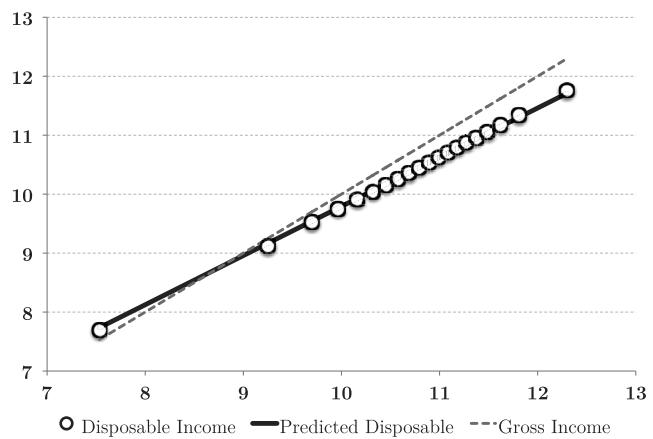
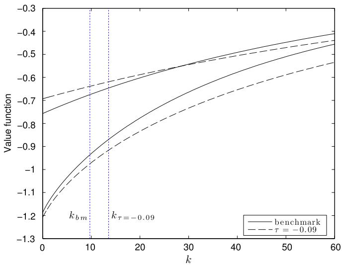
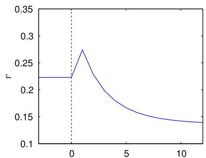
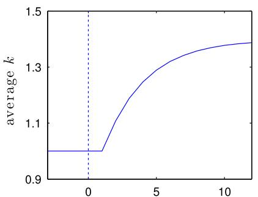
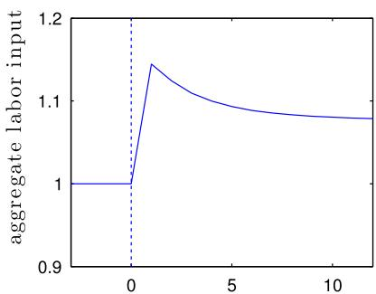
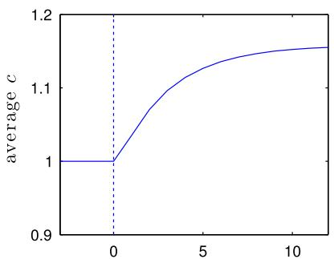
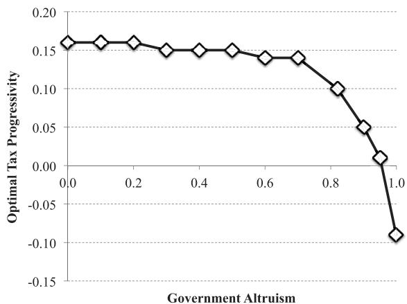

# Transitional dynamics and the optimal progressivity of income redistribution ✩

Ozan Bakı ¸s a, Barı ¸s Kaymak b, Markus Poschke c,∗

a TUSIAD – Sabanci University Competitiveness Forum, Istanbul, Turkey   
b Department of Economics and CIREQ, Université de Montréal, Quebec, Canada   
c Department of Economics and CIREQ, McGill University, Quebec, Canada

# a r t i c l e i n f o

Article history:

Received 22 October 2013

Received in revised form 22 July 2014

Available online 27 August 2014

JEL classification:

E62

H21

Keywords:

Optimal taxation

Intergenerational mobility

Progressive redistribution

# a b s t r a c t

We compute the optimal non-linear tax policy for a dynastic economy with uninsurable risk, where generations are linked by dynastic wealth accumulation and correlated incomes. Unlike earlier studies, we take full account of the welfare distribution along the transition to the new steady state following a once-and-for-all change in the tax system. Findings show that accounting for transitional dynamics leads to a more progressive optimal tax system than one would obtain by only comparing steady states. Starting at the U.S. status quo, the optimal tax reform is a slight to moderate reduction in the progressivity of the tax system, depending on how much the policy maker cares about future generations.

$©$ 2014 Elsevier Inc. All rights reserved.

# 1. Introduction

Most modern governments implement a redistributive fiscal policy, where incomes are taxed at an increasingly higher rate, while transfers are skewed towards the poor. Such policies are thought to deliver a more equitable distribution of income and welfare, and, thereby, provide social insurance both for the currently alive, who face income fluctuations, and for future generations, who face uncertainty about what conditions they will be born into.

In market economies, such egalitarian policies can be costly as they disrupt the efficiency of resource allocation. Therefore, the added benefit of a publicly provided social safety net, that is over and above what is available to people through other sources, such as their family or the private sector, has to be carefully weighed against this cost. In this paper, we provide such an analysis of the optimal degree of income redistribution for a utilitarian government.

The optimal design of a redistributive tax system is, however, subject to constraints. We emphasize three. First, agents may have access to insurance through other means. Savings and bequests, in particular, provide a natural source of insurance against adverse economic outcomes. A redistributive tax policy would alleviate the need for such self-insurance and crowd out accumulation of capital, leading to reduced investment.

Second, informational frictions may prevent the government from observing individual productivity. Consequently, it levies taxes on total income, which leads to well-known incentive problems as higher taxes discourage labor and thereby reduce output.

Third, the policymaker has to be cognizant of the implications of its tax policy on prices. Large-scale shifts in labor supply and savings alter the wage rate and the interest rate, which may have redistributive repercussions for income.

We explicitly address these constraints in a dynastic general equilibrium model with incomplete markets and endogenous labor supply, where generations are linked through a correlated income process. Individuals are faced with idiosyncratic fluctuations in their own income and they are uncertain about their offsprings’ income. Agents do not have access to contracts contingent on future outcomes. They can, however, save and transfer wealth to subsequent generations, but may not pass their debt onto them. This is essentially an Aiyagari–Bewley–Huggett setting with a borrowing constraint.

In this setting, we search for the optimal redistributive income tax scheme. Our approach to the problem is primarily quantitative and is in the tradition of Ramsey (1927). 1 The policy maker may not modify the financial structure of the economy. It cannot, for instance, introduce new assets or allow parents to accept obligations for their kids. It may, however, implement a transfer scheme, for example to transfer income to poor agents. Transfers and government expenditures are financed by taxes levied on labor and capital income. The set of tax policies is restricted to parametric forms albeit flexible ones. The tax schedule used here not only provides a good fit to the current U.S. system, but also allows for a variety of tax systems, such as progressive, flat, and regressive taxes. We assume that the government can commit to a once-and-for-all change in the tax policy, and ask two questions: Which tax policy maximizes average welfare at the steady state of our model economy? Which tax policy maximizes average welfare starting from the current wealth and income distributions in the U.S., taking into account the entire transition path until a new steady state is reached? Since the transition to an optimal steady state may be costly, the optimal reform starting at the status quo will in general be different from the optimal steady-state policy.

We find that when the transitional dynamics are ignored, the optimal tax policy for the long-run steady state is moderately regressive. Ceteris paribus, a less progressive tax system fosters creation of wealth and income by raising the after-tax return to labor and savings, resulting in higher average consumption. The improvement in consumption levels is weighed against larger wealth and income inequality implied by regressive taxation, an undesirable feature for a utilitarian government. The latter, however, is mitigated for two reasons. First, the larger supply of capital lowers the interest rate while boosting the wage rate, as labor complements capital in production. This redistributes income away from the wealthy, who rely primarily on capital income, to consumption-poor agents who rely heavily on labor income, and counterbalances the increase in inequality generated by regressive taxation.2 Second, the availability of self-insurance through savings considerably limits the translation of income inequality to consumption inequality. These mechanisms are effective until moderate levels of regressivity, beyond which the disutility from working even more hours outweighs that of additional income, so that hours worked do not increase further. Output and average consumption thus stop rising, while inequality keeps growing, leaving no incentive for the government to reduce progressivity further.

When the transition path is considered, a sudden switch to a regressive tax system from the current U.S. system is not desirable. Accumulation of the additional capital requires limited consumption of goods and leisure along the transition path, which limits the welfare gains from changing the tax policy. In addition, the welfare gains associated with having a higher capital stock realize only slowly since capital takes time to build. By contrast, a sudden change in the tax system involves large and immediate transfers of income which leads to substantial income inequality in the short run. Due to discounting by households, these concerns outweigh the long-run benefits of regressive income taxation.

As a result, the optimal tax reform is much more progressive when welfare during the transition to a new steady state is considered. The optimal degree of progressivity depends on how much the policy maker values future generations. When the policy maker only cares about the current generation, that is when future generations are valued only indirectly through altruistic motives of parents, a utilitarian government prefers a tax system that is close to the current status quo in the U.S. When the policy maker values future generations directly, with the same weight that altruistic parents use, the optimal tax reform is a moderate reduction in the progressivity of the tax system.

The literature on optimal taxation is vast. The approach here is closest to Conesa and Krueger (2006) and Conesa et al. (2009), who calculate the optimal progressivity of income taxes for an OLG economy with incomplete markets and heterogeneous agents. Heathcote et al. (2014) take a similar approach to compute optimal progressivity in a Blanchard– Yaari–Bewley economy with partial insurance, and without capital. Relative to these papers, we make two contributions. First, we introduce intergenerational income risk and allow dynasties to self-insure via capital accumulation and bequests.3 The results show that both components are important in gauging the value added by publicly provided social insurance, and for modeling the appropriate consumption response to tax policy. In particular, when self-insurance via savings is available,

a benevolent government may prefer to improve social welfare by affecting the savings incentives and by harnessing general equilibrium effects rather than by directly providing insurance via income redistribution. Second, whereas the quantitative literature on optimal taxation has been limited to steady-state welfare analysis, we provide a full quantitative analysis of the optimal tax system taking into account the transition path.4 Our findings indicate that accounting for the short-run distribution of welfare along the transition leads to a more progressive tax system than one would obtain by comparing steady states only.

Erosa and Koreshkova (2007), Seshadri and Yuki (2004) and Bénabou (2002) also look at taxation problems in dynastic settings, with emphasis on human capital investment and education. Bénabou (2002) abstracts from dynastic capital accumulation and Seshadri and Yuki (2004) from labor supply. Both Erosa and Koreshkova (2007) and Seshadri and Yuki (2004) analyze consequences of a flat tax reform, but do not calculate optimal non-linear taxation and only consider long-run stationary equilibria. Cutler and Gruber (1996), Ríos-Rull and Attanasio (2000), Golosov and Tsyvinski (2007) and Krueger and Perri (2011) study how publicly provided insurance schemes can crowd-out insurance that is available through other sources. Hubbard et al. (1995), in particular, emphasize the crowding out of precautionary savings by public tax policy.

In what follows, we introduce the model and formally define the optimal taxation problem. Section 3 describes our calibration. Section 4 presents the optimal tax policy based on the comparison of steady-state economies and Section 5 presents the optimal tax policy along the transition. Section 6 concludes.

# 2. A dynastic model with redistributive income taxation

The model is a standard model of savings with uninsured idiosyncratic income risk (Aiyagari, 1994; Bewley, 1986; Huggett, 1993) extended to incorporate intergenerational dynamics, non-linear fiscal policy and endogenous labor supply.

The economy consists of a continuum of measure one of heterogeneous consumers, a representative firm, and a government. Each consumer is endowed with capital, k, and a stochastic labor skill, z. With these endowments, they can generate an income of $y = z w h + r k$ , where w is the market wage per skill unit, $h \in ( 0 , 1 )$ is hours worked and r is the net real interest rate. Each period, every consumer faces a probability $\mu$ of dying and being replaced by a descendant, who inherits her savings. The intergenerational transmission of $z$ is described below.

Agents pay taxes on their income to finance an exogenous stream of government expenditure, $g _ { t }$ . The disposable income of an agent net of taxes is given by the function $y ^ { d } ( y )$ , which depends only on the agent’s total income. This function also determines the distribution of the tax burden.

Agents allocate their disposable income between consumption and capital investment to maximize the expected present value of their utility. They derive utility from consumption, and they dislike work. In addition, agents care about their offspring’s welfare, which depends on the amount of wealth passed on by the parent, and the child’s skill endowment. Hence, agents save both to insure against fluctuations in labor efficiency over their life and to transfer wealth to their offspring when they die. They are not, however, allowed to borrow. We use z to denote an agent’s labor efficiency units. The fluctuations in $z$ over the life cycle and across generations are captured by a first-order Markov process: $F ( z ^ { \prime } \mid z )$ . We describe this process in detail below.

The problem of an agent is to choose labor hours, consumption and capital investment to maximize the expected present value of the dynasty’s utility. The wage rate, the interest rate and the aggregate distribution of agents over wealth and productivity, denoted by $\varGamma$ , are given. Let ${ \cal { T } } ^ { \prime } = { \cal { H } } ( { \cal { T } } )$ describe the evolution of the distribution over time. The Bellman equation for a consumer’s problem then is:

$$
V (k, z; \Gamma) = \max  _ {c, k ^ {\prime} \geq 0, h \in (0, 1)} \left\{\frac {c ^ {1 - \sigma}}{1 - \sigma} - \theta \frac {h ^ {1 + \epsilon}}{1 + \epsilon} + \beta \mathbb {E} \left[ V \left(k ^ {\prime}, z ^ {\prime}; \Gamma^ {\prime}\right) \mid z \right] \right\} \tag {1}
$$

subject to

$$
c + k ^ {\prime} = y ^ {d} (y) + k
$$

$$
\Gamma^ {\prime} = H (\Gamma).
$$

The production technology of a representative firm uses aggregate capital, $K$ , and labor, $N$ , as inputs, and takes the Cobb–Douglas form: $F ( K , N ) = K ^ { \alpha } N ^ { 1 - \alpha }$ . Factor markets are competitive, and firms are profit maximizers.

A competitive equilibrium of the model economy consists of a value function, $V ( k , z ; T )$ , factor supplies, $k ^ { \prime } ( k , z ; T )$ and $h ( k , z ; T )$ , a wage rate, $w ( T )$ , an interest rate $r ( T )$ , and an evolution function $H ( T )$ such that:

(i) Given w(Γ ), r(Γ ) and $H ( \Gamma ) , V ( k , z ; \Gamma )$ solves the worker’s problem defined by (1) with the associated factor supplies $k ^ { \prime } ( k , z ; T )$ and $h ( k , z ; T )$ .

(ii) Factor demands are given by the following inverse equations:

$$
r (\Gamma) = \alpha (K / N) ^ {\alpha - 1} - \delta
$$

$$
w (\Gamma) = (1 - \alpha) (K / N) ^ {1 - \alpha}.
$$

(iii) Markets clear:

$$
K ^ {\prime} = \int k ^ {\prime} (k, z) d \Gamma (k, z) \quad \text {a n d} \quad N = \int z h (k, z) d \Gamma (k, z).
$$

(iv) $H ( T )$ is consistent with $F ( z ^ { \prime } \mid z )$ and the savings policy $k ^ { \prime } ( k , z ; T )$ .

(v) The government budget is balanced:

$$
g = \int [ y - y ^ {d} (y) ] d \Gamma (k, z).
$$

A steady state of the economy is a competitive equilibrium where the distribution of agents is stationary, i.e. ${ \cal T } ^ { s s } =$ $H ( T ^ { s s } )$ .

# 2.1. A redistributive income tax policy

Taxes are modeled after the current U.S. income tax system. Following Bénabou (2002) and Heathcote et al. (2014), we approximate disposable income with a log-linear function in gross-income:

$$
y ^ {d} = \lambda (z w h + r k) ^ {1 - \tau}. \tag {2}
$$

The power parameter $\tau \leq 1$ controls the degree of progressivity of the tax system, while λ adjusts to meet the government’s budget requirement. When $\tau = 0$ , the equation above reduces to the familiar proportional tax (or flat tax) system. When $\tau = 1$ , all income is pooled and redistributed equally among agents. For $0 < \tau < 1$ , the tax system is progressive.5

The disposable income function above also allows for negative taxes. Income transfers are, however, non-monotonic in income. When taxes are progressive, transfers are first increasing, and then decreasing in income. Examples of such transfers schemes include the earned income tax credit, welfare-to-work programs etc. In Section 3, we show that this functional form provides a remarkable fit to the U.S. tax system.

A regressive tax system is achieved when $\tau$ is negative. In this case, taxes are first increasing, then decreasing in income for high enough income levels, and may prescribe positive transfers for high income earners. Since the marginal tax rate, $1 - \lambda ( 1 - \tau ) y ^ { - \tau }$ , is monotonic in pre-tax income, (2) rules out tax policies that are progressive for some parts of the income distribution and regressive elsewhere.

# 2.2. Intergenerational and life-cycle dynamics

The process for labor efficiency units is modeled as:

$$
\ln z _ {i g t} = m _ {z} + f _ {i g} + a _ {i t}, \tag {3}
$$

where i indexes dynasties, $^ g$ generations and t time. $f _ { i g } \in \{ f _ { L } , f _ { H } \}$ denotes the intergenerational component of productivity, which remains fixed during each individual’s life, and $a _ { i t } \in \{ a _ { L } , a _ { H } \}$ denotes the life-cycle component of productivity, which may change from period to period. Let $F$ and A be the transition matrices for these components. If an agent survives to the next period, which happens with probability $1 - \mu$ , his labor efficiency is determined by the transition matrix

$$
S = \left( \begin{array}{c c c c c} & f _ {L} + a _ {L} & f _ {L} + a _ {H} & f _ {H} + a _ {L} & f _ {H} + a _ {H} \\ \hline f _ {L} + a _ {L} & A _ {1 1} & A _ {1 2} & 0 & 0 \\ f _ {L} + a _ {H} & A _ {2 1} & A _ {2 2} & 0 & 0 \\ f _ {H} + a _ {L} & 0 & 0 & A _ {1 1} & A _ {1 2} \\ f _ {H} + a _ {H} & 0 & 0 & A _ {2 1} & A _ {2 2} \end{array} \right)
$$

Since $f _ { i g }$ is fixed over an agent’s life, S is block-diagonal. If instead an agent dies, which occurs with probability $\mu$ , his offspring’s productivity is determined by the matrix

$$
D = \left( \begin{array}{c c c c c} & f _ {L} + a _ {L} & f _ {L} + a _ {H} & f _ {H} + a _ {L} & f _ {H} + a _ {H} \\ \hline f _ {L} + a _ {L} & \pi F _ {1 1} & (1 - \pi) F _ {1 1} & \pi F _ {1 2} & (1 - \pi) F _ {1 2} \\ f _ {L} + a _ {H} & \pi F _ {1 1} & (1 - \pi) F _ {1 1} & \pi F _ {1 2} & (1 - \pi) F _ {1 2} \\ f _ {H} + a _ {L} & \pi F _ {2 1} & (1 - \pi) F _ {2 1} & \pi F _ {2 2} & (1 - \pi) F _ {2 2} \\ f _ {H} + a _ {H} & \pi F _ {2 1} & (1 - \pi) F _ {2 1} & \pi F _ {2 2} & (1 - \pi) F _ {2 2} \end{array} \right)
$$

where $\pi$ denotes the share of newly born agents who start their careers with $a _ { L }$ . When $\pi$ is high enough, agents, on average, start their career with lower productivity, and tend to improve later as their careers progress. This helps generate wage growth over the life cycle.6 When $F _ { 1 1 }$ and $F _ { 2 2 }$ are greater than a half, a positive correlation of wages emerges across generations. Note that the intergenerational transition probabilities are independent of the level of the life-cycle component, $a _ { i t }$ , at the time an agent dies. This enables us to estimate the elements of the intergenerational transition matrix based on the permanent component of wages as is standard in the empirical literature.

The aggregate transitions across different endowments of labor efficiency units in the economy depend on both life-cycle and intergenerational transitions and are given by $\mu D + ( 1 - \mu ) S$ .

# 2.3. Optimal taxation problem

The benevolent Ramsey government maximizes average welfare in the economy by choosing the progressivity of the tax policy subject to a balanced budget constraint and equilibrium responses by households to the tax policy. We conduct a series of experiments, using different objective functions for the policy maker. In the first experiment, the policy maker is concerned with the average welfare at the long-run steady state of the economy. Formally, the problem is:

$$
\max  _ {\lambda , \tau} \mathcal {W} ^ {s s} = \int V ^ {s s} (k, z; \Gamma^ {s s}) d \Gamma^ {s s} (k, z)
$$

subject to

$$
g = \int \left[ y - y ^ {d} (y; \lambda , \tau) \right] d \Gamma^ {s s} (k, z) \tag {4}
$$

$$
y = w z h (k, z; \Gamma^ {s s}) + r k ^ {\prime} (k ^ {-}, z ^ {-}; \Gamma^ {s s}), \tag {5}
$$

where $V ^ { s s }$ is the value function, $\varGamma ^ { s s }$ is the stationary distribution of agents over productivity and wealth, $h ( . )$ and $k ^ { \prime } ( . )$ are the policy functions at the steady-state equilibrium associated with the tax policy $( \lambda , \tau )$ , and $k ^ { - } , z ^ { - }$ are the lagged values of $k$ and $z$ such that $k ^ { \prime } ( k ^ { - } , z ^ { - } ) = k$ . The dependence of these functions on the tax policy is suppressed for notational convenience. The steady-state experiment turns out to be very useful for understanding the tradeoffs the policy maker faces.

However, the steady-state objective ignores welfare along the transition to the new steady state. In the remaining experiments, we therefore assume that the economy starts off in the status quo, and that the government can credibly commit to a once-and-for-all change in the tax policy. We assume that the tax reform takes effect in period 0 and is not anticipated. In the second policy experiment, the policy maker seeks to maximize average utility by choosing the parameters of the tax reform. Let $\tilde { \varGamma } _ { t } ( k , z )$ be the distribution of agents born in period t.7 Formally, the policy maker solves

$$
\max  _ {\lambda , \tau} \int V _ {0} (k, z; \Gamma_ {0}) d \Gamma_ {0} (k, z) + \mu \sum_ {t = 1} ^ {\infty} \beta_ {g} ^ {t} \int V _ {t} (k, z; \Gamma_ {t}) d \tilde {\Gamma} _ {t} (k, z) \tag {6}
$$

subject to a balanced budget constraint each period and optimal, competitive behavior on part of the agents. The first component is the average welfare of agents that are alive when the new tax policy is implemented. The second component is the welfare of future generations, discounted at a rate $\beta _ { g }$ by the policy maker. $\mu$ is the total measure of newborn agents that enter the economy each period. When $\beta _ { g } = 0$ , the policy maker only takes into account the welfare of those who are alive in the initial period, at the time of the reform. Future generations appear in the policy maker’s objective function only indirectly, due to parental altruism of the existing generations. When $\beta _ { g } > 0$ , future generations are valued both directly, and indirectly through their parents’ welfare (see Farhi and Werning, 2007, for instance, for a discussion). Below, we report results for different values of $\beta _ { g }$ .8 , 9

Due to the concavity of the individual utility function, the utilitarian welfare criterion favors redistribution even when there are no shocks to be insured. It therefore confounds the insurance motive of redistribution with the pure equity motive. To separate the efficiency concerns from equity concerns, we conduct another experiment and employ a version of the aggregate efficiency criterion introduced by Bénabou (2002). The idea is to replace the stochastic consumption sequence of an

agent (and his dynasty) with its certainty-equivalent, and to evaluate welfare by aggregating the certainty-equivalent levels of consumption rather than utility levels in each period. With this procedure, risk aversion is reflected in the certaintyequivalent evaluation of consumption streams, but not in the interpersonal aggregation. As a consequence, redistribution then matters insofar as it provides insurance, reduces risk, and changes certainty-equivalent consumption, but is not valued for interpersonal redistribution.

When the utility function depends not only on consumption but also leisure, there are multiple ways to compute certainty equivalence depending on how disutility from work is treated. Since the utility function is additively separable between consumption and hours worked, our approach is to compute the certainty equivalence for each component separately. Formally, let $V _ { 0 } ( k , z ) = V _ { 0 } ^ { c } ( k , z ) - V _ { 0 } ^ { n } ( k , z )$ be the value of initially having a capital stock of $k$ and labor efficiency z. The certainty equivalent levels of consumption and hours, denoted by $\tilde { c } ( k , z )$ and $\tilde { n } ( k , z )$ , solve the following set of equations:

$$
V _ {0} ^ {c} (k, z) = \mathbb {E} \sum_ {t = 0} ^ {\infty} \beta^ {t} \frac {c \left(k _ {t} , z _ {t}\right) ^ {1 - \sigma}}{1 - \sigma} = \frac {1}{1 - \beta} \frac {\tilde {c} (k , z) ^ {1 - \sigma}}{1 - \sigma}
$$

$$
V _ {0} ^ {l} (k, z) = \overline {{\theta \mathbb {E} \sum_ {t = 0} ^ {\infty} \beta^ {t} \frac {h (k _ {t} , z _ {t}) ^ {1 + \epsilon}}{1 + \epsilon}}} = \frac {1}{1 - \beta} \frac {\tilde {n} (k , z) ^ {1 + \epsilon}}{1 + \epsilon}.
$$

Finally, the associated objective function is defined as follows:

$$
\mathcal {W} ^ {E} = \frac {1}{1 - \sigma} \left(\int \tilde {c} (k, z) d \Gamma_ {0} (k, z)\right) ^ {1 - \sigma} - \frac {\theta}{1 + \epsilon} \left(\int \tilde {n} (k, z) d \Gamma_ {0} (k, z)\right) ^ {1 + \epsilon}. \tag {7}
$$

The purpose of this experiment is not to dismiss equity concerns, but rather to be able to separately evaluate equity and efficiency concerns, which in the utilitarian welfare function are simultaneously present. A comparison of results for this objective with those for the utilitarian objective thus allows assessing how optimal progressivity is affected by equity concerns, and what it would be with efficiency concerns only. We also acknowledge that alternative formulations of the efficiency criterion may yield slightly different results.

# 3. Empirical analysis and calibration

The model is calibrated to the U.S. economy. For computational convenience, the model period is set to 5 years. $\mu$ is set to 0.2, which implies that in expectation, each generation of a dynasty holds the dynasty’s capital for 25 years. The capital share of income, $\alpha$ , is set to 0.36, the depreciation rate to $8 \%$ per annum and the rate of relative risk aversion to 2. This leaves three sets of parameters: the fiscal policy, $( g , \lambda , \tau )$ , the preference parameters for labor, $\theta$ and $\epsilon$ , and the parameters for the stochastic income process, z and $F ( z ^ { \prime } \mid z )$ . These parameters are identified as follows.

# 3.1. How progressive is the U.S. tax system?

The progressivity of the current tax system is estimated using household-level data from March supplements to the Current Population Survey for 1979 to 2009. Federal and state income taxes, as well as the payroll tax per household are obtained from the NBER tax simulator (Feenberg and Coutts, 1993). Our measure of pre-tax income is gross earnings, as reported by the household, plus the payroll tax. Disposable income is defined as reported earnings less federal and state income taxes. The estimated log-linear regression is:

$$
\log y ^ {d} (y) = 1. 3 4 + \boxed {0. 8 3} \log y + X \hat {\Gamma} \quad R ^ {2} = 0. 9 4. \tag {8}
$$

To control for the changes in the average tax rate over the years, X includes indicator variables for each survey year.10 The correlation coefficient indicates that the log-linear specification fits the U.S. tax system remarkably well. Fig. 1 further confirms this visually by plotting average disposable income by quantiles of pre-tax income (circles) over the regression line (solid). Two points are worth noting. First, the slope of the regression line is less than one, showing the progressivity of the U.S. tax system. The implied value of τ is 0.17 (0.0026).11 Second, the bottom five percent of the gross-income distribution are paying negative or zero taxes.

As Conesa et al. (2009), we set government expenditures to $1 7 \%$ of output in the benchmark economy. The implied level of government expenditure is then kept constant when evaluating alternative tax policies. Given $\tau = 0 . 1 7$ and $g / Y = 0 . 1 7$ , the value of λ is determined at the equilibrium by the government’s budget constraint.

  
Fig. 1. The progressivity of the U.S. tax system – log disposable household income as a function of log pre-tax income. Circles denote average income net of taxes by quantiles of gross income. The solid line is the fitted regression line and the broken line is the 45 degree line. Data combines March supplements to CPS (1979–2009) with the NBER tax simulator.

# 3.2. Income process and intergenerational dynamics

To calibrate the components of the transition matrix, we estimate the transition probabilities in A and $F$ using panel data on hourly wages from the PSID (1970–1991). The sample is restricted to men of ages 24 to 60 who report to be household heads. To decompose the wages into its life cycle and intergenerational components, we estimate the following specification:

$$
\ln w _ {i t} = \phi_ {i g} + g \left(\text {a g e} _ {i t}; \Phi\right) + I _ {t} + \varepsilon_ {i t}, \tag {9}
$$

where $\phi _ { i g }$ denotes the fixed effect for worker i of generation g. Since fathers and sons may be observed at different points in the life cycle, and possibly at different points of a business cycle, indicators for survey year, $I _ { t }$ , and a quartic polynomial in age, $g ( a g e _ { i t } ; \Phi )$ , are included as control variables.

The intergenerational component of wages is defined by $f _ { i g } = \hat { \phi } _ { i g }$ and the life-cycle component by $a _ { i t } = g ( a g e _ { i t } ; \hat { \phi } ) + \hat { \varepsilon } _ { i t }$ , where the first terms captures the deterministic age profile of wages, and the second term captures the transitory shock to the wage rate. The variance of the intergenerational component in the data is 0.22 and that of the life-cycle component is 0.12, implying that the fixed worker effects capture $6 4 \%$ of the total wage variance. This is in line with the findings in Storesletten et al. (2004) who estimate the share of fixed worker effect to be around $56 \%$ for earnings.

There is a longstanding literature on the intergenerational income mobility in U.S. (see Solon, 1999 for a survey). The elasticity of offspring’s earnings to parental earnings reported in the literature is around 0.40. The elasticity of wages is usually slightly lower than the earnings elasticity due to the positive intergenerational correlation of hours. Using data from the PSID, Solon (1992) reports an intergenerational wage elasticity of 0.30. Similarly, Mulligan (1997) reports a wage elasticity of 0.33. The intergenerational wage elasticity in our sample is 0.32.

Our model allows for two values of $f \colon f _ { L }$ and $f _ { H }$ . To estimate the intergenerational transition probabilities between these levels, we split the distributions of $f _ { i g - 1 }$ (fathers) and $f _ { i g }$ (sons) into two quantiles around the median, and compare the son’s position relative to the median in the $f _ { i g }$ distribution given his father’s position in the $f _ { i g - 1 }$ distribution.12 Similarly life-cycle transition probabilities are estimated by splitting the distributions of $a _ { i t }$ and $a _ { i t - 1 }$ into two quantiles, and tracking a worker’s position relative to the median in two consecutive years.

The corresponding states $( a _ { L } , a _ { H } )$ and $( f _ { L } , f _ { H } )$ are calibrated such that the means of $a _ { i t }$ and $f _ { i g }$ at the stationary state are (normalized to) zero and the standard deviations of each component match their data counterparts. The resulting states are $( f _ { L } , f _ { H } ) = ( - 0 . 4 0 , + 0 . 5 5 )$ , and $( a _ { L } , a _ { H } ) = ( - 0 . 3 7 , + 0 . 3 3 )$ . Combined with the average wages, these states imply four possible values for hourly wages: $\$ 8.3$ , $16.7, $\$ 21.5$ and $\$ 43.2$ in 1999 dollars.13

The transition matrices corresponding to each component are below14:

$$
F = \left[ \begin{array}{c c} 0. 6 9 & 0. 3 1 \\ 0. 4 3 & 0. 5 7 \end{array} \right] \qquad A = \left[ \begin{array}{c c} 0. 6 8 & 0. 3 2 \\ 0. 2 8 & 0. 7 2 \end{array} \right].
$$

Table 1 Calibration of the model to the U.S. economy.   

<table><tr><td>Parameter value</td><td>Target moment</td><td></td></tr><tr><td>σ = 2.00</td><td>relative risk aversion</td><td>2.00</td></tr><tr><td>β1/T = 0.962</td><td>annual interest rate (McGrattan and Prescott, 2010)</td><td>4.1%</td></tr><tr><td>θ = 0.358</td><td>average annual labor hours</td><td>0.49</td></tr><tr><td>ε = 1.183</td><td>coef. of variation of hours</td><td>0.27</td></tr><tr><td>α = 0.36</td><td>capital share of income</td><td>0.36</td></tr><tr><td>δ = 0.34</td><td>annual depreciation rate</td><td>0.08</td></tr><tr><td>g = 2.59</td><td>g/Y (Conesa et al., 2009)</td><td>0.17</td></tr><tr><td>τ = 0.17</td><td>own estimate (see Section 3.1)</td><td></td></tr></table>

Note that the matrices are not symmetric. For intergenerational transitions, the asymmetry stems from limited upward mobility across generations in the U.S., an aspect well documented in the literature (Solon, 1999; Black and Devereux, 2011). In the case of life cycle transitions, the asymmetry comes from the wage growth over a worker’s career.

Wage growth over the life cycle depends not only on the transmission probabilities in A, but also the initial distribution of new entrants over $a _ { L }$ and $a _ { H }$ . Therefore, $\pi$ is calibrated to observed wage growth over the life cycle given the probabilities in A. In the data, wages grow rapidly during the first 20 years of a worker’s career and remain flat thereafter, until the last 5 years of the career, when wages decline slightly before retirement. Therefore, we target wage growth during the first 20 years (4 model periods) to determine $\pi$ . The average log-wage difference between workers aged 44 to 49 and those aged 24–29 in the data is 0.30. Given the estimated transition matrices above, this is replicated when $\overline { { \pi = 0 . 9 } }$ , implying that $90 \%$ of all newborn agents starts their career with $a _ { L }$ .

# 3.3. Leisure and labor supply

The discount factor $\beta$ , the preference parameter for labor disutility, $\theta$ , and the curvature of utility with respect to hours worked, $\epsilon$ , are jointly calibrated to an annual interest rate of $4 . 1 \%$ , average hours worked over life, and the coefficient of variation of average lifetime labor hours. To obtain the latter components in the data, we estimate the specification in (9) for annual working hours in a year. An average person works 2122 hours in the data. We consider this to be approximately $4 9 \%$ of available work time during the year.15 The standard deviation of the estimated fixed worker effects for hours implies a coefficient of variation of 0.27 for hours worked.

Table 1 summarizes the calibrated values for the parameters. The implied values for the utility parameters are: $\theta = 0 . 3 5 8$ , $\epsilon = 1 . 1 8 3$ , and $\beta = 0 . 9 6 2 ^ { 5 }$ . The Frisch elasticity in the model depends both on the utility parameter $\epsilon$ , and the progressivity of the tax system $\tau$ as follows: $( 1 - \tau _ { l } ) / ( \epsilon + \tau _ { l } )$ . The calibrated values for these parameters imply an elasticity of 0.62. This is somewhat higher than the micro level estimates for yearly models, which are around 0.25 for individuals, while a value between 2 and 3 is required to match employment differences across time and countries at the macro level (see Prescott, 2004; Cho and Cooley, 1994 and Blundell and MaCurdy, 1999, among others). More recently, Blundell et al. (2012) report an estimate of 0.4 for males and 0.8 for females. Thus a value of 0.62 for a model that does not distinguish individuals by gender seems broadly plausible.

The calibration ensures that the benchmark economy exactly delivers the wage inequality in the PSID (1970–1991). Combining this with the labor supply policies results in a Gini coefficient for earnings of 0.35, which is closely in line with the data for this period (Heathcote et al., 2010). The model thus replicates wage dispersion, inter- and intragenerational wage dynamics, and earnings inequality in the PSID very well. The model does slightly less well in terms of the wealth distribution. The Gini coefficient for wealth in the model is $0 . 5 3 ,$ , which is below the reported estimates in the data. The data used to estimate the wage process spans the years between 1970 to 1991. Heathcote et al. (2010) reports a wealth Gini of 0.66 during this period based on the Survey of Consumer Finances (SCF). More recently, the wealth Gini has exceeded 0.8 (Diaz-Gimenez et al., 2011). As a consequence, inequality in capital income and thus in total income is also somewhat below data values. This issue is not unique to our model; see e.g. Heathcote et al. (2010, p. 41), who state that “one should not expect a model calibrated to wage or income dynamics from the PSID to replicate the extreme wealth inequality in the raw SCF”.16 Importantly, while our model mostly understates wealth inequality in the upper tail, it does much better for the lower tail. In particular, it captures the fact that the bottom $1 0 \%$ of households hold no net wealth at all (Heathcote et al., 2010). Matching this is important, as these households are constrained and thus are strongly affected by redistributive policy. Since these agents have low consumption levels, they also carry the highest welfare weight for a utilitarian policy maker.

Table 2 Optimal tax system: steady-state comparison.   

<table><tr><td></td><td>U.S.</td><td>Optimal</td><td></td><td>U.S.</td><td>Optimal</td></tr><tr><td>Progressivity (τ)</td><td>0.17</td><td>-0.09</td><td>Output</td><td>15.2</td><td>+18.4%</td></tr><tr><td>Interest rate (%)</td><td>4.10</td><td>2.60</td><td>Pre-tax income</td><td>12.5 (0.30)</td><td>+34.4% (0.32)</td></tr><tr><td>Wage rate</td><td>0.50</td><td>0.55</td><td>Disposable income</td><td>9.4 (0.25)</td><td>+34.0% (0.35)</td></tr><tr><td>Hours</td><td>0.49</td><td>0.52</td><td>Wealth</td><td>9.7 (0.53)</td><td>+40.2% (0.56)</td></tr><tr><td>G/Y</td><td>0.17</td><td>0.14</td><td>Consumption</td><td>9.3 (0.17)</td><td>+16.1% (0.20)</td></tr></table>

Note. Table compares the benchmark U.S. economy with the optimal tax system that maximizes average long-run welfare at the steady state. The numbers in parentheses show the Gini coefficients of inequality.

# 4. How progressive should the long-run tax policy be?

In this section, we report results for our first experiment by comparing the steady-state equilibria under different tax policies with varying degrees of progressivity. The findings suggest that the optimal tax code in the long run is slightly more regressive than a flat tax system. The optimal value for τ is $- 0 . 0 9$ . Below, we highlight several key aspects influencing the policy maker’s decision. This will also help understand the trade-off between the long-run welfare gains and short-run costs incurred along the transition analyzed in the next section. These costs are instrumental to the optimality of progressive income taxes when transition dynamics are considered.

How could a regressive tax system, which subjects low income groups to higher tax rates, be optimal for an egalitarian government? To see this, note that a utilitarian policymaker is concerned with two things when comparing tax policies: the total amount of available goods (consumption and leisure), and how these goods are distributed among agents. A less progressive tax policy raises average consumption at the cost of higher after-tax income inequality. However, this does not translate to equally severe consumption inequality when agents self-insure with precautionary savings. As a consequence, the optimal tax schedule may well be regressive.

Table 2 compares the steady state of the benchmark economy calibrated to the U.S. tax policy with that obtained under the optimal tax system. A decline in the progressivity of the tax policy promotes generation of income by increasing the after-tax return to labor and capital. This raises savings in the economy. Lack of redistribution also leads to a higher income risk, and promotes additional precautionary savings. For high-income groups, there is a positive income effect generated by lower taxes, which further encourages savings. For low-income groups, the income effect works against the substitution effect, but is not strong enough. Overall, the supply of capital increases, which puts a downward pressure on the interest rates.

The larger capital stock has two implications for labor. First, it raises the demand for labor, and increases the wage rate, despite the downward pressure created by the increase in the labor supply. Second, larger wealth has a negative income effect on labor supply, limiting the increase in labor input, and pushing the wage rate further up. With a larger stock of capital and increased labor input, output increases. The optimal tax system leads to a $1 8 . 4 \%$ increase in output, which translates to a $1 6 . 1 \%$ increase in consumption. The rise in welfare due to higher average consumption is mitigated by the decrease in average leisure from 0.51 to 0.48. Since government expenditure $^ g$ is fixed in all our experiments, higher output implies a lower average tax burden, and $g / y$ falls from 0.17 to 0.14.

Overall, an average person has larger wealth, higher income, substantially more consumption, and less leisure. To compare this improvement in the utility of an average person with the change in distributive inequality, the Gini coefficients of inequality are shown in parentheses in Table 2. Pre-tax income inequality remains similar under regressive taxes due to the change in the equilibrium prices. The decline in the interest rate attenuates the effect of wealth inequality on income, while the higher wage rate raises labor income, which is distributed more equally. Nonetheless, the economy with regressive taxes features larger wealth inequality along with a considerable increase in the inequality of after-tax income disposable for consumption. The Gini coefficient for wealth inequality increases from 0.53 to 0.56, and that for disposable income from 0.25 to 0.35. The impact of rising income and wealth inequality on consumption, however, is limited. The Gini coefficient for consumption inequality rises from 0.17 to 0.20, about a third of the rise in disposable income inequality. This is due, in large part, to the availability of self-insurance through precautionary savings.

# 4.1. Tax progressivity and steady-state welfare

To gauge the improvement in average steady-state welfare, we ask the following hypothetical question: by what factor would one need to increase the consumption of each and every person in the benchmark economy to reach the same average welfare as the optimal economy, keeping their labor supply constant? The answer is $3 . 3 \%$ , which is quite large considering that the welfare cost of business cycles are estimated at $1 \%$ or less, even for models with heterogeneous households.17 This calculation ignores the change in welfare during the transition to the new steady state, which is studied in Section 5.

  
Fig. 2. Welfare by wealth and productivity. Note: The vertical lines indicate average wealth in the two economies.

To see how the welfare distribution changes across agents, consider first the value functions for a given wealth and productivity level, without taking into account the shift in the wealth distribution. Fig. 2 plots welfare by wealth for the lowest and the highest productivity groups (out of 4 in total). The solid lines correspond to the benchmark economy, and the dashed lines represent the economy operating under the optimal tax code. The optimal economy features lower welfare for the wealthy, especially for those with little labor income. This is primarily due to the lower interest rate in the optimal economy. Workers with low wealth, on the other hand, are dependent on labor income, which is higher in the new economy due to higher wage rates. This leads to higher welfare for the highly productive, who have higher disposable incomes in the new tax system, and eases the fall in welfare for workers with low productivity and, hence, low income, who receive less transfers under the regressive tax system.

A utilitarian policymaker also considers the shift in the wealth and income distributions when comparing these two economies. In particular, the optimal economy features a higher wealth level on average, which leads to an upward movement along the dashed welfare functions in Fig. 2.

A similar intuition emerges in Davila et al. (2012), who show that in Aiyagari (1994) type models, agents’ individual savings decision in the laissez-faire equilibrium imply that the economy does not reach its constrained efficient optimum. They show that in a situation where the income of the poor consists mainly of labor income, as also is the case here, a subsidy to saving with the objective of promoting capital accumulation improves the welfare of the poor by raising the wage rate. Reinstating constrained efficiency in that paper requires state-dependent tax and transfer schemes on capital income at the individual level. Our findings suggest that when such policies are not feasible, a regressive income tax system can stand in for a more complicated mechanisms.18

# 4.2. Labor supply, self-insurance and partial equilibrium: implications for tax policy

In this section, we conduct counterfactual experiments to highlight the roles of the three constraints on the policymaker’s choice of redistributive tax policy: the crowding out of labor supply, the crowding out of self-insurance and adjustment of prices in equilibrium.

First, we recompute the optimal tax code assuming that savings behavior remains fixed at the benchmark economy. Agents are allowed to optimally adjust their labor supply, prices clear markets, and the budget is balanced at all times. Since savings are fixed, lower progressivity leads to larger consumption inequality with little improvement in aggregate output or consumption. Consequently, the optimal tax policy is highly progressive with a τ of 0.36.

To gauge the role of equilibrium price adjustments, the interest rate and the wage rate are fixed at their benchmark levels in the second experiment. Savings and labor supply respond optimally, and the government runs a balanced budget. In this partial equilibrium exercise, the redistributive role of prices in response to lower progressivity is absent. As a result, the optimal tax system is progressive with a τ of 0.23.

  
Fig. 3. Transition to regressive taxation – values relative to the benchmark economy, except for $r .$ . The new tax system with $\tau = - 0 . 0 9$ goes into effect at $t = 0$ .

Finally, when the labor supply response is shut down, the optimal tax system remains regressive with $\tau = - 0 . 0 6$ . This is because the long-run elasticity of labor supply is low due to two contradicting effects. On the one hand, progressive taxes reduce labor supply by lowering the return to an hour of work. On the other hand, they reduce the steady-state income in the economy, creating a negative income effect on leisure.

These experiments reveal that two features are key for the optimality of a tax system when only long-run outcomes are considered: the effect of taxes on saving, and the resulting changes in equilibrium prices. These features are absent in settings where there is no effect of capital accumulation on wages (as in Heathcote et al., 2014), or where assets cannot be transmitted to the next generation, limiting the response of savings to the tax system (as in Conesa and Krueger, 2006 and Conesa et al., 2009). In both cases, public insurance becomes more attractive.

# 5. Optimal redistribution along a transition path

The optimal tax code described in the previous section encourages capital accumulation and accordingly leads to higher wages than the benchmark economy. Getting there is costly, however, as building new capital requires initially reducing consumption and leisure. Therefore, the transition to the steady state following a switch to a regressive tax system is costly in terms of welfare. Comparing steady states abstracts from this cost. Depending on its size, implementing the tax code that is optimal in the long run may not be optimal once the transition is taken into account. Overall welfare including the transition may instead be maximized by a completely different tax code. Therefore, we next ask the following two questions: What are the short-run implications of implementing the tax code that is optimal at the steady state of the economy? And which level of progressivity of the tax code is optimal, taking into account the transition from the current U.S. benchmark?

# 5.1. Transition to the optimal steady state

To analyze the transitional dynamics, we assume that the economy is initially in the benchmark steady state that reproduces the U.S. status quo. In this situation, the government surprisingly implements the new tax code and commits to it. As the economy converges to the new steady state under the tax system, the interest rate, the wage rate and λ all change. Recall that the parameter λ of the tax code adjusts to balance the government’s budget every period.

Results show that the transition to the optimal long-run policy is very costly. Values of key endogenous variables along the transition path are shown in Fig. 3. The economy moves into the neighborhood of the new steady state in 25 to 50 years. Over this time, the capital stock increases by more than a third and average consumption rises by about $1 5 \%$ . Early in the transition, however, increased capital accumulation requires a $1 4 \%$ increase in labor hours, implying a significant reduction in leisure. Furthermore, a sudden change in the tax policy brings about a substantial increase in the after-tax income inequality, and, thereby, consumption inequality. The Gini coefficient for consumption rises from 0.17 to 0.20 immediately and remains relatively stable thereon. Unlike the rise in consumption inequality, average consumption rises only by $3 . 5 \%$ in the first period, approximately a fifth of the overall increase in consumption in the long run.

  
Fig. 4. Government altruism and optimal tax progressivity. Note: Figure shows the progressivity of the optimal tax schedule $( \tau )$ as a function of the policy maker’s discount factor applied to future generations $\cdot \beta _ { g } \in [ 0 ; 1 )$ ).

Due to discounting, the short-run welfare costs associated with switching to the regressive tax system carry a higher weight than long term gains. Using the same method as in Section 4.2, consumption of each person in the current generation would need to be reduced by $3 \%$ at every time and state in the future to make them indifferent between the benchmark economy and the transition to the optimal steady state. As a consequence, the cost of the transition wipes out the welfare gains achieved in the steady state with the regressive tax policy.

# 5.2. Optimal tax reform along the transition

This raises the question which tax reform is optimal, starting in the U.S. status quo. The answer generally depends on how much the policy maker values future generations relative to the current generation. We begin with the case where the policy maker only cares to maximize the average welfare of agents that are alive at the time the tax reform is introduced $\beta _ { g } = 0$ in (6)). Recall that future generations are still valued in the policy maker’s objective function due to parental altruism. In this case, the optimal policy is to slightly decrease progressivity, from 0.17 to 0.16. There are two underlying forces behind this result. On the one hand, the policy maker would like to increase long-run average output and consumption by implementing less progressive taxes. On the other hand, less progressive taxes imply lower consumption and leisure during the transition. They also lead to a less equitable distribution of income. Given the discount rate of the current generation, these forces balance each other. As a result, the optimal transition provides a welfare gain equivalent to $0 . 2 \%$ of consumption for the current generation. This is much lower than the gains suggested by the comparison of steady states only.

The utilitarian welfare function does not distinguish between ex-post inequality and ex-ante inequality. Therefore, it aims to equate marginal utility of consumption across agents not only to provide insurance for future variations in consumption, but also to eliminate pre-existing consumption differences. To better understand the insurance role of optimal taxation, we compute the optimal tax policy for the welfare function described in Eq. (7). The optimal progressivity in this case is $\tau =$ 0.10. The reduction in the optimal progressivity highlights the egalitarian motive implicit in the utilitarian function. Since the elasticity of capital supply is relatively low in the short run, it can be taxed away from the wealthy and redistributed towards the income poor with little efficiency cost. This motive, akin to the intuition behind Chamley (1986), applies only if transition dynamics are considered when deciding the optimal tax policy.19

If, instead, the policy maker discounts the well-being of future generations less than the altruistic agents do, the long-run gains of regressive taxes realized by future generations become more important. We acknowledge that there is no “right” way to assign welfare weights across generations and report the results for various values of the policy maker’s discount factor for future generations $( \beta _ { g } \in [ 0 , 1 ) )$ . The resulting progressivity of the optimal tax schedule for a utilitarian objective function is shown in Fig. 4. As $\beta _ { g }$ increases, the optimal tax schedule becomes less progressive. For low values of $\beta _ { g }$ , the change in the optimal tax schedule is minor. This is due in part to the fact that each period, only a fraction $\mu$ of the population is newly born. As $\beta _ { g }$ approaches 1, the policy maker values future generations as much as the current generation. In this extreme case, the long-run gains of reduced progressivity overtake the short-run costs along the transition. Consequently, the optimal tax progressivity approaches $- 0 . 0 9$ , which also maximizes steady-state welfare. If the policy maker values future generations as much as the altruistic parents do, $\displaystyle { \langle \beta _ { g } = \beta = 0 . 8 2 \rangle }$ , the optimal tax system features $\tau = 0 . 1 0$ , whereas a weight of $\beta _ { g } = 0 . 9 6$ is needed for a flat tax system to be optimal.

The different levels of progressivity obtained under various values of $\beta _ { g }$ lead to substantially different distributions of the tax burden. Table 3 summarizes the steady-state distribution of the tax burden associated with each economy. In the optimal

Table 3 The distribution of taxes and income.   

<table><tr><td rowspan="2">Economy</td><td rowspan="2">Government altruism (βg)</td><td rowspan="2">Tax policy (τ)</td><td colspan="5">Income percentiles</td></tr><tr><td>0-100</td><td>&lt;0.10</td><td>0.10-0.50</td><td>0.50-0.90</td><td>&gt;0.90</td></tr><tr><td></td><td></td><td></td><td colspan="5">Average tax rates (%)</td></tr><tr><td>Benchmark (U.S.)</td><td>-</td><td>0.17</td><td>21.8</td><td>6.7</td><td>15.0</td><td>23.1</td><td>29.7</td></tr><tr><td>Utilitarian</td><td>0.00</td><td>0.16</td><td>21.7</td><td>7.1</td><td>15.1</td><td>23.0</td><td>29.4</td></tr><tr><td>Altruistic</td><td>0.82</td><td>0.10</td><td>21.0</td><td>11.9</td><td>16.8</td><td>21.8</td><td>26.0</td></tr><tr><td>Flat tax</td><td>0.95</td><td>0.00</td><td>20.0</td><td>20.0</td><td>20.0</td><td>20.0</td><td>20.0</td></tr><tr><td>Long-run optimum</td><td>1.00</td><td>-0.09</td><td>19.4</td><td>27.8</td><td>23.6</td><td>18.9</td><td>14.6</td></tr><tr><td></td><td></td><td></td><td colspan="5">Total tax share (%)</td></tr><tr><td>Benchmark (U.S.)</td><td>-</td><td>0.17</td><td>100.0</td><td>1.2</td><td>18.2</td><td>50.8</td><td>29.9</td></tr><tr><td>Utilitarian</td><td>0.00</td><td>0.16</td><td>100.0</td><td>1.2</td><td>18.4</td><td>50.8</td><td>29.5</td></tr><tr><td>Altruistic</td><td>0.82</td><td>0.10</td><td>100.0</td><td>2.1</td><td>20.9</td><td>49.4</td><td>27.5</td></tr><tr><td>Flat tax</td><td>0.95</td><td>0.00</td><td>100.0</td><td>3.7</td><td>25.7</td><td>48.0</td><td>22.6</td></tr><tr><td>Long-run optimum</td><td>1.00</td><td>-0.09</td><td>100.0</td><td>5.1</td><td>30.6</td><td>47.0</td><td>17.3</td></tr></table>

Note. Table shows the steady-state distribution of the optimal tax rates and the resulting tax burden obtained under various welfare functions. The average tax rate in the model is determined by $1 - \lambda y ^ { - \tau }$ where $y$ is pretax income and $\tau < 1$ denotes the progressivity of the tax system.

tax system obtained for $\beta _ { g } = 0$ , the average tax rate is $2 1 . 7 \%$ of taxable income.20 The bottom $1 0 \%$ of the income distribution pays $7 . 1 \%$ of their disposable income in taxes while the top $1 0 \%$ pays $2 9 . 4 \%$ . This is similar to the existing tax system in the U.S. As the tax progressivity declines towards a flat tax system, the average tax rates incurred by different income groups converge. Note that lower progressivity leads to larger output and thus lower average tax rates in the aggregate. Recall that for the altruistic government that cares only about long-run outcomes, the optimal tax system is regressive with a τ of $- 0 . 0 9$ . The long-run equilibrium obtained under such a tax system features an average tax rate of 19.4. The bottom $1 0 \%$ pays $2 7 . 8 \%$ of their income in taxes, and the top $1 0 \%$ pays $1 4 . 6 \%$ .

The impact of declining progressivity on the poor is muted in terms of their contribution to the total government expenditure. For instance, while the average tax rate for the poor increases from $6 . 7 \%$ to $2 7 . 8 \%$ , the highest rate in the regressive system, the taxes collected from this group increase from $1 . 2 \%$ to $5 . 1 \%$ of total tax revenue. By contrast, the contribution of the top income group declines from nearly $30 \%$ to $1 7 . 3 \% .$

To summarize, what constitutes an optimal tax policy depends crucially on household reactions to the policy, and on the relative welfare weights of different generations. The progressivity of taxes influences the need for self-insurance and capital accumulation. Regressive taxes are a tool that allows the policy maker to provide incentives for capital accumulation, with the added benefit of general equilibrium effects that favor the consumption-poor. Since the benefits of large policy changes require time to materialize, while costs are paid up front, the desirability of using this policy tool depends on how the policy maker weights the welfare of different generations. Hence, how regressive or progressive income taxes should be depends not only on current redistribution objectives, but crucially on the policy maker’s welfare weights. If the policy maker discounts the well-being of future generations the way agents do, the well-being of generations that live early on dominates in the objective function. Consequently, it is optimal to sacrifice long-run steady-state welfare in exchange for current welfare improvements.

# 6. Discussion

The results highlight the role of transitional dynamics in the determination of an optimal redistribution system. When public policy is based solely on the comparison of steady states associated with different tax regimes, a utilitarian government may find it optimal to harness the effect of taxes on the demand for private insurance and, thereby, on equilibrium prices in order to improve social welfare. A regressive tax system achieves this by raising the wage rate and lowering the interest rate, giving the policy maker the option of eliminating the distortionary effects of a progressive system while keeping inequality under control. When the long-run outcomes of public policy are considered, this alternative is preferable to direct provision of social insurance via progressive taxation. The latter proves more costly as it also crowds out labor supply and savings.

When transitional dynamics are considered, direct redistribution through a progressive tax system is preferable instead. The cost of an immediate increase in inequality associated with less progressive taxes outweighs changes in long-run welfare. This is due to two reasons. First, reaching a steady state with a higher capital stock requires longer labor hours along the way. Second, since capital is inelastically supplied in the short run, the policymaker may find it optimal to raise the tax rate for high income groups, who rely more heavily on capital income. This is reminiscent of the result in Chamley (1986), where the government finds it optimal to initially confiscate the entire private capital stock before lowering the tax rate on capital to zero.

The sharp disparity between the optimal tax policy in these two scenarios illustrates the importance of the weighting of future generations relative to the current generation. If the policy maker only values future generations through parental altruism, a progressive tax system is optimal. If, in contrast, the policy maker assigns (almost) equal weights to all generations, welfare at the steady state outweighs short-run considerations. An alternative is to design intergenerational tax and transfer schemes to bring part of the increase in long-run average welfare to the current generation to compensate for longer hours. An implementation of such transfers may be possible if the policy maker can issue current debt against payments by future generations. How the possibility of debt issuance affects the optimal progressivity of income tax policy remains as a promising venue for future research.21

The optimal tax system may also differ if a reform is announced ahead of time, or if taxes can vary over time. In the former case, the policy maker would not be able to redistribute existing resources as effectively. Savings and thus the capital stock could decline in anticipation of a progressive reform. As a result, the policy maker would prefer a tax reform that is less progressive. Moreover, increased inequality is less costly if it only appears in the future, as dynasties gain time to prepare for the change in earnings risk. In addition, expected mean reversion of the fate of dynasties implies that attitudes to a reform will depend more on its effect on average outcomes, and less on distributional effects, helping to increase the political support for a tax reform.22 Finally, it seems likely that time-varying tax systems may make it easier to balance the concerns for inequality and welfare among currently alive generations with achieving long-run efficiency. A plausible conjecture is that a stream of tax policies with decreasing tax progressivity could help improve social welfare for a utilitarian government. An investigation of these issues is another promising direction for future research.

# Acknowledgments

The financial support of the Social Sciences and Humanities Research Council of Canada (Grant no. 410-2011-1607) and the Scientific and Technological Research Council of Turkey (TUBITAK, BIDEB-2219) is gratefully acknowledged.

# Appendix A. Computational algorithm

Steady state. 1. Choose a grid for asset holdings. 2. Guess a value for λSS. 3. Guess a value for rSS. 4. Compute the implied capital-labor ratio and the wage rate. 5. Solve the household’s problem for saving and labor supply. To do so, we iterate until convergence on an alternation of the endogenous grid point method for the saving policy (Carroll, 2006; Barillas and Fernández-Villaverde, 2007) and a bisection on the first order condition for labor supply. On some rare occasions where this method does not converge, we use value function iteration for one step. 6. Compute the stationary distribution of assets and z implied by the law of motion of z and the savings policy function. 7. Using this distribution and the household policies, compute the aggregate capital stock and labor supply. 8. Using these two terms, compute the net marginal product of capital. This is the implied (by policies) steady state interest rate. 9. Check whether the implied r equals the guess. If not, compute a new guess for r as a convex combination of the last guess and the implied value, and return to step 3. 10. Compute the implied λ using the government budget constraint and household incomes implied by their policies. Check whether the implied λ equals the guess. If not, compute a new guess for λ as a convex combination of the last guess and the implied value, and return to step 2.

Transition. 1. Compute the initial and final steady states. 2. Choose a length T for the transition. 3. Guess a path for $\{ r _ { t } , \lambda _ { t } \} _ { t = 1 } ^ { T }$ 4. Compute implied capital-labor ratios and wage rates for each t. 5. Using $V _ { S S 2 }$ =, solve for the optimal labor and saving policies at each t, given prices and policies, moving backwards from $t = T$ until $t = 1$ . 6. Because capital is predetermined, the distribution of capital in period 1 is already known. Use it to compute $K _ { 1 }$ . Use the joint distribution of capital and z in period 1 to compute aggregate labor supply in period 1. Using these two terms, compute the net marginal product of capital in period 1. This is the implied (by policies) interest rate for period 1. 7. Compute income and disposable income in period 1, and obtain implied $\lambda _ { 1 }$ from the government budget constraint. 8. Using the savings policy for period 1 obtained in step 5 and the distribution of capital in period 1, compute the distribution of capital in period 2. 9. Repeat steps 6 to 8 for all periods until period T . 10. Check whether implied $r _ { t }$ and $\lambda _ { t }$ , $t = 1 . . . T$ , equal the guesses. If yes, the problem is solved. If not, compute new guesses for $r _ { t }$ and $\lambda _ { t }$ for each t as a convex combination of the last guess and the implied value, and return to step 4. 11. Verify that the solution is not sensitive to T .

Note: The transition algorithm uses the same grid for capital as the steady-state algorithm.

# References

Acikgoz, O., 2013. Transitional dynamics and long-run optimal taxation under incomplete markets. Mimeo, Yeshiva University. Aiyagari, R., 1994. Uninsured idiosyncratic risk and aggregate saving. Quarterly Journal of Economics 109, 659–684.

Aiyagari, S.R., 1995. Optimal capital income taxation with incomplete markets, borrowing constraints, and constant discounting. Journal of Political Economy 103, 1158–1175.   
Barillas, F., Fernández-Villaverde, J., 2007. A generalization of the endogenous grid method. Journal of Economic Dynamics and Control 31, 2698–2712.   
Bénabou, R., 2002. Tax and education policy in a heterogeneous agent economy: what levels of redistribution maximize growth and efficiency? Econometrica 70, 481–517.   
Bewley, T., 1986. Contributions to mathematical economics: in honor of Gerard Debreu. In: Stationary Monetary Equilibrium with a Continuum of Independently Fluctuating Consumers. North Holland, New York, pp. 79–102.   
Black, S., Devereux, P.J., 2011. Recent Developments in Intergenerational Mobility. Handbook of Labor Economics, vol. 4B. Elsevier Science B.V., pp. 1487–1541.   
Blundell, R., MaCurdy, T.E., 1999. Labor Supply: A Review of Alternative Approaches. Handbook of Labor Economics, vol. 27. North Holland, Amsterdam, pp. 1559–1694.   
Blundell, R., Pistaferri, L., Saporta-Eksten, I., 2012. Consumption inequality and family labor supply. NBER Working Paper 18445.   
Cagetti, M., De Nardi, M., 2006. Entrepreneurship, frictions, and wealth. Journal of Political Economy 114, 835–870.   
Carroll, C.D., 2006. The method of endogenous gridpoints for solving dynamic stochastic optimization problems. Economics Letters 91, 312–320.   
Castaneda, A., Díaz-Giménez, J., Ríos-Rull, J.V., 2003. Accounting for the U.S. earnings and wealth inequality. Journal of Political Economy 111, 818–857.   
Chamley, C., 1986. Optimal taxation of capital income in general equilibrium with infinite lives. Econometrica 54, 607–622   
Chamley, C., 2001. Capital income taxation, wealth distribution and borrowing constraints. Journal of Public Economics 79, 55–69.   
Cho, J., Cooley, T.F., 1994. Employment and hours over the business cycle. Journal of Economic Dynamics and Control 18, 411–432.   
Conesa, J.C., Kitao, S., Krueger, D., 2009. Taxing capital? Not a bad idea after all! The American Economic Review 99, 25–48.   
Conesa, J.C., Krueger, D., 2006. On the optimal progressivity of the income tax code. Journal of Monetary Economics 53, 1425–1450.   
Cutler, D., Gruber, J., 1996. Does public insurance crowd out private insurance? The Quarterly Journal of Economics 111, 391.   
Davila, J., Hong, J.H., Krusell, P., Ríos-Rull, V., 2012. Constrained efficiency in the neoclassical growth model with uninsurable idiosyncratic shocks. Econometrica 80, 2431–2467.   
Diaz-Gimenez, J.A., Glover, A., Ríos-Rull, V., 2011. Facts on the distributions of earnings, income, and wealth in the United States: 2007 update. Federal Reserve Bank of Minneapolis Quarterly Review 34, 2–31.   
Domeij, D., Heathcote, J., 2004. On the distributional effects of reducing capital taxes. International Economic Review 45, 523–554.   
Erosa, A., Koreshkova, T., 2007. Progressive taxation in a dynastic model of human capital. Journal of Monetary Economics 54, 667–685.   
Farhi, E., Werning, I., 2007. Inequality and social discounting. Journal of Political Economy 115, 365–402.   
Farhi, E., Werning, I., 2012. Capital taxation: quantitative explorations of the inverse Euler equation. Journal of Political Economy 120, 398–445.   
Feenberg, D.R., Coutts, E., 1993. An introduction to the taxsim model. Journal of Policy Analysis and Management 12, 189–194.   
Fehr, H., Kindermann, F., 2014. Optimal taxation with current and future cohorts. In: CESifo Working Paper.   
Golosov, M., Kocherlakota, N., Tsyvinski, A., 2003. Optimal indirect and capital taxation. Review of Economic Studies 70, 569–587.   
Golosov, M., Tsyvinski, A., 2007. Optimal taxation with endogenous insurance markets. Quarterly Journal of Economics 122, 487–534.   
Guner, N., Kaygusuz, R., Ventura, G., 2014. Income taxation of U.S. households: facts and parametric estimates. Review of Economic Dynamics 17 (4), 559–581. http://dx.doi.org/10.1016/j.red.2014.01.003.   
Heathcote, J., Perri, F., Violante, G.L., 2010. Unequal we stand: an empirical analysis of economic inequality in the United States, 1967–2006. Review of Economic Dynamics 13, 15–51.   
Heathcote, J., Storesletten, K., Violante, G., 2014. Optimal tax progressivity: an analytical framework. Federal Reserve Bank of Minneapolis Research Department Staff Report 496.   
Hubbard, R.G., Skinner, J., Zeldes, S.P., 1995. Precautionary saving and social insurance. Journal of Political Economy 103, 360–399.   
Huggett, M., 1993. The risk-free rate in heterogeneous-agent incomplete-insurance economies. Journal of Economic Dynamics and Control 17, 953–969.   
Kocherlakota, N., 2005. Zero expected wealth taxes: a mirrlees approach to dynamic optimal taxation. Econometrica 73, 1587–1621.   
Krebs, T., 2007. Job displacement risk and the cost of business cycles. American Economic Review 97, 664–686.   
Krueger, D., Ludwig, A., 2013. Optimal progressive taxation and education subsidies in a model of endogenous human capital formation. Penn Institute for Economic Research Working Paper.   
Krueger, D., Perri, F., 2011. Public versus private risk sharing. Journal of Economic Theory 146, 920–956.   
Lucas, R.E.J., 1987. Models of Business Cycles. Blackwell, New York.   
Marcet, A., Obiols-Homs, F., Weil, P., 2007. Incomplete markets, labor supply and capital accumulation. Journal of Monetary Economics 54, 2621–2635.   
McGrattan, E.R., Prescott, E.C., 2010. Unmeasured investment and the puzzling U.S. boom in the 1990s. American Economic Journal: Macroeconomics 2, 88–123.   
Mirrlees, J.A., 1971. An exploration in the theory of optimum income taxation. Review of Economic Studies 38, 175–208.   
Mulligan, C., 1997. Parental Priorities and Economic Inequality. University of Chicago Press, Chicago, IL.   
Piketty, T., Saez, E., 2007. How progressive is the U.S. federal tax system? A historical and international perspective. Journal of Economic Perspectives 21, 3–24.   
Prescott, E.J., 2004. Why do Americans work so much more than Europeans? Federal Reserve Bank of Minneapolis Quarterly Review 28, 2–13.   
Ramsey, F., 1927. A contribution to the theory of taxation. Economic Journal 37, 47–61.   
Ríos-Rull, J., Attanasio, O., 2000. Consumption smoothing in Island economies: can public insurance reduce welfare? European Economic Review 44, 1225–1258.   
Seshadri, A., Yuki, K., 2004. Equity and efficiency effects of redistributive policies. Journal of Monetary Economics 51, 1415–1447.   
Solon, G., 1992. Intergenerational income mobility in the United States. American Economic Review 82, 393–408.   
Solon, G., 1999. Handbook of Labor Economics, vol. 3. Elsevier Science B.V., Chapter 29.   
Storesletten, K., Telmer, C.I., Yaron, A., 2004. Consumption and risk sharing over the life cycle. Journal of Monetary Economics 51, 609–633.