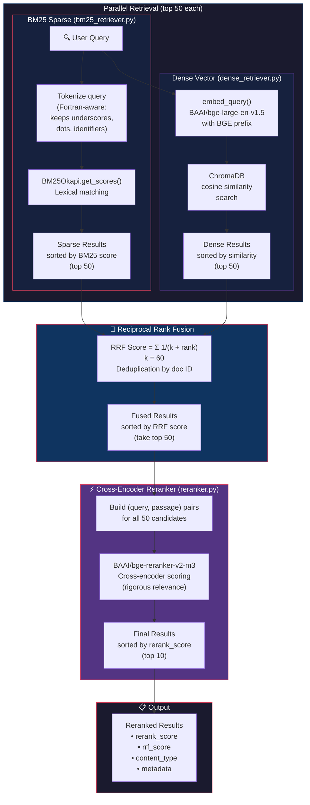
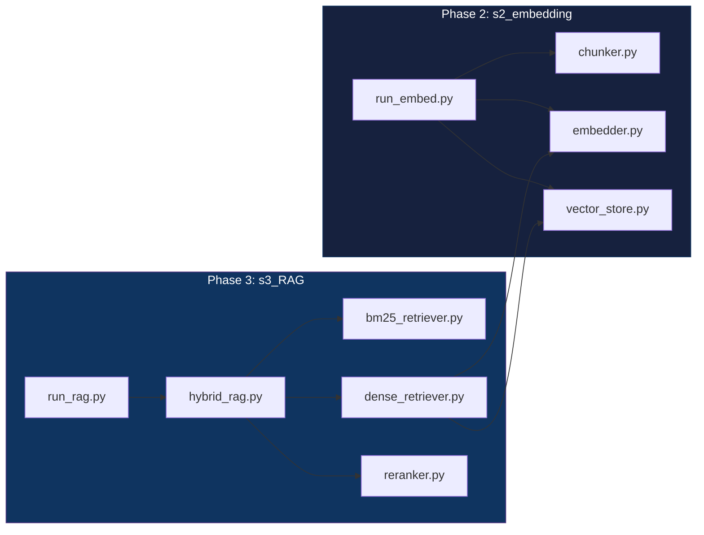
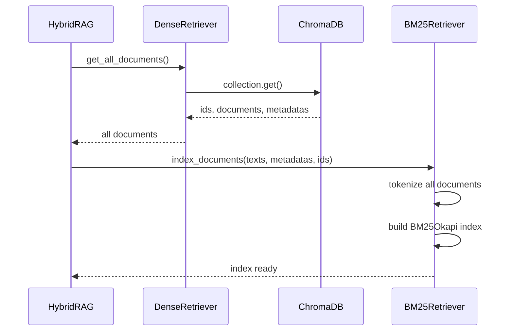

# Phase 3: Hybrid RAG Retrieval Workflow

```mermaid
flowchart TD
    Q["🔍 User Query"]

    subgraph Retrieval["Parallel Retrieval (top 50 each)"]
        direction LR

        subgraph Sparse["BM25 Sparse (bm25_retriever.py)"]
            Q --> TOK["Tokenize query\n(Fortran-aware:\nkeeps underscores,\ndots, identifiers)"]
            TOK --> BM["BM25Okapi.get_scores()\nLexical matching"]
            BM --> SR["Sparse Results\nsorted by BM25 score\n(top 50)"]
        end

        subgraph Dense["Dense Vector (dense_retriever.py)"]
            Q --> EMB["embed_query()\nBAAI/bge-large-en-v1.5\nwith BGE prefix"]
            EMB --> CHR["ChromaDB\ncosine similarity\nsearch"]
            CHR --> DR["Dense Results\nsorted by similarity\n(top 50)"]
        end
    end

    subgraph Fusion["🔀 Reciprocal Rank Fusion"]
        SR --> RRF["RRF Score = Σ 1/(k + rank)\nk = 60\nDeduplication by doc ID"]
        DR --> RRF
        RRF --> FUSED["Fused Results\nsorted by RRF score\n(take top 50)"]
    end

    subgraph Reranking["⚡ Cross-Encoder Reranker (reranker.py)"]
        FUSED --> PAIRS["Build (query, passage) pairs\nfor all 50 candidates"]
        PAIRS --> CE["BAAI/bge-reranker-v2-m3\nCross-encoder scoring\n(rigorous relevance)"]
        CE --> FINAL["Final Results\nsorted by rerank_score\n(top 10)"]
    end

    subgraph Output["📋 Output"]
        FINAL --> RES["Reranked Results\n• rerank_score\n• rrf_score\n• content_type\n• metadata"]
    end

    style Retrieval fill:#1a1a2e,stroke:#0f3460,color:#fff
    style Sparse fill:#16213e,stroke:#e94560,color:#fff
    style Dense fill:#16213e,stroke:#533483,color:#fff
    style Fusion fill:#0f3460,stroke:#e94560,color:#fff
    style Reranking fill:#533483,stroke:#e94560,color:#fff
    style Output fill:#1a1a2e,stroke:#e94560,color:#fff
```

## Component Interaction

```mermaid
flowchart LR
    subgraph s2["Phase 2: s2_embedding"]
        CH["chunker.py"]
        EM["embedder.py"]
        VS["vector_store.py"]
        RE["run_embed.py"]

        RE --> CH
        RE --> EM
        RE --> VS
    end

    subgraph s3["Phase 3: s3_RAG"]
        BM["bm25_retriever.py"]
        DR["dense_retriever.py"]
        RR["reranker.py"]
        HR["hybrid_rag.py"]
        RUN["run_rag.py"]

        RUN --> HR
        HR --> BM
        HR --> DR
        HR --> RR
    end

    DR --> EM
    DR --> VS

    style s2 fill:#16213e,stroke:#0f3460,color:#fff
    style s3 fill:#0f3460,stroke:#533483,color:#fff
```

## BM25 Index Build (at init)

```mermaid
sequenceDiagram
    participant HR as HybridRAG
    participant DR as DenseRetriever
    participant DB as ChromaDB
    participant BM as BM25Retriever

    HR->>DR: get_all_documents()
    DR->>DB: collection.get()
    DB-->>DR: ids, documents, metadatas
    DR-->>HR: all documents
    HR->>BM: index_documents(texts, metadatas, ids)
    BM->>BM: tokenize all documents
    BM->>BM: build BM25Okapi index
    BM-->>HR: index ready
```
