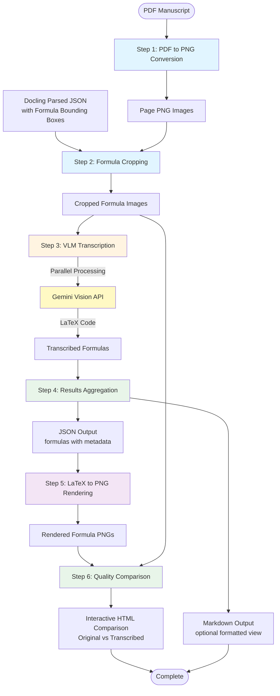

# Formula to LaTeX Extraction Pipeline

## High-Level Workflow

This pipeline extracts mathematical formulas from PDF manuscripts and converts them to LaTeX using Vision Language Models (VLM).

### Pipeline Steps

1. **PDF to PNG Conversion** (`pdf_to_png.py`)
   - Converts each page of the PDF manuscript into high-resolution PNG images (450 DPI)

2. **Formula Cropping** (`cropper.py`)
   - Uses Docling-parsed JSON containing formula bounding boxes
   - Crops individual formula images from page PNGs
   - Outputs: `page_{page_no}_formula_{formula_idx}.png`

3. **VLM Transcription** (`formula_png_to_latex.py`)
   - Sends cropped formula images to Gemini Vision API
   - Parallel processing with configurable workers (default: 10)
   - Filters out non-formula images (noise, text, blank crops)
   - Returns LaTeX code for each valid formula

4. **Results Aggregation** (`main.py`)
   - Collects all transcribed formulas with metadata (page number, formula index)
   - Saves to JSON file with structured data
   - Optionally generates formatted Markdown output

5. **LaTeX to PNG Rendering** (`latex_to_png.py`)
   - Renders transcribed LaTeX code back to PNG images using pdflatex
   - Uses standalone document class for clean, cropped output
   - Outputs rendered formulas to `vlm_formula_latex/png/` directory

6. **Quality Comparison** (`generate_comparison.py`)
   - Generates interactive HTML comparison page
   - Displays original and transcribed formulas side-by-side
   - Shows LaTeX code for each formula
   - Provides visual quality assessment of transcription accuracy
   - Output: `vlm_formula_latex/quality_comparison/comparison.html`
